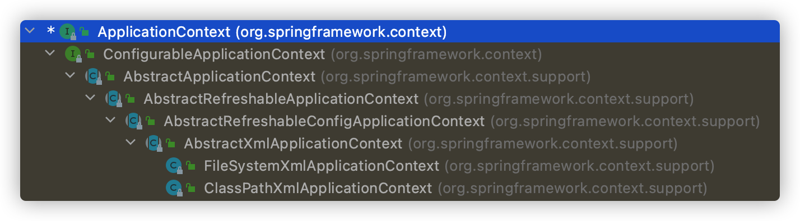
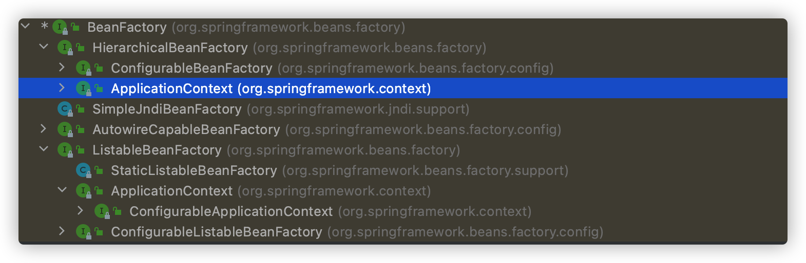

> 2022年5月18日

IOC底层原理：XML解析、工厂模式、反射

## IOC过程

第一步，xml配置文件，创建对象

```xml
    <bean id="user" class="com.liuyuncen.spring5.User"></bean>
```

第二步，有service类和dao类，创建工厂类，通过工厂返回对象

```java
class UserFactory{
  public static UserDao getDao(){
    String classValue = class属性值; // xml解析  获取得到 com.liuyuncen.spring5.User
    Class clazz = Class.forName(classValue); // 通过反射获取对象
    return (UserDao)clazz.newInstance();
  }
}
```


## 核心思想

1、IOC思想，基于IOC容器完成，IOC容器底层就是对象工厂

2、Spring提供了IOC容器实现两种方式（2个接口）BeanFactory、ApplicationContext

1. BeanFactory：IOC 容器基本实现，是Spring内部的使用接口，不提供给开发人员使用
	1. 加载配置文件时不会创建对象，在获取对象时才去创建（懒加载）
2. ApplicationContext：BeanFacotry接口的子接口，提供更多更大的功能，一般由开发人员使用。
	1. 加载及创建		






## IOC 操作 Bean 管理

Bean管理是两个操作，创建对象，注入属性。两种操作方式：1、基于XML配置。2、基于注解实现

### 基于XML创建对象

在spring的配置文件中，使用 bean 标签，标签里添加对应属性，就可以实现对象创建

```xml
    <bean id="user" class="com.liuyuncen.spring5.User"></bean>
```

1. id 属性：对象的别名，key
2. class属性：全路径
3. name属性：对象的别名，早期为struts提供的，可以使用特殊符号

创建对象时，默认是执行无参构造方法完成对象创建

### 基于XML方式注入属性

DI：依赖注入，就是注入属性，Spring支持常规的set和有参注入。

set方法注入属性

```xml
<bean id="user" class="com.liuyuncen.spring5.User">
	<property name="name" value="Coco"></property>
</bean>
```

有参构造注入属性，

```xml
<bean id="user" class="com.liuyuncen.spring5.User">
	<construcotr-arg name="name" value="Coco"></construcotr-arg>
</bean>
```

也可以将 name 属性改为 index 属性，为参数索引。

### 基于P名称空间注入

可以简化基于 xml 配置，配置文件添加命名空间 `xmlns:p="http://www.springframework.org/schema/p"`

```xml
<bean id="user" class="com.liuyuncen.spring5.User" p:name="Coco"></bean>
```

### 基于XML注入其他类型

字面量，直接在 private String name = "Coco";   或者上述 set方法注入那样，就是字面量，也可以注入控制

注入空值

```xml
<property name="name">
	<null/>
</property>
```

特殊字符，通过 `&lt;`、`&gt;` 转译，如果不想转译，可以用 `<![CDATA[]]`

```xml
	<property name="name" value="<![CDATA[<<Helo>>]]"></property>
```

### 基于XML注入外部bean

配置文件

```xml
<bean id="user" class="com.liuyuncen.spring5.User">
	<property name="name" ref="teacher"></property>
</bean>
<bean id="teacher" class="com.liuyuncen.spring5.Teacher"></bean>
```

在  User 类中，要有 teacher 成员变量及 setTeacher 方法。

### 基于XML内部Bean和级联赋值

假设使用部门、员工 来举例子，部门有部门名称 一个属性，员工有 员工姓名，部门 两个属性

> ```json
> dept:{
>   dName // 部门名称
> }
> emp:{
>   eName,	// 员工姓名
>   dept  // 部门
> }
> ```

xml配置如下：

```xml
<bean id = "emp" class="xxx">
	<property name="eName" value="Coco"></property>
  <property name="dept">
  	<bean id="dept" class="xxx">
    	<property name="dName" value="POM"></property>
    </bean>
  </property>
</bean>
```

### 基于XML级联赋值

```xml
<bean id = "emp" class="xxx">
	<property name="eName" value="Coco"></property>
  <property name="dept" ref="dept"></property>
</bean>
<bean id="dept" class="xxx">
  <property name="dName" value="POM"></property>
</bean>
```

第二种写法

```xml
<bean id = "emp" class="xxx">
	<property name="eName" value="Coco"></property>
  <property name="dept" ref="dept"></property>
	<property name="dept.dName" ref="CEO_Office"></property>
</bean>
<bean id="dept" class="xxx">
  <property name="dName" value="POM"></property>
</bean>
```

这里要注意的是，使用 `dept.name` 必须在 dept类中有 get方法

### 基于XML注入集合类型

```xml
<array>
	<value>1</value>
  <value>2</value>
</array>
<map>
  <entry key="key" value="value"></entry>
</map>
<set>
	<value>good</value>
</set>
```

设置集合对象

```xml
<property name="courseList">
	<list>
  	<ref bean="course1"></ref>
    <ref bean="course2"></ref>
  </list>
</property>

<bean id="course1" class="xxx">
	<propery name="cname" value="Helo"></propery>
</bean>
<bean id="course2" class="xxx">
	<propery name="cname" value="Hi"></propery>
</bean>
```

### FacotryBean（偏重点）

Spring 有两种类型Bean，一种是普通bean，定义是吗，返回的就是什么，另一种是工厂Bean，在配置文件定义bean类型可以和返回类型不一样

1. 创建类，让这个类作为工厂Bean，实现接口FacotryBean
2. 实现接口里面的方法，在实现的方法中定义返回的Bean类型


## Bean 作用域

在Spring里面，设置创建bean实例是但是单实例还是多实例，在Spring默认情况是单利。用对象地址值来判断实例是否单利还是多例，当 `scope="prototype"` 时为多例，默认不写或者 `scope="singleton"`

```xml
<bean id="Coco" class="xxx" scope="prototype">
</bean>
```

单利时，在加载Spring配置文件的时候，就会创建单利实例对象，当为多利情况下，在调用此对象时，才会创建他。（request、session等值作为扩展）

## Bean 生命周期

1. 通过构造器创建bean实例（无参构造）
2. 为bean的属性设置值或对其他bean引用（调用set方法）
3. 调用bean的初始化方法（需要进行配置）
4. bean 可以使用了（对象获取到了）
5. 当容器关闭，调用bean的销毁方法（需要配置销毁方法）

```xml
<bean id="Coco" class="xxx" init-method="init" destory-method="destory">
</bean>
```

初始化会调用 `init()` 方法，销毁时 执行 `ClassPathXmlApplication.close()` 时才会真正销毁，在销毁前调用 `destory()` 方法

更为细节的声明周期，称为后置处理器

1. 通过构造器创建bean实例（无参构造）
2. 为bean的属性设置值或对其他bean引用（调用set方法）
3. ==把Bean实例传给Bean前置处理器的方法==
4. 调用bean的初始化方法（需要进行配置）
5. ==把Bean实例传给Bean后置处理器的方法==
6. bean 可以使用了（对象获取到了）
7. 当容器关闭，调用bean的销毁方法（需要配置销毁方法）

### 实现演示

创建一个类实现 `BeanPostProcessor` 接口，实现 `postProcessBeforeInitialization`、 `postProcessAfterInitialization`就是这两个方法在初始化之前那个之后，执行的方法。

```xml
<!-- 配置后置处理器 -->
<bean id="myBeanPost" class="刚刚创建的类"></bean>
```

==配置完之后，当前这个配置文件下所有的对象都拥有了这个后置处理器==

## 自动装配

先看看手动装配

```xml
<bean id="emp" class="xxx">
  <property name="dept" ref="dept"></property>
</bean>
<bean id="dept" class="xxx">
```

下面是自动装配

```xml
<bean id="emp" class="xxx" autowire="byName">
</bean>
<bean id="dept" class="xxx">
```

实现自动装配，bean标签属性 `autowire` ，配置自动装配 `autowire`属性常用两个值，`byName`根据属性名称注入，`byType` 根据类型注入

## 引入外部属性配置数据库连接池

原先XML的配置方式

```xml
<bean id="dataSource" class="com.alibaba.druid.pool.DruidDataSource">
	<property name="driveClassName" value="com.mysql.jdbc.Drive"></property>
  <property name="url" value="jdbc:mysql://localhost:3306/db"></property>
  <property name="username" value="root"></property>
  <property name="password" value="root"></property>
</bean>
```

创建 `jdbc.properties`

```properties
prop.driveClass= com.mysql.jdbc.Drive
prop.url= jdbc:mysql://localhost:3306/db
prop.username= root
prop.passwors= root
```

在 `bean.xml` 中添加命名空间 `xmlns:context="http://www.springframework.org/schema/context"`

引入外部属性文件

```xml
<context:property-placeholder location="jdbc.property"/>
```

将原先的 `value` 值改用 jstl 表达式，例如：

```xml
	<property name="driveClassName" value="${prop.driveClass}"></property>
```

