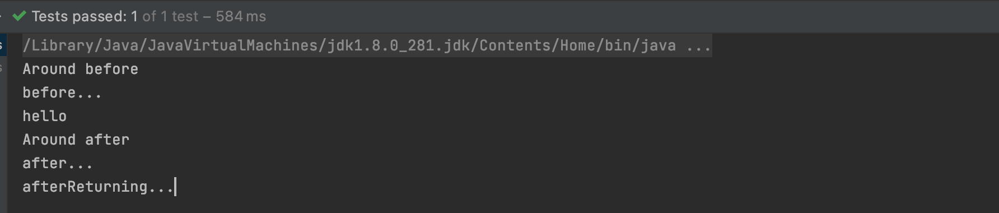

> 2022-5-24

[toc]

# AOP

面向切面编程，利用AOP可以对业务逻辑的各个部分进行隔离，从而使得业务逻辑各部分之间耦合度降低，从而改变这些行为不影响业务代码。

有两种情况的动态代理

+ 有接口情况（使用 JDK 动态代理）
	+ 创建接口实现类代理对象，增强类的方法
+ 没有接口情况（使用 CGLIB 动态代理）
	+ 创建子类的代理对象，增强类的方法


## JDK动态代理

使用 `Proxy` 的 `newProxyInstance` 方法 ，方法有3个参数

1. 类加载器
2. 增强方法所在的类，这个类实现的接口，支持多个接口
3. 实现这个接口 InvocationHandle，创建代理对象，写增强方法

代码实现

```java
public class ProxyTest{
  public static void main(String[] args){
		// 被代理的类
		Class[] interfaces = {UserService.class};
    UserService o = (UserService) Proxy.newProxyInstance(ProxyTest.class.getClassLoader(), interfaces, new UserServiceProxy(userService));
    o.sayService();
  }
}
```

创建代理对象，实现接口 `InvocationHandle`

```java
class UserServiceProxy implements InvocationHandler{
    private Object obj;
    public UserServiceProxy(Object obj){
        this.obj = obj;
    }
    @Override
    public Object invoke(Object proxy, Method method, Object[] args) throws Throwable {
        // 方法之前
        System.out.println("方法之前执行...."+method.getName()+"...传递的参数..."+ Arrays.toString(args));
        // 被增强的方法
        Object res = method.invoke(obj, args);
        // 方法之后
        System.out.println("方法执行后...."+res);
        return res;
    }
}
```

## 术语

### 1、连接点

类中具体的方法，哪个方法可以被增强，这些方法可以称为`连接点`

### 2、切入点

真正被增强的方法，称为 `切入点`

### 3、通知

增强的部分叫 `通知`，`通知` 有多种类型：前置、后置、环绕、异常、最终（finally）

### 4、切面

把通知应用到切入点的过程叫切面，这是个过程

## AspectJ

AspectJ 不是 Spring 组成部分，独立 AOP 框架，一般把 AspectJ 和 Spring 框架一起使用，进行 AOP 操作

切入点表达式

`execution（[权限修饰符][返回类型][类全路径][方法名称][参数列表]）`

### 注解实现

需要下面两个依赖

```xml
        <dependency>
            <groupId>org.springframework</groupId>
            <artifactId>spring-aop</artifactId>
            <version>5.2.6.RELEASE</version>
        </dependency>
        <dependency>
            <groupId>org.aspectj</groupId>
            <artifactId>aspectjweaver</artifactId>
            <version>1.8.14</version>
        </dependency>
```

被增强类

```java
@Component
public class UserService {

    public void sayHello(){
        System.out.println("hello");
    }
}
```

增强类

```java
@Component
@Aspect
public class AspectUser {

    @Before("execution(* com.xiang.service.*.*(..))")
    public void aspect(){
        System.out.println("before...");
    }
}
```

配置类 需要注意 `@EnableAspectJAutoProxy`

```java
@Configuration
@ComponentScan(basePackages = {"com.xiang"})
@EnableAspectJAutoProxy
public class XiangSpringConfig {

}
```

启动测试方法

```java
ApplicationContext context = new AnnotationConfigApplicationContext(XiangSpringConfig.class);
UserService userService = (UserService) context.getBean("userService");
userService.sayHello();
```

### 执行先后顺序

```java
@Component
@Aspect
public class AspectUser {

    @Before("execution(* com.xiang.service.*.*(..))")
    public void before(){
        System.out.println("before...");
    }

    @After("execution(* com.xiang.service.*.*(..))")
    public void after(){
        System.out.println("after...");
    }

    @AfterReturning("execution(* com.xiang.service.*.*(..))")
    public void afterReturning(){
        System.out.println("afterReturning...");
    }

    @Around("execution(* com.xiang.service.*.*(..))")
    public void around(ProceedingJoinPoint point) throws Throwable {
        System.out.println("Around before ");
        point.proceed();
        System.out.println("Around after ");
    }
    
}
```



+ after 在有无异常情况下都执行，after 也可以称为最终通知（finally）
+ afterReturning 在有异常下不执行

配置切入点 `@Pointcut`


优先级

在增强类上面添加注解 `@Order(int)` 数字越小，优先级越高