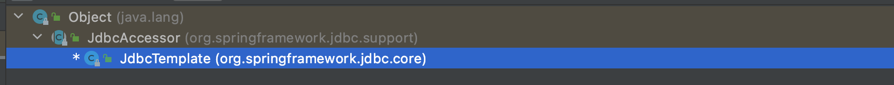

> 2022年6月1日

Spring 框架对 Jdbc 进行封装，使用 JdbcTemplate 方便实现的对数据库操作

## 配置

配置 JdbcTemplate 对象，注入 DataSource

我们查看源码，看到 JdbcTemplate 有个有参构造器，构造器内的参数就是



```java
	public JdbcTemplate(DataSource dataSource) {
		setDataSource(dataSource);
		afterPropertiesSet();
	}
```

但是他调的是父类  JdbcAccessor.setDataSource，所以我们直接使用 set 方法注入

```XML
    <bean id="jdbcTemplate" class="org.springframework.jdbc.core.JdbcTemplate">
        <property name="dataSource" ref="dataSource"/>
    </bean>
```

### 查询返回对象

`queryForObject` 有三个参数，1、SQL 语句，2、RowMapper 接口，3、参数值

RowMapper 是接口，针对返回不同类型数据

```java
jdbcTemplate.queryForObject("select * from user where user_id=?",new BeanPropertyRowMapper<>(User.class),id);
```

### 查询返回对象集合

`query` 还是刚刚参数

