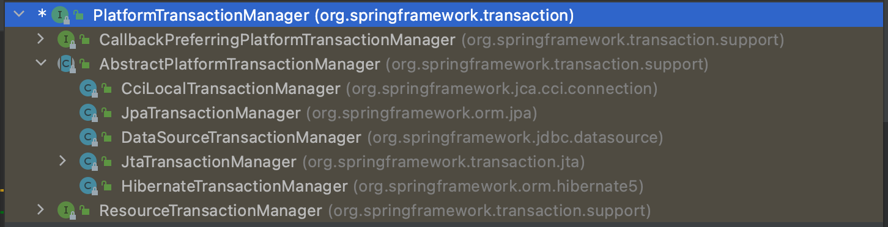

> 2022-6-3

# Spring 事务

事务是数据库操作最基本单元，逻辑上一组操作，要么都成功，如果有一个失败所有操作都失败，四大特性，原子、一致、隔离、持久

## 声明式事务管理

`PlatformTransactionManager` 提供一个接口，代表事务管理器，这个接口针对不同的框架提供不同的实现类



配置事务管理器

```xml
<bean id="transactionManager" class="org.springframework.jdbc.datasource.DataSourceTransactionManager">
    <property name="dataSource" ref="dataSource"/>
</bean>
```

开启声明式事务

```xml
 <tx:annotation-driven transaction-manager="transactionManager"></tx:annotation-driven>
```

在类或者方法上添加注解 `@Transactional`，在这个注解里面可以配置事务相关参数

1. propagation：事务传播行为

	1. REQUIRED：存在加入，否则创建（默认）
	2. REQUIRED_NEW：不管有没有都创建一个新的事务，如果有事务，原事务被挂起
	3. SUPPORTS：存在，加入，否则非事务运行
	4. NOT_SUPPORTES：非事务运行，存在，挂起他
	5. MANDATORY： 存在，加入，否则抛异常
	6. NEVER：非事务运行，存在，抛异常
	7. NESTED：存在就嵌套，没有就创建

2. ioslation：事务隔离级别

	1. 事务有特性成为隔离性，多事务操作之间不会产生影响，不考虑隔离性产生很多问题
	2. 有三个读问题：脏读、不可重复度、幻读
		1. 脏读：一个未提交的事务读取到了另一个事务未提交的数据（这是一种问题）
		2. 不可重复度：一个未提交的事务读取到了另一个事务提交的数据（这是一种现象）
		3. 虚度：一个未提交的事务读取到了另一个事务添加的数据
	3. 解决办法
		1. READ UNCOMMITTED 读取未提交 会有脏读、不可重复读、幻读
		2. READ COMMITED 读已提交，会有不可重复读，幻读
		3. REPEATABLE READ 可重复读，会有幻读
		4. SERIALIZABLE 串行话 解决所有问题‘

	`@Transactional(ioslation=Ioslation.SERIALIZABLE)`

3. timeout：超时时间

	1. 事务需要在一定时间内进行提交，如果不提交进行回滚
	2. 默认值是-1，设置时间以秒为单位

4. readOnly：是否只读

	1. 读：查询操作，写：添加修改删除操作
	2. 设置 readOnly默认值 false，表示可以查询，可以添加修改删除操作
	3. 设置 readOnly 为 true，只能查询

5. rollbackFor：回滚

	1. 设置出现哪些异常进行事务回滚

6. noRollbackFor：不回滚

	1. 设置出现哪些异常不进行回滚
	2. 同时设置，优先回滚


## XML配置

```xml
    <!--    配置通知-->
    <tx:advice id="txadvice">
        <tx:attributes>
            <tx:method name="addMoney" propagation="REQUIRED"/>
        </tx:attributes>
    </tx:advice>
    <!--    配置切入点-->
    <aop:config>
        <aop:pointcut id="pt" expression="execution(* com.transfer.service.UserService.*(..))"/>
        <aop:advisor advice-ref="txadvice" pointcut-ref="pt"/>
    </aop:config>
```

## 完全注解配置

```java
@Configuration
@ComponentScan(basePackages = {"com.transfer"})
@EnableTransactionManagement
public class SpringConfig {

    @Bean
    public DruidDataSource getDruidDataSource(){
        DruidDataSource dataSource = new DruidDataSource();
        dataSource.setDriverClassName("com.mysql.jdbc.Driver");
        dataSource.setUrl("jdbc:mysql:///0429_exam");
        dataSource.setUsername("root");
        dataSource.setPassword("root");
        return dataSource;
    }

    @Bean
    public JdbcTemplate getJdbcTemplate(DataSource dataSource){
        JdbcTemplate jdbcTemplate = new JdbcTemplate();
        jdbcTemplate.setDataSource(dataSource);
        return jdbcTemplate;
    }

    @Bean
    public DataSourceTransactionManager getDataSourceTransactionManager(DataSource dataSource){
        DataSourceTransactionManager dataSourceTransactionManager = new DataSourceTransactionManager();
        dataSourceTransactionManager.setDataSource(dataSource);
        return dataSourceTransactionManager;
    }
}
```