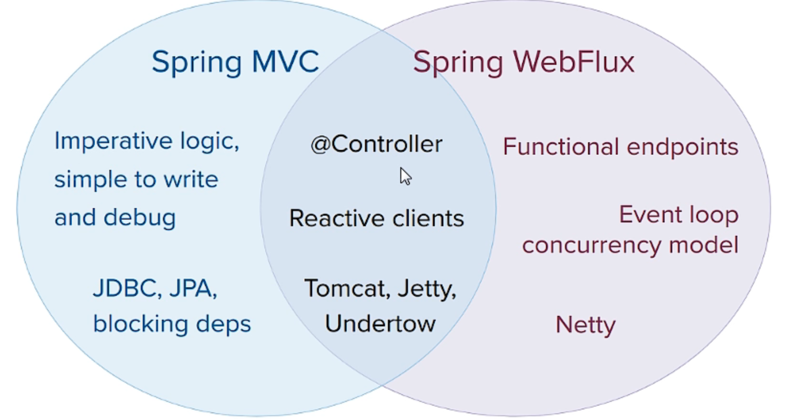
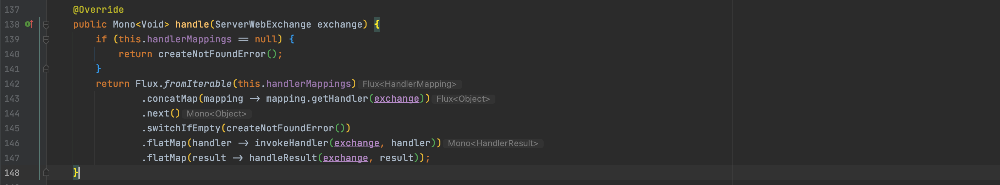
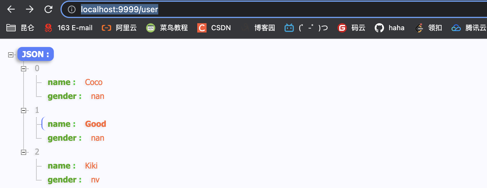
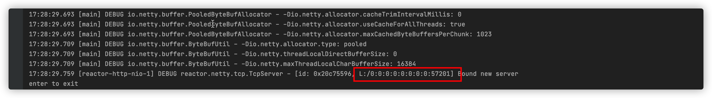
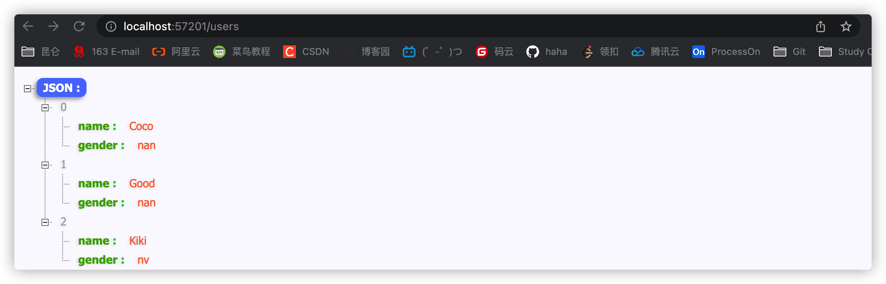
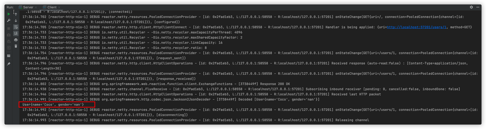
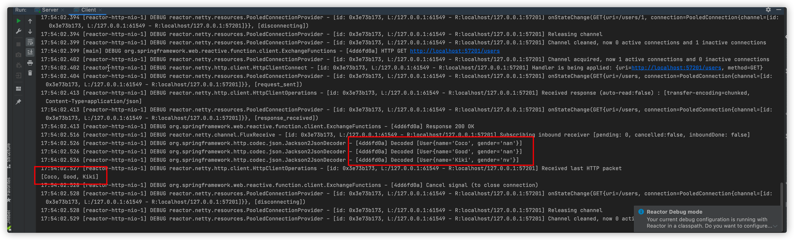

> 2022-06-03

# Spring Webflux

1. 是 Spring5 添加新模块，用于 Web 开发，功能和 SpringMVC 类似的，WebFlux 使用当前一种比较流程响应式编程出现的框架
2. 使用传统web框架，比如 SpringMVC，这些基于 Servlet 容器，Webflux是一种异步非阻塞的框架，异步非阻塞的框架在 Servlet3.1 以后才支持，核心是基于 Reactor 相关API实现的

webflux 特点：

1. 非阻塞式，在有限资源下，提高系统吞吐量和伸缩性，以 Reactor 为基础实现响应式编程
2. 函数式编程，Spring5框架基于 java8，webFlux使用 Java8 函数式编程方式实现路由请求



差异：

1. 两个框架都可以使用注解方式，都运行在Tomcat容器中
2. SpringMVC 采用命令式编程，WebFlux采用异步响应式编程


## 响应式编程

简称 RP，响应式编程是一种面向数据流和变化传播的编程范式。这意味着可以在编程语言中很方便地表达静态或动态的数据流，而相关的计算模型会自动将变化的值通过数据流进行传播。

响应式编程中，Reactor 是满足 Reactive 规范框架，Reactor 有两个核心类，Mono 和 Flux，这两个类实现的接口 Publisher，提供丰富操作符。Flux对象实现发布者，返回N个元素，Mono 实现发布者，返回 0或者1个元素

Flux和Mono都是数据流的发布者，使用 Flux 和 Mono 都可以发出三种数据新号：元素值，错误信号，完成信号，错误信号和完成信号都代表终止信号，终止信号用于告诉订阅者数据流结束了，错误信号终止数据流同时把错误信息传递给订阅者

```xml
        <dependency>
            <groupId>io.projectreactor</groupId>
            <artifactId>reactor-core</artifactId>
            <version>3.3.2.RELEASE</version>
        </dependency>
```

```java
public class TestReactor {
    public static void main(String[] args) {
        // just 方法直接声明
        Flux.just(1,2,3,4);
        Mono.just(1);

        // 其他的方法
        Integer[] array = {1,2,3,4};
        Flux.fromArray(array);
        List<Integer> list = Arrays.asList(array);
        Flux.fromIterable(list);
        Stream<Integer> stram = list.stream();
        Flux.fromStream(stram);
    }
}
```

### 三种信号的特点

1. 错误信号和完成信号都是终止信号，不能共存
2. 如果没有发送任何元素值，而是直接发送错误或者完成信号，表示是空数据流
3. 如果没有错误信号，没有完成信号，表示是无限数据流

```java
        Flux.just(1,2,3,4).subscribe(System.out::print);
        Mono.just(1).subscribe(System.out::print);
```

调用 just 或者其他方法只是声明数据流，数据流并没有发出，只有进行订阅之后才会触发，不订阅声明都不会发生

### 操作符

对数据流进行一道道操作，成为操作符，比如工程流水钱

1. map 元素映射为新的元素
2. flatMap 元素映射为流，把每个元素转换为流，把转换之后多个流合并大的流


## 执行流程核心API

SpringWebflux 基于 Reactor 默认使用容器是 Netty，Netty 是高性能的NIO（同步非阻塞）框架，异步非阻塞框架

SpringWebflux 执行过程和 SpringMVC 相似的，

1. SpringWebflux 核心控制器 `DispatchHander` ，接口是 `WebHandler`



1. `ServerWebExchange` 放一些http请求响应信息
2. `getHandler` 根据请求地址获取对应 mapping
3. `invokeHanlder` 调用具体的业务方法
4. `handlerResult` 处理返回结果


SorubfWebflux 里面DispatchHandler，负责请求的处理

+ `HandlerMapping`：请求查询到处理的方法
+ `HadnlerAdapte`：真正负责请求处理
+ `HanlderResultHandler`：响应结果处理


SpringWebFlux 实现函数式编程，两个接口：RouterFunction（路由处理）和 HandlerFunction（处理函数）

SpringWebflux 基于注解编程模式，实现方式有两种：注解编程模式和编程式编程模型，使用注解编程模型方式，和之前 SpringMVC 使用相同，只需要把相关依赖配置到项目中，SpringBoot 自动配置相关运行容器，默认情况下使用Netty 服务器

1. 创建 SpringBoot 工程，引入 Webflux 依赖

	```xml
	<dependency>
	  <groupId>org.springframework.boot</groupId>
	  <artifactId>spring-boot-starter-webflux</artifactId>
	</dependency>
	```

2. 创建包和相关类 

```java
@Service
public class UserService {

    private final Map<Integer,User> users = new HashMap<>();

    public UserService(){
        this.users.put(1,new User("Coco","nan"));
        this.users.put(2,new User("Good","nan"));
        this.users.put(3,new User("Kiki","nv"));
    }


    public Mono<User> getUserById(int id){
        return Mono.justOrEmpty(this.users.get(id));
    }

    public Flux<User> getAllUser(){
        return  Flux.fromIterable(this.users.values());
    }

    public Mono<Void> saveUser(Mono<User> user){
        return user.doOnNext(person ->{
           int id = users.size()+1;
           users.put(id,person);
        }).thenEmpty(Mono.empty());
    }
}
```

```java
@RestController
public class UserController {

    @Autowired
    private UserService userService;

    @GetMapping("/user/{id}")
    public Mono<User> findById(@PathVariable int id){
        return userService.getUserById(id);
    }

    @GetMapping("/user")
    public Flux<User> getUsers(){
        return userService.getAllUser();
    }

    @PostMapping("/saveuser")
    public Mono<Void> saveUser(@RequestBody User user){
        Mono<User> userMono = Mono.just(user);
        return userService.saveUser(userMono);
    }
}
```




## 说明

SpringMVC 方式实现，同步阻塞的方式，基于 SpringMVC+Servlet+Tomcat

SpringWebflux 方式实现，异步非阻塞方式，基于 SpringWebflux+Reactor+Tomcat


### 基于函数式编程模型

1. 使用函数式编程模型操作，需要自己初始化服务器
2. 基于函数式编程模型的时候，有两个核心接口：RouterFunction( 实现路由功能，请求转发给对应的 Handle)r 和 HandleFunction(处理请求生成响应的函数)。核心任务定义两个函数式接口的实现并且启动需要服务器
3. SpringWebflux 请求和响应不再是 ServletRequest 和 ServletResponse ，而是 ServerRequest 和 ServerResponse

创建 Handler

```java
public class UserHandler {

    private final UserService userService;

    public UserHandler(UserService userService){
        this.userService = userService;
    }

    public Mono<ServerResponse> getUserById(ServerRequest request){
        int userId = Integer.parseInt(request.pathVariable("id"));
        Mono<ServerResponse> notFound = ServerResponse.notFound().build();
        Mono<User> userMono = this.userService.getUserById(userId);
        // 使用 Reactor 操作 flatMap
        return userMono.flatMap(person->ServerResponse.ok()
                .contentType(MediaType.APPLICATION_JSON)
                .body(fromObject(person)))
                .switchIfEmpty(notFound);
    }

    public Mono<ServerResponse> getAllUsers(){
        Flux<User> users = this.userService.getAllUser();
        return ServerResponse.ok().contentType(MediaType.APPLICATION_JSON).body(users,User.class);
    }

    public Mono<ServerResponse> saveUser(ServerRequest request){
        Mono<User> userMono = request.bodyToMono(User.class);
        return ServerResponse.ok().build(this.userService.saveUser(userMono));
    }
}
```

创建路由

```java
    public RouterFunction<ServerResponse> routingFunction(){
        UserService userService = new UserService();
        UserHandler userHandler = new UserHandler(userService);
        return RouterFunctions.route(
                GET("/users/{id}").and(accept(MediaType.APPLICATION_JSON)),userHandler::getUserById)
                .andRoute(GET("/users").and(accept(MediaType.APPLICATION_JSON)),userHandler::getAllUsers);
    }
```

创建服务器并完成适配

```java
    public void createReactorServer(){
        RouterFunction<ServerResponse> router = routingFunction();
        HttpHandler httpHandler = toHttpHandler(router);
        ReactorHttpHandlerAdapter adapter = new ReactorHttpHandlerAdapter(httpHandler);
        // 创建服务器
        HttpServer httpServer = HttpServer.create();
        httpServer.handle(adapter).bindNow();
    }
```

启动并测试

```java
public static void main(String[] args) throws IOException {
    Server server = new Server();
    server.createReactorServer();
    System.out.println("enter to exit");
    System.in.read();
}
```






## 使用 WebClient 调用

```java
public class Client {

    public static void main(String[] args) {
        WebClient webClient = WebClient.create("http://localhost:57201");
        String id = "1";
        User block = webClient.get().uri("/users/{id}", id).accept(MediaType.APPLICATION_JSON).retrieve().bodyToMono(User.class).block();
        System.out.println(block.toString());
    }
}
```



```java
public class Client {

    public static void main(String[] args) {
        WebClient webClient = WebClient.create("http://localhost:57201");
        String id = "1";
        User block = webClient.get().uri("/users/{id}", id).accept(MediaType.APPLICATION_JSON).retrieve().bodyToMono(User.class).block();
        System.out.println(block.toString());
        System.out.println("------------------------");
        Flux<User> userFlux = webClient.get().uri("/users")
                .accept(MediaType.APPLICATION_JSON).retrieve().bodyToFlux(User.class);
        userFlux.map(stu -> stu.getName()).buffer().doOnNext(System.out::println).blockFirst();
    }
}
```



