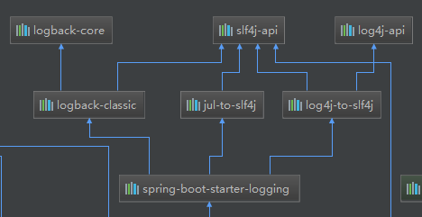
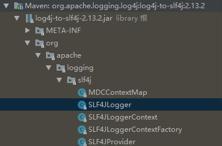
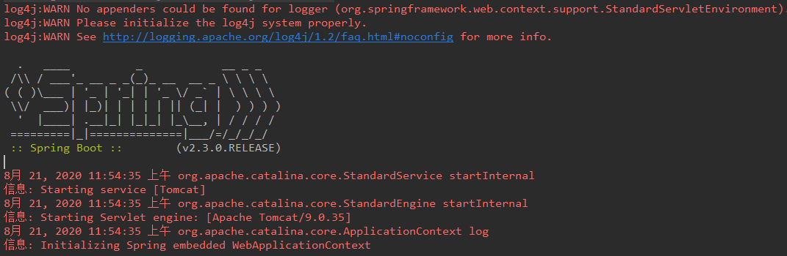
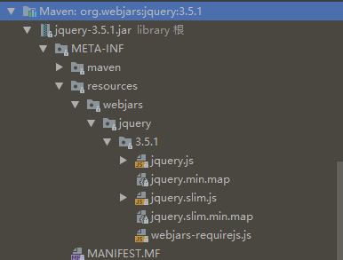
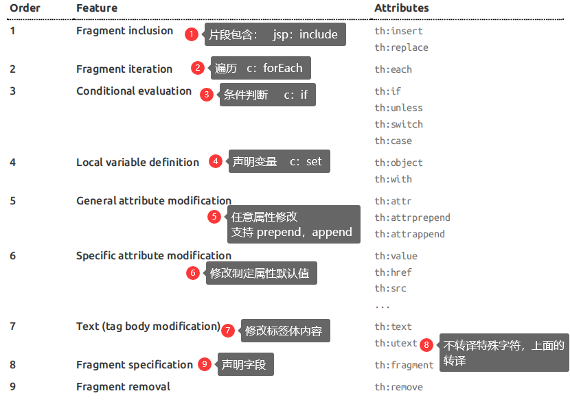

---
尚硅谷 BV1gW411W76m
https://www.bilibili.com/video/BV1Et411Y7tQ?p=3&spm_id_from=pageDriver
---

[toc]


# 一、Spring Boot 入门

## 1、Spring Boot 简介

> 简化Spring应用开发的一个框架
>
> 整个Spring技术栈的一个大整合
>
> J2EE开发的一站式解决方案

## 2、微服务

2014、martin fowler

微服务：架构风格

一个应用应该是一组小型服务；可以通过HTTP的方式进行互通；


每一个功能元素最终都是一个可独立替换和独立升级的软件单元；

[详细参照微服务文档](https://martinfowler.com/articles/microservices.html#MicroservicesAndSoa)

环境约束

-jdk1.8 : spring Boot 1.7 以上版本：java version "1.8.0_144"

-maven3.x：maven 3.3以上版本：Apache Maven 3.5.0

-IntlliJIDEA2017：

-SpringBoot 1.5.9.RELEASE


### 1、Maven设置

给maven的setttings.xml配置文件的profile标签添加

```xml
<profiles>
	<id>jdk-1.8</id>
	<activation>
		<activeByDefault>true</activeByDefault>
       <id>jdk-1.8</id>
    </activation>
	<properties>
        <maven.compiler.source>1.8</maven.compiler.source>
		<maven.compiler.target>1.8</maven.compiler.target>
		<maven.compiler.compilerVersion>1.8</maven.compiler.compilerVersion>
    </properties>
</profiles>
```

### 2、IDEA 设置


## 4、Spring Boot HelloWorld

一个功能

浏览器发送一个hello请求，服务器接受请求并处理，响应Hello World字符串；


### 1、创建一个maven工程；（jar）

###  2、导入依赖Spring boot相关依赖

> 官方无法使用，推荐使用第三种，初始化 POM

官方的：

```xml
 <parent>
        <groupId>org.springframework.boot</groupId>
        <artifactId>spring-boot-starter-web</artifactId>
        <version>1.5.9.RELEASE</version>
    </parent>
    <dependencies>
        <dependency>
            <groupId>org.springframework.boot</groupId>
            <artifactId>spring-boot-starter-web</artifactId>
        </dependency>
    </dependencies>
```

李明真的：

```xml
<parent>
        <groupId>org.springframework.boot</groupId>
        <artifactId>spring-boot-starter-parent</artifactId>
        <version>1.5.9.RELEASE</version>
    </parent>
    <dependencies>
        <dependency>
            <groupId>org.springframework.boot</groupId>
            <artifactId>spring-boot-starter-web</artifactId>
        </dependency>
        <dependency>
            <groupId>org.springframework.boot</groupId>
            <artifactId>spring-boot-starter</artifactId>
            <version>2.0.4.RELEASE</version>
        </dependency>

        <dependency>
            <groupId>org.springframework.boot</groupId>
            <artifactId>spring-boot-starter-test</artifactId>
            <scope>test</scope>
        </dependency>

        <dependency>
            <groupId>org.springframework.boot</groupId>
            <artifactId>spring-boot-starter-thymeleaf</artifactId>
        </dependency>
        <!--<dependency>-->
        <!--<groupId>org.mybatis.spring.boot</groupId>-->
        <!--<artifactId>mybatis-spring-boot-starter</artifactId>-->
        <!--<version>1.3.1</version>-->
        <!--</dependency>-->
        <dependency>
            <groupId>com.baomidou</groupId>
            <artifactId>mybatis-plus-boot-starter</artifactId>
            <version>3.1.1</version>
        </dependency>
        <dependency>
            <groupId>org.springframework.boot</groupId>
            <artifactId>spring-boot-devtools</artifactId>
            <optional>true</optional>
        </dependency>

        <dependency>
            <groupId>org.springframework.boot</groupId>
            <artifactId>spring-boot-starter-web</artifactId>
        </dependency>

        <dependency>
            <groupId>org.springframework.boot</groupId>
            <artifactId>spring-boot-starter-data-jpa</artifactId>
        </dependency>

        <!--<dependency>-->
            <!--<groupId>mysql</groupId>-->
            <!--<artifactId>mysql-connector-java</artifactId>-->
        <!--</dependency>-->


        <dependency>
            <groupId>com.alibaba</groupId>
            <artifactId>druid</artifactId>
            <version>1.0.11</version>
        </dependency>
        <!--简化bean代码的工具包-->
        <dependency>
            <groupId>org.projectlombok</groupId>
            <artifactId>lombok</artifactId>
            <optional>true</optional>
            <version>1.18.4</version>
        </dependency>
        <dependency>
            <groupId>org.slf4j</groupId>
            <artifactId>slf4j-log4j12</artifactId>
            <version>1.6.4</version>
        </dependency>

    </dependencies>
    <build>
        <plugins>
            <plugin>
                <groupId>org.springframework.boot</groupId>
                <artifactId>spring-boot-maven-plugin</artifactId>
            </plugin>
            <plugin>
                <groupId>org.apache.maven.plugins</groupId>
                <artifactId>maven-compiler-plugin</artifactId>
                <configuration>
                    <source>1.8</source>
                    <target>1.8</target>
                </configuration>
            </plugin>
        </plugins>
    </build>
```

==初始化 POM==

```xml
<?xml version="1.0" encoding="UTF-8"?>
<project xmlns="http://maven.apache.org/POM/4.0.0" xmlns:xsi="http://www.w3.org/2001/XMLSchema-instance"
         xsi:schemaLocation="http://maven.apache.org/POM/4.0.0 https://maven.apache.org/xsd/maven-4.0.0.xsd">
    <modelVersion>4.0.0</modelVersion>
    <groupId>press.xiang</groupId>
    <artifactId>spring-boot-01-helloworld</artifactId>
    <version>v1</version>
    <name>spring-boot-01-helloworld</name>
    <description>Demo project for Spring Boot</description>

    <properties>
        <java.version>1.8</java.version>
        <project.build.sourceEncoding>UTF-8</project.build.sourceEncoding>
        <project.reporting.outputEncoding>UTF-8</project.reporting.outputEncoding>
        <spring-boot.version>2.3.7.RELEASE</spring-boot.version>
    </properties>

    <dependencies>

        <dependency>
            <groupId>org.springframework.boot</groupId>
            <artifactId>spring-boot-starter-web</artifactId>
        </dependency>

        <dependency>
            <groupId>org.springframework.boot</groupId>
            <artifactId>spring-boot-starter</artifactId>
        </dependency>

        <dependency>
            <groupId>org.springframework.boot</groupId>
            <artifactId>spring-boot-starter-test</artifactId>
            <scope>test</scope>
            <exclusions>
                <exclusion>
                    <groupId>org.junit.vintage</groupId>
                    <artifactId>junit-vintage-engine</artifactId>
                </exclusion>
            </exclusions>
        </dependency>
    </dependencies>

    <dependencyManagement>
        <dependencies>
            <dependency>
                <groupId>org.springframework.boot</groupId>
                <artifactId>spring-boot-dependencies</artifactId>
                <version>${spring-boot.version}</version>
                <type>pom</type>
                <scope>import</scope>
            </dependency>
        </dependencies>
    </dependencyManagement>

    <build>
        <plugins>
            <plugin>
                <groupId>org.apache.maven.plugins</groupId>
                <artifactId>maven-compiler-plugin</artifactId>
                <version>3.8.1</version>
                <configuration>
                    <source>1.8</source>
                    <target>1.8</target>
                    <encoding>UTF-8</encoding>
                </configuration>
            </plugin>
            <plugin>
                <groupId>org.springframework.boot</groupId>
                <artifactId>spring-boot-maven-plugin</artifactId>
                <version>2.3.7.RELEASE</version>
                <configuration>
                    <mainClass>press.xiang.SpringBoot01HelloWorldApplication</mainClass>
                </configuration>
                <executions>
                    <execution>
                        <id>repackage</id>
                        <goals>
                            <goal>repackage</goal>
                        </goals>
                    </execution>
                </executions>
            </plugin>
        </plugins>
    </build>

</project>

```


### 3、编写一个主程序

```java
import org.springframework.boot.SpringApplication;
import org.springframework.boot.autoconfigure.SpringBootApplication;

@SpringBootApplication
public class HelloWorldMainApplication {
    public static void main(String[] args) {
        // Spring 引用启动起来
        SpringApplication.run(HelloWorldMainApplication.class,args);
    }
}
```

### 4、编写相关的Controller、Service

```java
import org.springframework.stereotype.Controller;
import org.springframework.web.bind.annotation.RequestMapping;
import org.springframework.web.bind.annotation.ResponseBody;

@Controller
public class HelloController {

    @ResponseBody
    @RequestMapping("/hello")
    public String hello(){
        return "hello World";
    }
}
```

### 5、运行主程序

### 6、简化部署

```xml
<!-- 这个插件 可以将应用打包成一个可执行的jar包：-->
    <build>
        <plugins>
            <plugin>
                <groupId>org.springframework.boot</groupId>
                <artifactId>spring-boot-maven-plugin</artifactId>
            </plugin>
        </plugins>
    </build>
```

将这个应用打成jar包，直接使用java-jar的命令进行执行；

## 5、Hello World探究

### 1、POM文件

#### 1、父项目

```xml
<parent>
        <groupId>org.springframework.boot</groupId>
        <artifactId>spring-boot-starter-web</artifactId>
        <version>1.5.9.RELEASE</version>
</parent>

<!-- 他的父项目 -->
<parent>
		<groupId>org.springframework.boot</groupId>
		<artifactId>spring-boot-dependencies</artifactId>
		<version>1.5.9.RELEASE</version>
		<relativePath>../../spring-boot-dependencies</relativePath>
</parent>
<!-- 他来真正管理Spring Boot应用里面的所有依赖版本 -->
```

Spring Boot的版本仲裁中心；

以后我们导入依赖默认是不需要写版本的；（没有在dependencies里面管理的依赖自然需要声明版本号）

#### 2、导入的依赖

 ```xml
<dependency>
            <groupId>org.springframework.boot</groupId>
            <artifactId>spring-boot-starter-web</artifactId>
</dependency>
 ```

**spring-boot-starter** - ==web==

​		Spring-boot-starter:Spring-Boot场景启动器;帮我们导入了web模块正常运行所依赖的组件


Spring Boot 将所有的功能场景都抽取出来，做成一个个的starters（启动器），只需要在项目里面引入这些starter相关场景的所有依赖都会导入进来。要用什么功能就导入什么场景启动器


### 2、主程序类，主入口类

```java
package com.atguigu;

import org.springframework.boot.SpringApplication;
import org.springframework.boot.autoconfigure.SpringBootApplication;

/**
 * @version v1.0
 * @ProjectName: springboot01helloworld
 * @ClassName: HelloWorldMainApplication
 * @Description: 基于Spring Boot 环境下的HelloWorld输出
 * @Author: Array
 * @Date: 2020/3/8 9:01
 * @SpringBootApplication: 来标注一个主程序，说明这是一个Spring Boot 应用
 */


@SpringBootApplication
public class HelloWorldMainApplication {
    public static void main(String[] args) {

        // Spring 引用启动起来
        SpringApplication.run(HelloWorldMainApplication.class,args);
    }
}
```

@**SpringBootApplication**：Spring Boot应用标注在某个类上说明这个类是SpringBoot的主配置类，SpringBoot就应该运行这个里的main方法来启动SpringBoot应用

```java
@Target(ElementType.TYPE)
@Retention(RetentionPolicy.RUNTIME)
@Documented
@Inherited
@SpringBootConfiguration
@EnableAutoConfiguration
@ComponentScan(excludeFilters = {
		@Filter(type = FilterType.CUSTOM, classes = TypeExcludeFilter.class),
		@Filter(type = FilterType.CUSTOM, classes = AutoConfigurationExcludeFilter.class) })
public @interface SpringBootApplication {
```

@**SpringBootConfiguration**：Spring Boot 的配置类：

​			标注在某个类上，表示这是一个Spring Boot的配置类

​			@**Configuration**：配置类上来标注这个注解；

​					配置类  -----  配置文件；配置类也是容器中的一个组件：@Component

@**EnableAutoConfiguration**：开启自动配置功能

​			以前我们需要配置的东西，Spring Boot 自动帮我们配置；@**EnableAutoConfiguration**告诉 Spring Boot开启自动配置功能：这样自动配置才能生效；

```java
@AutoConfigurationPackage
@Import(EnableAutoConfigurationImportSelector.class)
public @interface EnableAutoConfiguration {
```

@**AutoConfigurationPackage**：自动配置包

​		@Import(AutoConfigurationPackages.Registrar.class)

​		Spring 的底层注解@Import，给容器中导入一个组件；导入的组件由AutoConfigurationPackages.Registrar.class

[Spring注解版（谷粒学院）](http://www.gulixueyuan.com/)

`==将主配置类（@SpringBootApplication标注的类）的所在的包及下面所有子包里面的所有组件扫描到Spring容器==`

​			@**Import**(EnableAutoConfigurationImportSelector.class)；

​					给容器中导入组件？

​						EnableAutoConfigurationImportSelector：导入哪些组件的选择器

​						将所有需要导入的组件以全类名的方式返回；这些组件就会添加到容器中；

​						会给容器中导入非常多的自动配置类（xxxAutoConfiguration)；就是给容器中导入整个场景需要


有了自动配置类，免去了手动编写配置注入功能组件等的工作；

​				SpringFactoriesLoader.loadFactoryNames(EnableAutoConfiguration.class.classLoader);

**Spring Boot在启动的时候从类路径下的 ==META-INF/spring.factories== 中获取EnableAutoConfiguration指定的值；将这些值作为自动配置类导入到容器中，自动配置类就生效了，帮我们自动配置工作；**以前我们需要自己配置的东西，自动配置类都帮我们做了；

J2EE的整体整合解决方案和自动配置都在 **==spring-boot-autoconfigure-1.5.9.RELEASE.jar==**


## 6、使用Spring initializer 快速创建 Spring Boot项目

IDE都支持使用Spring的项目创建向导 快速创建一个Spring Boot项目；

选择我们需要的模块；向导会联网创建Spring Boot项目；


默认生成的Spring Boot项目；

+ 主程序已经生成好了，我们只需要编写我们自己的业务逻辑
+ resources文件夹中目录结构
     + static：保存所有的静态资源；js  css   images
     + templates：保存所有的模板页面；（Spring Boot默认jar包使用嵌入式的Tomcat，默认不支持JSP页面）；可以使用模板引擎（freemarker、thymeleaf）；
     + application.properties：Spring Boot应用的配置文件；  可以修改一些默认设置


# 二、配置文件

## 1、配置文件

SpringBoot使用一个全局的配置文件，配置文件名是固定的

+ application.properties
+ application.yml


配置文档作用：修改SpringBoot自动配置的默认值；SpringBoot在底层都给我们自动配置好了；


YAML（YAML Ain't Markup Language)

​		YAML A Markup Language：是一个标记语言

​		YAML isn't Markup Language：不是一个标记语言；

标记语言：

​		以前的配置文件；大多数都使用的是  **xxxx.xml**文件；

​		YAML：以数据为中心，比json、xml更适合做配置文件

​		YAML：配置例子

```YAML
server:
      port: 8081
```

​		XML：

```xml
<server>
	<port>8081</port>
</server>
```


## 2、YAML语法：

### 1、基本语法

k: (空格) v: 表示一对键值对(空格必须有);

以空格的缩进来控制层级关系；==只要是左对齐的一列数据==，都是同一层级的

```yaml
server:
    port:8081
    path:/hello
```

属性和值也是大小写敏感；


### 2、值的写法

#### 字面量：普通的值（数字，字符串，布尔）

​	k: y ：字面上直接来写；

​			字符串默认不用加上单引号或者双引号；

​				" "：双引号；不会转译字符串里面的特色字符；特色字符串最终只是一个普通的字符串数据

​						name："zhangsan \n list"：输出；zhangsan 换行 list

​				' ' ：单引号；会转译特色字符串，特色字符会作为本身想表示的意

​						name：'zhangsan \n list'：输出；zhangsan \n list				

#### 对象（属性和值）（键值对）：

​	k: v：在下一行来写对象的属性和值的关系；注意缩进

​			对象还是k:  v的方式

```yaml
friends：
    lastName：zhangsan
    age：20
```

行内写法：

```yaml
friends:{lastName: zhangsan,age: 18}
```

#### 数组（list、set）：

用-值表示数组中的一个元素

```yaml
pets:
 - cat
 - dog
 - pig
```

行内写法：

```yaml
pets:[cat,dog,pig]
```


### 3、配置文件值注入

配置文件

application.yml

```application.yml
person:
  lastName: zhangsan
  age: 18
  boss: false
  birth: 2017/12/12
  maps: {k1: v1,k2: 12}
  lists:
    - lisi
    - zhaoliu
  dog:
    name: 小狗
    age: 2
```

javaBean:

```java
/**
 * @version v1.0
 * @ProjectName: spring-boot-01-helloworld-quick
 * @ClassName: Person
 * @Description: 将配置文件中配置的每一个属性的值，映射到这个组件中
 * @Author: Array
 * @Date: 2020/3/8 14:42
 * @ConfigurationProperties: 告诉SpringBoot将本类中的所有属性和配置文件中相关的配置进行绑定；
 *          prefix = "person" :配置文件中国哪个下面的所有属性进行一一映射
 *
 *   只有这个组件是容器中的组件，才能提供容器的功能；@ConfigurationProperties
 */

@Component
@ConfigurationProperties(prefix = "person")
public class Person {
    private String lastName;
    private Integer age;
    private Boolean boss;
    private Date birth;

    private Map<String,Object> maps;

    private List<Object> lists;
    private Dog dog;
}
```

我们可以导入配置文件处理器，以后编写配置就有提示：

```xml
<!-- 导入配置文件 处理器，配置文件进入绑定就会有其实 -->
<dependency>
    <groupId>org.springframework.boot</groupId>
    <artifactId>spring-boot-configuration-processor</artifactId>
    <optional>true</optional>
</dependency>
```

在测试运行的时候，会出问题，这个时候，我是百度找的解决办法：

[idea 卡在 Resoving Maven dependencies的问题--junit-platform-launcher引发的血案](https://blog.csdn.net/qiuyeyijian/article/details/104401631)

方法三、成功解决

```xml
<dependency>
 <!-- this is needed or IntelliJ gives junit.jar or junit-platform-launcher:1.3.2 not found errors -->
            <groupId>org.junit.platform</groupId>
            <artifactId>junit-platform-launcher</artifactId>
            <scope>test</scope>
</dependency>
```

#### 1、propertites配置文件在idea中默认utf-8可能会乱码


#### 2、@Value获取值和@ConfiguratonProperties获取值比较

|                | @ConfigurationProperties |    @Value    |
| :------------: | :----------------------: | :----------: |
|      功能      | 批量注入配置文件中的属性 | 一个一个指定 |
|    松散绑定    |           支持           |    不支持    |
|  SpEL #{1+1}   |          不支持          |     支持     |
| JSR303数据校验 |           支持           |    不支持    |
|  复杂类型封装  |           支持           |    不支持    |

==使用@Email注解 爆红时，请添加如下配置==

```xml
<dependency>
    <groupId>org.springframework.boot</groupId>
    <artifactId>spring-boot-starter-validation</artifactId>
</dependency>
```


```java
@Validated
@Value()
//搭配使用 不写

@Component
@ConfigurationProperties(prefix = "person")
//搭配使用 在yaml里面写

@PropertySource(value = {"classpath:person.properties"})
//再创一个person.properties文件 在properties里面写
```


配置文件yml还是properties他们都能获取到值；

如果说，我们只是在某个业务逻辑中需要获取一下配置文件中的某项值，使用@Value

==推荐== 如果是，我们专门编写了一个javaBean来和配置文件进行映射，我们就直接使用@ConfigurationProperties；

#### 3、配置文件注入数据校验

```java
@Component
@ConfigurationProperties(prefix = "person")
@Validated
public class Person {

    /**
     * @Title:
     * @Description: @Value("") 的效果和 @ConfigurationProperties(prefix = "person") 是一样的
     * @param @param
     * @return @return
     * @author Array
     * @throws
     * @date 2020/3/8 15:49
     * <bean class="Person">
     *      <property name="lastName" value="字面量/${key}从环境变量、配置文件中获取值 /#{SpEL}"></property>
     * </bean>
     */
	// @Value("${person.last-name}")
    // lastName 必须是邮箱的格式
    @Email
    private String lastName;
	// @Value("#{11*2}")
    private Integer age;
	// @Value("true")
    private Boolean boss;
    private Date birth;
    private Map<String,Object> maps;
    private List<Object> lists;
    private Dog dog;
}
```

@**Validated**  和  @**Email** 配合使用就是 **JSR303数据校验**

> ==注意 ：如果在YML 和 Properties 中同时出现一个名字，其优先级高的是  Properties 中的值==

#### 4、@PropertySource&@ImportResource

==**@PropertySource：加载指定的配置文件**==

新建了一个 **person.properties** 文件

person：

```java
@PropertySource(value = {"classpath:person.properties"})
@Component
@ConfigurationProperties(prefix = "person")

public class Person {

    private String lastName;
    private Integer age;
    private Boolean boss;
    private Date birth;
    private Map<String, Object> maps;
    private List<Object> lists;
    private Dog dog;
```

>**==优先级==**
>		如果是用 @PropertySource 注解的配置文件，其优先级依旧没有 application.properites 高
>
>​		application.proeprties    `>`   @PropertySource 

==@**ImportResource**：导入Spring的配置文件，让配置文件里的内容生效==

> **==场景解释==**
>
> ​	ImportResource 的运用场景，我们的默认配置文件应该是 application.properties ，如果我们又新建了一个配置文件，我们要如何让新建的这个配置文件，在SpringBoot环境中生效呢， 我们可以使用这个注解
>
> ```xml
> @ImportResource(locations = {"classpath:beans.xml"})
> <!-- 这里的 beans.xml  等于我们新建的配置文件 ->
> ```

Spring Boot里面没有Spring的配置文件，我们自己编写的配置文件，也不能自动识别；

想让Spring的配置文件生效，加载进来；把 @**ImportResource** 标注在配置类上

```java
@ImportResource(locations = {"classpath:beans.xml"})
//导入Spring的配置文件让其生效
```


不编写Spring的配置文件

```xml
<?xml version="1.0" encoding="UTF-8"?>
<beans xmlns="http://www.springframework.org/schema/beans"
       xmlns:xsi="http://www.w3.org/2001/XMLSchema-instance"
       xsi:schemaLocation="http://www.springframework.org/schema/beans http://www.springframework.org/schema/beans/spring-beans.xsd">

    <bean id="helloService" class="com.atguigu.springboot.service.HelloService"></bean>
</beans>
```

SpringBoot推荐给容器添加组件的方式：推荐使用全注解的方式

1、 推荐类  Spring配置文件

2、 使用@Bean给容器中添加组件

```java
/**
 * @version v1.0
 * @ProjectName: spring-boot-01-helloworld-quick
 * @ClassName: MyAppConfig
 * @Author: Array
 * @Date: 2020/3/8 17:07
 * 
 * 指明当前是一个配置类；就是来替代之前的Spring配置文件的
 * 在配置文件中<bean></bean>标签添加组件
 */
@Configuration
public class MyAppConfig {

    //  将方法的返回值添加到容器中，容器中这个组件默认的id就是方法名
    @Bean
    public HelloService helloService(){
        System.out.println("配置类@Bean给容器中添加组件了....");
        return new HelloService();
    }
}
```

### 4、配置文件占位符

#### 1、随机数

```java
${random.value}、${random.int}、${random.long}
${random.int(10)}、${random.int[1024,65536]}
```


#### 2、占位符获取之前配置的值，如果没有，可以使用：（冒号）指定默认值

```properties
person.last-name=张三${random.uuid}
person.age=${random.int}
person.birth=2017/12/15
person.boss=false
person.maps.k1=v1
person.maps.k2=14
person.lists=a,b,c
person.dog.name=${person.hello:hello}_dog
# person.hello  如果没有值，取默认值 hello 如果有值，取其值
person.dog.age=15
```


### 5、Profile

#### 1、多Profile文件

我们在主配置文件编写的时候，文件名可以是application-{profile}.properties/yml

默然使用application.properties的配置；


#### 2、yml支持多文档块方式

```yml
server:
  port: 8081
spring:
  profiles:
    active: prod
---
server:
  port: 8083
spring:
  profiles: dev
---
server:
  port: 8084
spring:
  profiles: prod
```


#### 3、激活指定profile

​	1、在配置文件中指定   spring.profiles.active=dev

​	2、命令行方式：

​			java -jar spring-boot-01-helloworld-quick-0.0.1-SNAPSHOT.jar --spring.profiles.active=dev

​			可以直接在测试的时候，配置传入命令行参数

​	3、参数：

​	4、虚拟机：


### 6、配置文件加载位置

·Springboot启动会扫描一下位置的application.properties或者application.yml文件作为Spring boot的默认配置文件   **（优先级由高到低，高优先级的配置会覆盖低优先级的配置）**

​	-file:  ./config/							项目环境下config文件夹里

​	-file: ./										  项目环境下

​	-classpath: /config					路径环境下config文件夹里

​	-classpath: /								路径环境下

SpringBoot会从这四个位置全部加载主配置文件； 互补配置

> ==2020年1月2日 测试==
>
> ​	前两个优先级 测试无法通过！

我们还可以通过spring.config.location 来改变默认的配置文件位置

项目打包好后，我们可以使用命令行参数的形式，启动项目的时候，来指定配置文件的新位置；指定配置文件和默认加载的这些配置文件共同起作用，形成互补配置；

### 7、外部配置加载顺序

SpringBoot 也可以从以下位置加载配置：优先级从高到底，高优先级的配置覆盖低优先级的配置，所有的配置会形成互补配置

1. 命令行参数

```
java -jar xxx.jar --server.port=8087 --server.context-path=/abc
```

 多个配置用空格分开，  --配置项 = 值

2. 来自 java：comp/env 的JDNI 属性
3. Java 系统属性 （System.getProperties())
4. 操作系统环境变量
5. RandomValuePropertySource 配置的 random.*  属性值
6. jar 包==外==部的 application-{profile}.properties 或 application.yml （带 Spring.profile)配置文件
7. jar 包==内==部的 application-{profile}.properties 或 application.yml （带 Spring.profile)配置文件
8. jar 包==外==的 application.properties 或 application.yml （带 Spring.profile)配置文件
9. jar 包==内==部的 application.properties 或 application.yml （带 Spring.profile)配置文件
10. @Configuration 注解类上的 @PropertySource
11. 通过 SpringApplication.setDefaultProperties指定的默认属性


### 8、自动配置原理

#### 8.1、自动配置原理：

1. 从 主方法 开始启动，加载了 @SpringBootApplication  里最主要的是 开启了自动配置  @EnableAutoConfiguration

2. @EnableAutoConfiguration  的作用：

     + 利用选择器   @Import({AutoConfigurationImportSelector.class}) 给容器导入一些组件 ？  查看  ==selectImports（）==  方法查看

          ```
          AutoConfigurationEntry autoConfigurationEntry = getAutoConfigurationEntry(annotationMetadata);
          ```

     + AutoConfigurationEntry  封装了  List<String> `configurations  `

     +  getAutoConfigurationEntry 中，把==getCandidateConfigurations==(annotationMetadata, attributes); 给了  `configurations  `

          + getCandidateConfigurations 中  SpringFactoriesLoader.==loadFactoryNames==
               + ==loadSpringFactories==
                    + classLoader.getResources(==FACTORIES_RESOURCE_LOCATION==)
                         + public static final String FACTORIES_RESOURCE_LOCATION = "META-INF/spring.factories";
                         + 扫描所有jar 包类路径下的   META-INF/spring.factories
                         + 把扫描的这些文件的内容包装成  properties  对象
                         + 从 properties 中获取到的  EnableAutoCOnfiguration.class  类（类名）对应的值，然后把透明添加在容器中

     将 类路径下  META-INF/spring.factories 里配置的所有  EnableAutoConfiguration 的值添加到了容器中

     每一个  xxxAutoConfiguration 类都是容器中的组件，都加入到容器中；用他们来做自动配置

3. 每一个自动配置类进行自动配置功能

4. 以  HTTPEncodingAutoConfiguration（ServerProperties 编码自动配置） 为例解析自动配置原理

     ```java
     @Configuration(proxyBeanMethods = false)  // 表示这是一个配置类，配置文件也要，也可以给容器中添加组件
     @EnableConfigurationProperties(ServerProperties.class)   // 启动指定类的 ConfigurationProperties功能 ，我们发现这个类有 @ConfigurationProperties 注解，将配置文件中对应的值和 ServerProperties 绑定起来
     
     @ConditionalOnWebApplication(type = ConditionalOnWebApplication.Type.SERVLET) //Spring底层 @Conditional注解，根据不同的条件，如果满足指定条件，整配置里的配置就会生效；判断当前应用是否是 web应用，判断当前是否是 web 应用，如果是，当前配置类生效
     
     @ConditionalOnClass(CharacterEncodingFilter.class) // 判断当前项目有没有这个类  CharacterEncodingFilter;springMVC中进行乱码解决的过滤器
     
     @ConditionalOnProperty(prefix = "server.servlet.encoding", value = "enabled", matchIfMissing = true) //判断配置文件中是否存在   server.servlet.encoding，如果不存在，判断也是成立的
     // 即使我们的配置文件中不配置  pring.http.encoding.enable = true 也是默认生效的
     public class HttpEncodingAutoConfiguration {}
     	
     	// 只有一个有参构造器的情况下，参数的值就会从容器中拿
     	public HttpEncodingAutoConfiguration(ServerProperties properties) {
     		this.properties = properties.getServlet().getEncoding();
     	}
     
     	// 他已经和 SpringBoot 的配置文件映射了
     	private final Encoding properties;
     	
     	@Bean // 给容器中添加一个组件，这个组件的某些值需要从 properties 中获取
     	@ConditionalOnMissingBean
     	public CharacterEncodingFilter characterEncodingFilter() {
     		CharacterEncodingFilter filter = new OrderedCharacterEncodingFilter();
     		filter.setEncoding(this.properties.getCharset().name());
     		filter.setForceRequestEncoding(this.properties.shouldForce(Encoding.Type.REQUEST));
     		filter.setForceResponseEncoding(this.properties.shouldForce(Encoding.Type.RESPONSE));
     		return filter;
     	}
     
     ```

     根据当前不同的条件判断，决定这个配置类是否生效？

     一旦配置生效，这个配置类就会给容器添加各种组件：这些组件的属性是从对应的 properties 类中获取的，这些类中的每一个属性又是和配置文件绑定的

5. 所有配置文件中能配置的属性都在 xxxProperties 类中封装着，配置文件能配置什么就可以参照某个功能对应对这个属性类

     ```java
     @ConfigurationProperties(prefix = "server", ignoreUnknownFields = true)   // 从配置文件中获取指定的值和 Bean 属性进行绑定
     public class ServerProperties {
     }
     ```

SpringBoot 

1. SpringBoot 启动会加载大量的自动配置类
2. 看我们需要的功能有没有 SPringBoot 默认写好的 自动配置类
3. 再来看这个自动配置类中到底配置了哪些组件；（只要我们需要的组件 我们就不需要再来配置了）
4. 给容器中自动配置类添加组件的时候，会从 properties 类中获取某些属性，我们就可以在配置文件中指定这些属性的值

xxx AutoConfiguration：自动配置类

给容器中添加组件

xxxProperties：封装配置文件中相关属性；

#### 8.2、细节

1. @Conditional 派生注解（Sping注解版 原生的 @Conditional 作用）

     作用：必须是 @ Conditaional 指定的条件成立，才给容器中添加组件，配置里面的所有内容才生效...

     | @Conditional扩展注解           | 作用（判断是否满足当前指定条件）                    |
     | ------------------------------ | --------------------------------------------------- |
     | @ConditionalOnJava             | 系统的 java 版本是否符合要求                        |
     | @ConditionalOnBean             | 容器中存在指定  Bean                                |
     | @ConditionalOnMissingBean      | 容器不存在指定 Bean                                 |
     | @ConditionalOnExpression       | 满足 SpEL 表达式指定                                |
     | @ConditionalOnClass            | 系统中有指定的类                                    |
     | @ConditionalOnMissingClass     | 系统中没有指定的类                                  |
     | @ConditionalOnSingleCandidate  | 容器中只有一个指定的 Bean，或者这个Bean是个首选Bean |
     | @ConditionalOnProperty         | 类路径下是否存在指定资源文件                        |
     | @ConditionalOnWebApplication   | 当前是Web 环境                                      |
     | @ConditionalOnNotWebAppliction | 当前不是Web 环境                                    |
     | @ConditionalOnJndi             | JNDI 存在指定项                                     |

     > 自动配置类必须在一定的条件下才能生效
     >
     > ​	使用 debug = true 属性，让控制台打印自动配置报告，这样我们就可以很方便的找到那些配置类可以生效
     >
     > ```java
     > ============================
     > CONDITIONS EVALUATION REPORT
     > ============================
     > 
     > 
     > Positive matches:  （自动配置启动的）
     > -----------------
     > 
     >    AopAutoConfiguration matched:
     >       - @ConditionalOnProperty (spring.aop.auto=true) matched (OnPropertyCondition)
     >           
     >           
     > Negative matches:   (没有启动)
     > -----------------
     > 
     >    ActiveMQAutoConfiguration:
     >       Did not match:
     >          - @ConditionalOnClass did not find required class 'javax.jms.ConnectionFactory' (OnClassCondition)
     > ```


# 三、SpringBoot 与日志

> SpringBoot 选用SLF4j 和 logback

## 1、SLF4j 使用

### 1.1、如何在系统中使用

以后在开发中，日志记录方法的调用，不应该来直接调用 日志的实现类，而是调用日志抽象层里的方法；给系统里导入 slf4j 的jar 和 logback的实现jar

```java
import org.log4j.Logger;
import org.log4j.LoggeFactory;

public class HelloWorld{
    public static void main(String[] args){
        Logger logger = LoggerFacotry.getLogger(HelloWorld.class);
        logger.info("helloworld!");
    }
}
```


每一个日志的实现框架都有自己的配置文件，使用slf4j 以后，配置文件还是做成自己本身的日志实现框架的配置文件

#### 1.2、遗留问题

不一样的框架使用的不是一样的日志配置

统一日志记录，即使是别的框架和我一起统一输出使用  slf4j 进行输出


如何让系统中所有的日志，统一到 slf4j

1. 将系统总其他的日志框架先排除出去
2. 用中间包来替换原来日志框架
3. 我们导入 slf4j 其他来实现

> 面试时：
>
> ​	程序在开发时，面向日志门面编程，如果出现不同的框架，采用对应的jar包进行替换，以Spring项目，我们采用的是 SLF4j 门面，以log4j实现，程序无法直接进入 slf4j-api.jar 中， SLF4j提供了 jcl-over-slf4j.jar 用来替换 Commons-logging API，即保证了 Spring项目能正常运行，又通过 jcl-over-slf4j 找到sjf4j-api 再通过 slf4j.log412.jar 适配了 log4j  这样就实现了日志打印

## 2、SpringBoot日志关系

SpringBoot使用它来做日志功能

```
<groupId>org.springframework.boot</groupId>
	<artifactId>spring-boot-starter</artifactId>
<version>2.3.0.RELEASE</version>
```

```xml
<dependency>
  <groupId>org.springframework.boot</groupId>
  <artifactId>spring-boot-starter-logging</artifactId>
  <version>2.3.0.RELEASE</version>
  <scope>compile</scope>
</dependency>
```



底层依赖关系

1. SpringBoot 底层也是使用了 slf4j + logback 的方式进行日志记录

2. SpringBoot 也把其他日志给替换成了 slf4j

     

3. 如果我们要引入其他框架，一定要把框架的默认日志依赖移除掉

     1. Spring 框架使用的 comming-logging

     ```xml
             <dependency>
                 <groupId>org.springframework.boot</groupId>
                 <artifactId>spring-boot-starter-test</artifactId>
                 <scope>test</scope>
                 <exclusions>
                     <exclusion>
                         <groupId>org.junit.vintage</groupId>
                         <artifactId>junit-vintage-engine</artifactId>
                     </exclusion>
                 </exclusions>
             </dependency>
     ```

SpringBoot 能自动适配所有日志，而且底层使用 slf4j + logback 的方式记录日志，引入其他框架的时候，只需要把这个框架依赖的日志框架排除掉

> 总之，在调用日志时候，一定要用到适配的日志框架，连同一起调用。

## 3、日志使用

### 3.1、默认配置

SpringBoot默认帮我配置好了日志；

```
logging.level.com.atguigu=trace
```

指定某个包下使用更低级别的日志等级，没有指定，就用默认 info 级别（也称 root 级别）

| logging.file | logging.path | Example | Description                      |
| ------------ | ------------ | ------- | -------------------------------- |
| --           | --           |         | 只在控制台输出                   |
| 指定文件名   | --           | my.log  | 输出日志的翱  my.log 文件        |
| --           | 指定目录     | 、      | 输出到指定日志的 Spring.log 文件 |

### 3.2、指定配置

给类路径下放上每个日志框架在的配置文件即可；SpringBoot 就不使用他默认配置了

| LoggingSystem            | Customization                                                |
| ------------------------ | ------------------------------------------------------------ |
| Logback                  | logback-spring.xml 、loback-spring.groovy、logback.xml、logback.gtoovy |
| Log4j2                   | log4j2-spring.xml、log4h2.xml                                |
| JDK（Java Util Logging） | logging.properties                                           |

logback.xml ：直接被日志框架识别

logback-spring.xml：日志框架就不直接加载日志的配置项，由SpringBoot

```xml
<springProfile name="staging">
	<!--   -->
    可以指定某段配置只在某个环境下生效
</springProfile>

```

### 4、切换日志框架

可以按照 slf4j 的日志适配图，进行相关的切换；

排除 `log4j-to-slf4j` 、 `logback-classic`  添加  `slf4j-log4j12` 

```
<dependency>
    <groupId>org.springframework.boot</groupId>
    <artifactId>spring-boot-starter-web</artifactId>
    <exclusions>
        <exclusion>
            <artifactId>log4j-to-slf4j</artifactId>
            <groupId>org.apache.logging.log4j</groupId>
        </exclusion>
        <exclusion>
            <artifactId>logback-classic</artifactId>
            <groupId>ch.qos.logback</groupId>
        </exclusion>
    </exclusions>
</dependency>

		<dependency>
            <groupId>org.slf4j</groupId>
            <artifactId>slf4j-log4j12</artifactId>
        </dependency>
```



切换到 log4j2 

```xml
<dependency>
    <groupId>org.springframework.boot</groupId>
    <artifactId>spring-boot-starter-web</artifactId>
    <exclusions>
        <exclusion>
            <artifactId>spring-boot-starter-logging</artifactId>
            <groupId>org.springframework.boot</groupId>
        </exclusion>
    </exclusions>
</dependency>
<dependency>
    <groupId>org.springframework.boot</groupId>
    <artifactId>spring-boot-starter-log4j2</artifactId>
</dependency>
```


# 四、Web 开发

使用 SpringBoot

1. 创建 SpringBoot 应用，选中需要的模块
2. SpringBoot 已经默认将我们配置好了，只需要在配置文件，指定少量配置就可以运行起来
3. 自己编号业务代码


自动配置原理？

这个场景 SpringBoot 帮我们配置了什么，能不能修改？

```
xxxAutoConfiguration ： 帮我们给容器自动配置组件
xxxProperties ：配置类来封装配置文件的内容
```

## 1、SpringBoot 对静态资源的映射规则

```java
@ConfigurationProperties(prefix = "spring.resources", ignoreUnknownFields = false)
public class ResourceProperties {
}
// 可以设置和静态资源有关的配置，比如缓存时间
```


WebMVCAutoConfiguration

```java
@Override
public void addResourceHandlers(ResourceHandlerRegistry registry) {
   if (!this.resourceProperties.isAddMappings()) {
      logger.debug("Default resource handling disabled");
      return;
   }
   Duration cachePeriod = this.resourceProperties.getCache().getPeriod();
   CacheControl cacheControl = this.resourceProperties.getCache().getCachecontrol().toHttpCacheControl();
   if (!registry.hasMappingForPattern("/webjars/**")) {
      customizeResourceHandlerRegistration(registry.addResourceHandler("/webjars/**")
            .addResourceLocations("classpath:/META-INF/resources/webjars/")
            .setCachePeriod(getSeconds(cachePeriod)).setCacheControl(cacheControl));
   }
   String staticPathPattern = this.mvcProperties.getStaticPathPattern();
   if (!registry.hasMappingForPattern(staticPathPattern)) {
      customizeResourceHandlerRegistration(registry.addResourceHandler(staticPathPattern)
            .addResourceLocations(getResourceLocations(this.resourceProperties.getStaticLocations()))
            .setCachePeriod(getSeconds(cachePeriod)).setCacheControl(cacheControl));
   }
}

	
		// WelcomePageHandlerMapping.class
		// 欢迎页配置
		@Bean
		public WelcomePageHandlerMapping welcomePageHandlerMapping(ApplicationContext applicationContext,
				FormattingConversionService mvcConversionService, ResourceUrlProvider mvcResourceUrlProvider) {
			WelcomePageHandlerMapping welcomePageHandlerMapping = new WelcomePageHandlerMapping(
					new TemplateAvailabilityProviders(applicationContext), applicationContext, getWelcomePage(),
					this.mvcProperties.getStaticPathPattern());
			welcomePageHandlerMapping.setInterceptors(getInterceptors(mvcConversionService, mvcResourceUrlProvider));
			welcomePageHandlerMapping.setCorsConfigurations(getCorsConfigurations());
			return welcomePageHandlerMapping;
		}

	// getWelcompage() 点进来
	WelcomePageHandlerMapping(TemplateAvailabilityProviders templateAvailabilityProviders,
			ApplicationContext applicationContext, Optional<Resource> welcomePage, String staticPathPattern) {
		if (welcomePage.isPresent() && "/**".equals(staticPathPattern)) {
			logger.info("Adding welcome page: " + welcomePage.get());
			setRootViewName("forward:index.html");
		}
		else if (welcomeTemplateExists(templateAvailabilityProviders, applicationContext)) {
			logger.info("Adding welcome page template: index");
			setRootViewName("index");
		}
	}
```

[https://www.webjars.org/](https://www.webjars.org/)

1. ==所有 /webjars/** ，都去 classpath:/META-INF/resources/webjars/ 找资源，webjars 以 jar 包的形式引入静态资源==

     

2. localhost:8080/webjars/jquery/3.5.1/jquery.js

```xml
在访问的时候，只需要写 webjars 下面的资源名称就可以了
<dependency>
    <groupId>org.webjars</groupId>
    <artifactId>jquery</artifactId>
    <version>3.5.1</version>
</dependency>
```

3. ==“/**”  访问当前项目的任何资源 ==

     ```
     "classpath:/META-INF/resources/",
     "classpath:/resources/", 
     "classpath:/static/", 
     "classpath:/public/" 
     "/" :当前项目的根目录
     ```

localhost:8080/abc  === 去静态资源文件夹里找 abc

4. ==欢迎页；静态资源文件下的所有index.html 页面，被"/**"映射==

     localhost:8080    找index 页面

5. ==所有 **/favicon.ico 都是在静态资源文件下找的==

     在2.x 版本以后在  Html  head标签里，设置这个

     ```
         <link rel="icon" href="/favicon.ico" type="image/x-icon"/>
         <link rel="bookmark" href="/favicon.ico" type="image/x-icon"/>
     ```

自己定义了静态文件夹之后，默认的静态处理就会失效

```yml
spring:
  resources:
    static-locations: classpath:/hello,classpath:/atguigu
```

## 2、thymeleaf 模板引擎

> thymeleaf 文档在 doc 里

JSP、Veloctiy、Freemarkey、Thymeleaf（SpringBoot 推荐）

SpringBoot 推荐 Thymeleaf

### 2.1、引入 thymeleaf

```
<dependency>
    <groupId>org.springframework.boot</groupId>
    <artifactId>spring-boot-starter-thymeleaf</artifactId>
</dependency>
```

[https://github.com/thymeleaf/thymeleaf/releases](https://github.com/thymeleaf/thymeleaf/releases)    查看更新版本

```xml
<thymeleaf.version>3.0.9.RELEASE</thymeleaf.version>
<!-- 布局功能的支持 thymeleaf 3 需要 layout 2 以上才能适配 -->
<!-- thymeleaf 2  layout 1-->
<thymeleaf-layout-dialect.version>2.2.2</thymeleaf-layout-dialect.version>
```

切换版本

```xml
<dependency>
    <groupId>org.springframework.boot</groupId>
    <artifactId>spring-boot-starter-thymeleaf</artifactId>
    <thymeleaf.version>3.0.9.RELEASE</thymeleaf.version>
	<thymeleaf-layout-dialect.version>2.2.2</thymeleaf-layout-dialect.version>
</dependency>
```

### 2.2、Thymeleaf 使用&语法

spring-boot-autoconfigure-2.3.0.RELEASE.jar

```java
package org.springframework.boot.autoconfigure.thymeleaf;

@ConfigurationProperties(prefix = "spring.thymeleaf")
public class ThymeleafProperties {
   private static final Charset DEFAULT_ENCODING = StandardCharsets.UTF_8;
   public static final String DEFAULT_PREFIX = "classpath:/templates/";
   public static final String DEFAULT_SUFFIX = ".html";
```

> 通过 DEFAULT_PREFIX参数我们可以知道
>
> ​		==只要我们把 HTML 页面放在classpath:/templates/,thymeleaf就能自动渲染==

#### 2.2.1、使用

1. 导入 thymeleaf 的名称空间

```html
<html lang="zh-CN" xmlns:th="http://www.thymeleaf.org">
```

2. 使用 thymeleaf 语法

     1. Controller

          ```java
              @RequestMapping("/success")
              public String success(Map<String,Object> map){
                  map.put("hello","你好");
                  return "success";
          ```

     2. Html

          ```html
          <div th:text="${hello}"></div>
          ```

## 3、Thymeleaf 语法规则

1. th:text   改变当前元素里面的文件内容

     th：任意 html 属性 来替换原生属性的值，下面案例，后者 可以替换前者

     ```html
     <div id="head" th:id="${hello}"></div>
     ```

     

2. 表达式

     ```properties
     Simple expressions: (表达式语法)
         Variable Expressions: ${...}  				获取变量 OGNL
         	1）、获取对象的属性、调用
         	2）、使用的内置基本对象
         		#ctx : the context object. #vars: the context variables. 
         		#locale : the context locale. 
         		#request : (only in Web Contexts) the HttpServletRequest object. 
         		#response : (only in Web Contexts) the HttpServletResponse object. 
         		#session : (only in Web Contexts) the HttpSession object. 
         		#servletContext : (only in Web Contexts) the ServletContext object.
         		${session.foo}
         	3）、内置的一些工具对象
         		#execInfo : information about the template being processed. 
         		#messages : methods for obtaining externalized messages inside variables expressions, in the same way as they would be obtained using 
         		#{…} syntax. 
         		#uris : methods for escaping parts of URLs/URIs
         		#conversions : methods for executing the configured conversion service (if any). 
         		#dates : methods for java.util.Date objects: formatting, component extraction, etc. 
         		#calendars : analogous to #dates , but for java.util.Calendar objects. 
         		#numbers : methods for formatting numeric objects. 
         		#strings : methods for String objects: contains, startsWith, prepending/appending, etc. 
         		#objects : methods for objects in general. 
         		#bools : methods for boolean evaluation. 
         		#arrays : methods for arrays. 
         		#lists : methods for lists. 
         		#sets : methods for sets. 
         		#maps : methods for maps. 
         		#aggregates : methods for creating aggregates on arrays or collections. 
         		#ids : methods for dealing with id attributes that might be repeated (for example, as a result of an iteration).
         		
         Selection Variable Expressions: *{...} 		选择表达式：和 ${} 功能是一样的
         	补充：配合  th：object=${session.user}
         	<div th:object="${session.user}"> 
         		<p>Name: <span th:text="*{firstName}">Sebastian</span>.</p> 
         		<p>Surname: <span th:text="*{lastName}">Pepper</span>.</p> 
         		<p>Nationality: <span th:text="*{nationality}">Saturn</span>.</p> 
         	</div>
         	
         Message Expressions: #{...} 				获取国际化内容
         Link URL Expressions: @{...} 				定义 url 
         	@{/order/process(execId=${execId},execType='FAST')}
         	
         Fragment Expressions: ~{...} 				片段
         	<div th:insert="~{commons :: main}">...</div>
         	
     Literals 																（字面量）
     	Text literals: 'one text' , 'Another one!' ,… 
     	Number literals: 0 , 34 , 3.0 , 12.3 ,… 
     	Boolean literals: true , 
     	false Null literal: null Literal tokens: one , 
     	sometext , main ,… 
     Text operations: 														（文本操作）
     	String concatenation: + 
     	Literal substitutions: |The name is ${name}| 
     Arithmetic operations: 													（数学运算）
     	Binary operators: + , - , * , / , % 
     	Minus sign (unary operator): - 
     Boolean operations: 													（布尔运算）
     	Binary operators: and , or 
     	Boolean negation (unary operator): ! , not 
     Comparisons and equality: 												（比较运算）
     	Comparators: > , < , >= , <= ( gt , lt , ge , le ) 
     	Equality operators: == , != ( eq , ne ) 
     Conditional operators: 													（条件运算） 三元运算符
     	If-then: (if) ? (then) 
     	If-then-else: (if) ? (then) : (else) 
     	Default: (value) ?: (defaultvalue) 
     Special tokens: 														（特殊运算）
     	No-Operation: _
     ```


## 4、SpringMVC 自动配置

Spring Boot provides auto-configuration for Spring MVC that works well with most applications.       *SpringBoot 自动配置好了  SpringMVC*

The auto-configuration adds the following features on top of Spring’s defaults:     *以下是 SpringBoot 对 SpringMVC 的默认*

- Inclusion of `ContentNegotiatingViewResolver` and `BeanNameViewResolver` beans.
     - 自动配置了  ViewResolver（视图解析器，根据方法的返回值得到视图对象（View），视图对象觉得如何渲染（转发，重定向））
     - ==ContentNegotiatingViewResolver==   组合所有视图解析器
     - 给容器中添加视图解析器；自动的将其放进去
- Support for serving static resources, including support for WebJars (covered [later in this document](https://docs.spring.io/spring-boot/docs/2.3.0.RELEASE/reference/htmlsingle/#boot-features-spring-mvc-static-content))).
     - 静态资源文件加载路径
- Automatic registration of `Converter`, `GenericConverter`, and `Formatter` beans.
     - 自动注册了  Converter、GenericConverter、Formatter1
     - Converter：转换器，类型转换使用 Converter 
     - Formatter：格式化器：2020-6-20 == date
- Support for `HttpMessageConverters` (covered [later in this document](https://docs.spring.io/spring-boot/docs/2.3.0.RELEASE/reference/htmlsingle/#boot-features-spring-mvc-message-converters)).
- Automatic registration of `MessageCodesResolver` (covered [later in this document](https://docs.spring.io/spring-boot/docs/2.3.0.RELEASE/reference/htmlsingle/#boot-features-spring-message-codes)).
     - 定义错误代码生成规则
- Static `index.html` support.
     - 静态首页访问
- Custom `Favicon` support (covered [later in this document](https://docs.spring.io/spring-boot/docs/2.3.0.RELEASE/reference/htmlsingle/#boot-features-spring-mvc-favicon)).
- Automatic use of a `ConfigurableWebBindingInitializer` bean (covered [later in this document](https://docs.spring.io/spring-boot/docs/2.3.0.RELEASE/reference/htmlsingle/#boot-features-spring-mvc-web-binding-initializer)).

### 4.1、扩展 SpringMVC

```xml
<mvc:view-controller path="/hello" view-name="success"/>
<mvc:interceptors>
	<mvc:interceptor>
    	<mvc:mapping path="/hello"/>
        <bean></bean>
    </mvc:interceptor>
</mvc:interceptors>
```

编写一个配置类（@Configuration），是 WebMvcConfiguration 类型，不能标注 @EnableWebMVC

既保留了所有的自动配置，也能用我们扩展的

```java
@Configuration
public class MyMvcConfig extends WebMvcConfigurerAdapter {
    @Override
    public void addViewControllers(ViewControllerRegistry registry) {
        // super.addViewControllers(registry);
        // 浏览器发送  /atguigu 请求到 success
        registry.addViewController("/atguigu").setViewName("success");
    }
}
```

原理：

1. WebMvcAutoConfiguration 是SpringMVC 的自动配置类
2. 在做其他自动配置时 会导入 @Import(EnableWebMvcConfiguration)

```java
@Configuration(proxyBeanMethods = false)
public static class EnableWebMvcConfiguration extends DelegatingWebMvcConfiguration implements ResourceLoaderAware {
}
    // DelegatingWebMvcConfiguration   父类
    private final WebMvcConfigurerComposite configurers = new WebMvcConfigurerComposite();


	@Autowired(required = false)					// 自动装配，从容器中获取 所有 MvcConfigurater
	public void setConfigurers(List<WebMvcConfigurer> configurers) {
		if (!CollectionUtils.isEmpty(configurers)) {
			this.configurers.addWebMvcConfigurers(configurers);
            // 一个参考实现，将所有的 WebMvcCnfigurater 相关的配置都来一起调用；
            	@Override
                public void addViewControllers(ViewControllerRegistry registry) {
                    for (WebMvcConfigurer delegate : this.delegates) {
                        delegate.addViewControllers(registry);
                    }
                }
		}
	}
```

3. 容器中所有的 WebMvcConfiguration 都会一起起作用
4. 我们的配置类也会被调用

效果：SpringMVC 的自动配置和我们的扩展配置都会起作用。

### 4.2、全面接管 SpringMVC

SprnigBoot 对 SpringMVC 的自动配置不需要了，所有都是我们自己来配；==所有 SpringMVC 的自动配置都失效了==

我们需要在配置类中添加 EnableWebMvc

原理：

1. 点进  EnableWebMvc中

     ```java
     @Import(DelegatingWebMvcConfiguration.class)
     public @interface EnableWebMvc {
     }
     ```

2. 点进 DelegatingWebMvcConfiguration

     ```java
     @Configuration(proxyBeanMethods = false)
     public class DelegatingWebMvcConfiguration extends WebMvcConfigurationSupport {
     ```

3. 返回  WebMvcAutoConfiguration

     ```java
     @Configuration(proxyBeanMethods = false)
     @ConditionalOnWebApplication(type = Type.SERVLET)
     @ConditionalOnClass({ Servlet.class, DispatcherServlet.class, WebMvcConfigurer.class })
     // 判断容器中，没有这个组件，这个配置类才生效
     @ConditionalOnMissingBean(WebMvcConfigurationSupport.class)
     @AutoConfigureOrder(Ordered.HIGHEST_PRECEDENCE + 10)
     @AutoConfigureAfter({ DispatcherServletAutoConfiguration.class, TaskExecutionAutoConfiguration.class,
           ValidationAutoConfiguration.class })
     public class WebMvcAutoConfiguration {
     ```

4. @EnableWebMvc 将  WebMvcConfigurationSupport 组件导入了进来

5. 导入的 WebMvcConfigurationSupport  只是 SpringMVC 是基本的功能

## 5、如何修改 SpringBoot 的默认配置

模式：

1. SpringBoot 在自动配置很多组件的时候，先看容器中有没有用户自己配置的 （@Bean、@Component)如果有就用用户配置的，如果没有，就自动配置；如果有些组件可以有多个（ViewResolver）将用户配置的和自己默认的组合起来
2. 在SpringBoot 中会有 非常多的 xxxConfiguration 帮助我们进行扩展配置

## 6、Restful CRUD

1. 默认访问首页

