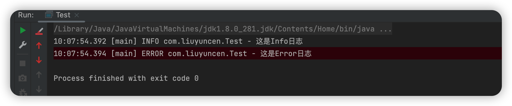

> 创建于2022年9月19日

# SpringBoot 整合 Slf4j

### 前言

在以前的开发项目中，打印日志都需要使用到下面这个组合

```java
import org.slf4j.Logger;
import org.slf4j.LoggerFactory;

private Logger log = LoggerFactory.getLogger(Test.class);
```

然后使用 `log.info()` 的方式打印日志，每个类都需要申请，很是麻烦。

### 现在

现在可以采取`@lombok.extern.slf4j.Slf4j 注解`进行简化操作，以下是具体实现步骤：

引入依赖，`@Slf4j` 这个注解是 `lombok` 中的一个

```xml
<!-- https://mvnrepository.com/artifact/org.projectlombok/lombok -->
        <dependency>
            <groupId>org.projectlombok</groupId>
            <artifactId>lombok</artifactId>
            <version>1.18.0</version>
        </dependency>

        <!-- https://mvnrepository.com/artifact/org.slf4j/slf4j-api -->
        <dependency>
            <groupId>org.slf4j</groupId>
            <artifactId>slf4j-api</artifactId>
            <version>1.7.25</version>
        </dependency>

        <!-- https://mvnrepository.com/artifact/ch.qos.logback/logback-classic -->
        <dependency>
            <groupId>ch.qos.logback</groupId>
            <artifactId>logback-classic</artifactId>
            <version>1.2.3</version>
        </dependency>

        <!-- https://mvnrepository.com/artifact/org.junit.jupiter/junit-jupiter-api -->
        <dependency>
            <groupId>org.junit.jupiter</groupId>
            <artifactId>junit-jupiter-api</artifactId>
            <version>5.2.0</version>
            <scope>test</scope>
        </dependency>
```

然后直接使用就可以了

```java
package com.liuyuncen;

import lombok.extern.slf4j.Slf4j;

/**
 * @belongsProject: radis_springboot
 * @belongsPackage: com.liuyuncen
 * @author: Xiang想
 * @createTime: 2022-09-19  09:49
 * @description: TODO
 * @version: 1.0
 */
@Slf4j
public class Test {
    public static void main(String[] args) {
        log.info("这是Info日志");
        log.error("这是Error日志");
    }
}
```

