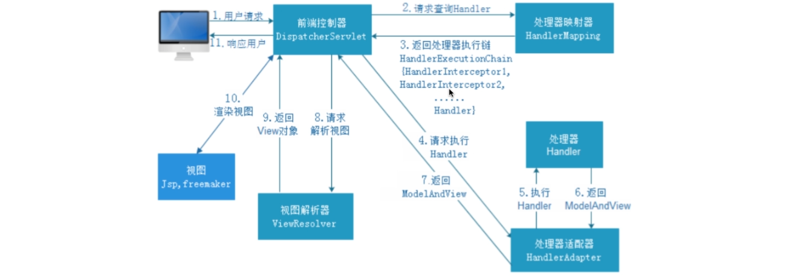

1. 用户发送请求到DispatcherServlet，也就是SpringMVC的老大，他会处理SpringMVC 所有请求
2. 收到请求之后，通过HandlerMapping 映射查找要哪一个 handler，可以理解为一个键值对，key就是url，value就是对应的 handler
3. 返回查找到的 handler，这里的 HandlerInterceptor 这个比 filter 功能强大的多
4. 请求 HandlerAdapter 适配器，为什么要有适配器呢？SpringMVC 早期的时候，不一定是 注解，也有可能是一个方法，实现 Controller接口，实现 handlerRequest 方法，根据不同的方法，适配不同的 handler
5. 执行 @RequestMapping 里的代码
6. 返回 数据和视图
7. 最后返回给老大 DIspatcherServlet
8. 请求视图解析器，将逻辑试图转换为物理视图 经过 InternalResourceViewResolver 
9. 返回View对象，也就是实际的 /WEB-INF/jsp/success.jsp
10. 找到具体的 jsp文件经行渲染
11. 返回给用户

