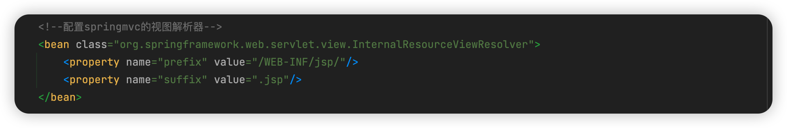

## HandlerMapping

这里处理 url 对应 Handler，通过 @RequestMapping 定义一个 Handler，Handler 的基本实现就是一个方法，一个类里可以有很多 Handler。在早期我们可以实现 Controller 接口，重写 handlrRequest 方法，但是这样一个类只能写一个handler。所以往往不用这种方式。

HandlerMapping 的作用就是找到相应的 Handler 和 Interceptor


## HandlerAdapter

Handler 可以是不同的形式，就像上面说的，可以是实现 Controller 接口、也可以是注解。包括参数也有不同的表现形式，String参数、HttpServlet 参数、自定义的User对象等。都要适配


## HandlerExcptionResolver

处理 Handler 产生的异常情况


## ViewResolver



视图解析器：干两件大事，第一找到渲染那所用的模版，第二，就是填入参数。


## RequestToViewNameTranslator

（请求参数转换为逻辑视图名）把请求的路径转换为寻找资源的路径，假设请求的是  /demo/hendler01

```java
   @RequestMapping("/demo/handle01")
    public ModelAndView handle01(@ModelAttribute("name") String name) {
        ModelAndView modelAndView = new ModelAndView();
      	// 注释掉逻辑视图名
        // modelAndView.setViewName("success");
        return modelAndView;
    }
```

访问的路径则会是：/WEB-INF/jsp/demo/handler01/success.jsp

## LocalResolver

国际化的一个东西，zh-CN 不重要

## ThemeResolver

主题

## MultipartResolver

多元素解析器，上传功能

## FlashMapManager

重定向参数传递