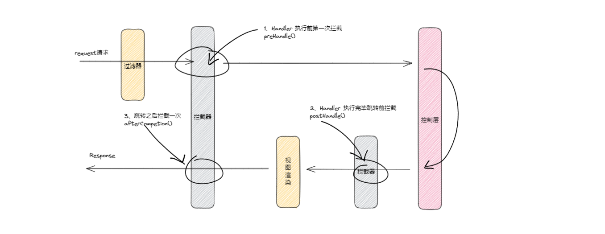
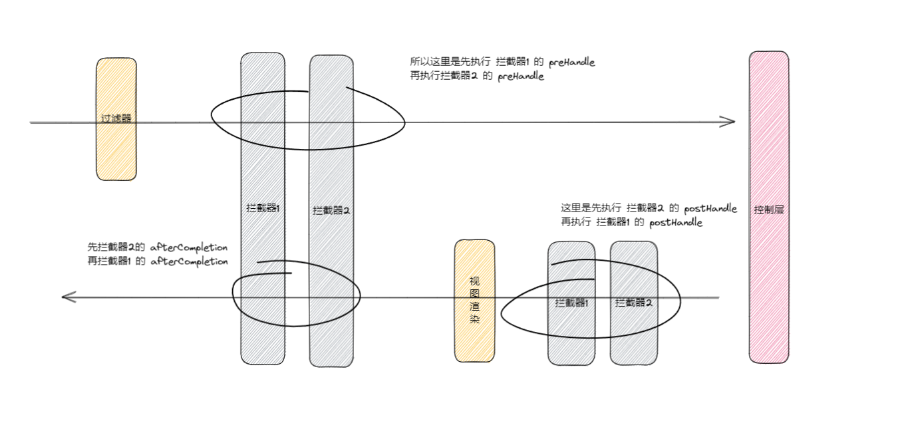

## 自定义拦截器

三次拦截代码案例：

~~~java
package com.lagou.edu.interceptor;

import org.springframework.web.servlet.HandlerInterceptor;
import org.springframework.web.servlet.ModelAndView;

import javax.servlet.http.HttpServletRequest;
import javax.servlet.http.HttpServletResponse;

/**
 * 自定义springmvc拦截器
 */
public class MyIntercepter01 implements HandlerInterceptor {

    /** 
     * 会在handler方法业务逻辑执行之前执行
     * 往往在这里完成权限校验工作
     * @param request
     * @param response
     * @param handler
     * @return  返回值boolean代表是否放行，true代表放行，false代表中止
     * @throws Exception
     */
    @Override
    public boolean preHandle(HttpServletRequest request, HttpServletResponse response, Object handler) throws Exception {
        System.out.println("MyIntercepter01 preHandle......");
        return true;
    }

    /**
     * 会在handler方法业务逻辑执行之后尚未跳转页面时执行
     * @param request
     * @param response
     * @param handler
     * @param modelAndView  封装了视图和数据，此时尚未跳转页面呢，你可以在这里针对返回的数据和视图信息进行修改
     * @throws Exception
     */
    @Override
    public void postHandle(HttpServletRequest request, HttpServletResponse response, Object handler, ModelAndView modelAndView) throws Exception {
        System.out.println("MyIntercepter01 postHandle......");
    }

    /**
     * 页面已经跳转渲染完毕之后执行
     * @param request
     * @param response
     * @param handler
     * @param ex  可以在这里捕获异常
     * @throws Exception
     */
    @Override
    public void afterCompletion(HttpServletRequest request, HttpServletResponse response, Object handler, Exception ex) throws Exception {
        System.out.println("MyIntercepter01 afterCompletion......");
    }
}
~~~

写完了这里要到 SpringMVC.xml 的配置文件中注册

~~~xml
<mvc:interceptor>
    <!--配置当前拦截器的url拦截规则，**代表当前目录下及其子目录下的所有url-->
    <mvc:mapping path="/**"/>
    <!--exclude-mapping可以在mapping的基础上排除一些url拦截-->
    <!--<mvc:exclude-mapping path="/demo/**"/>-->
    <bean class="com.lagou.edu.interceptor.MyIntercepter01"/>
</mvc:interceptor>
~~~

如果是多个拦截器链的执行顺序如何呢？

一图就明白

