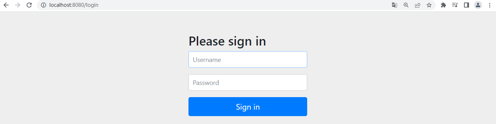
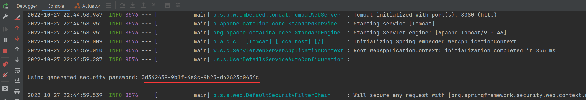
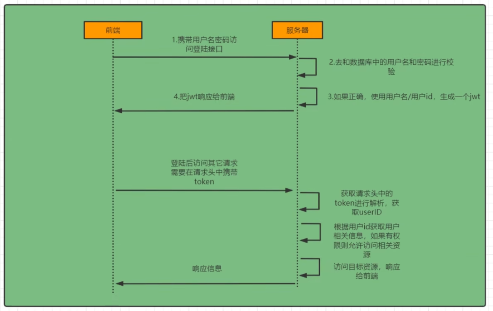
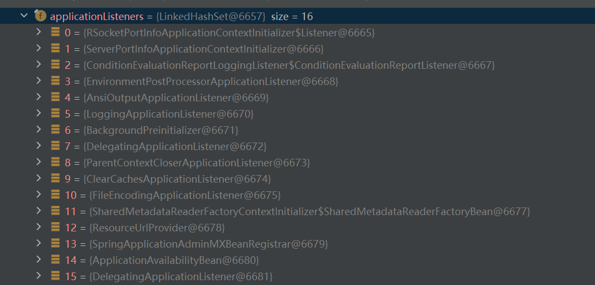
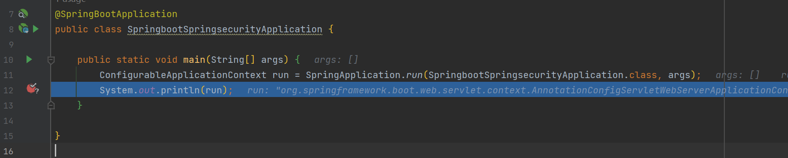
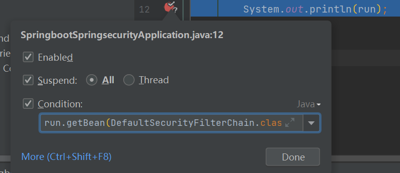
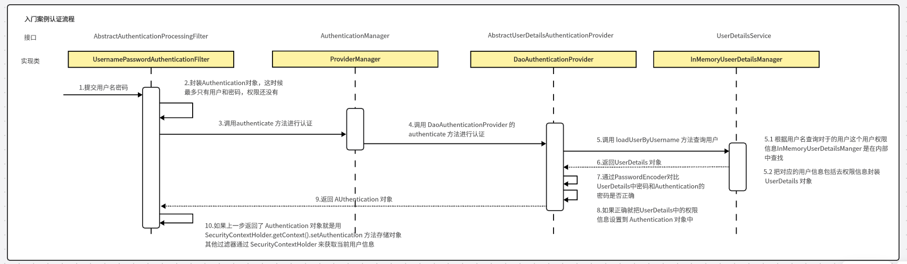

> 创建于2022年10月27日
>
> 来源：https://www.bilibili.com/video/BV1mm4y1X7Hc


[toc]

# SpringSecurity 从入门到精通

## 1、简介

​	**SpringSecurity**  是 Spring 家族中的一个安全管理框架，相比与另外一个安全框架 **Shiro**，它提供了更丰富的功能，社区资源也比 **Shiro** 丰富。

​	一般来讲，大型项目用的都是 SpringSecurity 来做安全框架，小项目用 Shiro 的比较多，因为相比 SpringSecurity，Shiro 的上手更加的简单。

​	一般 web 应用的需要进行认证和授权

​		**认证：验证当前访问系统的是不是系统用户，并且要确认具体是哪个用户**

​		**授权：经过认证后判断当前用户是否具有权限进行某个操作**

​	而且认证和授权也是SpringSecurity 作为安全框架的核心功能

### 1.1、初始化一个Spring工程

`pom.xml` 引入下列坐标

```xml
 	<parent>
        <groupId>org.springframework.boot</groupId>
        <artifactId>spring-boot-starter-parent</artifactId>
        <version>2.5.0</version>
    </parent>

    <dependencies>
        <dependency>
            <groupId>org.springframework.boot</groupId>
            <artifactId>spring-boot-starter-web</artifactId>
        </dependency>
        <dependency>
            <groupId>org.projectlombok</groupId>
            <artifactId>lombok</artifactId>
            <optional>true</optional>
        </dependency>
    </dependencies>
```

添加一个 `HelloController`

```java
    @RequestMapping("/hello")
    public String hello(){
        return "hello world";
    }
```

测试没有问题


## 2、引入 SpringSecurity

```xml
        <dependency>
            <groupId>org.springframework.boot</groupId>
            <artifactId>spring-boot-starter-security</artifactId>
        </dependency>
```

在引入 SpringSecurity 之后，再次访问之前的路径就多了一个登录页面



账户是 User

密码在控制台



## 3、认证

### 3.1、登录校验流程



### 3.2、原理初探

想要知道如何实现自己的登录流程就必须要先知道入门案例中 SpringSecurity 的流程

### 3.3、SpringSecurty 完整流程

SpringSecurty 的原理其实就算一个过滤器链，内部包含了提供各种功能的过滤器，这里我们可以看到入门案例中的过滤器

+ **UsernamePasswordAuthenticationFilter**：负责处理我们在登录页面填写了用户名密码的登录请求，入门案例的认证主要工作由他负责
+ **ExceptionTranslationFilter**：处理过滤器链中抛出的任何 AccessDeniedException 和 AuthenticationException。
+ **FilterSecurityInterceptor**：负责权限校验的过滤器



> 想到找到这个断点，可以这样做
>
> 
>
> 
>
> ```
> run.getBean(DefaultSecurityFilterChain.class)
> ```

### 3.4、入门案例认证流程



Authentication接口：它的实现类，表示当前访问系统的用户，封装了用户相关信息

AuthenticationManage 接口：定义了认证 Authentication 的方法

UserDetailsService接口：加载用户特定数据的核心接口。里面定义了一个根据用户名查询用户信息的放啊

UserDetails接口：提供核心用户信息，通过UserDetailsService根据用户名获取处理的用户信息要封装成 UserDetails 对象返回。然后将这些信息封装到 Authentication 对象中


## 4、解决问题

### 4.1、思路分析

登录

​	① 自定义登录接口 在ProviderManager 的方法进行认证，如果认证通过，就生成 `JWT `，并且把用户信息存入`Redis`中

​	② 自定义 UserDetailsService 这个实现列中查询数据库

校验

 	定义 JWT 认证过滤器

​			获取 token

​			解析 token 获取齐总的 userid

​			从 redis 中获取信息，存入 SecurityContexttHolder

### 4.2、准备工作

重新创建一个 springboot 工程，大致和上面的差不多

```xml
        <!-- reids 依赖 -->
        <dependency>
            <groupId>org.springframework.boot</groupId>
            <artifactId>spring-boot-starter-data-redis</artifactId>
        </dependency>
        <!-- fastjson 依赖 -->
        <dependency>
            <groupId>com.alibaba</groupId>
            <artifactId>fastjson</artifactId>
            <version>1.2.33</version>
        </dependency>
        <!-- jwt 依赖 -->
        <dependency>
            <groupId>io.jsonwebtoken</groupId>
            <artifactId>jjwt</artifactId>
            <version>0.9.0</version>
        </dependency>
```

添加 redis、JwtUtils、WebUtils 等工具配置文件

### 4.3、创建表

```sql
create table sys_user (
id bigint(20) not NULL AUTO_INCREMENT comment '主键',
user_name varchar(64) not null default 'NULL' comment '用户名',
password varchar(64) not null default 'NULL' comment '昵称',
PRIMARY key(id)
)
```

添加 Mybatis-plus 和 mysql 驱动依赖

```xml
        <dependency>
            <groupId>com.baomidou</groupId>
            <artifactId>mybatis-plus-boot-starter</artifactId>
            <version>3.4.2</version>
        </dependency>
        <dependency>
            <groupId>mysql</groupId>
            <artifactId>mysql-connector-java</artifactId>
        </dependency>
```

数据库连接信息

```yaml
spring:
  datasource:
    url: jdbc:mysql://localhost:3306/nacos?characterEncoding=utf-8&serverTimezone=UTC
    username: root
    password: root
    driver-class-name: com.mysql.cj.jdbc.Driver
```

定义Mapper接口

```java
public interface UserMapper extends BaseMapper<User> {
}
```

在 User 实体类上

```
类名上添加 @TableName(value = "sys_user") 主键字段加上 @TableId
```

配置 mapper 扫描

```java
@MapperScan("com.liuyuncen.mapper")
```


到这里程序就写的差不多了，我们测试一下程序是否可用，写个测试类

引入测试依赖

```xml
<dependency>
    <groupId>org.springframework.boot</groupId>
    <artifactId>spring-boot-starter-test</artifactId>
</dependency>
```

测试代码

```java
@SpringBootTest
public class MapperTest {

    @Autowired
    private UserMapper userMapper;

    @Test
    public void testUserMapper(){
        List<User> users = userMapper.selectList(null);
        System.out.println(users.toString());
    }
}
```

