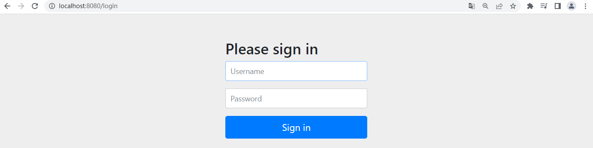
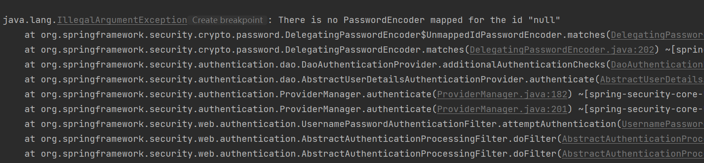
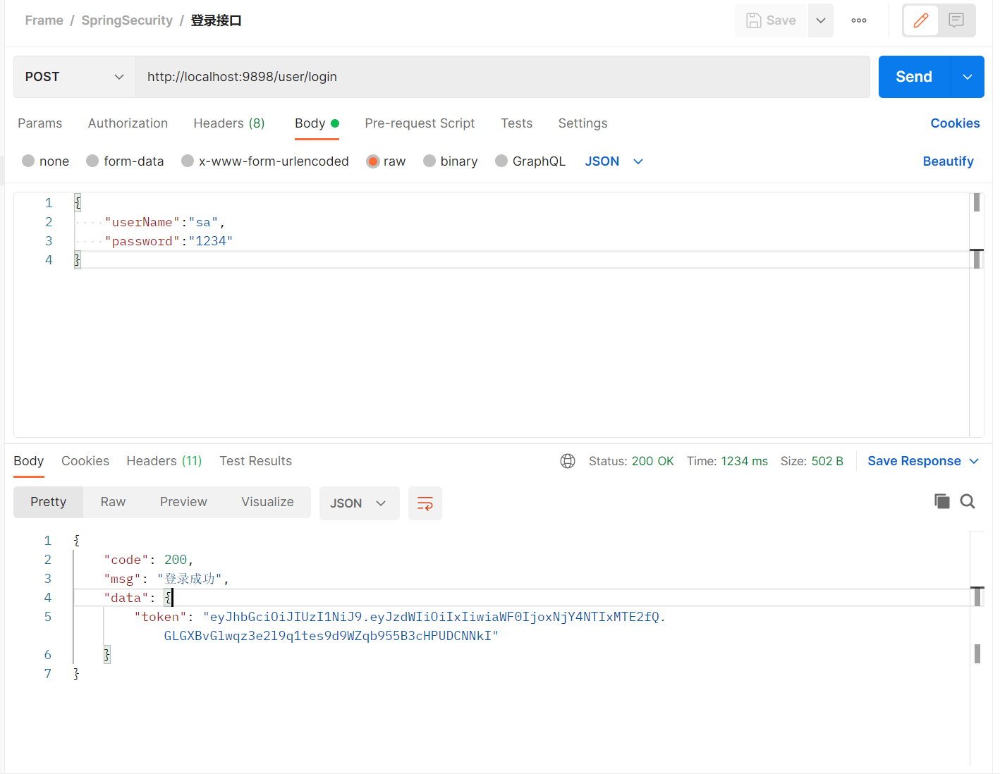

## SpringSecurity 实现自定义登录

> 通过 SpringSecurity 第一章，系统已经可以成功的读取到 MySQL 数据库中的内容了

​	

​	在前一章，我们可以通过系统打印在控制台的密码进行登录，所以这一章，要使用 MySQL 中定义的数据进行用户密码验证。



​		需要用到一个关键的类 `org.springframework.security.core.userdetails.UserDetailsService`，我们创建一个 `UserDetailsServiceImpl `实现 `UserDetailsService `这个重要的类

```java
package com.liuyuncen.service.impl;

import com.baomidou.mybatisplus.core.toolkit.Wrappers;
import com.liuyuncen.domain.LoginUser;
import com.liuyuncen.domain.User;
import com.liuyuncen.mapper.UserMapper;
import org.springframework.beans.factory.annotation.Autowired;
import org.springframework.security.core.userdetails.UserDetails;
import org.springframework.security.core.userdetails.UserDetailsService;
import org.springframework.security.core.userdetails.UsernameNotFoundException;
import org.springframework.stereotype.Service;

import java.util.Objects;

/**
 * @author xiang
 */
@Service
public class UserDetailsServiceImpl implements UserDetailsService{

    @Autowired
    private UserMapper userMapper;

    @Override
    public UserDetails loadUserByUsername(String username) throws UsernameNotFoundException{
        // 查询用户信息
        User user = userMapper.selectOne(Wrappers.<User>query().lambda().eq(User::getUserName, username));
        // 如果没有查询到用户就抛出一场
        if (Objects.isNull(user)){
            throw new RuntimeException("用户名或密码错误");
        }
        // 把数据封装成 UserDetails 返回
        return new LoginUser(user);
    }
}

```

​		在这里，我们重写了 `loadUserByUsername` 这个方法，并把用户名拿到MySQL中去查询，这里的入参，就算前端页面登录的那个用户名。

​		` return new LoginUser(user)`  中的 LoginUser 需要再创建一个

```java
package com.liuyuncen.domain;

import lombok.AllArgsConstructor;
import lombok.Data;
import lombok.NoArgsConstructor;
import org.springframework.security.core.GrantedAuthority;
import org.springframework.security.core.userdetails.UserDetails;

import java.util.Collection;

/**
 * @author xiang
 */
@Data
@AllArgsConstructor
@NoArgsConstructor
public class LoginUser implements UserDetails {


    private User user;
    @Override
    public Collection<? extends GrantedAuthority> getAuthorities() {
        return null;
    }
    @Override
    public String getPassword() {
        return user.getPassword();
    }
    @Override
    public String getUsername() {
        return user.getUserName();
    }
    @Override
    public boolean isAccountNonExpired() {
        return true;
    }
    @Override
    public boolean isAccountNonLocked() {
        return true;
    }
    @Override
    public boolean isCredentialsNonExpired() {
        return true;
    }
    @Override
    public boolean isEnabled() {
        return true;
    }
}

```

这里需要注意几个问题，LoginUser 用户实现 UserDetails 后，重写方法，isAccountNonExpired、isAccountNonLocked... 下面几个返回 boolean 类型的方法，如果是返回false 的话，就会提示


原因是 `isAccountNonLocked` 为 false 了，账号锁定，就无法登录了。此时，我们就要把这些 `false `都改为 `true`。然后再次登录



发现又有一个问题了，此时，我们把数据库里的密码修改一下

```
user_name:sa
password:{noop}1234
```

这里的 `{noop}` 我们就可以用明文，直接用1234作为密码进行登录。重新登录，结果：登录成功！

实际项目中，我们不会把密码明文存储在数据库中

默认使用 PasswordEncoder  要求数据库中的密码为：{id}password。它会根据id去判断密码的加密方式。但是我们一般不会采用这种方式。所以就要替换 passwordEncoder

我们一般使用 SpringSecurity 为我们提供的BCryptPasswordEncoder

我们只需要把 BCryptPasswordEncoder 对象注入 Spring 容器中，SpringSecurity就会使用该 PasswordEncoder 来进行密码验证。我们可以定义一个 SpringSecurity 的配置类，SpringSecutiry 要求这个配置类要继承 WebSecurityConfigurerAdapter

```java
package com.liuyuncen.config;

import org.springframework.context.annotation.Bean;
import org.springframework.context.annotation.Configuration;
import org.springframework.security.config.annotation.web.configuration.WebSecurityConfigurerAdapter;
import org.springframework.security.crypto.bcrypt.BCryptPasswordEncoder;
import org.springframework.security.crypto.password.PasswordEncoder;

@Configuration
public class SecurityConfig extends WebSecurityConfigurerAdapter {

    @Bean
    public PasswordEncoder passwordEncoder(){
        return new BCryptPasswordEncoder();
    }
}
```

通过 BCryptPasswordEncoder  我们可以自定义的获取密文和对比明文和密文

```java
 @Test
    public void TestBCryptPasswordEncoder(){
        BCryptPasswordEncoder passwordEncoder = new BCryptPasswordEncoder();
        // 密码加密
        String encode = passwordEncoder.encode("1234");
        System.out.println("encode = " + encode);

        // 校验方法
        boolean matches = passwordEncoder.matches("1234", "$2a$10$wViW/IDHIUu5pdSOolojbuK8fMDn/8zeC5lCR8TNIY4.kzEaVTVo.");
        System.out.println("matches = " + matches);

    }
```

在添加了 `SecurityConfig` 把加密方式改为 BCryptPasswordEncoder 后，数据库密码的内容就要修改为 

`$2a$10$wViW/IDHIUu5pdSOolojbuK8fMDn/8zeC5lCR8TNIY4.kzEaVTVo.`  这个样子的了。然后我们重新登录，验证登录成功！


### 自定义登录接口

​	在接口中我们通过 AuthenticationManager 的 authenticate 方法来进行用户认证，所以需要在 SecutiryConfig 中配置 AuthenticationManager 注入容器中

​	认证要成的话要生产jwt，放入相应返回，并且让用户下回请求能通过jwt识别出具体是哪个用个用户，我们需要把用户信息存入 redis，可以把id作为key。

首先需要创建一个登录接口

```java
@PostMapping("/user/login")
public ResponseResult<Map<String,String>> login(@RequestBody User user){
    return loginService.login(user);
}
```

在 SecurityConfig 配置中 添加

```java
    @Override
    protected void configure(HttpSecurity http) throws Exception {
        http
                // 关闭csrf
                .csrf().disable()
                // 不通过 Session 获取 SecutiryCOntext
                .sessionManagement().sessionCreationPolicy(SessionCreationPolicy.STATELESS)
                .and()
                .authorizeRequests()
                // 对于登录接口 允许匿名访问
                .antMatchers("/user/login").anonymous()
                // 除上面的所有请求都需要鉴定认证
                .anyRequest().authenticated();
    }

    /**
     * 通过 AuthenticationManager 的 authenticate 方法来进行用户认证
     */
    @Bean
    @Override
    public AuthenticationManager authenticationManagerBean() throws Exception {
        return super.authenticationManagerBean();
    }
```

在自定义 LoginServiceImpl 中

```java
package com.liuyuncen.service.impl;

import com.liuyuncen.domain.LoginUser;
import com.liuyuncen.domain.ResponseResult;
import com.liuyuncen.domain.User;
import com.liuyuncen.service.LoginService;
import com.liuyuncen.utils.JwtUtils;
import com.liuyuncen.utils.RedisCache;
import org.springframework.beans.factory.annotation.Autowired;
import org.springframework.security.authentication.AuthenticationManager;
import org.springframework.security.authentication.UsernamePasswordAuthenticationToken;
import org.springframework.security.core.Authentication;
import org.springframework.stereotype.Service;

import java.util.HashMap;
import java.util.Map;
import java.util.Objects;

@Service
public class LoginServiceImpl implements LoginService {

    @Autowired
    private AuthenticationManager authenticationManager;

    @Autowired
    private RedisCache redisCache;

    @Override
    public ResponseResult<Map<String,String>> login(User user) {
        // 通过 AuthenticationManager 的 authenticate 方法来进行用户认证
        UsernamePasswordAuthenticationToken authenticationToken = new UsernamePasswordAuthenticationToken(user.getUserName(),user.getPassword());
        Authentication authenticate = authenticationManager.authenticate(authenticationToken);
        // 如果认证没通过，给出对应提示
        if (Objects.isNull(authenticate)){
            throw new RuntimeException("登录失败");
        }
        // 如果认证通过 使用 userid 生成一个 jwt，纯如 responseResult 返回
        LoginUser loginUser = (LoginUser)authenticate.getPrincipal();
        String userid = loginUser.getUser().getId().toString();
        String jwt = JwtUtils.acquireJWT(userid);

        // 把完整用户存入 redis userid 作为 key
        Map<String,String> map = new HashMap<>();
        map.put("token",jwt);

        redisCache.setCacheObject("login:"+userid,loginUser);
        return new ResponseResult<Map<String,String>>(200,"登录成功",map);
    }
}
```

启动项目



