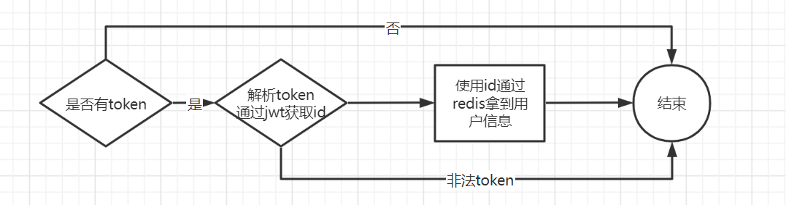
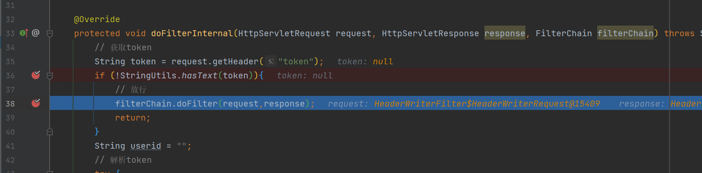
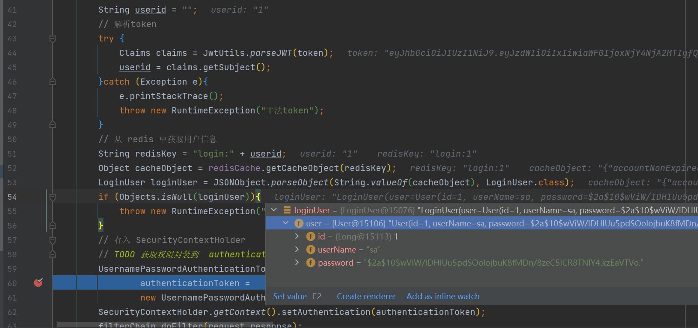

### 自定义认证过滤器

创建 JwtAuthenticationTokenFilter 继承 OncePerRequestFilter 重写 doFilterInternal 方法

```java
package com.liuyuncen.filter;

import com.alibaba.fastjson.JSONObject;
import com.liuyuncen.domain.LoginUser;
import com.liuyuncen.utils.JwtUtils;
import com.liuyuncen.utils.RedisCache;
import io.jsonwebtoken.Claims;
import org.springframework.beans.factory.annotation.Autowired;
import org.springframework.security.authentication.UsernamePasswordAuthenticationToken;
import org.springframework.security.core.context.SecurityContextHolder;
import org.springframework.stereotype.Component;
import org.springframework.util.StringUtils;
import org.springframework.web.filter.OncePerRequestFilter;

import javax.servlet.FilterChain;
import javax.servlet.ServletException;
import javax.servlet.http.HttpServletRequest;
import javax.servlet.http.HttpServletResponse;
import java.io.IOException;
import java.util.Objects;

/**
 * 自定义过滤器
 */
@Component
public class JwtAuthenticationTokenFilter extends   {

    @Autowired
    private RedisCache redisCache;


    @Override
    protected void doFilterInternal(HttpServletRequest request, HttpServletResponse response, FilterChain filterChain) throws ServletException, IOException {
        // 获取token
        String token = request.getHeader("token");
        if (!StringUtils.hasText(token)){
            // 没有token放行
            filterChain.doFilter(request,response);
            return;
        }
        String userid = "";
        // 解析token
        try {
            Claims claims = JwtUtils.parseJWT(token);
            userid = claims.getSubject();
        }catch (Exception e){
            e.printStackTrace();
            throw new RuntimeException("非法token");
        }
        // 从 redis 中获取用户信息
        String redisKey = "login:" + userid;
        Object cacheObject = redisCache.getCacheObject(redisKey);
        LoginUser loginUser = JSONObject.parseObject(String.valueOf(cacheObject), LoginUser.class);
        if (Objects.isNull(loginUser)){
            throw new RuntimeException("用户未登录");
        }
        // 存入 SecurityContextHolder
        // TODO 获取权限封装到  authenticationToken 中
        UsernamePasswordAuthenticationToken
                authenticationToken =
                new UsernamePasswordAuthenticationToken(loginUser,null,null);
        SecurityContextHolder.getContext().setAuthentication(authenticationToken);
        filterChain.doFilter(request,response);
    }
}

```




上图是过滤器的过程，可以拦截所有请求

那有了过滤器如何才能加载到配置中呢，还是需要用到 `SecurityConfig`

```java

    @Autowired
    private JwtAuthenticationTokenFilter jwtAuthenticationTokenFilter;

	@Override
    protected void configure(HttpSecurity http) throws Exception {
        http
            // 关闭csrf
            .csrf().disable()
            // 不通过 Session 获取 SecutiryCOntext
            .sessionManagement().sessionCreationPolicy(SessionCreationPolicy.STATELESS)
            .and()
            .authorizeRequests()
            // 对于登录接口 允许匿名访问
            .antMatchers("/user/login").anonymous()
            // 除上面的所有请求都需要鉴定认证
            .anyRequest().authenticated();

        // 把 token 校验过滤器添加到过滤器链中
        http.addFilterBefore(jwtAuthenticationTokenFilter, UsernamePasswordAuthenticationFilter.class);
    }

```

在原先的 configure 基础上添加  把 token 校验过滤器添加到过滤器链中

```java
http.addFilterBefore(jwtAuthenticationTokenFilter, UsernamePasswordAuthenticationFilter.class);
```


当我们不使用 token 去访问时



过滤器放行，让 springsecurity 去终止请求

当我们携带 token 时



Jwt 解析token中的 userid，然后再从 redis 中获取用户的所有信息！