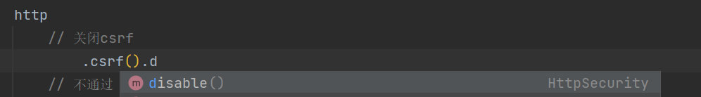
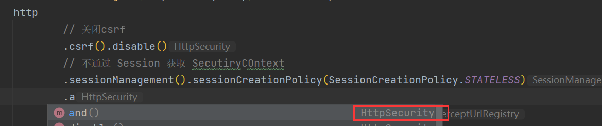
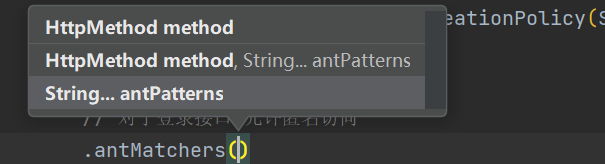
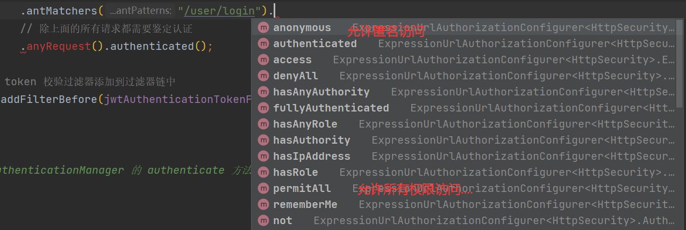
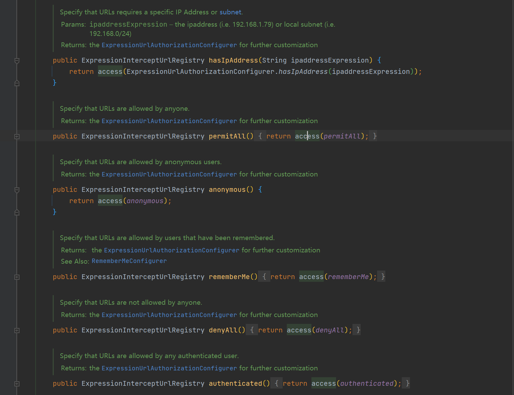

SpringSecurity 的配置主要是通过  SecurityConfig 继承  WebSecurityConfigurerAdapter 来实现的

重写 configure 方法

像之前留下的

```java
@Override
protected void configure(HttpSecurity http) throws Exception {
    http
        // 关闭csrf
        .csrf().disable()
        // 不通过 Session 获取 SecutiryCOntext
        .sessionManagement().sessionCreationPolicy(SessionCreationPolicy.STATELESS)
        .and()
        .authorizeRequests()
        // 对于登录接口 允许匿名访问
        .antMatchers("/user/login").anonymous()
        // 除上面的所有请求都需要鉴定认证
        .anyRequest().authenticated();

    // 把 token 校验过滤器添加到过滤器链中
    http.addFilterBefore(jwtAuthenticationTokenFilter, UsernamePasswordAuthenticationFilter.class);
}
```

这里来讲解一下

参数只有一个 HttpSecurity 对象

第一个  csrf().disable() 其实返回的还是 HttpSecurity 对象



第二个 sessionManagement 是关于 session  相关的配置... 这里我还不太明白，但是有意思的是，在 ..... 一堆 sesion 配置后，.and() 方法又是返回 HttpSecurity 对象



第三个 **antMatchers**  这里重点讲一下这个



它有三个构造器，我们最常用的是第三种，直接传入字符串。

在 **antMatchers（）** 方法后面还可以跟一个方法，就是确定这个参数到底是可匿名访问，还是不可匿名访问的



可以在 `ExpressionUrlAuthorizationConfigurer` 这个类中查看

