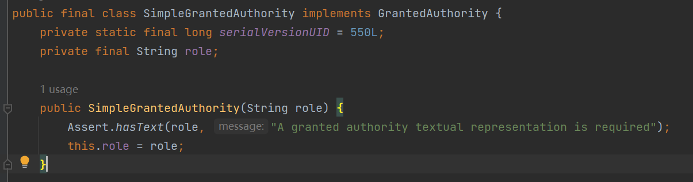
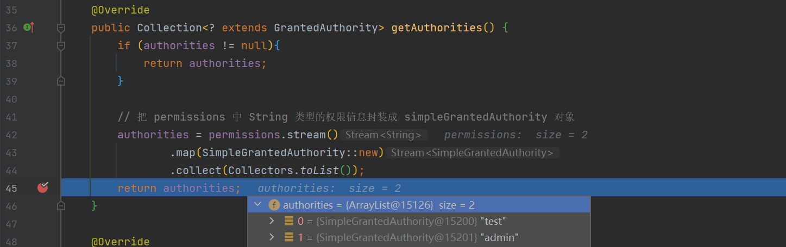
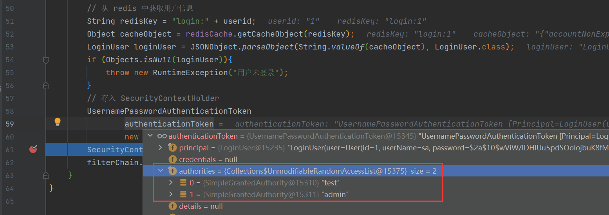
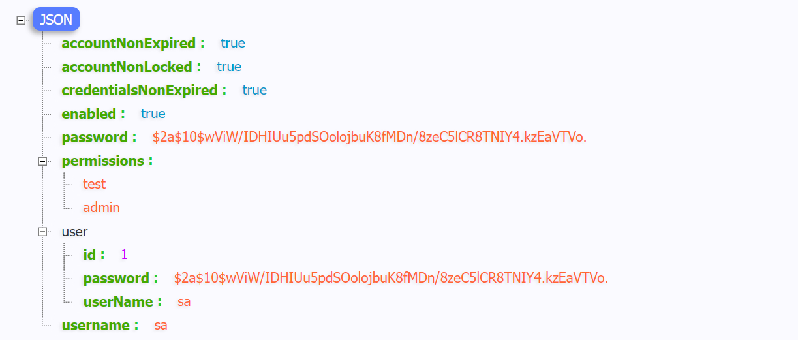

### 限制访问资源所需权限

​	SpringSecurity 为我们提供了基于注解的权限控制方案，这也是我们项目中主要采用的方式。我们可以使用注解去指定访问对应所需的权限。

​	但是要使用它我们需要先开启相关配置

```java
@EnableGlobalMethodSecurity(prePostEnable = true)
```

​	然后我们就可以使用对应的注解 `@PreAuthorize`

```java
package com.liuyuncen.controller;

import org.springframework.security.access.prepost.PreAuthorize;
import org.springframework.web.bind.annotation.GetMapping;
import org.springframework.web.bind.annotation.RestController;

@RestController
public class HelloController {

    @GetMapping("/sayHello")
    @PreAuthorize("hasAuthority('admin')")
    public String sayHello(){
        return "hello world";
    }
}

```


### 封装权限信息步骤

权限可以理解为一个具有意义的标识符、字符串。在用户第一次登录时候，就需要把这个字符串加载进 Security 中

```UserDetailsServiceImpl```

```java
 @Override
    public UserDetails loadUserByUsername(String username) throws UsernameNotFoundException{
        // 查询用户信息
        User user = userMapper.selectOne(Wrappers.<User>query().lambda().eq(User::getUserName, username));
        // 如果没有查询到用户就抛出一场
        if (Objects.isNull(user)){
            throw new RuntimeException("用户名或密码错误");
        }
        //TODO 查询到对应的权限信息
        List<String> permissions = new ArrayList<>(Arrays.asList("test","admin"));

        // 把数据封装成 UserDetails 返回
        return new LoginUser(user,permissions);
    }
```

添加了 `permissions `权限

在 `LoginUser `中新增两个属性

```java
    
	// 用于存储当前用户的所有权限集合
	private List<String> permissions;

	// 这是 Security 内部解析 permissions 属性
    // Redis 序列化时无需此属性
    @JSONField(serialize = false)
    private List<SimpleGrantedAuthority> authorities;

    public LoginUser(User user, List<String> permissions) {
        this.user = user;
        this.permissions = permissions;
    }
```

重写 `getAuthorities` 方法

```java
@Override
public Collection<? extends GrantedAuthority> getAuthorities() {
    if (authorities != null){
        return authorities;
    }

    // 把 permissions 中 String 类型的权限信息封装成 simpleGrantedAuthority 对象
    authorities = permissions.stream()
            .map(SimpleGrantedAuthority::new)
            .collect(Collectors.toList());
    return authorities;
}
```

从有参构造中，获取 permissions，遍历然后转换到 SimpleGrantedAuthority 对象中



其实就是一个有特色意义的字符串  String role

最后在过滤器中加载 loginUser 的 authoritites 属性

`JwtAuthenticationTokenFilter.doFilterInternal()` 

```java
UsernamePasswordAuthenticationToken
        authenticationToken =
        new UsernamePasswordAuthenticationToken(loginUser,null,loginUser.getAuthorities());
```


### 封装权限过程

登录接口时候，LoginUser 属性 authorites 属性



调用其他接口时，也能查看到 authorites 属性信息



通过 Redis 工具我们可以看到



