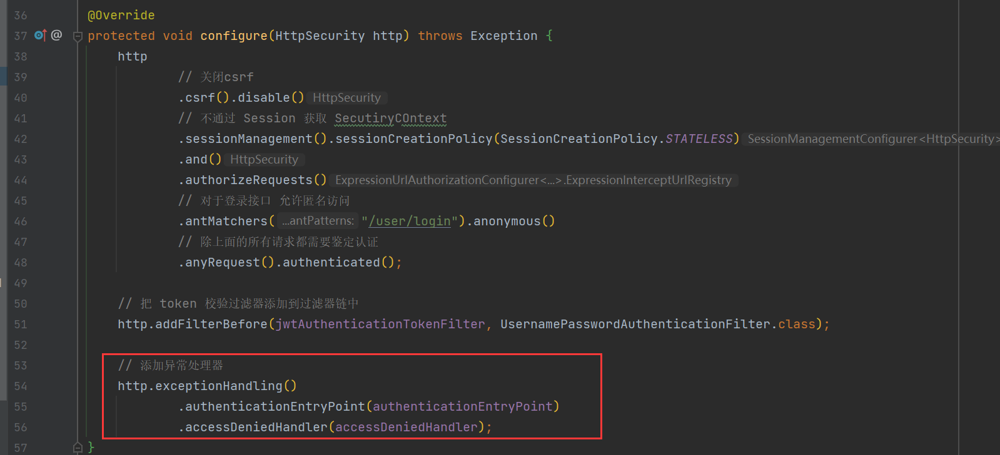
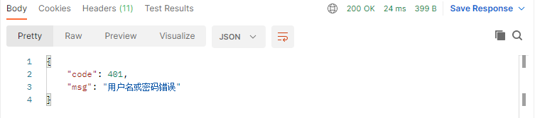
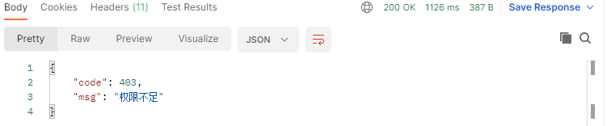

### 自定义失败处理

SpringSecutiry 异常处理机制，ExceptionTranslationFilter 捕捉

如果是认证过程中出现的异常会被封装成 AuthenticationExcpetion 然后调用 **AuthenticationEntryPoint** 对象的方法进行异常处理

如果是授权过程中出现的异常会被封装成 AccessDeniedException 然后调用 **AccessDeniedHandler** 对象的方法进行异常处理


所以解决办法就是，实现对应的接口 **AuthenticationEntryPoint** 、**AccessDeniedHandler**  然后配置给 SpringSecurity

 自定义实现类

```java
@Component
public class AuthenticationEntryPointImpl implements AuthenticationEntryPoint {

    @Override
    public void commence(HttpServletRequest httpServletRequest, HttpServletResponse httpServletResponse, AuthenticationException e) throws IOException, ServletException {
        ResponseResult result = new ResponseResult(HttpStatus.UNAUTHORIZED.value(),"用户名或密码错误");
        String message = JSON.toJSONString(result);
        WebUtils.renderString(httpServletResponse,message);
    }
}
```

```java
@Component
public class AccessDeniedHandlerImpl implements AccessDeniedHandler {
    
    @Override
    public void handle(HttpServletRequest httpServletRequest, HttpServletResponse httpServletResponse, AccessDeniedException e) throws IOException, ServletException {
        ResponseResult result = new ResponseResult(HttpStatus.FORBIDDEN.value(),"权限不足");
        String message = JSON.toJSONString(result);
        WebUtils.renderString(httpServletResponse,message);
    }
}
```

在 SecurityConfig 中添加异常处理器



用 Postmen 测试



