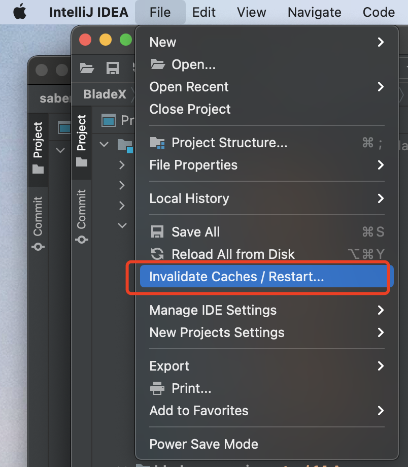

> 创建于2022年3月3日

## 实体类报错

因为业务需要，改变实体类包的位置，再刷新 maven 之后，发现 IDEA 编译器提示 service 和 controller 都报找不到实体类。尝试过 mvn install，发现 执行过程中并没有问题。

猜测是 IDEA 缓存问题。

更新 index，清楚缓存

==缓存清除后，会从新对本地maven仓库进行加载。==

更新完成后，不报错。