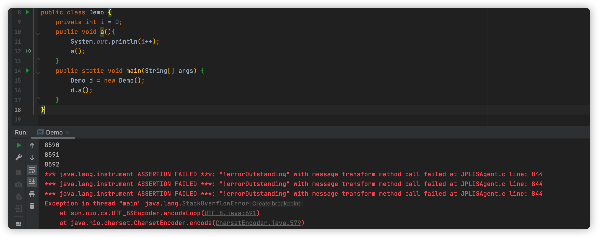
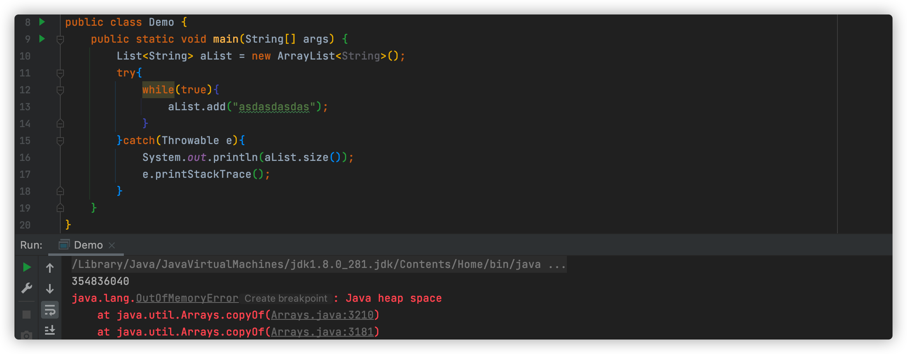

[toc]

# 基础面试题


## 1、面向对象三大特征

继承、封装、多态

继承：子类继承父类过程，可以继承方法和成员变量，也可以对其进行方法重写

封装：万物皆对象，对象有属性

多态：父类引用指向子类对象，前提满足继承和重写

```java
List<String> lists = new ArrayList<>();
```


## 2、不能做 switch() 的参数类型是

在 switch（expression）中，expression 只能是整数表达式或者枚举常量，整数表达式可以是 int 类型，Integer 包装类型。由于 byte，short，char 都是可以隐式转换为int类型，所以这些也可以作为表达式。

另外，在 JDK1.7 以后，String 类型也可以作为表达式

> 原理参考：https://blog.csdn.net/queenjade/article/details/44778653

那为什么支持 String 都不支持 long 呢？String 可以通过ASCII 码形式转换为整数，但是 long 型的范围大于 int 型，不支持隐式转换

> 详细解释：https://blog.csdn.net/xiaochengxuyuan1/article/details/113557984

## 3、static 有什么用途

static 可以修饰变量和方法，修饰后称为 “全局”、“静态”

1. static 变量

	JVM 在加载类过程就完成对静态变量的内存分配

2. 静态代码块和静态方法

	静态方法是需要被调用执行，静态代码块是自动执行的。

	静态方法和静态代码块都可以定义多个，不同的是，静态代码块只在第一次new时执行一次，非静态代码块每次new都执行，普通代码块可以在普通方法执行，静态代码块不可以。

	在继承中执行顺序是：父类静态内容 -> 子类静态内容-> 父类非静态代码块-> 父类构造方法-> 子类非静态代码块-> 子类构造方法

3. 静态内部类

	实际很少用，写一下测试类会用到

4. 静态导包

```java
import static java.lang.System.out;

public class Demo {
    static{
        out.println("hello");
    }
    static{
        out.println("hi！");
    }
}
```

> 原理参考：https://blog.csdn.net/Candy_luck/article/details/79582037

## 4、引用与指针有什么区别

Java 的引用和 C++ 的指针都是指向一块内存地址，通过引用或指针来完成对内存数据的操作。

+ 类型：引用的值为地址的数据元素，java封装了地址，转换为字符串，指针是一个变量，一般都是int
+ 所占内存：引用没有实体，不占内存，指针要赋值，会占
+ 内存泄露：引用不会产生内存泄露，指针会哦！

> 原理参考：https://blog.csdn.net/sinat_40959511/article/details/80217003

## 5、堆栈溢出一般是由什么原因导致的

1. 局部数组过大
2. 递归调用层次太多
3. 指针数组越界，这个最常见了

我们分开来说：

栈溢出(StackOverflowError)：栈帧远远超过了栈的深度，疯狂递归.....

可以通过 -Xss  调整栈大小



堆溢出(OutOfMemoryError:java heap space)：玩命的对数组进行扩容......

可以通过 -Xmx 调整堆总大小



> 参考1：https://blog.csdn.net/qq_31615049/article/details/82980799
>
> 参考2：https://blog.csdn.net/u010590166/article/details/22294291

## 6、网络编程时的同步、异步、阻塞、非阻塞

不难理解，现在有 A，B，C三个同学

拿做核酸举🌰

+ 同步

	A，B 同学排着队做核酸

+ 异步

	现在有若干个做核酸的队列，A 和 B 同时做核酸

拿商店付款举🌰

+ 阻塞

	99块钱的东西，我付了100，我要等他找我1块钱回来我再走

+ 非阻塞

	100块钱的东西，我直接给他一张100的，给了直接走，不用等


​																			 求点赞，在看，分享三连


