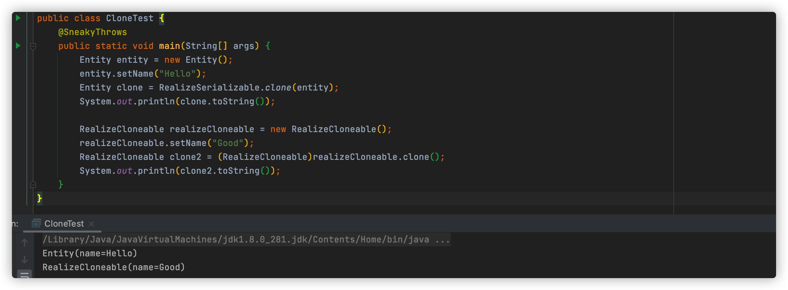

[toc]


## 1、如何实现对象克隆

1. 实现 `Cloneable` 接口重写 `Object` 类中的 `clone()` 方法
2. 实现 `Serializable` 接口，通过对象序列化和反序列实现克隆，可以实现真正的深度克隆

```java
@Data
public class RealizeCloneable implements Cloneable {
    private String name;
    @Override
    protected Object clone() throws CloneNotSupportedException {
        return super.clone();
    }
}
```

```java
public class RealizeSerializable {
    public RealizeSerializable() {
        throw new AssertionError();
    }
    public static <T extends Serializable> T clone(T obj)throws Exception{
        ByteArrayOutputStream bos = new ByteArrayOutputStream();
        ObjectOutputStream oos = new ObjectOutputStream(bos);
        oos.writeObject(obj);

        ByteArrayInputStream bis = new ByteArrayInputStream(bos.toByteArray());
        ObjectInputStream ois = new ObjectInputStream(bis);
        return (T)ois.readObject();
    }
}
@Data
class Entity implements Serializable {
    private String name;
}
```

```java
public class CloneTest {
    @SneakyThrows
    public static void main(String[] args) {
        Entity entity = new Entity();
        entity.setName("Hello");
        Entity clone = RealizeSerializable.clone(entity);
        System.out.println(clone.toString());

        RealizeCloneable realizeCloneable = new RealizeCloneable();
        realizeCloneable.setName("Good");
        RealizeCloneable clone2 = (RealizeCloneable)realizeCloneable.clone();
        System.out.println(clone2.toString());
    }
}
```



## 2、访问修饰符有哪些，优先级，以及区别

Java 中，有4种不同的修饰符，其优先级分别是 public > protected >  default  > private

public：所有类可见

protected：子类，同一个包中的类可见

default：通过一个包中可见

private：只能被自己访问和修改

## 3、this 与 super 的区别

`super()`和`this()`类似,区别是，`super()`从子类中调用父类的构造方法，`this()`在同一类内调用其它方法。

从本质上讲，`this`是一个指向本对象的指针, 然而`super`是一个Java关键字。

## 4、并发和并行有什么区别

并发是指某一时间段内，多个事件正在交替执行

并行是真正意义上，一个时刻多个事件正在同时执行

## 5、抽象类 和 接口 有什么区别

1. 抽象类只能单继承，接口可以多实现
2. 抽象类可以有构造方法，接口中不能有构造方法
3. 抽象类中可以有成员变量，接口中没有成员变量，只有常量（默认就是 `public static final`）
4. 抽象类中可以包含非抽象方法，在Java7之前接口中的方法都是抽象的，Java8后，接口支持非抽象方法，default方法和静态方法等，java9支持私有方法、私有静态方法

## 6、Error 和 Exception 有什么区别

Error 和 Exception 都是 Throwable 的子类，用于表示程序出现不正常的情况，但是区别是

1. Error表示系统级别的错误，比如说 `stackoverflow` 栈溢出
2. Excpetion 异常分为 可检查和不可检查异常，可检查异常在源码里显示进行捕捉，不可检查异常就是所谓的运行时异常，类似 OOM，`ArrayIndexOutOfBoundsException` 数据越界这样

## 7、try、catch、finally考察

```java
public class TryDemo {
    public static void main(String[] args) {
        System.out.println(test());
    }
    public static int test() {
        try {
            return 1;
        } catch (Exception e) {
            return 2;
        } finally {
            System.out.print("3");
        }
    }
}
```

执行结果为 ：  3  1

在程序执行到 第3行，`test()` 获取结果之前， `test` 类中的 `finally` 代码块优先执行，这个没什么好争论的，大家应该都懂

```java
public class TryDemo {
    public static void main(String[] args) {
        System.out.println(test1());
    }
    public static int test1() {
        try {
            return 2;
        } finally {
            return 3;
        }
    }
}
```

执行结果： 3

这里就有个陷阱了，很多人会以为是 `3 2` 其实不是，在第7行，`return 2` 之前，执行 `finally` 代码块，结果这老六不按常理出牌，直接抢在前头就返回了，所以这里只有 `3`

```java
public class TryDemo {
    public static void main(String[] args) {
        System.out.println(test1());
    }
    public static int test1() {
        int i = 0;
        try {
            i = 2;
            return i;
        } finally {
            i = 3;
        }
    }
}
```

执行结果： 2

这里估计又有人掉陷阱里去了，我们知道 `return` 之前会执行 `finally` ，但是 `finally` 中已经修改为 3 了，那返回的不应该是 `3` 吗？其实不然，在执行 `finally` 之前，JVM 会将 i 的结果保存起来，这里用到了两个指令 `iload` 、`istore` 最后返回的也是指令中保存的值，而并不是 `finally` 中修改后的值！