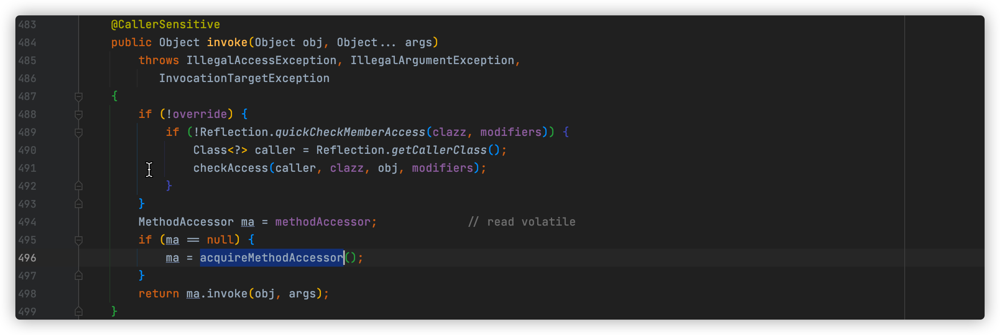
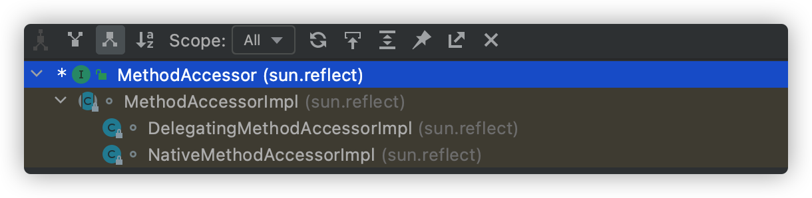
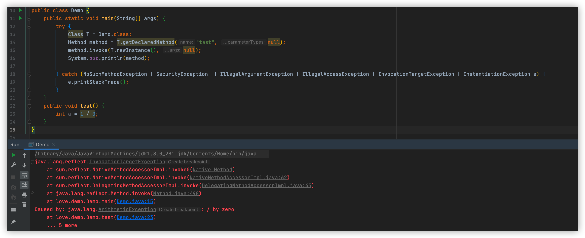

[toc]

## 基础面试题-反射

### 1、什么是反射

主要是指程序可以访问、检测和修改它本身状态的一种行为，反射就是把 java 类中的各个成分映射为一个个对象，一个类里有：成员变量、方法、构造方法、包等信息。

**Java 反射是 Java 被视为动态语言的一个关键性质**，这个机制允许程序在运行时透过 `Relfection APIs `取得任何一个已知名称 `class` 的内部信息，包括 `modifiers` (诸如 `public`、`static` 等)、`superclass`（例如 `Object`），实现 `interfaces`（例如 `Cloneable`）也包括 `fiedls` 和 `methods` 的所有信息，并可以改变 `fields`内容或唤起 ``methods``

在静态语言中，使用一个变量，必须知道他的存在，Java 中，变量的类型信息在编译时都保存到 class 文件中，这样在运行时才能保证准确无误，换句话说，程序在运行时都是固定的，如果这个时候想改变，就需要反射这个东西了。

实现 Java 发射机制的类都位于 java.lang.relfect 包中

1. Class类：代表一个类
2. Field类：代表类的成员变量（类的属性）
3. Method类：代表类的方法å
4. Constructor类：代表类的构造方法
5. Array类：提供了动态创建数组，以及访问数组的元素的静态方法

一句话概括就是使用反射可以赋予 `jvm` 动态编译的能力，否则类的元数据信息只能用今天该编译的方式实现，例如热加载，`Tomcat` 和 `classloader` 都无法支持

> 快速通道：[什么是反射，Java反射是什么](https://baijiahao.baidu.com/s?id=1722735740852260951)
>
> 地址：https://baijiahao.baidu.com/s?id=1722735740852260951

 ### 2、反射机制的优缺点

优点：

1. 反射机制极大的提高了程序的灵活性和扩展性，降低模块的耦合性，提高自身的适应能力
2. 通过反射机制可以让程序创建和控制任何类的对象，无需提前硬编码目标类
3. 使用反射机制能够在运行时构造一个类的对象、判断一个类所具有的成员变量和方法、调用一个对象的方法。
4. 反射机制是构建[框架](https://so.csdn.net/so/search?q=框架&spm=1001.2101.3001.7020)技术的基础所在，使用反射可以避免将代码写死在框架中

缺点：

1. 性能问题，反射中包含很多动态类型，Java虚拟机不能对这些动态内容进行优化，因此反射操作效果要比正常效果低很多
2. 安全限制，反射通常需要程序在运行么有安全方面的限制，如果一个程序有安全需求，那就最好不要使用反射
3. 程序健壮性，反射允许代码执行一些通常不被运行的操作，使用反射会导致意想不到的后果。反射代码破坏了Java程序结构的抽象性。

> 快速通道：[Java反射的优缺点](https://blog.csdn.net/hongfenglx/article/details/108819006)
>
> 地址：https://blog.csdn.net/hongfenglx/article/details/108819006

### 3、如何获取反射Class

1. 调用某个对象的 getClass 方法 

```java
People p = new People();
Class cazz = p.getClass();
```

2. 调用某个 class 属性来获取对应的 Class 对象

```java
Class clazz = People.class;
```

3. 使用 Class 类中的静态方法 forName() 获取

```java
Class clazz = Class.forName("xxx.xxx.People");
```

有了 class 对象，我们可以通个调用 newInstance() ，默认调用无参构造来返回一个对象

```java
String str = (String)(Class.forName("java.lang.String").newInstance());
```

也可以通过 Constructor 构造器来获取对象

```java
// 调用无参的私有构造函数
Constructor c1 = Class.forName("java.lang.String").getDeclaredConstructor();
c1.setAccessible(true);
String str1 = (String) c1.newInstance();

// 调用有参的私有构造函数
Constructor c2 = Class.forName("java.lang.String").getDeclaredConstructor(new Class[] { String.class });
c2.setAccessible(true);
String str2 = (String) c2.newInstance("hello");
```

> 快速通道：[简述Java中Class类的作用](https://blog.csdn.net/chongxue91/article/details/60961086)
>
> 地址：https://blog.csdn.net/chongxue91/article/details/60961086

### 4、反射的实现方法

**举例：**

+ 通过 Class 对象枚举该类所有方法
+ 通过 Method.setAccessible() 绕过 Java 语言的访问权限，在其他方法中调用该私有方法
+ Spring 框架中 IOC 依赖反转基于反射机制

**反射如何调用**

常用的方法是调用在 `java.lang.reflect.Method.invoke()`



前面不研究，就是做了权限判断， `override` 是内部的遍历，这一部分是检查 `public/private` 权限的 ，最后我们可以看到他交给了 `MethodAccessor` 来实现



一共是两个

+ DelegatingMethodAccessorImpl
	+ 字面上看是委派实现
+ NativeMethodAccessorImpl
	+ Native 是本地的意思

```java
public class Demo {
    public static void main(String[] args) {
        try {
            Class T = Demo.class;
            Method method = T.getDeclaredMethod("test", null);
            method.invoke(T.newInstance(), null);
            System.out.println(method);

        } catch (NoSuchMethodException | SecurityException  | IllegalArgumentException | IllegalAccessException | InvocationTargetException | InstantiationException e) {
            e.printStackTrace();
        }
    }
    public void test() {
        int a = 1 / 0;
    }
}
```

通过这样的



排除除数 0 的异常，我可以看到，调用顺序是 

> Method.invoke -> DelegatingMethodAccessorImpl.invoke (委派）-> NativeMethodAccessorImpl.invoke（本地实现）

为什么用委派而不直接调用本地实现呢，因为反射调用还有另一个机制，就是动态生成字节码的实现，也就是动态实现，直接使用 invoke 指令调用目标方法的，委派实现在这里的作用就是为了能让本地实现和动态实现之间来回切换

可以看看 NativeMethodAccessorImpl 的 invoke 实现

```java
public Object invoke(Object obj, Object[] args) 
    throws IllegalArgumentException, InvocationTargetException
{
    if (++numInvocations > ReflectionFactory.inflationThreshold()) {
        MethodAccessorImpl acc = (MethodAccessorImpl)
            new MethodAccessorGenerator().
                generateMethod(method.getDeclaringClass(),
                               method.getName(),
                               method.getParameterTypes(),
                               method.getReturnType(),
                               method.getExceptionTypes(),
                               method.getModifiers());
        parent.setDelegate(acc);
    }
 
    return invoke0(method, obj, args);
```

不然发现，当 `numInvocations` > `ReflectionFactory.inflationThreshold()`，也就是类膨胀阈值时，`MethodAccessorGenerator` 会生成一个代理类对象，并且委托给 `NativeMethodAccessorImpl` 的 `parent`，也就是 `DelegatingMethodAccessorImpl`，设置为这个代理类。转为由 `GenerateMethodAccessor1` 来实现，也就是动态是实现。

其中代理的实现你可以参考下面这段伪代码

```java
// 这里只列举了关键的调用逻辑，其实它还包括调用者检测、参数检测的字节码。
package jdk.internal.reflect;
 
public class GeneratedMethodAccessor1 extends ... {
  @Overrides    
  public Object invoke(Object obj, Object[] args) throws ... {
    Demo.test1();
    return null;
  }
}
```

总结

反射在内部有两种实现方式，分别时动态实现和本地实现，本地实现采用的是 C++ 代码实现的，需要 Java 到 C++ 代码的来回转化，而动态实现因为生成字节码的较长，所以在对反射只是调用一两次的情况下，采用本地实现会比动态实现快，而在面对大于 15 次以上（可以调整）的情况下，动态实现反而比本地就更高效率了。

我们还可以把反射的权限的检查关闭`setAccessible(true)` 能够提升一定性能，在 `invoke` 方法中就体现了。

反射性能的干扰因素

+ 变成参数方法导致的 Object 数组要自动生成
+ 基本类型在传入参数时的自动拆装箱子。
+ 方法的内联。

> 快速通道：[反射基本实现](https://blog.csdn.net/qq_37391214/article/details/106643472)
>
> 地址：https://blog.csdn.net/qq_37391214/article/details/106643472

### 5、序列化与反序列化

序列化：将数据对象转换为二进制流的过程称为对象序列化

反序列化：将二进制流恢复为数据对象的过程称为反序列化

目的是为了进行数据持久化和网络传输，常用的场景是 `PRC`框架的数据传输

序列化有三种方式实现

1. Java原生序列化 实现 `Serializable` 接口，这个接口非常特殊，没有任何方法，只起标识作用，这个方法的兼容性也最好，但是不支持跨语言，而且性能一般。在实现 `Seriablizable` 时，建议设置 `serialVersionUID` 字段值，如果不设置，编译器会根据内部实现类包括类名、接口名、方法和属性自动生成 `serialVersionUID`，如果类的源码有修改，那么重新编译后 `serialVersionUID` 取值可能会发生改变，因此 `Serializable` 一定要显示定义 `serialVersionUID` 属性值。

2. Hessian 序列化，支持动态类型、跨语言、基于对象传输的网络协议，Java对象序列化二进制流可以被其他语言反序列化

	特点：

	+ 自描述序列化类型，不依赖外部描述文件和定义接口，用一个字节表示常用基础类型，极大缩短二进制流
	+ 语言无关，支持脚本语言
	+ 协议简单，比Java原生序列化高效

3. JSON 序列化，轻量级数据交换格式，就是将对象转换为 JSON 字符串，在序列化中抛弃了数据类型，所以在反序列化时只有提供类型信息才能准确的反序列化

序列化通常会通过网络传输对象，对象中往往有敏感数据，所以序列化常常会成为黑客攻击点，攻击者巧妙利用反序列过程构建恶意代码，使得程序在反序列地过程中执行任意代码。

`Transient` 关键字可以避免属性转换为序列化