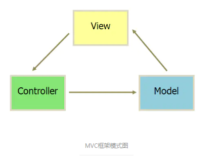

[toc]

## 1、SpringBoot 启动方式

1. 通过 Main 方法启动

     ```java
     SpringApplication.run(Xxxx.class, args);
     ```

2. 通过命令行 java -jar 的方式

     1. 把项目打成 jar 包，用 java -jar 的方式运行

3. 通过Spring - boot - pluging 方式启动

     需要写 maven 配置

     ```xml
     <plugin>
     	<groupId>org.springframework.boot</groupId>
     	<artifactId>spring-boot-maven-plugin</artifactId>
     </plugin>
     ```

     因为指定了父模块 spring-boot-starter-parent  所以不需要指定插件版本

     ==执行==  :runner:

     ```
     mvn spring-boot:run
     ```

## 2、Redis 实现持久化的方式

有两种持久化的方式，分别是  rdb 和 aof，

1. rdb 默认方式，snapshotting（快照）方式，将内存中以快照的方式写入二进制文件中，默认是 dump.rdb ，我们可以通过设置自动做快照持久化的方式，可以配置 redis在n秒内如果超过 m 个key 修改，就自动快照
2. append-only file （aof方式），reids 会将每一个收到的命令通过 write 函数追加到命令中，当redis 重启后，会重新执行文件保存好的命令，并重新建立数据内容，apeendonly.aof 不是立即写入磁盘的，是通过配置文件修改强制写到磁盘的。

## 3、MVC、MVVM、MVP是什么，区别

[https://www.jianshu.com/p/ff6de219f988](https://www.jianshu.com/p/ff6de219f988)

#### MVC：



M：Model（模型） 是应用程序中处理数据逻辑的部分，可以负责数据的存储获取

V：View（视图）处理数据显示部分

C：Controller（控制器）是应用程序中处理交互的部分。并向模型发送数据

#### MVP：


Model-View-Presenter

M：提供数据

V：负责显示

P：逻辑的处理

#### MVVM：


MVVM是Model-View-ViewModel的简写。它本质上就是MVC 的改进版。MVVM 就是将其中的View 的状态和行为抽象化，让我们将视图 UI 和业务逻辑分开。

组成部分：

+ 模型：是指代表真实状态内容的领域模型（面向对象），或指代表内容的数据访问层（以数据为中心）

+ 视图：就想 MVC 和 MVP 模式中一样，视图是用户在屏幕上看的结构、布局和外观
+ 视图模型：暴露公共属性和命令的视图抽象。MVVM 没有MVC模式控制器，也没有MVP模式的 presenter，有的是一个绑定器
+ 绑定器：声明性数据和命令绑定隐含在 MVVM 模式中。在 Microsoft 解决方案堆中，绑定器是一种名为 XAML 的标记性语言。

#### MVP与MVC区别：

作为一种新的模式，MVP与MVC有着一个重大的区别：在MVP中View并不直接使用Model，它们之间的通信是通过Presenter (MVC中的Controller)来进行的，所有的交互都发生在Presenter内部，而在MVC中View会直接从Model中读取数据而不是通过 Controller。
 在MVC里，View是可以直接访问Model的！从而，View里会包含Model信息，不可避免的还要包括一些业务逻辑。 在MVC模型里，更关注的Model的改变，而同时有多个对Model的不同显示，即View。所以，在MVC模型里，Model不依赖于View，但是View是依赖于Model的。不仅如此，因为有一些业务逻辑在View里实现了，导致要更改View也是比较困难的，至少那些业务逻辑是无法重用的。
 虽然 MVC 中的 View 的确“可以”访问 Model，但是我们不建议在 View 中依赖 Model，而是要求尽可能把所有业务逻辑都放在 Controller 中处理，而 View 只和 Controller 交互。

#### MVVM与MVP区别

MVVM 模式将 Presener 改名为 View Model，基本上与 MVP 模式完全一致，唯一的区别是，它采用双向绑定 （data-binding）：view 的变动，自动反应在 ViewModel。

## 4、JDBC 操作步骤

1. 加载（注册）数据库驱动（到  JVM）
2. 建立（获取）数据库连接
3. 创建（获取）数据库操作对象
4. 定义操作的 SQL 语句
5. 执行数据库操作
6. 获取并操作结果集

## 5、Object 类常用的方法有哪些

Object 有12个成员方法

1. 构造方法
2. hashCode和 equale 函数
3. wait（）、wait（long）、wait（long，int）、notify（）、notifyAll（）
     + wait（）用于让当前线程失去操作权限，当前线程进入等待序列
     + notify（）用于随机通知一个持有对象的锁的线程获取操作权限
     + notifyAll（）用于通知所有持有对象的锁的线程获取操作权限
     + wait（long）、wait（long，int）用于设定下一次获取锁的距离当前释放锁的时间间隔
4. toString（）和 getClass
     + toString ，返回String 对象，用来标识自己
     + getClass（），返回 Class 对象   例如： class package.name.xxx
5. clone（）
     + 用于另存一个当前存在的对象
6. finalize（）用于在垃圾回收
     + 回收垃圾

## 6、StringBuffer、StringBuilder


## 7、Super 和 this 关键字的区别

这两个关键字都是在继承关系中才会出现的，Super .变量，会在直接去父类中查找，this.变量，优先在本类中查找，没找到的话，会去父类中查找

## 8、线程同步的方法

[https://www.cnblogs.com/XHJT/p/3897440.html](https://www.cnblogs.com/XHJT/p/3897440.html)

