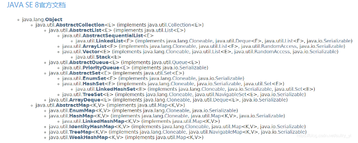

[toc]

# 1、String可以被继承？

==不能被继承，因为String类有final修饰符，而final修饰的类是不能被继承的。==

```java
public final class String implements java.io.Serializable, Comparable<String>, CharSequence {
   // 省略...　
}
```


# 2、常见集合类




> Java集合框架主要包括两种类型的容器，一种是集合（Collection），另一种是图（Map）。Collection接口又有3种子类型，List、Set和Queue，再下面是一些抽象类，最后是具体实现类，常用的有ArrayList、LinkedList、HashSet、LinkedHashSet、HashMap、LinkedHashMap等等。Map常用的有HashMap,LinkedHashMap等

## **1.List**

List接口扩展自Collection，它可以定义一个允许重复的有序集合，从List接口中的方法来看，List接口主要是增加了面向位置的操作，允许在指定位置上操作元素，同时增加了一个能够双向遍历线性表的新列表迭代器ListIterator。AbstractList类提供了List接口的部分实现，AbstractSequentialList扩展自AbstractList，主要是提供对链表的支持。下面介绍List接口的两个重要的具体实现类，也是我们可能最常用的类，ArrayList和LinkedList。

### **1.1ArrayList**

通过阅读ArrayList的源码，我们可以很清楚地看到里面的逻辑，它是用数组存储元素的，这个数组可以动态创建，如果元素个数超过了数组的容量，那么就创建一个更大的新数组，并将当前数组中的所有元素都复制到新数组中。假设第一次是集合没有任何元素，下面以插入一个元素为例看看源码的实现。

```java
1、找到add()实现方法。
   public boolean add(E e) {
        ensureCapacityInternal(size + 1);  // Increments modCount!!
        elementData[size++] = e;
        return true;
    }
2、此方法主要是确定将要创建的数组大小。
  private void ensureCapacityInternal(int minCapacity) {
        if (elementData == DEFAULTCAPACITY_EMPTY_ELEMENTDATA) {
            minCapacity = Math.max(DEFAULT_CAPACITY, minCapacity);
        }
        ensureExplicitCapacity(minCapacity);
    }
    private void ensureExplicitCapacity(int minCapacity) {
        modCount++;
        if (minCapacity - elementData.length > 0)
            grow(minCapacity);
    }
3、最后是创建数组，可以明显的看到先是确定了添加元素后的大小之后将元素复制到新数组中。
    private void grow(int minCapacity) {
        // overflow-conscious code
        int oldCapacity = elementData.length;
        int newCapacity = oldCapacity + (oldCapacity >> 1);
        if (newCapacity - minCapacity < 0)
            newCapacity = minCapacity;
        if (newCapacity - MAX_ARRAY_SIZE > 0)
            newCapacity = hugeCapacity(minCapacity);
        // minCapacity is usually close to size, so this is a win:
        elementData = Arrays.copyOf(elementData, newCapacity);
    }
```

### **1.2LinkedList**

同样，我们打开LinkedList的源文件，不难看到LinkedList是在一个链表中存储元素。

在学习数据结构的时候，我们知道链表和数组的最大区别在于它们对元素的存储方式的不同导致它们在对数据进行不同操作时的效率不同，同样，ArrayList与LinkedList也是如此，实际使用中我们需要根据特定的需求选用合适的类，如果除了在末尾外不能在其他位置插入或者删除元素，那么ArrayList效率更高，如果需要经常插入或者删除元素，就选择LinkedList。

### **1.3CopyOnWriteArrayList**

CopyOnWriteArrayList，是一个线程安全的List接口的实现，它使用了ReentrantLock锁来保证在并发情况下提供高性能的并发读取。

## **2.Set**

Set接口扩展自Collection，它与List的不同之处在于，规定Set的实例不包含重复的元素。在一个规则集内，一定不存在两个相等的元素。AbstractSet是一个实现Set接口的抽象类，Set接口有三个具体实现类，分别是散列集HashSet、链式散列集LinkedHashSet和树形集TreeSet。

### **2.1HashSet**

散列集HashSet是一个用于实现Set接口的具体类，可以使用它的无参构造方法来创建空的散列集，也可以由一个现有的集合创建散列集。在散列集中，有两个名词需要关注，初始容量和客座率。客座率是确定在增加规则集之前，该规则集的饱满程度，当元素个数超过了容量与客座率的乘积时，容量就会自动翻倍。

从输出结果我们可以看到，规则集里最后有4个元素，而且在输出时元素还是无序的。

### **2.2LinkedHashSet**

LinkedHashSet是用一个链表实现来扩展HashSet类，它支持对规则集内的元素排序。HashSet中的元素是没有被排序的，而LinkedHashSet中的元素可以按照它们插入规则集的顺序提取。

### **2.3TreeSet**

TreeSet扩展自AbstractSet，并实现了NavigableSet，AbstractSet扩展自AbstractCollection，树形集是一个有序的Set，其底层是一颗树，这样就能从Set里面提取一个有序序列了。在实例化TreeSet时，我们可以给TreeSet指定一个比较器Comparator来指定树形集中的元素顺序。树形集中提供了很多便捷的方法。

## **3.Queue**

队列是一种先进先出的数据结构，元素在队列末尾添加，在队列头部删除。Queue接口扩展自Collection，并提供插入、提取、检验等操作。

上图中，方法offer表示向队列添加一个元素，poll()与remove()方法都是移除队列头部的元素，两者的区别在于如果队列为空，那么poll()返回的是null，而remove()会抛出一个异常。方法element()与peek()主要是获取头部元素，不删除。

接口Deque，是一个扩展自Queue的双端队列，它支持在两端插入和删除元素，因为LinkedList类实现了Deque接口，所以通常我们可以使用LinkedList来创建一个队列。PriorityQueue类实现了一个优先队列，优先队列中元素被赋予优先级，拥有高优先级的先被删除。

## 4、Map

### **1.HashMap**

HashMap是基于哈希表的Map接口的非同步实现，继承自AbstractMap，AbstractMap是部分实现Map接口的抽象类。在平时的开发中，HashMap的使用还是比较多的。我们知道ArrayList主要是用数组来存储元素的，LinkedList是用链表来存储的，那么HashMap的实现原理是什么呢？先看下面这张图：


在之前的版本中，HashMap采用数组+链表实现，即使用链表处理冲突，同一hash值的链表都存储在一个链表里。但是当链表中的元素较多，即hash值相等的元素较多时，通过key值依次查找的效率较低。而JDK1.8中，HashMap采用数组+链表+红黑树实现，当链表长度超过阈值（8）时，将链表转换为红黑树，这样大大减少了查找时间。

下面主要通过源码介绍一下它的实现原理。

**HashMap存储元素的数组**

```
  transient Node<K,V>[] table;
```

> 数组的元素类型是Node<K,V>，Node<K,V>继承自Map.Entry<K,V>，表示键值对映射。

```java
static class Node<K,V> implements Map.Entry<K,V> {
        final int hash;
        final K key;
        V value;
        Node<K,V> next;
        //构造函数 ( Hash值键值下一个节点 )
        Node(int hash, K key, V value, Node<K,V> next) {
            this.hash = hash;
            this.key = key;
            this.value = value;
            this.next = next;
        }
        public final K getKey()        { return key; }
        public final V getValue()      { return value; }
        public final String toString() { return key + "=" + value; }
        public final int hashCode() {
            return Objects.hashCode(key) ^ Objects.hashCode(value);
        }
        public final V setValue(V newValue) {
            V oldValue = value;
            value = newValue;
            return oldValue;
        }
        public final boolean equals(Object o) {
            if (o == this)
                return true;
            if (o instanceof Map.Entry) {
                Map.Entry<?,?> e = (Map.Entry<?,?>)o;
                if (Objects.equals(key, e.getKey()) &&
                    Objects.equals(value, e.getValue()))
                    return true;
            }
            return false;
        }
    }
```

> 接下来我们看下HashMap的put操作。

```java
    final V putVal(int hash, K key, V value, boolean onlyIfAbsent,
        boolean evict) {
        Node<K,V>[] tab; Node<K,V> p; int n, i;
        if ((tab = table) == null || (n = tab.length) == 0)
            n = (tab = resize()).length;  //如果没有初始化则初始化table
        if ((p = tab[i = (n - 1) & hash]) == null)
            //这里 (n-1)&hash 是根据hash值得到这个元素在数组中的位置（即下标）
            tab[i] = newNode(hash, key, value, null);
        //如果数组该位置上没有元素，就直接将该元素放到此数组中的该位置上
        else {
            Node<K,V> e; K k;
            //第一节节点hash值同，且key值与插入key相同
            if (p.hash == hash &&
                ((k = p.key) == key || (key != null && key.equals(k))))
                e = p;
            else if (p instanceof TreeNode)
                //属于红黑树处理冲突
                e = ((TreeNode<K,V>)p).putTreeVal(this, tab, hash, key, value);
            else {
                //链表处理冲突
                for (int binCount = 0; ; ++binCount) {
                    if ((e = p.next) == null) {
                        p.next = newNode(hash, key, value, null);
                        if (binCount >= TREEIFY_THRESHOLD - 1) // -1 for 1st
                        //新增节点后如果节点个数到达阈值，则将链表转换为红黑树
                            treeifyBin(tab, hash);
                        break;
                    }
                    if (e.hash == hash &&
                        ((k = e.key) == key || (key != null && key.equals(k))))
                        break;
                    p = e;
                }
            }
            //更新hash值和key值均相同的节点Value值
            if (e != null) { // existing mapping for key
                V oldValue = e.value;
                if (!onlyIfAbsent || oldValue == null)
                    e.value = value;
                afterNodeAccess(e);
                return oldValue;
            }
        }
        ++modCount;
        if (++size > threshold)
            resize();
        afterNodeInsertion(evict);
        return null;
    }
```

> 接下来我们看下HashMap的get操作。

```java
  final Node<K,V> getNode(int hash, Object key) {
        Node<K,V>[] tab; Node<K,V> first, e; int n; K k;
        if ((tab = table) != null && (n = tab.length) > 0 &&
            (first = tab[(n - 1) & hash]) != null) {
            if (first.hash == hash && // always check first node
                ((k = first.key) == key || (key != null && key.equals(k))))
                return first;
            if ((e = first.next) != null) {
                //如果第一个节点是TreeNode,说明采用的是数组+红黑树结构处理冲突
    //遍历红黑树，得到节点值
                if (first instanceof TreeNode)
                    return ((TreeNode<K,V>)first).getTreeNode(hash, key);
                do {
                    if (e.hash == hash &&
                        ((k = e.key) == key || (key != null && 
                                                       key.equals(k))))
                        return e;
                } while ((e = e.next) != null);
            }
        }
        return null;
    }
```

到这里HashMap的大致实现原理应该很清楚了，有几个需要关注的重点是：HashMap存储元素的方式以及根据Hash值确定映射在数组中的位置还有JDK 1.8之后加入的红黑树的。

> 在HashMap中要找到某个元素，需要根据key的hash值来求得对应数组中的位置。对于任意给定的对象，只要它的hashCode()返回值相同，那么程序调用hash(int h)方法所计算得到的hash码值总是相同的。我们首先想到的就是把hash值对数组长度取模运算，这样一来，元素的分布相对来说是比较均匀的。但是，“模”运算的消耗还是比较大的，在HashMap中，**(n - 1) & hash**用于计算对象应该保存在table数组的哪个索引处。HashMap底层数组的长度总是2的n次方，当数组长度为2的n次幂的时候，**(n - 1) & hash** 算得的index相同的几率较小，数据在数组上分布就比较均匀，也就是说碰撞的几率小，相对的，查询的时候就不用遍历某个位置上的链表，这样查询效率也就较高了。

### **2.LinkedHashMap**

LinkedHashMap继承自HashMap，它主要是用链表实现来扩展HashMap类，HashMap中条目是没有顺序的，但是在LinkedHashMap中元素既可以按照它们插入图的顺序排序，也可以按它们最后一次被访问的顺序排序。

### **3.TreeMap**

TreeMap基于红黑树数据结构的实现，键值可以使用Comparable或Comparator接口来排序。TreeMap继承自AbstractMap，同时实现了接口NavigableMap，而接口NavigableMap则继承自SortedMap。SortedMap是Map的子接口，使用它可以确保图中的条目是排好序的。

在实际使用中，如果更新图时不需要保持图中元素的顺序，就使用HashMap，如果需要保持图中元素的插入顺序或者访问顺序，就使用LinkedHashMap，如果需要使图按照键值排序，就使用TreeMap。

### **4.ConcurrentHashMap**

Concurrent，并发，从名字就可以看出来ConcurrentHashMap是HashMap的线程安全版。同HashMap相比，ConcurrentHashMap不仅保证了访问的线程安全性，而且在效率上与HashTable相比，也有较大的提高。


# 3、异常

> 	1，异常是什么
> 				第一，异常模拟的是现实世界中不正常的事件
> 				第二，java中采用类去模拟异常
> 				第三，类是可以创建对象的
> 					NullPointerException e= 0x1234
> 					e是引用类型，e中保存的内存地址指向堆中的对象
> 					这个对象一定是NullPointerException类型
> 					这个对象就表示真实存在的异常事件
> 					NullPointerException是一类异常抢劫是一类异常，        ---->类
> 			 张三被抢劫就是一个异常事件				----->对象
> 				类和对象
> 					
> 		2，异常机制的作用？
> 			java语言为我们提供一种完善的异常处理机制
> 			作用是：程序发生异常事件之后，为我们输出详细的信息，
> 				程序员通过这个信息，可以对程序进行一些处理，使程序更加健壮
> ==本质：程序执行过程中发生了算数异常这个事件，JVM向我们创建了一个ArithmeticException类型的对象
> 				并且这个对象包含了详细的异常信息，JVM把这个对象中的信息输出到控制台==

- ArithmeticException - 算术运算中，被0除或模除。
- ArrayIndexOutOfBoundsException - 数组越界访问。
- ArrayStoreException - 数据存储异常，写数组操作时，对象或数据类型不兼容。
- ClassCastException - 类型转换异常。
- IllegalArgumentException - 方法的参数错误 无效。
- IllegalThreadStateException - 试图非法改变线程状态，比方说试图启动一已经运行的线程。
- NullPointerException - 试图访问一空对象的变量、方法或空数组的元素("程序遇上了空指针",因为调用了未经初始化的对象或者是不存在)
- NumberFormatException - 数据格式异常，试图把一字符串非法转换成数值（或相反）。
- SecurityException - 如果Applet试图执行一被WWW浏览器安全设置所禁止的操作。
- IncompatibleClassChangeException - 如改变了某一类定义，却没有重新编译其他引用了这个类的对象。如某一成员变量的声明被从静态改变为非静态，但其他引用了这个变量的类却没有重新编译，或者相反。
- OutOfMemoryException - 内存不足，通常发生于创建对象之时。
- NoClassDefFoundException - JAVA运行时系统找不到所引用的类。
- IncompatibleTypeException - 试图实例化一个接口，Java运行时系统将抛出这个异常。
- UnsatisfiedLinkException - 如果所需调用的方法是C函数，但Java运行时系统却无法连接这个函数。
- InternalException - 系统内部故障所导致的异常情况，可能是因为Java运行时系统本身的原因。如果发现一可重现的InternalException，可以直接给Sun公司发电邮java@java.Sun.com。
-   java.lang.classnotfoundexception 解释是"指定的类不存在"，这里主要考虑一下类的名称和路径是否正确即可。

​                                                                                                                                                                                              


# 4、线程

## 4.1、创建方式

==1）继承Thread类创建线程==

==2）实现Runnable接口创建线程==

==3）使用Callable和Future创建线程==

==4）使用线程池例如用Executor框架==

### 1.1、继承Thread类创建线程

> 1】d定义Thread类的子类，并重写该类的run()方法，该方法的方法体就是线程需要完成的任务，run()方法也称为线程执行体。
>
> 2】创建Thread子类的实例，也就是创建了线程对象
>
> 3】启动线程，即调用线程的start()方法

```java
public class MyThread extends Thread{//继承Thread类
　　public void run(){
　　//重写run方法
　　}
}
public class Main {
　　public static void main(String[] args){
　　　　new MyThread().start();//创建并启动线程
　　}
}
```

###  1.2、实现Runnable接口创建线程

>1】定义Runnable接口的实现类，一样要重写run()方法，这个run（）方法和Thread中的run()方法一样是线程的执行体
>
>2】创建Runnable实现类的实例，并用这个实例作为Thread的target来创建Thread对象，这个Thread对象才是真正的线程对象
>
>3】第三部依然是通过调用线程对象的start()方法来启动线程

```java
public class MyThread2 implements Runnable {//实现Runnable接口
　　public void run(){
　　//重写run方法
　　}
}
public class Main {
　　public static void main(String[] args){
　　　　//创建并启动线程
　　　　MyThread2 myThread=new MyThread2();
　　　　Thread thread=new Thread(myThread);
　　　　thread().start();
　　　　//或者    new Thread(new MyThread2()).start();
　　}
}
```

### 1.3、使用Callable和Future创建线程

和Runnable接口不一样，Callable接口提供了一个call（）方法作为线程执行体，call()方法比run()方法功能要强大。

》call()方法可以有返回值

》call()方法可以声明抛出异常

Java5提供了Future接口来代表Callable接口里call()方法的返回值，并且为Future接口提供了一个实现类FutureTask，这个实现类既实现了Future接口，还实现了Runnable接口，因此可以作为Thread类的target。在Future接口里定义了几个公共方法来控制它关联的Callable任务。

\>boolean cancel(boolean mayInterruptIfRunning)：视图取消该Future里面关联的Callable任务

\>V get()：返回Callable里call（）方法的返回值，调用这个方法会导致程序阻塞，必须等到子线程结束后才会得到返回值

\>V get(long timeout,TimeUnit unit)：返回Callable里call（）方法的返回值，最多阻塞timeout时间，经过指定时间没有返回抛出TimeoutException

\>boolean isDone()：若Callable任务完成，返回True

\>boolean isCancelled()：如果在Callable任务正常完成前被取消，返回True

介绍了相关的概念之后，创建并启动有返回值的线程的步骤如下：

> 1】创建Callable接口的实现类，并实现call()方法，然后创建该实现类的实例（从java8开始可以直接使用Lambda表达式创建Callable对象）。
>
> 2】使用FutureTask类来包装Callable对象，该FutureTask对象封装了Callable对象的call()方法的返回值
>
> 3】使用FutureTask对象作为Thread对象的target创建并启动线程（因为FutureTask实现了Runnable接口）
>
> 4】调用FutureTask对象的get()方法来获得子线程执行结束后的返回值

```java
public class Main {
　　public static void main(String[] args){
　　　MyThread3 th=new MyThread3();
　　　//使用Lambda表达式创建Callable对象
　　   //使用FutureTask类来包装Callable对象
　　　FutureTask<Integer> future=new FutureTask<Integer>(
　　　　(Callable<Integer>)()->{
　　　　　　return 5;
　　　　}
　　  );
　　　new Thread(task,"有返回值的线程").start();//实质上还是以Callable对象来创建并启动线程
　　  try{
　　　　System.out.println("子线程的返回值："+future.get());//get()方法会阻塞，直到子线程执行结束才返回
 　　 }catch(Exception e){
　　　　ex.printStackTrace();
　　　}
　　}
}
```

### 1.4、使用线程池例如用Executor框架

1.5后引入的Executor框架的最大优点是把任务的提交和执行解耦。要执行任务的人只需把Task描述清楚，然后提交即可。这个Task是怎么被执行的，被谁执行的，什么时候执行的，提交的人就不用关心了。具体点讲，提交一个Callable对象给ExecutorService（如最常用的线程池ThreadPoolExecutor），将得到一个Future对象，调用Future对象的get方法等待执行结果就好了。Executor框架的内部使用了线程池机制，它在java.util.cocurrent 包下，通过该框架来控制线程的启动、执行和关闭，可以简化并发编程的操作。因此，在Java 5之后，通过Executor来启动线程比使用Thread的start方法更好，除了更易管理，效率更好（用线程池实现，节约开销）外，还有关键的一点：有助于避免this逃逸问题——如果我们在构造器中启动一个线程，因为另一个任务可能会在构造器结束之前开始执行，此时可能会访问到初始化了一半的对象用Executor在构造器中。

 

  Executor框架包括：线程池，Executor，Executors，ExecutorService，CompletionService，Future，Callable等。

 

  Executor接口中之定义了一个方法execute（Runnable command），该方法接收一个Runable实例，它用来执行一个任务，任务即一个实现了Runnable接口的类。ExecutorService接口继承自Executor接口，它提供了更丰富的实现多线程的方法，比如，ExecutorService提供了关闭自己的方法，以及可为跟踪一个或多个异步任务执行状况而生成 Future 的方法。 可以调用ExecutorService的shutdown（）方法来平滑地关闭 ExecutorService，调用该方法后，将导致ExecutorService停止接受任何新的任务且等待已经提交的任务执行完成(已经提交的任务会分两类：一类是已经在执行的，另一类是还没有开始执行的)，当所有已经提交的任务执行完毕后将会关闭ExecutorService。因此我们一般用该接口来实现和管理多线程。

 

  ExecutorService的生命周期包括三种状态：运行、关闭、终止。创建后便进入运行状态，当调用了shutdown（）方法时，便进入关闭状态，此时意味着ExecutorService不再接受新的任务，但它还在执行已经提交了的任务，当素有已经提交了的任务执行完后，便到达终止状态。如果不调用shutdown（）方法，ExecutorService会一直处在运行状态，不断接收新的任务，执行新的任务，服务器端一般不需要关闭它，保持一直运行即可。

  

  Executors提供了一系列工厂方法用于创先线程池，返回的线程池都实现了ExecutorService接口。  

   public static ExecutorService newFixedThreadPool(int nThreads)

  创建固定数目线程的线程池。

  public static ExecutorService newCachedThreadPool()

  创建一个可缓存的线程池，调用execute将重用以前构造的线程（如果线程可用）。如果现有线程没有可用的，则创建一个新线  程并添加到池中。终止并从缓存中移除那些已有 60 秒钟未被使用的线程。

  public static ExecutorService newSingleThreadExecutor()

  创建一个单线程化的Executor。

  public static ScheduledExecutorService newScheduledThreadPool(int corePoolSize)

  创建一个支持定时及周期性的任务执行的线程池，多数情况下可用来替代Timer类。

 

  这四种方法都是用的Executors中的ThreadFactory建立的线程，下面就以上四个方法做个比较

 

| newCachedThreadPool()       | -缓存型池子，先查看池中有没有以前建立的线程，如果有，就 reuse.如果没有，就建一个新的线程加入池中 -缓存型池子通常用于执行一些**生存期很短的异步型任务**  因此在一些面向连接的daemon型SERVER中用得不多。但对于生存期短的异步任务，它是Executor的首选。 -能reuse的线程，必须是timeout IDLE内的池中线程，**缺省   timeout是60s**,超过这个IDLE时长，线程实例将被终止及移出池。  注意，放入CachedThreadPool的线程不必担心其结束，**超过TIMEOUT不活动，其会自动被终止。** |
| --------------------------- | ------------------------------------------------------------ |
| newFixedThreadPool(int)     | -newFixedThreadPool与cacheThreadPool差不多，也是能reuse就用，但不能随时建新的线程 -其独特之处:任意时间点，最多只能有固定数目的活动线程存在，此时如果有新的线程要建立，只能放在另外的队列中等待，直到当前的线程中某个线程终止直接被移出池子 -和cacheThreadPool不同，FixedThreadPool没有IDLE机制（可能也有，但既然文档没提，肯定非常长，类似依赖上层的TCP或UDP IDLE机制之类的），所以FixedThreadPool多数针对一些很稳定很固定的正规并发线程，多用于服务器 -从方法的源代码看，cache池和fixed 池调用的是同一个底层 池，只不过参数不同: fixed池线程数固定，并且是0秒IDLE（无IDLE）    **cache池线程数支持0-Integer.MAX_VALUE(显然完全没考虑主机的资源承受能力），60秒IDLE** |
| newScheduledThreadPool(int) | -调度型线程池 -这个池子里的线程可以按schedule依次delay执行，或周期执行 |
| SingleThreadExecutor()      | -单例线程，任意时间池中只能有一个线程 -**用的是和cache池和fixed池相同的底层池，但线程数目是1-1,0秒IDLE（无IDLE）** |

​    一般来说，CachedTheadPool在程序执行过程中通常会创建与所需数量相同的线程，然后在它回收旧线程时停止创建新线程，因此它是合理的Executor的首选，只有当这种方式会引发问题时（比如需要大量长时间面向连接的线程时），才需要考虑用FixedThreadPool。（该段话摘自《Thinking in Java》第四版）

​              

#### **Executor执行Runnable任务**

  通过Executors的以上四个静态工厂方法获得 ExecutorService实例，而后调用该实例的execute（Runnable command）方法即可。一旦Runnable任务传递到execute（）方法，该方法便会自动在一个线程上

  

```java
[java] view pl
import java.util.concurrent.ExecutorService;   
import java.util.concurrent.Executors;   
public class TestCachedThreadPool{   
    public static void main(String[] args){   
        ExecutorService executorService = Executors.newCachedThreadPool(); 
//      ExecutorService executorService = Executors.newFixedThreadPool(5);  
//      ExecutorService executorService = Executors.newSingleThreadExecutor();  
        for (int i = 0; i < 5; i++){   
            executorService.execute(new TestRunnable());   
            System.out.println("************* a" + i + " *************");   
        }   
        executorService.shutdown();   
    }   
}   
class TestRunnable implements Runnable{   
    public void run(){   
        System.out.println(Thread.currentThread().getName() + "线程被调用了。");   
    }   
}  
```

​    某次执行后的结果如下： 


   从结果中可以看出，pool-1-thread-1和pool-1-thread-2均被调用了两次，这是随机的，execute会首先在线程池中选择一个已有空闲线程来执行任务，如果线程池中没有空闲线程，它便会创建一个新的线程来执行任务。

####  **Executor执行Callable任务**

  在Java 5之后，任务分两类：一类是实现了Runnable接口的类，一类是实现了Callable接口的类。两者都可以被ExecutorService执行，但是Runnable任务没有返回值，而Callable任务有返回值。并且Callable的call()方法只能通过ExecutorService的submit(Callable<T> task) 方法来执行，并且返回一个 <T>Future<T>，是表示任务等待完成的 Future。

 

  Callable接口类似于Runnable，两者都是为那些其实例可能被另一个线程执行的类设计的。但是 Runnable 不会返回结果，并且无法抛出经过检查的异常而Callable又返回结果，而且当获取返回结果时可能会抛出异常。Callable中的call()方法类似Runnable的run()方法，区别同样是有返回值，后者没有。

 

  当将一个Callable的对象传递给ExecutorService的submit方法，则该call方法自动在一个线程上执行，并且会返回执行结果Future对象。同样，将Runnable的对象传递给ExecutorService的submit方法，则该run方法自动在一个线程上执行，并且会返回执行结果Future对象，但是在该Future对象上调用get方法，将返回null。

 

  下面给出一个Executor执行Callable任务的示例代码： 

```java
import java.util.ArrayList;   
import java.util.List;   
import java.util.concurrent.*;   
public class CallableDemo{   
    public static void main(String[] args){   
        ExecutorService executorService = Executors.newCachedThreadPool();   
        List<Future<String>> resultList = new ArrayList<Future<String>>();   
        //创建10个任务并执行   
        for (int i = 0; i < 10; i++){   
            //使用ExecutorService执行Callable类型的任务，并将结果保存在future变量中   
            Future<String> future = executorService.submit(new TaskWithResult(i));   
            //将任务执行结果存储到List中  
            resultList.add(future);   
        }   
        //遍历任务的结果   
        for (Future<String> fs : resultList){   
                try{   
                    while(!fs.isDone);//Future返回如果没有完成，则一直循环等待，直到Future返回完成
                    System.out.println(fs.get());     //打印各个线程（任务）执行的结果   
                }catch(InterruptedException e){   
                    e.printStackTrace();   
                }catch(ExecutionException e){   
                    e.printStackTrace();   
                }finally{   
                    //启动一次顺序关闭，执行以前提交的任务，但不接受新任务  
                    executorService.shutdown();   
                }   
        }   
    }   
}   
class TaskWithResult implements Callable<String>{   
    private int id;   
    public TaskWithResult(int id){   
        this.id = id;   
    }   
    /**  
     * 任务的具体过程，一旦任务传给ExecutorService的submit方法， 
     * 则该方法自动在一个线程上执行 
     */   
    public String call() throws Exception {  
        System.out.println("call()方法被自动调用！！！    " + Thread.currentThread().getName());   
        //该返回结果将被Future的get方法得到  
        return "call()方法被自动调用，任务返回的结果是：" + id + "    " + Thread.currentThread().getName();   
    }   
}  
```

 

  某次执行结果如下：

   

 

  从结果中可以同样可以看出，submit也是首先选择空闲线程来执行任务，如果没有，才会创建新的线程来执行任务。另外，需要注意：如果Future的返回尚未完成，则get（）方法会阻塞等待，直到Future完成返回，可以通过调用isDone（）方法判断Future是否完成了返回。

  

#### 自定义线程池

  自定义线程池，可以用ThreadPoolExecutor类创建，它有多个构造方法来创建线程池，用该类很容易实现自定义的线程池，这里先贴上示例程序：

 

```java
import java.util.concurrent.ArrayBlockingQueue;   
import java.util.concurrent.BlockingQueue;   
import java.util.concurrent.ThreadPoolExecutor;   
import java.util.concurrent.TimeUnit;   
public class ThreadPoolTest{   
    public static void main(String[] args){   
        //创建等待队列   
        BlockingQueue<Runnable> bqueue = new ArrayBlockingQueue<Runnable>(20);   
        //创建线程池，池中保存的线程数为3，允许的最大线程数为5  
        ThreadPoolExecutor pool = new ThreadPoolExecutor(3,5,50,TimeUnit.MILLISECONDS,bqueue);   
        //创建七个任务   
        Runnable t1 = new MyThread();   
        Runnable t2 = new MyThread();   
        Runnable t3 = new MyThread();   
        Runnable t4 = new MyThread();   
        Runnable t5 = new MyThread();   
        Runnable t6 = new MyThread();   
        Runnable t7 = new MyThread();   
        //每个任务会在一个线程上执行  
        pool.execute(t1);   
        pool.execute(t2);   
        pool.execute(t3);   
        pool.execute(t4);   
        pool.execute(t5);   
        pool.execute(t6);   
        pool.execute(t7);   
        //关闭线程池   
        pool.shutdown();   
    }   
}   

class MyThread implements Runnable{   
    @Override   
    public void run(){   
        System.out.println(Thread.currentThread().getName() + "正在执行。。。");   
        try{   
            Thread.sleep(100);   
        }catch(InterruptedException e){   
            e.printStackTrace();   
        }   
    }   
}  
```

 运行结果如下：

 

 

  从结果中可以看出，七个任务是在线程池的三个线程上执行的。这里简要说明下用到的ThreadPoolExecuror类的构造方法中各个参数的含义。  

 public ThreadPoolExecutor (int corePoolSize, int maximumPoolSize, long     keepAliveTime, TimeUnit unit,BlockingQueue<Runnable> workQueue)

 corePoolSize：线程池中所保存的线程数，包括空闲线程。

maximumPoolSize：池中允许的最大线程数。

keepAliveTime：当线程数大于核心数时，该参数为所有的任务终止前，多余的空闲线程等待新任务的最长时间。

unit：等待时间的单位。

workQueue：任务执行前保存任务的队列，仅保存由execute方法提交的Runnable任务。

 ####  四种创建线程方法对比

实现Runnable和实现Callable接口的方式基本相同，不过是后者执行call()方法有返回值，后者线程执行体run()方法无返回值，因此可以把这两种方式归为一种这种方式与继承Thread类的方法之间的差别如下：

1、线程只是实现Runnable或实现Callable接口，还可以继承其他类。

2、这种方式下，多个线程可以共享一个target对象，非常适合多线程处理同一份资源的情形。

3、但是编程稍微复杂，如果需要访问当前线程，必须调用Thread.currentThread()方法。

4、继承Thread类的线程类不能再继承其他父类（Java单继承决定）。

5、前三种的线程如果创建关闭频繁会消耗系统资源影响性能，而使用线程池可以不用线程的时候放回线程池，用的时候再从线程池取，项目开发中主要使用线程池

注：在前三种中一般推荐采用实现接口的方式来创建多线程

## 4.2、生命周期

线程的生命周期包含5个阶段，包括：新建、就绪、运行、阻塞、销毁。

- 新建：就是刚使用new方法，new出来的线程；
- 就绪：就是调用的线程的start()方法后，这时候线程处于等待CPU分配资源阶段，谁先抢的CPU资源，谁开始执行;
- 运行：当就绪的线程被调度并获得CPU资源时，便进入运行状态，run方法定义了线程的操作和功能;
- 阻塞：在运行状态的时候，可能因为某些原因导致运行状态的线程变成了阻塞状态，比如sleep()、wait()之后线程就处于了阻塞状态，这个时候需要其他机制将处于阻塞状态的线程唤醒，比如调用notify或者notifyAll()方法。唤醒的线程不会立刻执行run方法，它们要再次等待CPU分配资源进入运行状态;
- 销毁：如果线程正常执行完毕后或线程被提前强制性的终止或出现异常导致结束，那么线程就要被销毁，释放资源;

## 4.3、线程安全

在多线程环境下，不同线程对同一份数据操作，就可能会产生不同线程中数据状态不一致的情况，这就是线程安全问题的定义或者说原因。
 要实现线程安全，需要保证数据操作的两个特性：

- 原子性：对数据的操作不会受其他线程打断，意味着一个线程操作数据过程中不会插入其他线程对数据的操作
- 可见性：当线程修改了数据++++++++++的状态时，能够立即被其他线程知晓，即数据修改后会立即写入主内存，后续其他线程读取时就能得知数据的变化

==以上两个特性结合起来，其实就相当于同一时刻只能有一个线程去进行数据操作并将结果写入主存，这样就保证了线程安全。==

