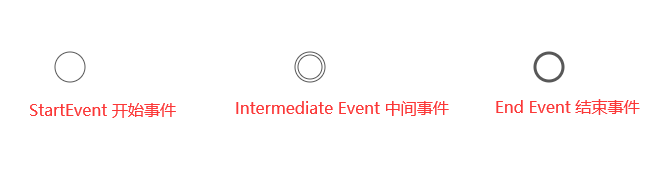
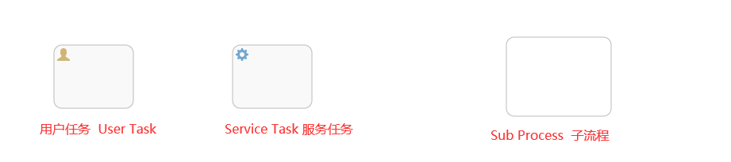
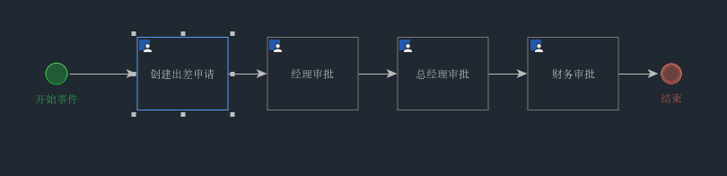

> 创建于2021年7月8日
>
> 作者：想想

[toc]


# Activiti 入门

本章节中，我们来创建一个 Activiti 工作流，并启动这个流程，创建这个流程分为以下几个步骤

1. 定义流程
2. 部署流程
3. 启动流程

## 一、流程符号

BPMN 2.0 是业务流程建模符号 2.0 的缩写

它由 Business Process Management Initative 这个非盈利协会创建并不断发展，作为一种标识，BPMN 2.0 是使用一些符号来明确业务流程设计图的一整符号规范，他能增进业务建模时的沟通效率，目前 BPMN2.0是最新版本，它用于在BPM上下文进行布局和可视化的沟通。

BPMN2.0 基本符号包括

### 1.1、Event 事件



### 1.2、Active 活动

活动是工作或者任务的通用术语，一个活动可以是一个任务，还可以是当前流程的子处理流程，其次，你还可以为活动指定不同的类型，常见活动如下



### 1.3、 GateWay 网关


#### 排他网关（x）

​		只有一条路径会被选中，流程执行到该网关时，按输出流的顺序逐个计算，当条件计算为 true 时，继续执行，如果多条线路计算都是true，着会执行第一个值的路线，如果所有网关计算为 ture ，则引擎抛出异常，排他网关需要和条件顺序流结合使用，defatule 属性指定默认顺序流，当所有顺序条件不满足时执行默认顺序

#### 并行网关（+）

​		所有路径会被同时选择

+ 拆分--并行执行所有输出顺序流，为每一条顺序流创建一个并行执行路线
+ 合并--所有从并行网关拆分执行完成的路线均在此等候，直到所有路线都执行完才继续向下执行

#### 包容网关（o）

​		可以同时执行多条线路，也可以在网关上设置条件

+ 拆分--计算每一条路线上的表达式，当表达式计算结果为true时，创建一个并行线路并继续执行
+ 合并--所有从行网关拆分并执行完成的路线均在此等候，直到所有的路线都执行完才继续向下执行。

#### 事件网关（+）

​		专门为中间捕获事件设置，运行设置多个输出流指向多个不同的中间捕获事件，当流程执行到事件网关后，流程处于等待状态，需要等待抛出事件才能将等待状态转换为活动状态

#### 流向 Flow

​		流是链接两个流程节点的连线，常见的流向包含以下几种

顺序流、消息流、关联流


## 二、流程设计器使用

### 2.1、Activiti-Designer 使用

在 reouces 下创建 bpmn 文件夹，在文件夹下创建 evection.bpmn20.xml 文件

```xml
<definitions xmlns="http://www.omg.org/spec/BPMN/20100524/MODEL" xmlns:xsi="http://www.w3.org/2001/XMLSchema-instance" xmlns:xsd="http://www.w3.org/2001/XMLSchema" xmlns:activiti="http://activiti.org/bpmn" xmlns:bpmndi="http://www.omg.org/spec/BPMN/20100524/DI" xmlns:omgdc="http://www.omg.org/spec/DD/20100524/DC" xmlns:omgdi="http://www.omg.org/spec/DD/20100524/DI" typeLanguage="http://www.w3.org/2001/XMLSchema" expressionLanguage="http://www.w3.org/1999/XPath" targetNamespace="http://www.activiti.org/processdef">
<process id="process1" name="流程" isExecutable="true">
<startEvent id="startEvent" name="开始事件"/>
<userTask id="userTask1" name="创建出差申请"/>
<userTask id="userTask2" name="经理审批"/>
<userTask id="userTask3" name="总经理审批"/>
<userTask id="userTask4" name="财务审批"/>
<endEvent id="endEvent" name="结束"/>
<sequenceFlow id="flow1" sourceRef="startEvent" targetRef="userTask1"/>
<sequenceFlow id="flow2" sourceRef="userTask1" targetRef="userTask2"/>
<sequenceFlow id="flow3" sourceRef="userTask2" targetRef="userTask3"/>
<sequenceFlow id="flow4" sourceRef="userTask3" targetRef="userTask4"/>
<sequenceFlow id="flow5" sourceRef="userTask4" targetRef="endEvent"/>
</process>
<bpmndi:BPMNDiagram id="BPMNDiagram_process1">
<bpmndi:BPMNPlane bpmnElement="process1" id="BPMNPlane_process1">
<bpmndi:BPMNShape bpmnElement="startEvent" id="BPMNShape_startEvent">
<omgdc:Bounds height="30.0" width="30.0" x="104.5" y="93.0"/>
</bpmndi:BPMNShape>
<bpmndi:BPMNShape bpmnElement="userTask1" id="BPMNShape_userTask1">
<omgdc:Bounds height="80.0" width="100.0" x="210.0" y="68.0"/>
</bpmndi:BPMNShape>
<bpmndi:BPMNShape bpmnElement="userTask2" id="BPMNShape_userTask2">
<omgdc:Bounds height="80.0" width="100.0" x="355.0" y="68.0"/>
</bpmndi:BPMNShape>
<bpmndi:BPMNShape bpmnElement="userTask3" id="BPMNShape_userTask3">
<omgdc:Bounds height="80.0" width="100.0" x="500.0" y="68.0"/>
</bpmndi:BPMNShape>
<bpmndi:BPMNShape bpmnElement="userTask4" id="BPMNShape_userTask4">
<omgdc:Bounds height="80.0" width="100.0" x="645.0" y="68.0"/>
</bpmndi:BPMNShape>
<bpmndi:BPMNShape bpmnElement="endEvent" id="BPMNShape_endEvent">
<omgdc:Bounds height="28.0" width="28.0" x="790.0" y="94.0"/>
</bpmndi:BPMNShape>
<bpmndi:BPMNEdge bpmnElement="flow1" id="BPMNEdge_flow1">
<omgdi:waypoint x="134.5" y="108.0"/>
<omgdi:waypoint x="210.0" y="108.0"/>
</bpmndi:BPMNEdge>
<bpmndi:BPMNEdge bpmnElement="flow2" id="BPMNEdge_flow2">
<omgdi:waypoint x="310.0" y="108.0"/>
<omgdi:waypoint x="355.0" y="108.0"/>
</bpmndi:BPMNEdge>
<bpmndi:BPMNEdge bpmnElement="flow3" id="BPMNEdge_flow3">
<omgdi:waypoint x="455.0" y="108.0"/>
<omgdi:waypoint x="500.0" y="108.0"/>
</bpmndi:BPMNEdge>
<bpmndi:BPMNEdge bpmnElement="flow4" id="BPMNEdge_flow4">
<omgdi:waypoint x="600.0" y="108.0"/>
<omgdi:waypoint x="645.0" y="108.0"/>
</bpmndi:BPMNEdge>
<bpmndi:BPMNEdge bpmnElement="flow5" id="BPMNEdge_flow5">
<omgdi:waypoint x="745.0" y="108.0"/>
<omgdi:waypoint x="790.0" y="108.0"/>
</bpmndi:BPMNEdge>
</bpmndi:BPMNPlane>
</bpmndi:BPMNDiagram>
</definitions>
```

导出 png 图，方便查看流程



### 2.2、书写代码

1. 创建 ProcessEngine
2. 获取 RepositoryService
3. 使用 service 进行流程部署，定义一个流程名字，把 bpmn 和 png 部署到数据库中

```java
 @Test
    public void testDepolyment(){
        // 1.创建 ProcessEngine
        ProcessEngine processEngine = ProcessEngines.getDefaultProcessEngine();
        // 2.获取 RepositoryService
        RepositoryService repositoryService = processEngine.getRepositoryService();
        // 3.使用 service 进行流程部署，定义一个流程名字，把 bpmn 和 png 部署到数据库中
        Deployment deploy = repositoryService.createDeployment()
                .name("出差申请流程")
                .addClasspathResource("bpmn/evection.bpmn20.png")
                .addClasspathResource("bpmn/evection.bpmn20.xml")
                .deploy();
        // 4. 输出部署信息
        System.out.println("部署流程Id = " + deploy.getId());
        System.out.println("部署流程Name = " + deploy.getName());
    }
```

### 2.3、日志动作

1. 查询版本 ==ACT_GE_PROPERTY== 表

```sql
select * from ACT_GE_PROPERTY where NAME_ = 'schema.version'
```

| NAME_          | VALUE_  | REV_ |
| -------------- | ------- | ---- |
| schema.version | 7.0.0.0 | 1    |

2. ==ACT_GE_PROPERTY== 表

```sql
select * from ACT_GE_PROPERTY where NAME_ = 'cfg.execution-related-entities-count'
```

| NAME_                                | VALUE_ | REV_ |
| ------------------------------------ | ------ | ---- |
| cfg.execution-related-entities-count | false  | 1    |

3. ==ACT_GE_PROPERTY== 表

```sql
select * from ACT_GE_PROPERTY where NAME_ = 'next.dbid'
```

| NAME_     | VALUE_ | REV_ |
| --------- | ------ | ---- |
| next.dbid | 5001   | 3    |

4. ==ACT_GE_PROPERTY== 表

```sql
update ACT_GE_PROPERTY SET REV_ = 3, VALUE_ = '5001' where NAME_ = 'next.dbid' and REV_ = 2 
```

5. ==ACT_RE_PROCDEF== 表

```sql
select * from ACT_RE_PROCDEF where KEY_ = 'process1' and (TENANT_ID_ = '' or TENANT_ID_ is null) and VERSION_ = (select max(VERSION_) from ACT_RE_PROCDEF where KEY_ = 'process1' and (TENANT_ID_ = '' or TENANT_ID_ is null))
```

| ID_             | REV_ | CATEGORY_                          | NAME_ | KEY_     | VERSION_ | DEPLOYMENT_ID_ | RESOURCE_NAME_           | DGRM_RESOURCE_NAME_ | DESCRIPTION_ | HAS_START_FORM_KEY_ | HAS_GRAPHICAL_NOTATION_ | SUSPENSION_STATE_ | TENANT_ID_ | ENGINE_VERSION_ |
| --------------- | ---- | ---------------------------------- | ----- | -------- | -------- | -------------- | ------------------------ | ------------------- | ------------ | ------------------- | ----------------------- | ----------------- | ---------- | --------------- |
| process1:1:2504 | 1    | http://www.activiti.org/processdef | 流程  | process1 | 1        | 2501           | bpmn/evection.bpmn20.xml |                     |              | 0                   | 1                       | 1                 |            |                 |

6. ==ACT_RU_TIMER_JOB== 关联 ==ACT_RE_PROCDEF== 

```sql
select J.* from ACT_RU_TIMER_JOB J inner join ACT_RE_PROCDEF P on J.PROC_DEF_ID_ = P.ID_ where J.HANDLER_TYPE_ = 'timer-start-event' and P.KEY_ = 'process1' and (P.TENANT_ID_ = '' or P.TENANT_ID_ is null)
```

| ID_  | REV_ | TYPE_ | LOCK_EXP_TIME_ | LOCK_OWNER_ | XCLUSIVE_ | EEXECUTION_ID_ | PROCESS_INSTANCE_ID_ | PROC_DEF_ID_ | RETRIES_ | EXCEPTION_STACK_ID_ | EXCEPTION_MSG_ | DUEDATE_ | REPEAT_ | HANDLER_TYPE_ | HANDLER_CFG_ | TENANT_ID_ |
| ---- | ---- | ----- | -------------- | ----------- | --------- | -------------- | -------------------- | ------------ | -------- | ------------------- | -------------- | -------- | ------- | ------------- | ------------ | ---------- |
|      |      |       |                |             |           |                |                      |              |          |                     |                |          |         |               |              |            |

7. ==ACT_PROCDEF_INFO== 

```sql
select * from ACT_PROCDEF_INFO where PROC_DEF_ID_ = 'process1:1:2504'
```

| ID_  | PROC_DEF_ID_ | REV_ | INFO_JSON_ID_ |
| ---- | ------------ | ---- | ------------- |
|      |              |      |               |

8. ==ACT_RE_PROCDEF== procdef  和 deployment 关系是一对多的关系 ，一条记录对应着一个工作流程

```sql
insert into ACT_RE_PROCDEF(ID_, REV_, CATEGORY_, NAME_, KEY_, VERSION_, DEPLOYMENT_ID_, RESOURCE_NAME_, DGRM_RESOURCE_NAME_, DESCRIPTION_, HAS_START_FORM_KEY_, HAS_GRAPHICAL_NOTATION_ , SUSPENSION_STATE_, TENANT_ID_, ENGINE_VERSION_) values (?, 1, ?, ?, ?, ?, ?, ?, ?, ?, ?, ?, ?, ?, ?)
-- process1:1:2504(String), http://www.activiti.org/processdef(String), 流程(String), process1(String), 1(Integer), 2501(String), bpmn/evection.bpmn20.xml(String), null, null, false(Boolean), true(Boolean), 1(Integer), (String), null
```

| ID_             | REV_ | CATEGORY_                          | NAME_ | KEY_     | VERSION_ | DEPLOYMENT_ID_ | RESOURCE_NAME_           | DGRM_RESOURCE_NAME_ | DESCRIPTION_ | HAS_START_FORM_KEY_ | HAS_GRAPHICAL_NOTATION_ | SUSPENSION_STATE_ | TENANT_ID_ | ENGINE_VERSION_ |
| --------------- | ---- | ---------------------------------- | ----- | -------- | -------- | -------------- | ------------------------ | ------------------- | ------------ | ------------------- | ----------------------- | ----------------- | ---------- | --------------- |
| process1:1:2504 | 1    | http://www.activiti.org/processdef | 流程  | process1 | 1        | 2501           | bpmn/evection.bpmn20.xml |                     |              | false               | true                    | 1                 |            |                 |

9. ==ACT_RE_DEPLOYMENT== deployment  多条记录对应 procdef 一条记录。每次有人申请， deployment  都会新增一条，

```sql
insert into ACT_RE_DEPLOYMENT(ID_, NAME_, CATEGORY_, KEY_, TENANT_ID_, DEPLOY_TIME_, ENGINE_VERSION_) values(?, ?, ?, ?, ?, ?, ?)
-- 2501(String), 出差申请流程(String), null, null, (String), 2021-07-08 23:38:13.065(Timestamp), null
```

| ID_  | NAME_        | CATEGORY_ | KEY_ | TENANT_ID_ | DEPLOY_TIME_            | ENGINE_VERSION_ |
| ---- | ------------ | --------- | ---- | ---------- | ----------------------- | --------------- |
| 2501 | 出差申请流程 |           |      |            | 2021-07-08 23:38:13.065 |                 |

10. ==ACT_GE_BYTEARRAY== 导入资源

```sql
INSERT INTO ACT_GE_BYTEARRAY(ID_, REV_, NAME_, BYTES_, DEPLOYMENT_ID_, GENERATED_) VALUES (?, 1, ?, ?, ?, ?) , (?, 1, ?, ?, ?, ?)
-- 2502(String), bpmn/evection.bpmn20.xml(String), java.io.ByteArrayInputStream@3ebff828(ByteArrayInputStream), 2501(String), false(Boolean), 2503(String), bpmn/evection.bpmn20.png(String), java.io.ByteArrayInputStream@2552f2cb(ByteArrayInputStream), 2501(String), false(Boolean)
```

| ID_  | REV_ | NAME_                    | BYTES_                                | DEPLOYMENT_ID_ | GENERATED_ |
| ---- | ---- | ------------------------ | ------------------------------------- | -------------- | ---------- |
| 2502 | 1    | bpmn/evection.bpmn20.xml | java.io.ByteArrayInputStream@3ebff828 | 2501           | false      |
| 2503 | 1    | bpmn/evection.bpmn20.png | java.io.ByteArrayInputStream@2552f2cb | 2501           | false      |

> 总结一下，创建这个流程，一共insert、update如下表
>
> ```sql
> select * from ACT_RE_PROCDEF  -- 已部署的流程定义 INSERT
> -- 新增了我们定义的流程
> select * from ACT_RE_DEPLOYMENT -- 部署单元信息 INSERT
> -- 新增了id 和 名字 
> select * from ACT_GE_BYTEARRAY -- 通用的流程定义和流程资源 INSERT
> -- 新增了两个静态资源
> select * from ACT_GE_PROPERTY -- 系统相关属性 UPDATE
> -- 更新系统相关属性 next.dbid
> ```

### 2.4、启动实例

```
/**
 * 启动流程实例
 */
@Test
public void testStartProcess(){
    // 1. 创建 ProcessEngine
    ProcessEngine processEngine = ProcessEngines.getDefaultProcessEngine();
    // 2. 获取 RuntimeService
    RuntimeService runtimeService = processEngine.getRuntimeService();
    // 3. 根据流程定义的 id 启动流程 process1
    ProcessInstance process1 = runtimeService.startProcessInstanceByKey("process1");
    // 4. 输出内容
    System.out.println("流程定义ID "+process1.getProcessDefinitionId());
    System.out.println("流程实例ID "+process1.getId());
    System.out.println("当前活动ID "+process1.getActivityId());
}
```


```sql
-- 流程实例执行历史
select * from act_hi_actinst
-- 流程参与者的历史信息
select * from act_hi_identitylink
-- 流程实例的历史信息
select * from act_hi_procinst
-- 任务的历史信息
select * from act_hi_taskinst
-- 流程执行的信息
select * from act_ru_execution
-- 流程参与者信息
select * from act_ru_identitylink
-- 任务信息
select * from act_ru_task
```


>ACT_RE_DEPLOYMENT		流程部署表，每部署一次都会增加一条记录
>
>ACT_RE_PROCDEF				流程定义表
>
>ACT_GE_BYTEARRAY			流程资源表

