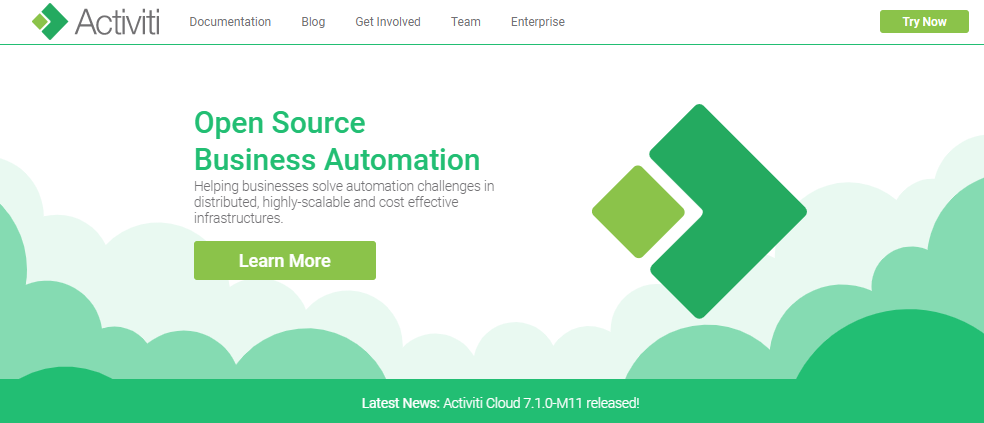
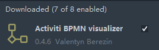
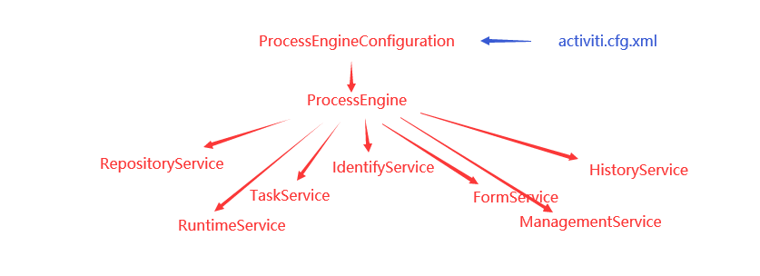
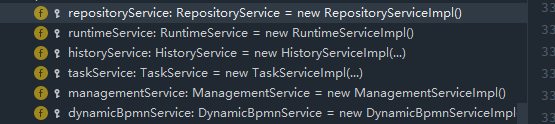

> 创建于 2021年7月7日
>
> 作者：想想

[toc]


# 一、工作流介绍

## 1.1、概念

​		工作流（workflow）通过计算机对业务流程自动化执行管理。它主要解决的是：使多个参与者之间按照某种预定的规则自动进行传递文档、信息或任务的过程自动进行传递文档、信息或任务的过程，从而实现某个预期的业务目标，或者促使此目标的实现

## 1.2、工作流系统

​		一个软件系统中具有工作流的功能，我们把它称为工作流系统，一个系统中工作流的功能是什么？就是对系统业务流程进行自动化管理，所以工作流是建立在业务流程上，所以一个软件的系统核心根本还是系统业务流程，工作流只是协助进行业务流程管理，即使没有工作流业务系统也可以开发运行，只不过有了工作流可以更好的管理业务流程，提供系统的可扩展性

## 1.3、适用行业

​		消费者行业、制造业、电信、银行.....

## 1.4、具体应用

1. 关键业务流程：订单、报价处理、合同审理
2. 行政管理类：出差申请、加班申请、请假申请
3. 人员管理：员工培训、绩效考核、职位变动

## 1.5、实现方式

​		在没有专门的工作流引擎之前，我们之前为了实现流程控制，通常的做法就是采用状态字段的值来跟踪流程的变化情况，这样不同角色用户，通过状态字段的取值来决定记录是否显示

​		针对有权限可以查看的记录，当前用户根据自己的角色来决定审核是否合格的操作。如果合格将状态字段设置一个值，来代表合格，当然如果不合格就用另外一个值来表示，这是最原始的方式，通过状态字段虽然做到了流程控制，但是我们的流程发生变更之后，原来的方法和代码都要改变，消耗大量精力


# 二、Activity 概述

## 2.1、介绍

​		Alfersco软件在2010年5月17日宣布 Activiti业务流程管理（BPM)开源项目的正式启动，其首席架构师由业务流程管理 BPM 的专家 Tom Baeyens 担任，Tom Baeyens 原来就是 jbpm 的架构师，而 jbpm 是一个非常有名的工作流引擎，当然 activiti 也是工作流引擎

​		Activiti 是一个工作流引擎，activiti 可以将业务系统中复复杂的业务流程抽取出来，使用专门的建模语言 BPMN2.0 进行定义，业务流程安装预先定义的流程执行，实现了系统的流程由 acitivti 进行管理，减少业务系统由流程变更而进行系统升级改造的工作量，从而提高系统的健壮性，同时也减少了系统开发维护成本

官方网站：https://www.activiti.org



### 2.1.1、BPM

​		BPM（Business Process Management）业务流程管理，是一种规范的构造端到端的业务流程，以持续提高组织业务效率。常见商业管理教育如 EMBA、MBA等均将BPM包含在内

### 2.1.2、BPM 软件

​		BPM 软件就是根据企业中业务环境的变化，推进人与人之间、人与系统之间以及系统与系统之间 的整合及调整的经营方法与解决方案的IT工具，通过 BPM软件对企业内部及外部的业务流程的整个生命周期进行建模、自动化、管理监控的优化，使企业成本降低，利润得以大幅度提高

### 2.1.3、BPMN

​		BPMN（Business Process Model AndNoation）业务流程符合和模型 是由 BPMI（BussinessProcess Management Initiative）开发的一套标准的业务流程建模符号，使用BPMN 提供的符号可以创建业务流程

Event

用圆圈表示，它是流程中运行过程中发生的事情

活动用圆角矩形表示，一个流程由一个活动或多个活动组成

Bpmn 图形实际上是 XML文件


## 2.2、使用步骤

### 2.2.1、部署 activiti

​		Activiti 是一工作流引擎，其实就是一堆jar包 API，业务系统访问（操作）acitviti 的接口，就可以方便的操作流程相关数据，这样就可以把工作流环境与业务系统环境集成到一起

### 2.2.2、流程定义

​		使用 acitivit 流程建模工具（acitviti-designer）定义业务流程 （.bpmn 文件） .bpmn 文件就是业务流程定义的文件，通过 xml 定义业务流程

### 2.2.3、流程定义部署

​		activiti 部署业务流程定义（.bpmn文件），使用 activiti 提供的api吧流程定义内容存储起来，在 Activiti 执行过程中可以查询定义的内容，Actitivit 执行把流程定义存储在数据库中

### 2.2.4、启动一个流程实例

​		流程实例也叫 ProcessInstance，启动一个流程实例表示开始一次业务流程的运行。在员工请假流程定义部署完成后，如果张三要请假就可以启动一个流程实例，如果历史要请假也启动一个流程实例，二者执行不相互影响

### 2.2.5、用户查询待办任务（Task）

​		因为现在系统的业务流程已经交给 activiti 管理，通过 Activiti 就可以查询当前流程执行到哪了，当前用户需要办理什么任务，这些activit 帮我们管理了，而不需要开发人员自己编写在 sql 语句查询

### 2.2.6、用户办理任务

​		用户查询待办任务后，就可以办理某个任务，如果这个任务办理完成还需要其他用户办理，activiti 也帮我们完成

### 2.2.7、流程结束

​		当任务办理完成没有下一个节点了，这个流程实例就完成了。


# 三、Activiti 环境

## 3.1、开发环境

+ Jdk1.8 以上版本
+ Mysql 5.x 以上
+ Tomcat 8.5
+ IDEA

activiti 的流程定义工具在 IDEA 安装

## 3.2、Activiti 环境

我们使用 Activiti 7.0.0.Beta1 默认执行 Spring5

### 3.2.1、下载 Activiti 7

Activiti 下载地址 http://activiti.org/download.html ，Maven 依赖如下

```xml
<dependencies>
	<dependency>
    	<groupId>org.activiti</groupId>
        <artifactId>activiti-dependencies</artifactId>
        <version>7.0.0.Beta1</version>
        <scope>import</scope>
        <type>pom</type>
    </dependency>
</dependencies>
```

1) DataBase

activiti 运行需要有数据库的支持，支持的数据库有 h2，mysql，oracle，postgres，mssql，db2

### 3.2.2、流程设计器 IDEA下安装



## 3.3、Activiti 的数据库支持

Activiti 在运行时需要数据库支持，使用 25 张表，把流程定义节点内容读取到数据库表中，以供后续使用

### 3.3.1、Activiti支持的数据库

| 数据库类型 | 版本                        | Jdbc连接示例                                                 | 说明                           |
| ---------- | --------------------------- | ------------------------------------------------------------ | ------------------------------ |
| h2         | 1.3.168                     | jdbc:h2:tcp//localhost/activiti                              | 默认配置的数据库               |
| mysql      | 5.1.21                      | jdbc:mysql://localhost:3306/activiti?<br />autoReconnect=true | 使用 mysql-connertor-java 驱动 |
| oracle     | 11.2.0.1.0                  | jdbc:oracle:thin:@localhost:1521:xe                          |                                |
| postgres   | 8.1                         | jdbc:postgresql://locahos:5432/activiti                      |                                |
| db2        | DB2 10.1 using<br />db2jcc4 | jdbc:db2://localhost:50000/activiti                          |                                |
| mssql      | 2008 using<br />sqljdbc4    | jdbc:sqlserver://localhost:1433/activiti                     |                                |

### 3.3.2、在 MySQL 生成表

#### 3.3.2.1、创建数据库

创建 mysql 数据库 activiti

```sql
create database activiti default character set utf8;
```

#### 3.2.2.2、使用 java 代码生成表

##### 3.2.2.2.1、创建 Java 工程

Windows 电脑上 ==F:\study\Project\project\activiti\activiti-study-01==

##### 3.2.2.2.2、加入maven 依赖的坐标

1. activiti-engine 7.0.0.beta1.jar
2. activiti 依赖的 mybatis、slf4j、log4j等
3. activiti 依赖的 spring 包
4. mysql 数据库驱动
5. 第三方数据连接池 dbcp
6. 单元测试 Junit-4.12.jar

```xml
  <properties>
        <maven.compiler.source>8</maven.compiler.source>
        <maven.compiler.target>8</maven.compiler.target>

        <slf4j.version>1.6.6</slf4j.version>
        <log4j.version>1.2.12</log4j.version>
        <activiti.version>7.0.0.Beta1</activiti.version>
    </properties>

    <dependencies>
        <dependency>
            <groupId>org.activiti</groupId>
            <artifactId>activiti-engine</artifactId>
            <version>${activiti.version}</version>
        </dependency>

        <dependency>
            <groupId>org.activiti</groupId>
            <artifactId>activiti-spring</artifactId>
            <version>${activiti.version}</version>
        </dependency>

<!--        bpmn 模型处理 -->
        <dependency>
            <groupId>org.activiti</groupId>
            <artifactId>activiti-bpmn-model</artifactId>
            <version>${activiti.version}</version>
        </dependency>

<!--        bpmn 转换 -->
        <dependency>
            <groupId>org.activiti</groupId>
            <artifactId>activiti-bpmn-converter</artifactId>
            <version>${activiti.version}</version>
        </dependency>

<!--        bpmn json 数据转换-->
        <dependency>
            <groupId>org.activiti</groupId>
            <artifactId>activiti-json-converter</artifactId>
            <version>${activiti.version}</version>
        </dependency>

<!--        bpmn 布局-->
        <dependency>
            <groupId>org.activiti</groupId>
            <artifactId>activiti-bpmn-layout</artifactId>
            <version>${activiti.version}</version>
        </dependency>

<!--        activiti 云支持-->
        <dependency>
            <groupId>org.activiti.cloud</groupId>
            <artifactId>activiti-cloud-services-api</artifactId>
            <version>${activiti.version}</version>
        </dependency>

<!--        mysql 驱动-->
        <dependency>
            <groupId>mysql</groupId>
            <artifactId>mysql-connector-java</artifactId>
            <version>5.1.46</version>
        </dependency>
        
<!--        mybatis-->
        <dependency>
            <groupId>org.mybatis</groupId>
            <artifactId>mybatis</artifactId>
            <version>3.4.5</version>
        </dependency>

<!--        链接池-->
        <dependency>
            <groupId>commons-dbcp</groupId>
            <artifactId>commons-dbcp</artifactId>
            <version>1.4</version>
        </dependency>

        <dependency>
            <groupId>junit</groupId>
            <artifactId>junit</artifactId>
            <version>4.12</version>
        </dependency>

        <dependency>
            <groupId>log4j</groupId>
            <artifactId>log4j</artifactId>
            <version>${log4j.version}</version>
        </dependency>

        <dependency>
            <groupId>org.slf4j</groupId>
            <artifactId>slf4j-api</artifactId>
            <version>${slf4j.version}</version>
        </dependency>

        <dependency>
            <groupId>org.slf4j</groupId>
            <artifactId>slf4j-log4j12</artifactId>
            <version>${slf4j.version}</version>
        </dependency>

    </dependencies>
```


> 注意，如果出现  activiti-bpmn-layout 中报了 com.github.jgraph/jgraphx/v3.9.3 错误，在maven仓库中下载，单独导入
>
> https://mvnrepository.com/artifact/com.github.jgraph/jgraphx/v3.9.3


##### 3.2.2.2.3、 log4j 日志配置

```properties
### 设置###
log4j.rootLogger = debug,stdout,D,E

### 输出信息到控制抬 ###
log4j.appender.stdout = org.apache.log4j.ConsoleAppender
log4j.appender.stdout.Target = System.out
log4j.appender.stdout.layout = org.apache.log4j.PatternLayout
log4j.appender.stdout.layout.ConversionPattern = [%-5p] %d{yyyy-MM-dd HH:mm:ss,SSS} method:%l%n%m%n

### 输出DEBUG 级别以上的日志到=E://logs/error.log ###
log4j.appender.D = org.apache.log4j.DailyRollingFileAppender
log4j.appender.D.File = F:/study/Project/project/activiti/activiti-study-01/log/log.log
log4j.appender.D.Append = true
log4j.appender.D.Threshold = DEBUG
log4j.appender.D.layout = org.apache.log4j.PatternLayout
log4j.appender.D.layout.ConversionPattern = %-d{yyyy-MM-dd HH:mm:ss}  [ %t:%r ] - [ %p ]  %m%n

### 输出ERROR 级别以上的日志到=E://logs/error.log ###
log4j.appender.E = org.apache.log4j.DailyRollingFileAppender
log4j.appender.E.File =F:/study/Project/project/activiti/activiti-study-01/log/error.log
log4j.appender.E.Append = true
log4j.appender.E.Threshold = ERROR
log4j.appender.E.layout = org.apache.log4j.PatternLayout
log4j.appender.E.layout.ConversionPattern = %-d{yyyy-MM-dd HH:mm:ss}  [ %t:%r ] - [ %p ]  %m%n
```

##### 3.2.2.2.4、activiti 配置文件

​		我们使用 activiti 提供的默认方法来创建 mysql 的表

默认方法的要求在 resources 下创建 activiti.cfg.xml 文件，注意：默认方法目录和文件名不能修改，因为 activiti 的源码中已经设置，到固定的目录下读取固定文件名的文件

```xml
<?xml version="1.0" encoding="UTF-8"?>
<beans xmlns="http://www.springframework.org/schema/beans"
       xmlns:xsi="http://www.w3.org/2001/XMLSchema-instance"
       xmlns:context="http://www.springframework.org/schema/context"
       xmlns:tx="http://www.springframework.org/schema/tx"
       xsi:schemaLocation="http://www.springframework.org/schema/beans
                           http://www.springframework.org/schema/beans/spring-beans.xsd
http://www.springframework.org/schema/contex 
http://www.springframework.org/schema/context/spring-context.xsd
http://www.springframework.org/schema/tx 
http://www.springframework.org/schema/tx/spring-tx.xsd">
    
</beans>
```

配置数据库相关信息，配置在 `activiti-cfg.xml` 中

```xml
<!--    在默认情况下 bean 的id 固定为processEngineConfiguration -->
    <bean id="processEngineConfiguration" class="org.activiti.engine.impl.cfg.StandaloneInMemProcessEngineConfiguration">
<!--        配置数据库相关信息-->
<!--        数据库驱动-->
        <property name="jdbcDriver" value="com.mysql.jdbc.Driver"/>
<!--        数据库链接-->
        <property name="jdbcUrl" value="jdbc:mysql:///activiti"/>
<!--        数据库用户名-->
        <property name="jdbcUsername" value="activiti"/>
<!--        数据库密码-->
        <property name="jdbcPassword" value="activiti"/>
<!--        activiti 数据库在生成时的策略， true 如果数据库中已经存在相应的表，那么直接使用，如果不存在，那么创建-->
        <property name="databaseSchemaUpdate" value="true"/>
    </bean>
```


##### 3.2.2.2.5、创建测试类

```java
@Test
public void testCreateTable(){
    // 需要使用 activiti 提供的工具类 ProcessEnginess，使用方法 getDefaultProcessEngine
    // getDefaultProcessEngine 会默认从 resources 下读取 activiti.cfg.xml 的文件
    // 创建 processEngine 时，就会创建 mysql 表

    ProcessEngine processEngine = ProcessEngines.getDefaultProcessEngine();
    System.out.println(processEngine);
}
```

我们可以在日志中，看到 它定位到 mysql 数据库，并且伴随着大量的建表语句

```
[DEBUG] 2021-07-08 01:38:51,978 method:org.activiti.engine.impl.cfg.ProcessEngineConfigurationImpl.initDatabaseType(ProcessEngineConfigurationImpl.java:1148)
database product name: 'MySQL'
```

## 3.4、表结构介绍

### 3.4.1、表的命名规则及作用

​		所有的表都是以 act 开头的

+ 【ge】 通用的，存放通用的数据类型
+ 【hi】存放历史流程
+ 【re】流程定义内容、静态资源
+ 【ru】模块，activiti 运行时才会用到这些表，流程结束后，就会删除

### 3.4.2、Activiti 数据表介绍

| 表分类       | 表名                | 解释                                               |
| ------------ | ------------------- | -------------------------------------------------- |
| 一般数据     |                     |                                                    |
|              | ACT_GE_BYTEARRAY    | 通用的流程定义和流程资源                           |
|              | ACT_GE_PROPERTY     | 系统相关属性                                       |
| 流程历史记录 |                     |                                                    |
|              | ACT_HI_ACTINST      | 历史的流程实例                                     |
|              | ACT_HI_ATTACHMENT   | 历史的路程附件                                     |
|              | ACT_HI_COMMENT      | 历史的说明性信息                                   |
|              | ACT_HI_DETAIL       | 历史的流程运行中的细节信息                         |
|              | ACT_HI_IDENTITYLINK | 历史的流程运行过程中用户关系                       |
|              | ACT_HI_PROCINST     | 历史的流程实例                                     |
|              | ACT_HI_TASKINST     | 历史的任务实例                                     |
|              | ACT_HI_VARINST      | 历史的流程运行中的变量信息                         |
| 流程定义表   |                     |                                                    |
|              | ACT_RE_DEPLOYMENT   | 部署单元信息                                       |
|              | ACT_RE_MODEL        | 模型信息                                           |
|              | ACT_RE_PROCDEF      | 已部署的流程定义                                   |
| 运行实例表   |                     |                                                    |
|              | ACT_RU_EVENT_SUBSCR | 运行时事件                                         |
|              | ACT_RU_EXECUTION    | 运行时流程执行实例                                 |
|              | ACT_RU_IDENTITYLINK | 运行时用户关系信息，存储任务节点与参与者的相关信息 |
|              | ACT_RU_JOB          | 运行时作业                                         |
|              | ACT_RU_TASK         | 运行时任务                                         |
|              | ACT_RU_VARIABLE     | 运行时变量表                                       |

# 四、Activiti 类关系图

​		上面我们完成了 Activiti 数据库表的生成，Java代码中我们调用 Activiti 的工具类，下面来了解Activiti 的类关系

## 4.1、类关系



在新版本中，IdentiryService、FormService 已经删掉了



repositoryService：操作部署相关的东西，进而操作 [RE] 表

RuntimeService：运行时，操作【RU】表

HistoryService：历史，操作【HI】表

## 4.2、Activiti.cfg.xml

​		activiti的引擎配置文件，包括 ProcessEngineConfiguration 的定义、数据源定义、事务管理器等，此文件其实就是一个 spring 配置文件

## 4.3、流程引擎配置类


