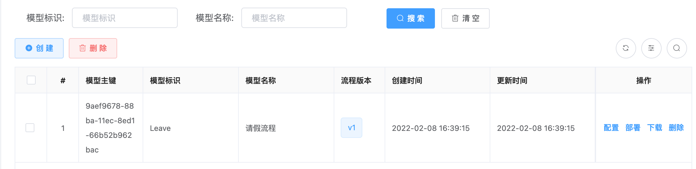
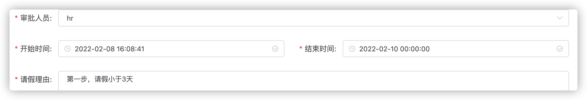
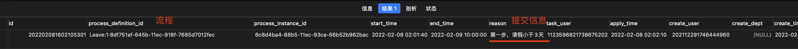
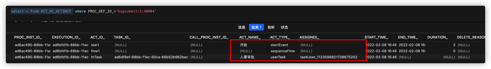

> 创建于2022年2月8日

[toc]

> 前言：删掉 flow 数据库中所有表（75张），重新初始化 Activiti 表，启动项目，至少保证如下服务启动
>
> + 8105 DeskApplication :8105/
> + 8999 FlowDesignApplication :8999/
> + 8008 FlowApplication :8008/
>
> 进入bladexflow流程设计器，新增请假流程（详细见bladex文档）

## 1、部署流程

查询表 `ACT_DE_MODEL` 



```sql
-- flow库
select * from ACT_RE_PROCDEF  -- 已部署的流程定义 INSERT
-- 新增了我们定义的流程
select * from ACT_RE_DEPLOYMENT -- 部署单元信息 INSERT
-- 新增了id 和 名字
select * from ACT_GE_BYTEARRAY -- 通用的流程定义和流程资源 INSERT
-- 新增了两个静态资源
select * from ACT_GE_PROPERTY -- 系统相关属性 UPDATE
-- 更新系统相关属性 next.dbid
```

## 2、执行逻辑

### 1、申请请假

`xiang` 用户登录给 `hr` 用户提交 `Leave`（请假流程）



#### 1.1、代码分析

+ DeskApplication 向`blade_process_leave` 表插入一条数据，

```
Execute ID  ：org.springblade.desk.mapper.LeaveMapper.insert
Execute SQL ：INSERT INTO blade_process_leave (id, process_definition_id, start_time, end_time, reason, task_user, apply_time, create_user, create_time, status, is_deleted) VALUES (?, ?, ?, ?, ?, ?, ?, ?, ?, ?, ?)
```



+ FlowApplication 直接走了三步，start--> flow1 --> hrTask



向如下表插入数据

```sql
select * from ACT_HI_TASKINST 
select * from ACT_HI_PROCINST 
select * from ACT_HI_ACTINST 
select * from ACT_HI_IDENTITYLINK  
select * from ACT_RU_EXECUTION
select * from ACT_RU_TASK
select * from ACT_RU_IDENTITYLINK
```

### 2、处理请假

用 `hr` 用户登录系统，进到 待办业务

