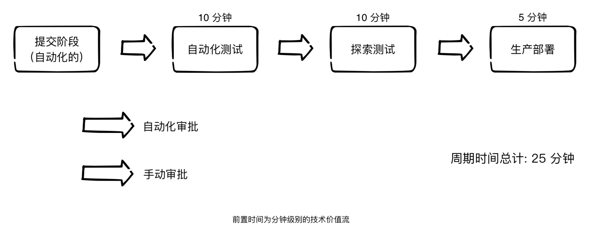

# DevOps

[toc]

“ DevOps”一词来自“Development”和“Operations”的组合。DevOps是一种文化，可促进开发人员与其他技术专业人员之间的协作，通常称是运维。具体来说，是在软件交付和部署过程中进行通信和协作，目的是更快，更可靠地发布质量更好的软件。具有所谓DevOps文化的组织的共同特征是：自主的多技能团队（Steve，Annie和Joey都在同一团队中），高水平的测试和发布自动化（连续交付）以及两者之间的共同目标多技术成员。

DevOps文化通常与持续交付相关联，因为它们都旨在增强开发人员和运营团队之间的协作，并且都使用自动流程来更快，更频繁，更可靠地构建，测试和发布软件。这些都是像我们这样的人想要的东西尽管开发团队经常看到流程改进的最直接好处，但CI，CD和DevOps对我们其他人来说却有很多好处简而言之，我相信实践CD并拥护DevOps文化的组织将更频繁地向其客户提供更有价值，更可靠的软件。

### 相关术语

##### 签到

将本地开发代码推送到公共源存储库的过程。

##### CI服务器

用于构建和测试源代码的工具。CI服务器将告知开发人员最新的代码构建是否成功以及是否继续通过测试。

##### 开发环境

开发人员在哪里创建，集成，构建和测试代码。

##### 部署管道/管道

这是Steve和Annie的代码更改在完成并准备交付生产之前要经历的一组阶段。通常，这些将是“构建”，“单元测试”，“功能测试”，“性能测试”和“部署”。不同的自动化测试将在不同的阶段运行。一旦代码通过了整个部署管道，就可以将软件交付生产。

##### 绿色建筑

绿色表示成功。绿色版本或内部版本已通过开发和交付过程的特定阶段的测试。通常，除非软件是“绿色”的，否则不会将其内部版本升级到部署管道的下一个阶段。绿色版本的反面是红色版本（请参见下文）。

##### 增量发展

不要与迭代开发相混淆（见下文）。增量开发是一次构建一点产品直到全部完成的过程。在每个增量中添加片段，这些增量可以小也可以大。您可以将CI与增量开发结合使用，但是通过增量开发很难实现持续交付或连续部署，因为您必须等到所有增量完成后才能交付价值。Jeff Paton的《蒙娜丽莎》（MonaLisa）很好地说明了增量开发与迭代开发之间的区别。

##### 积分

个人或团队编写的所有代码都需要合并。我们称这种集成。在持续集成中，我们通常意味着需要定期整合个人的软件。在连续交付中，我们通常意味着将来自不同团队的软件集成在一起以创建整个产品。

##### 迭代开发

不要与渐进式开发相混淆（请参见上文）。迭代开发是一次构建一点产品并对其进行完善直到完成的地方。该产品是迭代构建的，每次迭代都对相同的部分进行重新加工。预期并计划在不同迭代中的功能之间进行更改。您可以将CI，持续交付或持续部署与迭代开发结合使用。Jeff Paton的《蒙娜丽莎》（Mona Lisa）很好地说明了增量开发与迭代开发之间的区别。

##### 主/干线/主线

“ master”，“ trunk”或“ mainline”分支是源存储库的主要分支。大多数人都进行基于主干的开发， 这意味着他们将始终将其更改集成到主线中。当个别开发人员将拥有自己的分支，或者团队将具有针对不同功能的分支时，其他人将进行基于分支的开发。

##### 生产环境

这是部署或发布软件的地方。使用您的产品或网站的客户最有可能使用此环境。也称为“生产中”，“生产中”或“实时”。

##### 红色打造

红色表示失败。红色版本或内部版本表示尚未通过开发和交付过程的特定阶段的测试。通常，如果软件的版本或版本为“红色”，则不会升级到部署管道的下一个阶段。

##### 源库

这就是源代码所在的地方。史蒂夫和安妮拥有自己正在处理的代码的本地版本（即在自己的计算机上），但是在开发人员签入对其所做的更改之后，源存储库将包含所有代码。

##### 测试自动化

需要高质量的测试自动化来进行持续集成和持续交付。测试是检查软件是否按预期运行的方法。自动化测试是经过编码的测试，一旦将代码检入公共源存储库中，它们就会自动运行。

#####　单元测试

单元测试是代码中的自动化测试，用于测试低级的单个代码段，以确保它们可用并按预期工作。单元测试被认为是实践CI和CD的前提条件。

### 敏捷、持续交付和三步法

我们侧重于这些理论和原则，它们记录了制造业、高可靠性企业、高信任管理模型等十几年的经验，DevOps 实践正式基于这些经验衍生而来的。

#### 制造业价值流

在制造业的流程中，价值流所处可见，它始于接收到客户订单并将原草料发往工厂。为了缩短和预测价值流中的前置时间，通常需要持续地关注如何建立一套流畅的工作流程，包含缩小批量尺寸、减少在制品（Work in Process, WIP）数量、避免返工等，同时还需要确保不会将次品传递到下游的工作中心，并持续不断地基于全局目标来优化整个系统。

#### 技术价值流

在制造业中加速物理产品加工流程的原则和模式，同时可以应用到技术工作（及所有知识工作）中。在DevOps 中，通常将技术价值流定义为 **"把业务构想转换为客户交付价值的、由技术驱动的服务所需要的流程**"。

##### 聚焦于部署的前置时间

部署的前置时间是价值流的一个子集，价值流始于工程师（包括开发、QA、IT运维和信息安全人员）向版本控制系统中提交了一个变更，止于变更成功地在生产环境中运行，为客户提供价值，并产生有效的反馈和监控信息。

一般分为2个阶段：

+ 第一个阶段，工作只要包括设计和开发，它和精益产品开发有很多相似之处：都具有高度的变化性和不确定性，不仅需要创意，某些工作还可能无法重来，这导致无法确定总体处理时间。

+ 第二个阶段，工作主要包括运维和测试，它类似于精益制造。相比前一个阶段，它需要创造性和专业技能，力求可预见性和自动化，将可变性降到最低（如短的和可预测的前置时间，接近零缺陷），并满足业务目标。

我们并不提倡在设计、开发串行的完成大批量的工作后，再转入测试、运维阶段（如使用大批量、基于瀑布模式的开发流程，工作在长生命周期的特性分支上）。恰恰相反，我们的目标是采用测试和运维与设计和开发同步的模式，从而产生更快的价值流和更高的质量。只有当工作任务是小批量的，并将质量内建到价值流的每个部分时，这种同步的模式才能实现。

> 实际上，使用类似测试驱动开发的技术，测试甚至可以发生在编写第一行程序代码之前

###### 定义前置时间和处理时间

​		在精益社区里，前置时间与处理时间（有时候也被称为接触时间或者任务时间）是度量价值流性能的两个常用指标。

######  常见的场景:为期数月的部署前置时间

部署前置时间一旦变长，那么在价值流的每个阶段，几乎都需要 “填坑” 能手动来补救。通常很可能是项目结束前，将开发团队的变更合并到一起后，才发现整个系统根本无法正常工作，有时甚至会出现代码都无法通过编译和测试的情况。每一个问题都可能需要几天甚至几周的时间来定位和修复，因此导致了极其糟糕的客户体验。

######  我们的目标:分钟级别的部署前置时间

在 DevOps 的理想情况下，开发人员能够快速、持续地获得工作反馈，能快速和独立地开发集成和验证代码，并能将代码部署到生产环境中（自己部署或者他人部署）。

我们可以通过如下方式达到这个目标：向版本控制系统中不断地提交小批量的代码变更，并对代码做自动化测试和探索后，然后再将它部署到生产环境中。这样，就能对代码变更在生产环境中的成功运行保持高度自信，同时还能快速的发现并修复可能出现的问题。

