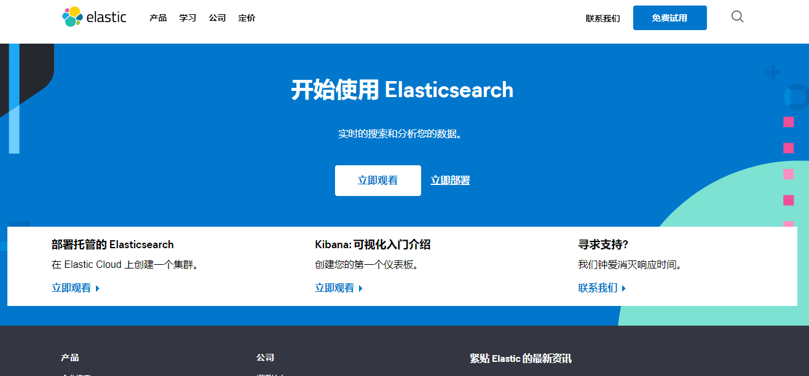

# ElasticSearch

版本：ElasticSearch 7.6.1

Luncene 是一套信息检索工具包，jar包！不包含搜索引擎系统，包含的是：索引结构！读写索引的工具，排序，搜索规则...工具类

Luncene 和 ElasticSearch 关系：

​	ElasticSearch 是基于 Lecene 做了一些封装和增强

## 1、ElasticSearch 概述

​		Elaticseach ，简称为 es，es 是一个开源的==高扩展==的==分布式全文搜索引擎==，它可以近乎==实时的存储==、==检索数据==；本身扩展性很好，可以扩展到上百台服务器，处理 PB 级别 （大数据时代）的数据。es 也使用 Java 开发并使用 Luence 作为其核心来实现所有索引和搜索功能，但是它的目的是通过简单的 RESTful API 来隐藏 Lucence 的复杂性，从而让全文搜索变得更简单

​		根据国际权威数据库产品机构 DB Engines 的统计，在2016年月，ElasticSearch 已超过 Solr等，==成为排名第一的搜索类引擎引用==

> ELK 技术    ElasticSearch  +   Logstash   +  Kibana

## 2、ElasticSearch 与 Solr 区别

### 2.1、ElasticSearch

ElasticSearch 是一个实时分布式搜索的分析引擎，它让你以前所未有的速度处理大数据变成可能。它用于==全文搜索==、==数据化搜索==、==分析==以及这三者混合使用：百度使用 ElasticSearch提供全文搜索并高亮关键字、以及输入实在搜索（search-asyou-type）和搜索纠错（did-you-mean）等搜索建议功能。ElasticSearch 是一个基于 Apache Lucence（TM）的开源搜索引擎。无论在开源还是专有领域，Lucene 可以被认为迄今为止最先进、性能最好的，功能最全的搜索引擎库。但是，Luncene 只是一个库，想要使用它，你必须要使用Java 来作为开发语言将其直接集成到你的应用中 ，更糟糕的是，Luncene 非常复杂，你需要深入了解检索相关知识来理解它是如何工作的。

ElasticSearch 也使用 Java 开发并使用 Luence 作为其核心来实现所有索引和搜索功能，但是它的目的就是通过简单的 ==RESTful API== 来隐藏 Lucene 的复杂性，从而让全文搜索变得简单

### 2.2、Solr

Solr 是 Apache 下的一个顶级开源项目，采用 Java 开发，他是基于 Luncene 的全文搜索服务器，Solr 提供了比 Luence 更为丰富的查询语言，同时实现了可配置、可扩展、并对索引，搜索性能进行了优化

Solr 还可以独立运行，运行在 Jetty、Tomcat 等这些容器里，Solr 索引的实现方法很简单，==用POST 方法向 Solr 服务器发送一个描述 Field 及其内容的 XML 文档，Solr 根据XML文档添加、删除、更新索引==。Solr搜索只需要发送 HTTP GET 请求，然后对 Solr 返回XML，JSON 格式的查询结果进行解析，组织页面布局，Solr 不提供建UI的功能，Solr 提了一个管理界面，通过管理界面可以查询 Solr 的配置和运行情况，Solr 基于Lucene 开发企业级搜索服务器，实际上就是封装了Lucene。Solr 是一个独立的企业级搜索服务器，他对外提供了 类似于==Web-Service== 的API 接口，用户可以通过 Http 请求，像 搜索服务器提交一定格式的文件，生成索引，也可以通过提出查询请求，并获得返回结果。

### 2.3、Lucene

Lucene 是Apache 软件基金会4  jakarta 项目组的一个子项目，是一个开放源代码的全文索引工具包，但是它并不是一个完整的全文检索引擎，而是一个全文检索引擎的架构，提供了一个简单易用的工具包，以方便在目标系统中实现全文检索的功能，或者是为此基础建立起完整的全文索引引擎。 ==在java 开发环境中， Lucene 是一个成熟免费开源工具，就其本身而言，Lucene 是当前以及最近几年最受欢迎的免费java 信息检索程序库。人们经常提到信息检索程序库，虽然与搜索引擎有关，但不应该将信息检索程序与搜索引擎相混淆。

### 2.4、架构选择

1. 当单纯的对已有数据进行搜索时，Solr 更快
2. 当实时建立索引时，solr 会产生 io 阻塞，查询性能较差，ElasticSearch 具有明显优势
3. 随着数据量的增加，Solr 搜索效率会变得低，而 Elasticsearch 却没有明显变化
4. 转变搜索基础设施从 Solr Elasticsearch ，提高 50 x 倍效率

### 2.5、ES vs  Solr 总结

1. es 基本是开箱即用，非常简单，Solr安装略微复杂一丢丢
2. Solr 利用 Zookeeper 进行分布式管理，而 Elasticsearch 自身带有分布式协调管理功能。
3. Solr 支持更多数据格式，比如 JSON、XML、CSV 而 Elasticsearch 仅支持 json 文件格式
4. Solr 官方提供的功能更多，而 Elasticsearch 本身更注重核心功能，高级功能都由第三方插件提供，例如图形化界面需要 kibana 友好支撑
5. Solr 查询快，但更新索引慢（及插入删除慢），用于电商等查询多的应用
     1. ES 建立索引快（查询慢）即实时查询快，用于 facebook 新浪等搜索
     2. solr 是传统搜索引用的最有力解决方案，但 ElasticSearch 更适用于新兴 的实用搜索应用
6. Solr 比较成熟，有一个更大，更成熟的客户，开发和贡献者团队，而 ElasticSearch 相对开发维护则较少，更新太快，学习使用成本较高。

## 3、ElasticSearch 安装

> 声明 JDK1.8 ，最低要求 

[https://www.elastic.co/cn/](https://www.elastic.co/cn/)

