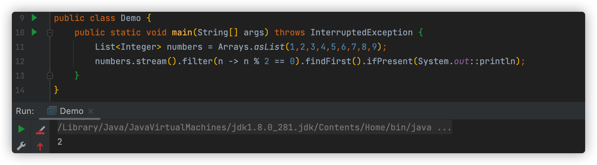

[toc]

# 感受流的快乐

流是 Java API 的新成员，他运行你以声明性方法处理数据集合，你可以把他看为是遍历数据的高级迭代器，此外，流还可以透明的并行处理，你无需写更多的线程代码。

先开感受一下流的快乐，在一个【菜肴】集合中，提取出小于400卡路里的菜肴名，并按卡路里进行排序~

```java
List<Dish> result = new ArrayList();
for(Dish d:menu){
  if(d.getCalories() < 400){
    reslt.add(d);
  }
}
Collections.sort(result,new Comparator<Dish>)(){
  public int compare(Dish d1,Dish d2){
    return Integer.compare(d1.getCalories(), d2.getCalories());
  }
}
List<String> resultName = new ArrayList();
for(Dish d: result){
  resultName.add(d.getName())
}
```

一般情况可能都会这样写，先赛选出小于400的，然后排序，最后再提取名字。所有这里就存在了一个垃圾变量 result，他的作用就是作为中间容器，在 Java8 中，他就应该被放到属于他的库里。来看操作吧

```java
List<String> resultName = 
  menu.stream() 
     .filter(d -> d.getCalories() < 400) 
     .sorted(comparing(Dish::getCalories))
     .map(Dish::getName) 
     .collect(toList());
```

如果你还希望用到多线程，你可以将 stream() 更换为 parallelStream()

总结下来，Java8 中的 Stream API 可以让你的的代码：

+ 生命性——更简洁、更易懂
+ 可复合——更灵活
+ 可并行——性能更好

# 流与集合

## 只能遍历一次

流和迭代器类似，流只能遍历一次，遍历完之后，这个流就被消费掉了，但是你可以从原始数据那在获取一个新的流来遍历。

## 内外部迭代

外部迭代：

```java
List<String> names = new ArrayList<>(); 
for(Dish d: menu){ 
	names.add(d.getName()); 
}
```

使用 Iterator 也是一样，也是外部迭代


内部迭代：

```java
List<String> names = menu.stream() 
   .map(Dish::getName)
   .collect(toList());
```


# 操作流

```java
List<String> names = menu.stream() 
   .filter(d -> d.getCalories() > 300)
   .map(Dish::getName) 
   .limit(3) 
   .collect(toList());
```

我们可以看到两类操作

+ filter、map、limit 可以连成一条流水线
+ collect 出发流水线执行并关闭


所以流可分为中间操作和终端操作


## 1、筛选和切片

### 1.1、用谓词筛选

这里解释一下什么是 谓词 说白了，就是 filter 、map 、 limit 这类的中间操作

```java
List<Dish> vegetarianMenu = menu.stream() 
  .filter(Dish::isVegetarian) 
  .collect(toList());
```


### 1.2、distinct 去重

使用 distinct() 方法，返回一个去重流

```java
List<Integer> numbers = Arrays.asList(1, 2, 1, 3, 3, 2, 4);
List<Integer> collect = numbers.stream()
  .distinct()
  .collect(toList());
System.out.println(collect);
```


### 1.3、limit 截断流

使用 limit(n) 方法，返回前n个元素

```java
List<Integer> numbers = Arrays.asList(1,2,3,4,5,6,7,8,9);
List<Integer> collect = numbers.stream()
  .limit(3)
  .collect(toList());
System.out.println(collect);
```


### 1.4、skip 跳过

skip(n) 跳过前面 n 个元素

```java
List<Integer> numbers = Arrays.asList(1,2,3,4,5,6,7,8,9);
List<Integer> collect = numbers.stream()
  .skip(4)
  .collect(toList());
System.out.println(collect);
```


## 2、映射

### 2.1、对流中每个元素应用函数

假如你想找出每个单词的长度有多长，你可以这样

```java
List<String> words = Arrays.asList("Java 8", "Lambdas", "In", "Action");
List<Integer> wordLengths = words.stream()
  .map(String::length)
  .collect(toList());
System.out.println("wordLengths = " + wordLengths);
```


### 2.2、流的扁平化

假设有两个单词 ["Hello","World"] ，你想要返回一个列表 ["H","e","l", "o","W","r","d"]

通过上面的方法，你知道了，要这样写

```java
words.stream() 
 .map(word -> word.split("")) 
 .distinct() 
 .collect(toList());
```

其实是错误的，你往下看！


并不能正确的找出单词中不同的字符，这时可以使用 flatMap 来解决这个问题

1、尝试使用 map 和 Arrays.stream() 解决问题

```java
words.stream() 
 .map(word -> word.split("")) 
 .map(Arrays::stream)
 .distinct() 
 .collect(toList());
```

因为 Arrays.stream() 方法可以接受一个数组返回一个流

```java
String[] arrayOfWords = {"Goodbye", "World"}; 
Stream<String> streamOfwords = Arrays.stream(arrayOfWords);
```

2、尝试用 flatMap

```java
List<String> uniqueCharacters = 
 words.stream() 
 .map(w -> w.split("")) 
 .flatMap(Arrays::stream) 
 .distinct() 
 .collect(Collectors.toList());
```


## 3、查找和匹配

Stream API提供了 AllMatch、anyMatch、noneMatch、findFirst和findAny 这些方法，咱们挨个说

### 3.1、anyMatch 是否包含一个

anyMatch 返回的 boolean 类型，是一个终端操作，如果符合一个就直接返回

```java
List<String> words = Arrays.asList("Java 8", "Lambdas", "In", "Action");
if(words.stream().anyMatch(Predicate.isEqual("In"))){
  System.out.println("包含 In 字符");
}
if(words.stream().anyMatch(Predicate.isEqual("IN"))){
  System.out.println("包含 IN 字符");
}
```


### 3.2、allMatch 是否匹配所有

这个就好理解了，所有元素是否都能匹配，也是返回 boolean 类型，作为终止操作

```java
List<Integer> numbers = Arrays.asList(1,2,3,4,5,6,7,8,9);
if (numbers.stream().allMatch(n -> n < 10)){
  System.out.println(" 都小于10 ");
}
```


还有一个 noneMatch ，确保没有一个元素符合和 allMatch 反着来的

```java
List<Integer> numbers = Arrays.asList(1,2,3,4,5,6,7,8,9);
if (numbers.stream().noneMatch(n -> n > 10)){
  System.out.println(" 没有一个大于10 ");
}
```


### 3.3、findAny 查找元素

findAny 和 findFirst 直接能看出来，一个是查找任何一个，一个是查找第一个

```java
List<Integer> numbers = Arrays.asList(1,2,3,4,5,6,7,8,9);
Optional<Integer> first = numbers.stream().filter(n -> n % 2 == 0).findFirst();
```

Optional 简介，Optional<T> 类是一个容器类，代表一个值存在或不存在，有可能 findFirst 一个都没有，如果没有是不是就容易出null的问题了呢？这一块你不需要了解过多，看看他的方法就好了

+ isPresent() 终止操作，判断是否有值，如果有就true 没有就 false
+ isPresent(Consumer<T> block) 这里等下代码展示
+ T get() 有值就返回值，没有值抛出 NoSuchElemnt 异常
+ T orElse(T other) 存在就返回值，没有就返回一个默认值



你有没有想过，为什么存在一个 findAny 为什么又要一个 findFirst 呢？答案是他是并行的，如果你不关心返回的是哪个，随便一个都行的话，请使用 findAny，因为在并行流限制较少

## 4、归纳

到目前为止，你见过的终止操作有返回一个 boolean（allMatch类的）void（forEach）Optional 对象（findAny），你也见过如果用 collect(toList()) 合成一个 List

### 4.1、reduce 元素求和

reduce 接受两个参数，第一个是初始值，第二个是每次计算后的值，有点类似于递归

```java
List<Integer> numbers = Arrays.asList(4,5,3,9);
Integer total = numbers.stream().reduce(0, (a, b) -> a + b);
System.out.println("total = " + total);
```

让我们深入研究一下reduce操作是如何对一个数字流求和的。首先，0作为Lambda（a）的。第一个参数，从流中获得4作为第二个参数（b）。0 + 4得到4，它成了新的累积值。然后再用累。积值和流中下一个元素5调用Lambda，产生新的累积值9。接下来，再用累积值和下一个元素3。调用Lambda，得到12。最后，用12和流中最后一个元素9调用Lambda，得到最终结果21。

这里有一点绕，你也可以用更为简洁的办法，更容易理解

```java
int total = numbers.stream().reduce(0, Integer::sum);
```

除此之外，他还有个无载体

```java
Optional<Integer> sum = numbers.stream().reduce((a, b) -> (a + b));
```

无载体不接受初始值，所以自身也不能判断是否有值，因此用 Optional 来接收再正常不过了

### 4.2、reduce 最大和最小值

还是复用 reduce 这个角色，因为 reduce 接受两个参数，那既然有2个参数，自然就可以进行对比

```java
Optional<Integer> max = numbers.stream().reduce(Integer::max);
```

你也可以写成

```java
Optional<Integer> max = numbers.stream().reduce(a,b -> a > b ? a : b);
```

这样是不是就更好理解了

> 通过 map 和 reduce 可以计算有有所在总量，你可以把流中元素 映射成1 然后用 reduce 求和
>
> ```java
> int count = data.stream() 
> .map(d -> 1) 
> .reduce(0, (a, b) -> a + b);
> ```
>
> 这种模式称为 map-reduce 模式，Google 用他进行网络搜索而出名

总结一下吧


本文参考丛书 《Java8 实战》- 【英】Raoul-Gabriel Urma

关注公众号【Xiang想】回复【图书】即可获得电子版图书