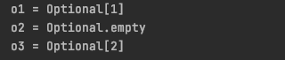

> 创建于 2021年6月17日
>
> 作者：想想

[toc]


## Lambda

+ 是一个简洁、可传递的匿名函数，它是推动 Java8 发布的重要新特性
+ 本质是函数，虽然它不属于某个特定的类，单具备参数列表、函数主体、返回类型、甚至能抛异常
+ 是匿名的，它没有具体的函数名称
+ 允许把函数作为方法的参数（函数作为参数传递进方法中）
+ 可以使代码变得简洁

```java
// 传统写法
Runnable r1 = new Runnable(){
  public void run(){
    System.out.println("hello world");
  }
}
```

```java
// 使用Lambda
Runnable r2 = () -> System.out.println("hello world");
```

### Lambda 异常处理

```java
List<Integer> list = Arrays.asList(1, 2, 3, 4, 5);
list.forEach(i -> {
  try {
    System.out.println(i/0);
  }catch (Exception e){
    System.out.println("e.getMessage() = " + e.getMessage());
  }
});
```


## Steam

​		流是 Java8 引入的全新概念，它用来处理集合中的数据，暂且可以理解为一种高级集合

流的特点：

1. 只能遍历一次

2. 采用内部迭代方法

   若要对集合进行处理，则需要我们手写处理代码，这就叫外部迭代，而要对流进行处理，我们只需要告诉流我们需要什么结果，处理过程流自行完成，这叫内部迭代。

### List转Stream

```java
 Stream<Integer> stream = list.stream();
```

### filter 过滤

```java
List<Integer> person = Arrays.asList(1, 2, 3, 4);


Stream<Integer> integerStream = person.stream().filter(new Predicate<Integer>() {
  @Override
  public boolean test(Integer integer) {
    return integer > 2;
  }
});
```

### map 元素转换

```java
List<String> list = new ArrayList<>();
list.add("I am a body");
list.add("I love the girl");
list.add("But the girl loves another girl");


List<Stream<String>> collect = list.stream().map(line -> line.split(" ")).map(Arrays::stream).collect(toList());
```

### distinct （去重）

```java
list.stream().distinct();
```

### sorted (排序)

```java
Stream<T> sorted();
Stream<T> sorted(Comparator<? super T> comparator);
```

### limit 取前面n个元素

```java
Stream<T> limit(long maxSize);
```

### skip 跳过n个元素

```java
Stream<T> skip(long n);
```

### forEach 遍历

```java
void forEach(Consumer<? super T> action);

list.stream().forEach(i -> System.out.println(i));
```

### toArray 转换成数组

```java
Object[] toArray();
```

### toList 转换成集合

```java
<R, A> R collect(Collector<? super T, A, R> collector);

List<String> collect = list.stream().collect(toList());
```

## Optional

+ 空指针异常导致Java程序失败是最常见的原因
+ 为了解决空指针异常，Java8提供了 Optional 类库
+ Optional 实际上个容器，它可以保存类型T的值，或者仅仅保存null
+ Optional 提供很多由用的方法，这样我们就不用显式进行空值检测

```java
Optional o1 = Optional.of(1);
Optional<Object> o2 = Optional.ofNullable(null);
Optional<Integer> o3 = Optional.ofNullable(2);

System.out.println("o1 = " + o1);
System.out.println("o2 = " + o2);
System.out.println("o3 = " + o3);
```



Option.empty（） 所有null 包装的 Option 对象

```java
Optional<Object> o1 = Optional.ofNullable(null);
Optional<Object> o2 = Optional.ofNullable(null);

System.out.println(o1==o2);								// true
System.out.println(o1==Optional.empty());	// true

Optional<Object> o3 = Optional.empty();
Optional<Object> o4 = Optional.empty();

System.out.println(o3 == o4);           // true
```

isPresent（） 判断是否有值。 true/false

如果不为空，则可以使用 ifPersent（Consumer consumer）及时为空，也可以使用，则不调用 Consumer

```java
Optional<Integer> o1 = Optional.ofNullable(1);

o1.ifPresent(new Consumer<Integer>() {
  @Override
  public void accept(Integer integer) {
    System.out.println("integer = " + integer);
  }
});
```


