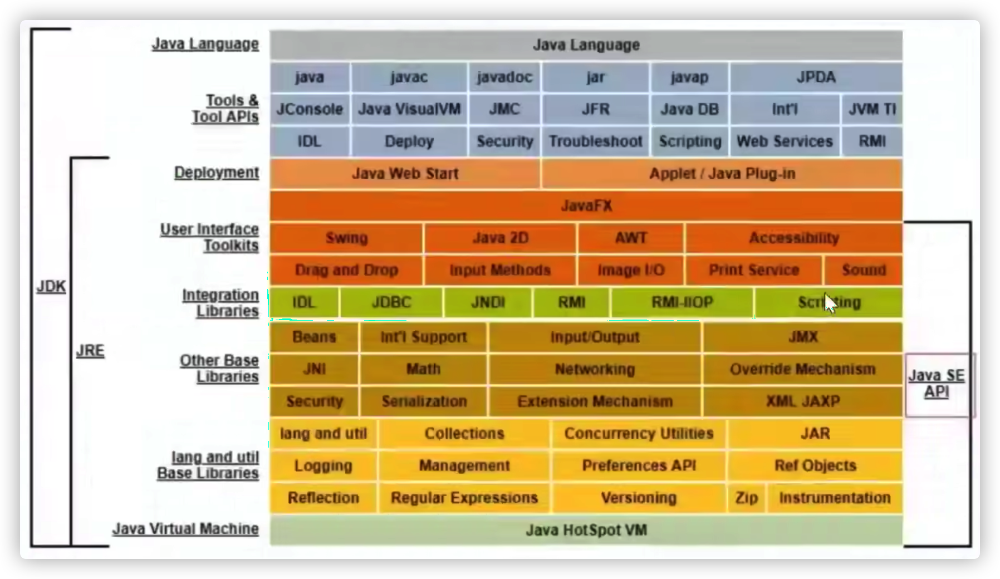
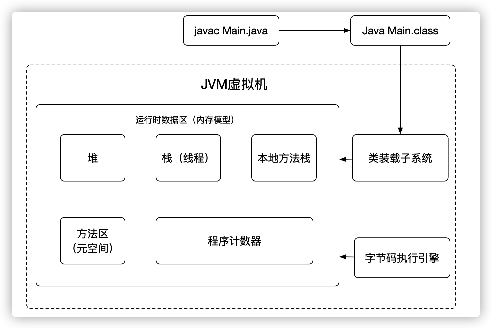
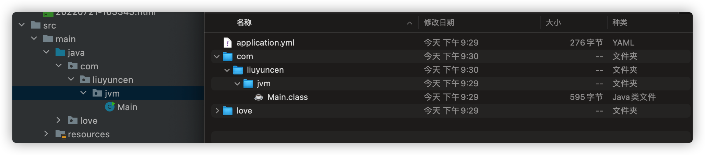
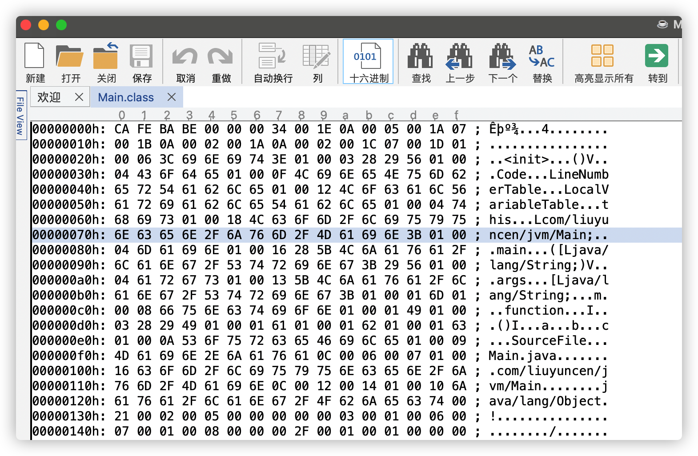
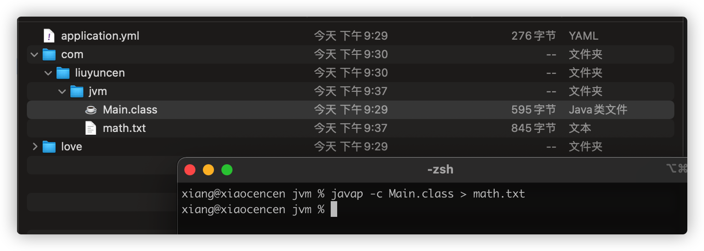
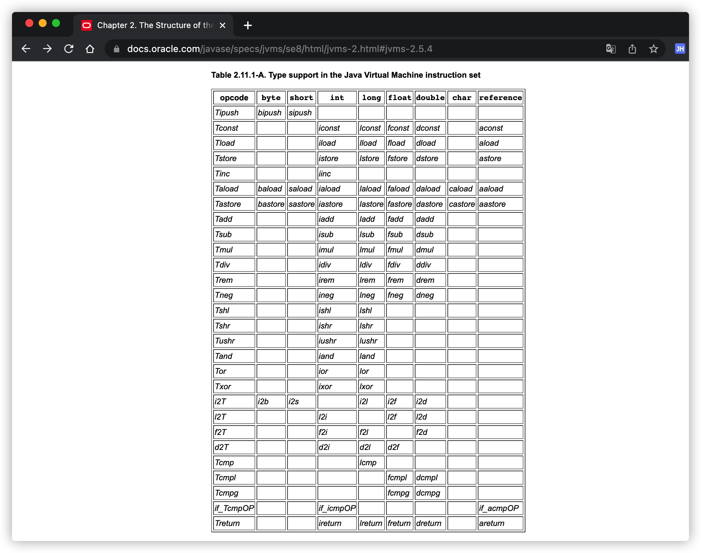
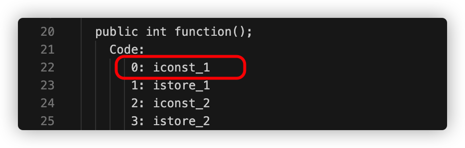

# 1、JVM底层-class文件

工作好几年了，但是对jdk底层、JVM原理方面很多东西都是一知半解，现在打算单独找一大快时间来弥补一下这方面的知识，带着讨论式的学习方式。一起探索 JVM 底层

> 众所周知 Java 特性：一次编译到处运行（跨平台）

跨平台的能力就是 Java 虚拟机 JVM 实现的，JDK中到底有哪些东西呢？如下图！



在图中最下面这个地方 `Java HotSpot VM` 就是我们常说的 `JVM` 虚拟机，`JVM` 由什么组成呢？



既然当我们清楚`JVM`的组成部分后，那当一段程序执行时，JVM到底是怎么做的，又如何去印证这一说法呢？

```java
package com.liuyuncen.jvm;

public class Main {
    public static void main(String[] args) {
        Main m = new Main();
        int function = m.function();
    }

    public int function(){
        int a = 1;
        int b = 2;
        int c = ( a + b ) * 10;
        return c;
    }
}
```

## 1.1、反编译 class 文件

当我们有如上一段程序后，我们通过 `javac` 命令可以得到一个 `.class` 的文件



这里我直接用的 IDEA 工具，编译后在 `target` 路径下看到的 `.class` 文件

当我们用记事本打开这个 `Main.class` 文件后，我们会看到一大堆字节码



这其实就印证了之前我们所说的，JAVA特性，一次编译到处运行，`JVM` 把 `.java` 文件编译成 `.class` 文件后，最终由计算机运行，而计算机就是去读这样的二进制字符，我们看到的是十六进制，大同小异。

进制编码是给计算机看的，而不是给我们看的，虽然我们也可以通查阅 Oracle 的官方文档找到每个字符对应的含义，但是这样查询未免也....  太爽了吧，所以 Oracle 提供了另外一个工具 `javap`

## 1.2、Javap 反编译工具

通过 `javap` 反编译 `class` 文件获得 `txt` 文件

```
javap -c Main.class > math.txt
```



我们可以得到这样一个文本

```
Compiled from "Main.java"
public class com.liuyuncen.jvm.Main {
  public com.liuyuncen.jvm.Main();
    Code:
       0: aload_0
       1: invokespecial #1                  // Method java/lang/Object."<init>":()V
       4: return

  public static void main(java.lang.String[]);
    Code:
       0: new           #2                  // class com/liuyuncen/jvm/Main
       3: dup
       4: invokespecial #3                  // Method "<init>":()V
       7: astore_1
       8: aload_1
       9: invokevirtual #4                  // Method function:()I
      12: istore_2
      13: return

  public int function();
    Code:
       0: iconst_1
       1: istore_1
       2: iconst_2
       3: istore_2
       4: iload_1
       5: iload_2
       6: iadd
       7: bipush        10
       9: imul
      10: istore_3
      11: iload_3
      12: ireturn
}
```

我们可以大体看出一些东西来！但是具体的一些指令什么的，看不懂。没关系，我们可以去查官网，查资料





就拿 iconst_1 而言，表示将 int 类型常量 1 压入栈中

+ istore_1 将 int 类型值存入局部变量 1
+ iconst_2 将 int 类型常量 2 压入栈中
+ istore_2 将 int 类型值存入局部变量2

那 `_1` 和 `_2` 代表什么呢？其实就是代表类中的局部变量，你先初始化一个 a 那 a 就占用了第1个下标，再初始化了 b 那 b 就占用了第2个下标。紧接着就是 `_3` `_4`...其实还有 `_0` ，`0` 代表的 `this` 类本身

所以这就解释的通了，人们通过写 main 方法等各个函数后，再运行 main 方法，先通过 javac 编译成 class 文件，而计算机就是通过这些指令集去运行程序。

