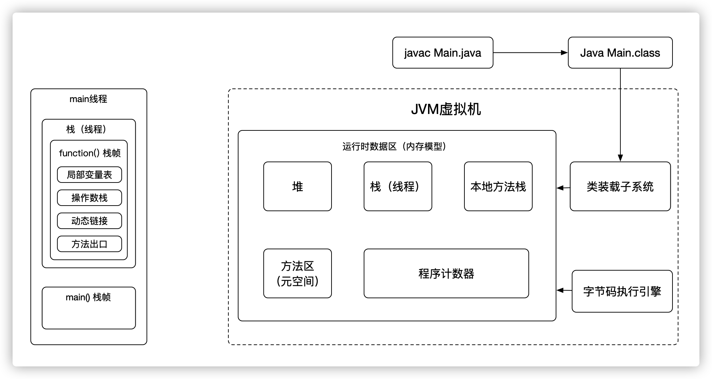
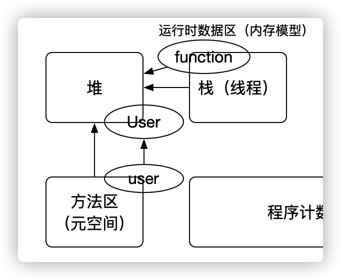

## 堆栈、方法区、本地方法栈之间关系

在前面一期 JVM底层-Class文件一章，我们已经知道 JVM 是如何编译执行的，但是 JVM 内存模型中的 栈帧内存空间又是如何存在的呢？我们用什么方法可以看到他们之间的变化呢？

```java
public class Main {
    public static void main(String[] args) {
        Main m = new Main();
        int function = m.function();
    }

    public int function(){
        int a = 1;
        int b = 2;
        int c = ( a + b ) * 10;
        return c;
    }
}
```

还是用这段代码来举例子，在 function 方法中，包含 局部变量表、操作数栈、动态链接、方法出口

+ 局部变量表：用来存储 变量a、b、c并赋值
+ 操作数栈：1、2、10这些操作数，这些操作数在操作运算中是需要做加减操作，而操作数栈就是用来做运算的临时空间
+ 动态链接：main 方法调用 function 方法，找的其实是 function 方法的地址值，需要通过地址值去方法区（元空间）去找这个方法的入口地址，去指向这个方法的地址值（也可以称为：把符号引用转换为直接引用）
+ 方法出口：function 方法运行完后 return 返回，当时在进入function 方法的时候，就已经把当时的线程的位置保存在 方法出口中了，记录在 main 方法的哪一行指令去执行。


我们通过一段代码的 debug 就可以清楚的看到当代码执行到function 方法中，栈的位置就多出了一个 function 的方法栈，当退出到main 方法后，就意味着 function 出栈。栈内就少了 function 方法栈。

main 方法也有局部变量， main 方法的的 Main 对象其实一个地址值，地址值放在栈中，这个地址值是堆中的一个地址值。通过这个地址值可以在堆中找到 Main对象的实际位置。

因此，栈和堆中的关系已经出来了。

> 栈中存放着，就是堆中的地址值。

方法空间在 Jdk 1.8 之前，叫`持久代`。1.8以后叫 `元空间` 

里面存放一些 常量、静态变量、类信息

```java
private final String param = "abc";
private static User user = new User();
```

上面两行代码就是 常量 和 静态变量，我们看见这个user 又是一个对象，很显然，在 元空间 存放的肯定是堆空间的地址值，那 方法区和堆之间的关系 又出来了



那什么是本地方法栈呢？

在调用本地方法的时候，jvm 虚拟机会在内存空间中分配一块内存给本地方法栈。