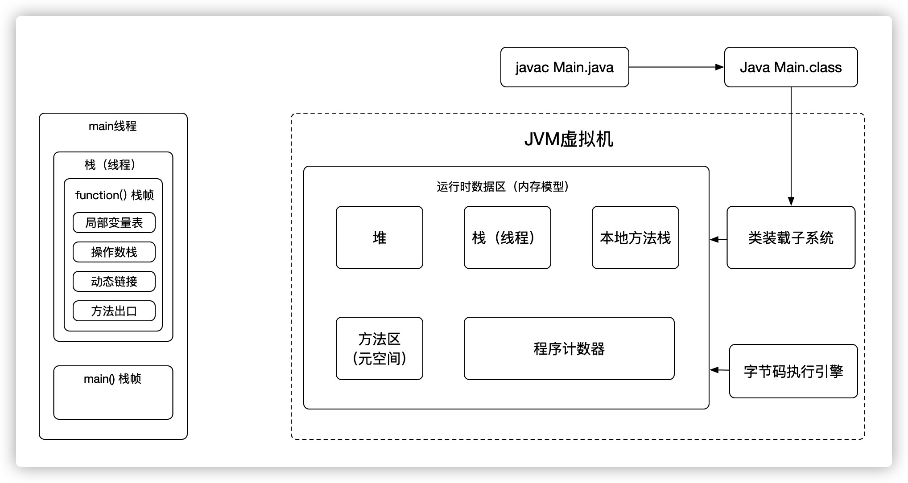
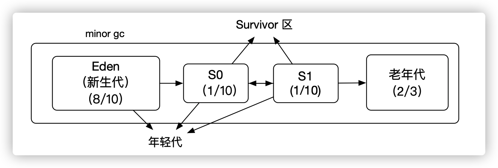
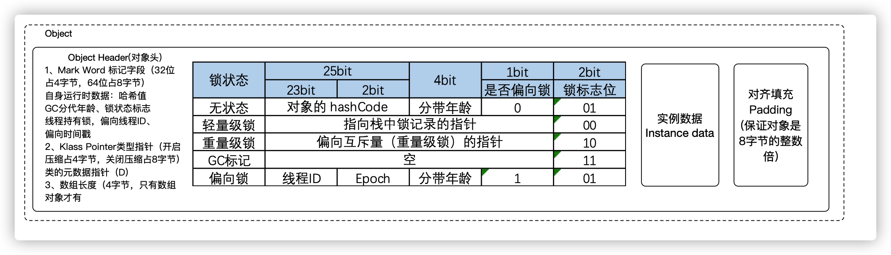
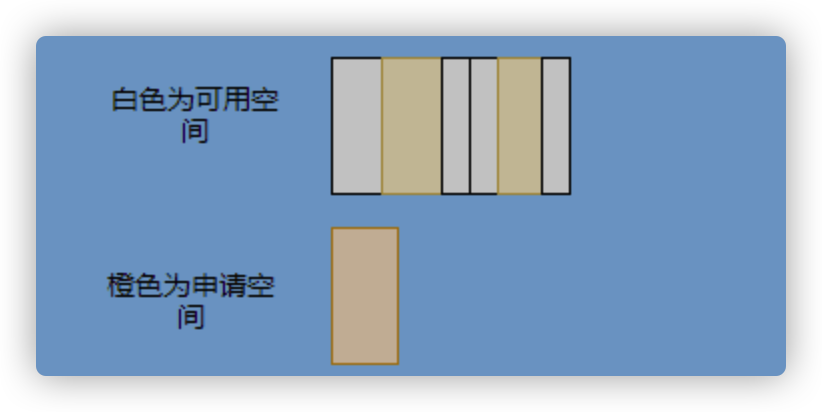

[toc]

## Java 虚拟机规范

通过前两篇的讲解，我们已经清楚的知道了，Java 虚拟机运行时区分为：堆、栈、本地方法栈、方法区、程序计数器

其中 程序计数器、栈、本地栈是私有的，不需要管理。所以 GC 只关心堆 和 方法区的回收

那程序要如何判断他是否为垃圾呢？又如何进行回收呢？这里就有大学问了

那为什么我们要去关心 JVM 垃圾回收这个问题呢，因为 JVM 回收垃圾的时候`STW(stop the world) `，或多或少会占用系统资源，导致系统卡顿，那如果我们准确的预判好各个区域的大小，避免 JVM 频繁回收，是不是就能解决这个问题。带着这个思维，我们先去了解一下，JVM 是如何回收的。

然后我还会动态的给大家展示 垃圾对象在回收时候是如何运转的

>  问题：如何判断能否回收♻️

## 垃圾回收机制

### 1、引用计数法

在被引用的时候 计数器加一，当计数器减少为0时，说明没有被人引用了，立刻清理释放内存。

如上图所示，云朵代表引用，此时对象 A 有 1 个引用，因此计数器的值为 1，对象 B 有两个外部引用，所以计数器的值为 2，而对象 C  没有被引用，所以说明这个对象是垃圾，因此可以立即释放内存。

### 2、可达性分析

**从一个被称为GC Roots的对象开始向下搜索，**如果一个对象到GC Roots没有任何引用链相连时，则说明此对象不可达的，不可用。要注意的是，不可达对象不等价于可回收对象，不可达对象变为可回收对象至少要经过两次标记过程。两次标记后仍然是可回收对象，则将面临回收。

**作为GC Roots的对象有以下几种：**

1. 虚拟机栈中引用的对象
2. 方法区类静态属性引用的对象
3. 方法区常量池引用的对象
4. 本地方法栈JNI引用的对象

可以理解为标记清除（这个思想后面会说），存在的弊端是，当内存不足的时候，再扫描，原本不富裕的家庭更加艰辛了，这样扫描的时间也会长一点。这种就是攒着，一次性处理。而不论标记清除还是计数。

而不论是标记清楚或者是引用计数，都只关心引用类型，不管数据类型，所以JVM还需要判断栈上的数据是什么类型的，这里又分为了 保守GC、半保守GC、准确式GC（这个不细讲了，如果想知道的朋友，可以加我好友催更哟）

## 垃圾回收算法

### 1、分代收集算法

堆分为新生代、老年代，其中新生代的对象有着朝生夕死的特性，因此GC特别频繁，需要追溯标记的对象也很少，都是直接干掉。如果用**标记-清除**的话，需要对对象处理很多次。因此可以使用**标记-复制**算法，每次将存活的对象复制到另一个区域，剩下的直接干掉就行了。但是朴素的 **标记-复制**算法将堆对半分，这样效率很低，只有50%，所以 虚拟机分为了 Eden 区和 两个 survivor，默认比例死 8:1:1 这样能有 90% 的利用率。每次回收将存活对象拷贝到 survivor区就可以了， 这就是 分配担保机制

老年代的对象基本上都不是垃圾，追溯标记非常耗时，回收率也比较低，所以安排的少一点，这样一来，新生代回收多、老年代回收少，这样就区分出来了分代收集的特性。（下面讲 标记-清除、复制)

> 这里要强调一点，如果 GC 一次，没有被回收的对象 `分代年龄` 会`+1` ，每一次回收会在 `s0` 、 `s1` 区间挪来挪去，直到分代年龄到 `15` 岁，就会被挪到 `老年代`
>
> 那这个分代年龄存放在哪里呢？是存在在`对象头`中的
>
> 
>
> 这一整块对象都是放在 `堆` 中的

### 2、标记-清除

分为两个阶段，标记阶段、清除阶段

**标记阶段**：全局遍历从根（栈、寄存器、全局变量） 开始遍历，凡是垃圾，统统标记

**清除阶段**：然后把标记住的，统统干掉，这里删一点，那里删一点，这样就会存在很多碎片化的空间

> 清除不会移动和整理内存空间

这就使得明明总的内存是足够的，但就是申请不到内存，在申请的时候，也需要遍历链表去查合适的内存块。比较耗时。所以就会有**多个链表的实现**

当然还可以分更多，这里只画了 2 个

还有标记，标记的话一般我们会觉得应该是标记在对象身上，比如标记位放在对象头中，等于每一次 GC 都需要修改对象，因此就有一种**位图标记法**，其实就是将堆的内存某个块用一个位来标记。就像我们的内存是一页一页的，堆中的内存可以分成一块一块，而对象就是在一块，或者多块内存上

这样，就不用去扫描整个堆而去清除对象了。

但是不论是标记对象头还是利用位图，**标记-清除**的碎片问题还是处理不了。

因此就引出了标记-复制和标记-整理。

### 3、标记-复制

首先这个算法会把堆分为两块，一块是 From、一块是 To。

对象只会在 From 上生成，发生 GC 之后会找到所有存活对象，然后将其复制到 To 区，之后整体回收 From 区。

再将 To 区和 From 区身份对调，即 To 变成 From ， From 变成 To，我再用图来解释一波。

可以看到内存的分配是紧凑的，不会有内存碎片的产生。

不需要空闲链表的存在，直接移动指针分配内存，效率很高。

简单粗暴的把活动的内存，一箩筐移到另一个区中，相当紧密，缺点是，效率是50%，因需要对半分内存空间。如果存活的对象非常多的话，也会很困难，要挪很多，所以不适用保守型的GC

### 4、标记-整理

和标记-复制差不多，区别在于复制算法是分为两个区来回复制，而且整理不分区，直接整理。这种就是不挪到另一个分区了，直接整理到一块，删掉垃圾。

至此相信你对标记-清除、标记-复制和标记-整理都清晰了，让我们再回到刚才提到的分代收集。

### 5、 跨代引用

有了分代收集到基础，提高了垃圾收集的效率，但是新生代在回收的时候，有可能被老年代引用，老年代也作为根，那这样扫描整个老年代，效率又低了。

此时：记忆集（Remembered Set） 出现了，他可以记录跨代之间的引用而避免扫描整体非收集区域，因此记忆集就是一种用于记录从非收集区域指向收集区域的指针集合的抽象数据结构。根据记录的精度分为

+ 字长精度，每条记录精确到机器字长
+ 对象精度，每条记录精确到对象
+ 卡精度，每条记录精确到一块内存区域

最常见的是卡精度来实现记忆集，称之为卡表。

什么叫卡呢？

拿对象精度来距离，假设新生代对象 A 被老年代对象 D 引用了，那么就需要记录老年代 D 所在的地址引用了新生代对象。

那卡的意思就是将内存空间分成很多卡片。假设新生代对象 A 被老年代 D 引用了，那么就需要记录老年代 D 所在的那一块内存片有引用新生代对象。

也就是说堆被卡切割了，假设卡的大小是 2，堆是 20，那么堆一共可以划分成 10 个卡。

因为卡的范围大，如果此时 D 旁边在同一个卡内的对象也有引用新生代对象的话，那么就只需要一条记录。

一般会用字节数组来实现卡表，卡的范围也是设为 2 的 N 次幂大小。来看一下图就很清晰了。

这其实很好理解，说白了就是当引用字段赋值的时候判断下当前对象是老年代对象，所引用对象是新生代对象，于是就在老年代对象所对应的卡表位置置为 1，表示脏，待会需要加入根扫描。

不过这种将老年代作为根来扫描会有浮动垃圾的情况，因为老年代的对象可能已经成为垃圾，所以拿垃圾来作为根扫描出来的新生代对象也很有可能是垃圾。

不过这是分代收集必须做出的牺牲。

## 总结

1. 关于垃圾回收首先得找出垃圾，而找出垃圾分为两个流派，一个是引用计数，一个是可达性分析。
2. 引用计数垃圾回收的及时，对内存较友好，但是循环引用无法处理。
3. 可达性分析基本上是现代垃圾回收的核心选择，但是由于需要统一回收比较耗时，容易影响应用的正常运行。
4. 所以可达性分析的研究方向就是往如何减少对应用程序运行的影响即减少 STW(stop the world) 的时间。
5. 因此根据对象分代假说研究出了分代收集，根据对象的特性划分了新生代和老年代，采取不同的收集算法，提升回收的效率。
6. 想方设法的拆解 GC 的步骤使得可以与应用线程并发，并且采取并行收集，加快收集速度。
7. 还有往评估的方向的延迟回收或者说回收部分垃圾来减少 STW 的时间。

http://arctrix.com/nas/python/gc/

https://openjdk.java.net/groups/hotspot/docs/HotSpotGlossary.html

《The Garbage Collection Handbook 》

https://www.iteye.com/blog/user/rednaxelafx

https://www.jianshu.com/u/90ab66c248e6