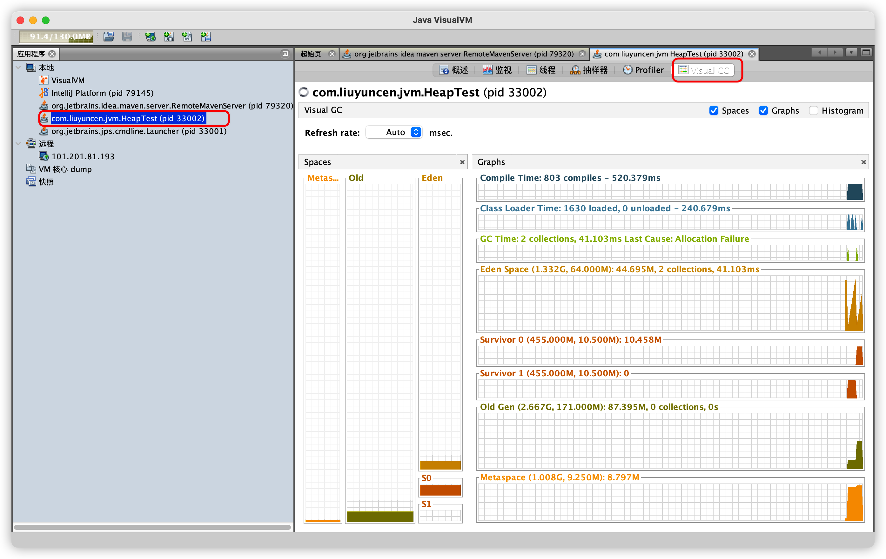
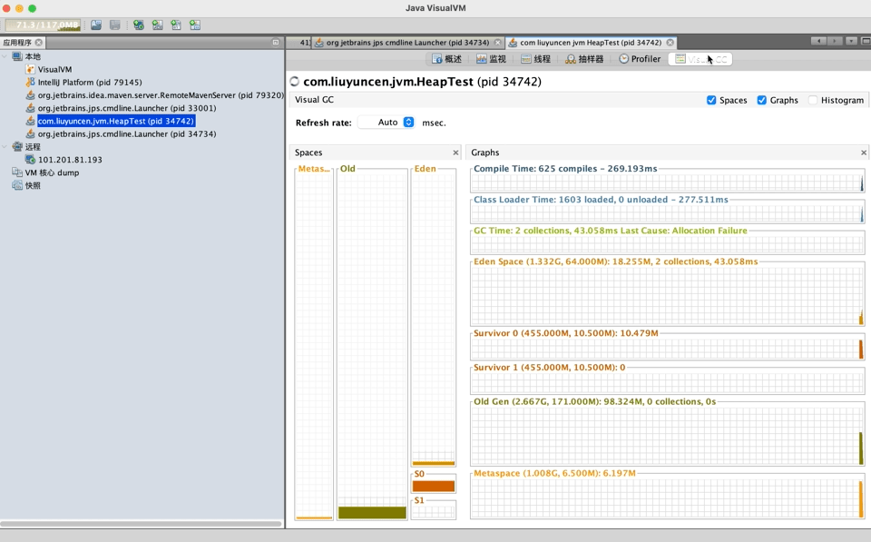
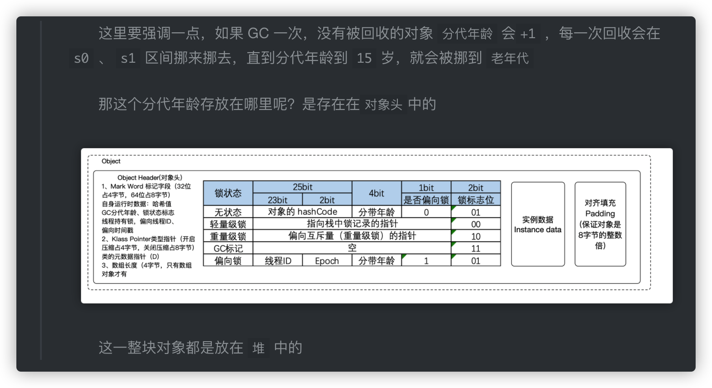
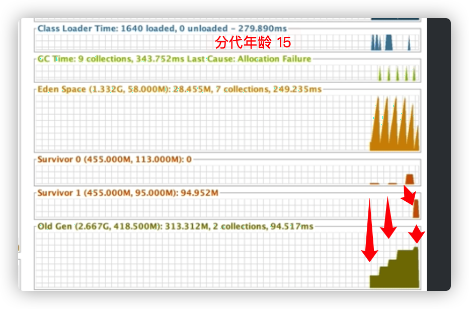
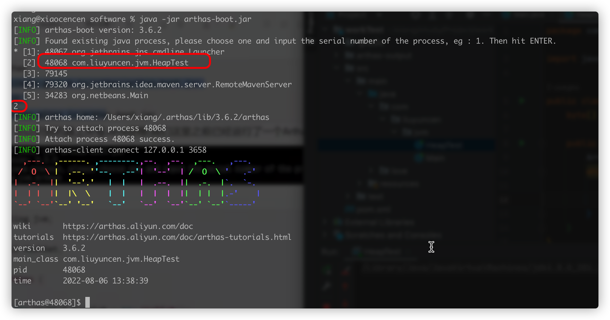
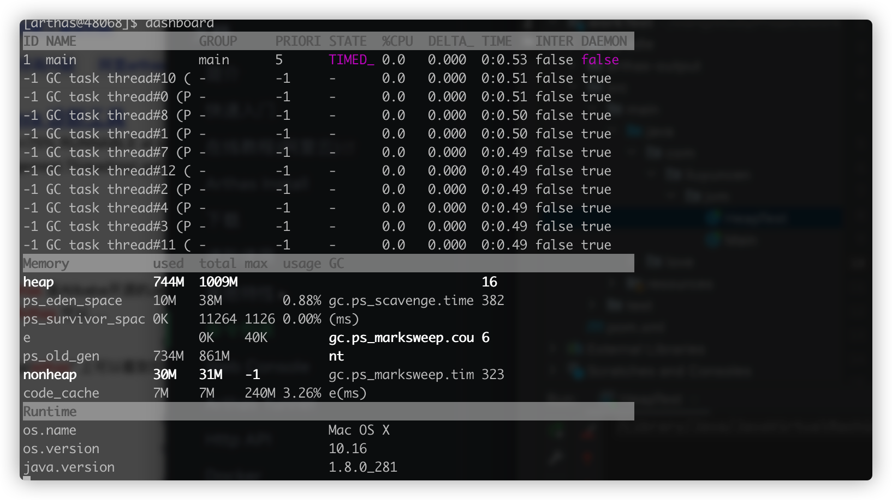
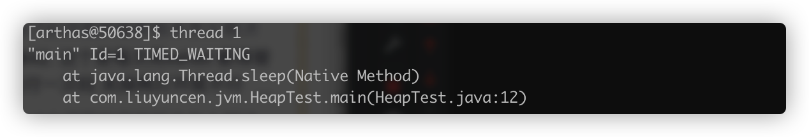
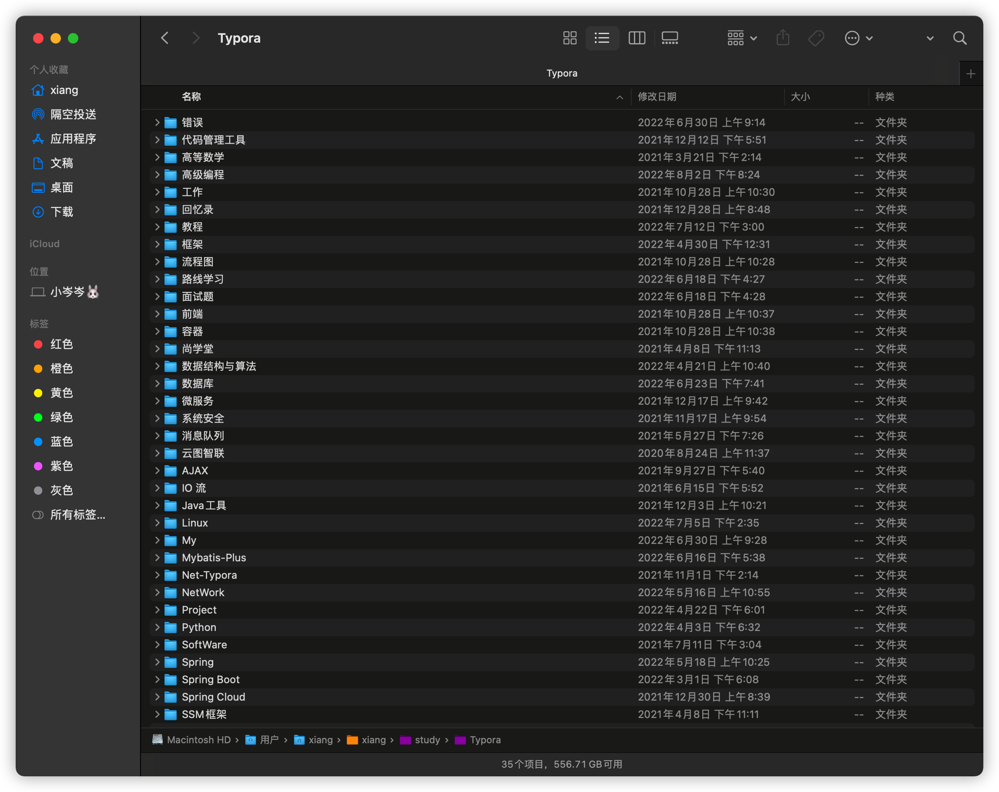
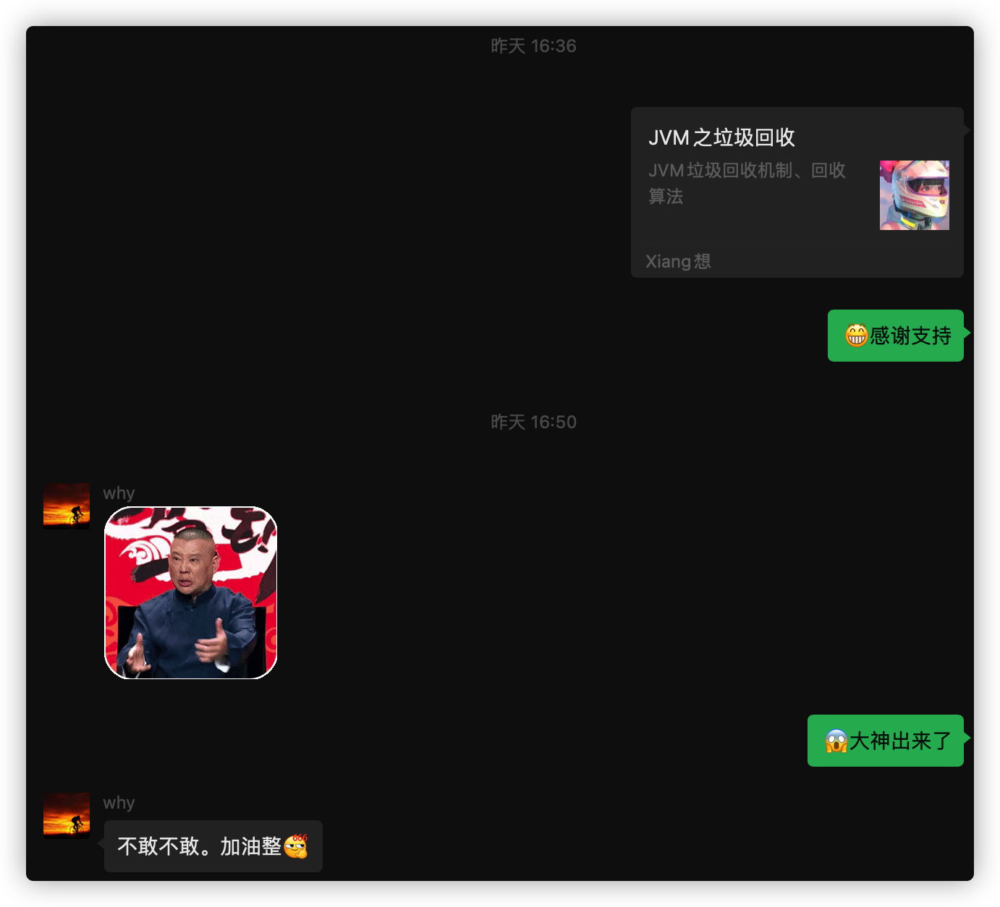

这里我们主要介绍两款工具

+ jvisualvm
+ arthas

前面我们说过，通过垃圾回收进行调优，只要减少JVM频繁回收，就可以减少 STW 时间，从而达到调优的目的。那准确的判断堆内存在回收时各个区域（`Eden`、`s0`、`s1`、`Old`）的流转情况，我们可以通过 jvm 调优工具来看到。

我们直接开始吧！

在调优之前，我们先手写一段代码，更好的观察 JVM 运行状态

```java
public class HeapTest {
    byte[] a = new byte[1024 * 100];

    public static void main(String[] args) throws InterruptedException {
        ArrayList<HeapTest> heapTests = new ArrayList<>();
        while (true){
            heapTests.add(new HeapTest());
            Thread.sleep(10);
        }
    }
}
```

写了一个死循环，每隔10毫秒，往list中放对象，最终这段程序肯定会内存溢出的

## Jvisualvm

jvisualvm 是  jdk 系统自带的 Java 诊断工具

我们先启动这段程序，然后在控制台输入 `jvisualvm` 我们可以看到这个页面



> 如果没有 Visual GC 这个插件的，请移步
>
> https://blog.csdn.net/qq_34378595/article/details/119446859



通过观察，我们可以看到，Eden 区在慢慢增长，增长到一定时候，就往 S0 区挪动，后续又往 S1 区挪动，最后放入 Old 老年代。

我们再细讲图片中的内容

1. 在我们往 list 里存放对象时，Eden 区在慢慢递增，我们看 Eden Space （右侧第四行），当 Eden Space 到达顶峰时，触发一次 GC Time（右侧第三行），也就是触发了 GC
2. 触发GC也就是要回收对象了，但是我们的对象回收不了啊。我们的对象都被 list 引用了,list 被GC ROOT 局部变量引用了，所以不能回收，所以只能往 `Survior 0` 区存放
3. 当分待年龄超过15了，就往 老年代存放，没有超过15，s0 就往 s1 区挪。再触发 分代年龄15，就又往老年代挪了。可以看我近期发的文章中有说到





所以，这个图，就清晰的了解了，堆在生命周期的各个流转区。

## Arthas

阿里开源的一款线上调优工具，非常好用👌🏻

Arthas 是 Alibaba 在 2018年9月开源的 Java 诊断工具，支持 Jdk1.6+，采用命令交互模式，方便定位和诊断线上运行问题，Arthas 官方文档十分详细，详见：https://arthas.aliyun.com/doc/commands.html

当你遇到以下类似问题而束手无策时，`Arthas`可以帮助你解决：

1. 这个类从哪个 jar 包加载的？为什么会报各种类相关的 Exception？
2. 我改的代码为什么没有执行到？难道是我没 commit？分支搞错了？
3. 遇到问题无法在线上 debug，难道只能通过加日志再重新发布吗？
4. 线上遇到某个用户的数据处理有问题，但线上同样无法 debug，线下无法重现！
5. 是否有一个全局视角来查看系统的运行状况？
6. 有什么办法可以监控到 JVM 的实时运行状态？
7. 怎么快速定位应用的热点，生成火焰图？
8. 怎样直接从 JVM 内查找某个类的实例？

....   从官网抄的，这里就不详细介绍，只简单的过一遍

下载

```
wget https://alibaba.github.io/arthas/arthas-boot.jar
wget https://arthas.gitee.io/arthas-boot.jar
```

运行 `java -jar `

```
java -jar arthas-boot.jar
```



### dashboard

输入 `dashboard`



我们可以看到 `eden_space`  、`survivor_space`、`old_space` 等

### thread

通过 thread 加线程ID 查看线程代码



### jad

通过 `jad` 全限定类名，可以输出反编译的类

它还可以线上定位方法中的参数，是一款线上定位问题的神器。可以查看线上系统变量的值，甚至可以修改变量的值。

关于Arthas 详情可以去看官网！官网讲的很详细。也可以联系我来催更😄。

关于这些工具，都只是 Java 调优诊断的辅助手段，真正的 Java 虚拟机调优可没这么


这里废话几句，😄

> 近期，我的文章也是受越来越多的朋友们关注和喜爱。我感觉很激动。在这里特别感谢 `why神`的鼓励，起初开启公众号发文原因是为了用公众视野督促我自身坚持学习。其实我本身热衷于记笔记，往年的笔记已经有好几个G了。
>
> 
>
> 只是最初没有详细归类分组，现在我想一点点把这些笔记整理好，也一同分享给大家，不曾想收到大家的好评，开心
>
> 
>
> 如果大家有想要了解的技术点，可以私信我，或者公众号里回复我，我会结合情况给出回复，我是很愿意和大家探讨技术的。
>
> 
>
> 最后，愿我们彼此共同进步，在成长的道路上不失初心，感谢你的关注，"技术"不仅仅只有"技术"。