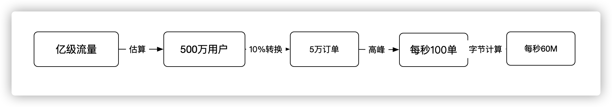
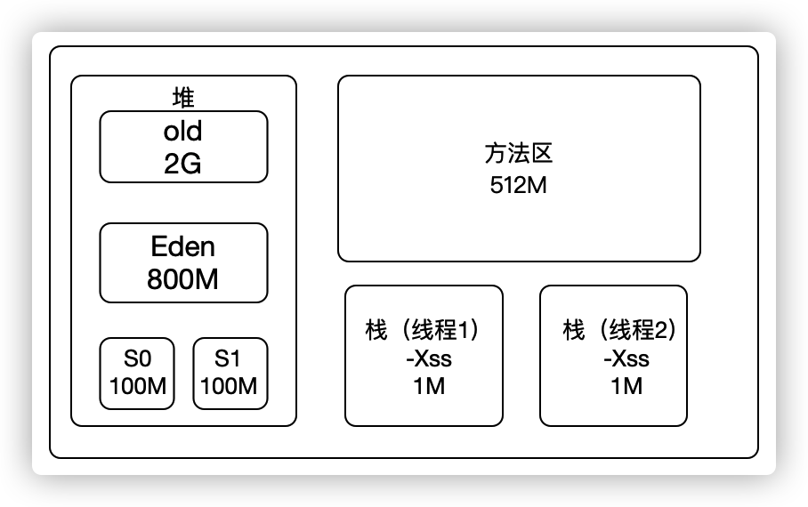
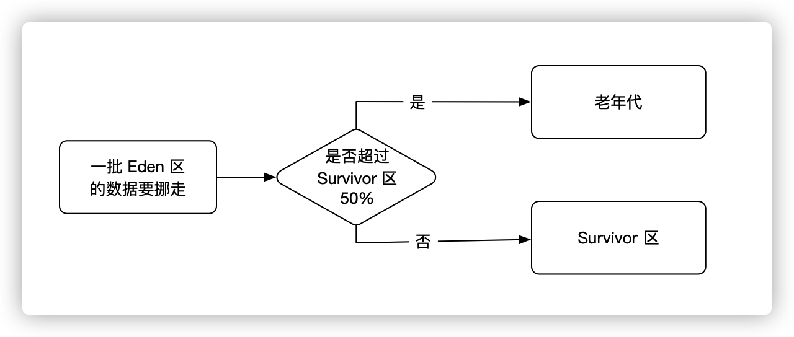
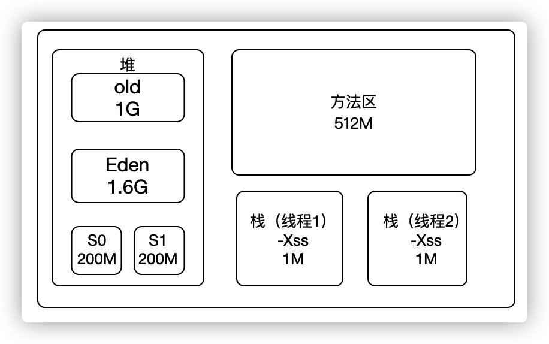

[toc]

## 调优目的

Java 虚拟机调优的目的何在？

程序在运行过程中，会有不断的数据往老年代里放，如果老年代放满了，Java虚拟机并不是立即抛出 `OOM`，而是先进行一次 `FullGC`，当 `FullGC` 之后如果还没有足够的空间，此时才会抛出 `OOM` 异常。

那我们清楚了有这样一个 `FullGC` 的过程后，再返回这个问题，`Java` 虚拟机调优的目的就是为了让程序减少 `FullGC` 的次数。why？

因为程序在 `gc` 时候，无论是 `minor gc` 还是 `full gc`，都会进行 `STW`

## 什么是 STW

当程序在 `gc` 时，`java` 虚拟机会停掉所有的线程，专心的去收集垃圾去清理垃圾。如果这个时候，用户去使用一个功能，就会存在一定的卡顿。这个卡顿是间歇性的，可能一会以后就会好。但是经常性的卡顿，那就不行了。这个卡顿的过程，我们就称为是 `STW`（stop the world）

因此我们要规避 `stw` 过程，让程序流畅

> 问：当初java在设计`JVM`时候，为什么要设置 `STW` 呢？不设置行吗？
>
> 答：如果不设计 `STW`，也就是在 `GC` 的时候，程序线程一直在运行，有可能这个对象刚还不是垃圾，但线程运行完之后就变为垃圾了，或者原本是垃圾的对象，又被引用，又不是垃圾了。这就让 `GC` 很头痛了，他需要重新又去遍历整个堆，这还不算上堆中对象的变化。于此如此，`JVM` 不如暂停所有线程，等他执行完`GC`后，`STW`结束后再继续线程任务！

## 真实案例

现在我们来模拟一个电商网站调优过程。从点击量到用户到订单到服务器每秒使用的内存来一步一步进行分析

1. 一个亿级流量电商网站，每日点击上亿次。像这种拼多多、淘宝这些都是百亿级别。
2. 像这样的一个电商类网站，大概日活用户量在 500 万左右，正常一个人买一件商品或者看一件商品，操作二十几次很正常吧
3. 日活500万的用户，其付费转换率在 10% 左右，这个数据在很多年前就已经有过了
4. 换算成秒，如果是均匀的下单，每秒几十单，但是呢，电商类型的网站，他会有活动大促，像唯品会，早上7、8点，晚上7、8点。一天80%的订单都集中在这几个小时里，这样算下来，其峰值在每秒 一千单左右。
5. 每秒处理 1000 单请求，假设部署3台 `4C8G` 的服务器，每台每秒处理300个订单。（真正一些大的电商网站，其订单服务器，多的有上千台，淘宝双十一甚至超万台服务器）
6. 3台服务器，每秒就是300个订单，那就是每秒300个订单对象，对象的大小根据成员变量，int类型占4个字节计算。一个订单不超过1kb。我们姑且1kb，每秒是300kb的订单生成。
7. 下单还涉及到其他对象，库存、优惠券、积分等等等，我们放大20倍，除此之外我们可能还有其他查询操作。再放大10倍，
8. 结果就是 300kb * 20 * 10  大概估算每秒 60M 的对象生成，但是这些对象在1秒之后就会变成垃圾（订单完成之后就结束了，就变成垃圾了）



再根据我们 4C8G 的服务器环境，默认的去配置 jvm 参数

```sh
java -Xms3G -Xmx3G -Xss1M -XX:MetaspaceSize=512M -XX:MaxMetaspaceSize=512M -jar order-server.jar
```

`-Xms3G` `-Xmx3G`  堆占 3个G，因为我们知道 新生代和老年代，老年代占3/2 的堆，占有2G，年轻代 1个G，`eden区`和 `s区`又是8:1:1 的比例，所以 Eden区有 800M、S0和S1分别是 100M。



现在以每秒60M的数据往 eden 区存放，**大概十几秒就会占满 Eden 区，触发一次 minor gc**

```java
// 创建订单
public int createOrder(){
  Order order = new Order();
 	// 订单保存
  order.save();
  return order.money;
}
```

订单创建完成后，这个方法结束后，对应的对象及局部变量对于`gc root` 来说就是垃圾了，**所以对象在创建完几秒内就会变成垃圾**，这是其一

因为以我们 800M 的 `eden`区来计算，每秒60M对象，过了十几秒，可能就在 14到15秒之间，`eden` 区满了，但是此时方法并没有结束，线程在执行在 订单保存 这一逻辑，触发 `minor gc` ，使得 `stw` ，线程挂起，因为没执行完，所以不是垃圾。正因为他不是垃圾，他会挪到哪里去呢？ S区？不一定

> **对象动态年龄判断**
>
> 当前对象的 survivor 区域里（其中一块区域，放对象的那块 s区）一批对象的总大小大于这块 Survivor 区域内存大小的 50%（-XX:TargetSurvivorRatio 可以指定），那么此时**大于等于**这批对象年龄最大值的对象，就可以直接进入老年代了，例如 Survivor 区域里现在有一批对象，年龄1+年龄2+年龄n的多个年龄对象和超过了 Suvivor 区域的 50%，此时就会把年龄 n（含）以上的对象都放进老年代，这个规则其实是希望那些长期存活的对象，尽早进入老年代，**对象动态年龄判断机制一般在 minior gc 之后触发的**

通俗的解释，有一批对象从 `eden` 区挪到 `survivor` 区，如果这批对象超过 `survivor` 区的 50%，**就直接进入老年代**



很显然，60M 超过了 S区的 50%，这批数据进入 老年代，每隔十五六秒就会有 60M 左右的数据往 老年代挪，2G的老年代，五六分钟左右就放满了，此时触发 `full gc`

说白了，这些都已经是垃圾了，还要存进老年代，触发 `full gc` ，显然非常的不值当，而且几分钟就触发一次 `full gc`，正常情况下应该是几天甚至是几周才能去触发 `full gc`。所以这明显不合理。

## 调优过程

如果我想要上述的场景，能否对 `JVM` 调优，让其几乎不发生 `Full GC`，不能说完全不发生，是几周甚至几个月才发生一次。

我们知道是因为 年轻代内存不足导致垃圾频繁往老年代存放，所以我们可以把年轻代调大一点。

```sh
java -Xms3G -Xmx3G -Xmn2G -Xss1M -XX:MetaspaceSize=512M -XX:MaxMetaspaceSize=512M -jar order-server.jar
```

`-Xms3G` `-Xmx3G` 堆占 3个G， `-Xmn2G` 年轻代 2个G 其他不变，结果就是这样



当然，我们也可以直接指定 `survivor` 区大小，这里还是按默认 8:1:1 来

当 `survivor` 区有200M以后，我们刚刚说的那一批从 eden区挪过来的未执行完订单的对象，就不会往老年代中存放，就安心的放在 `survivor` ，等下一次再触发 `minor gc` 时，就会把新生代包括 `survivor` 这一块垃圾给回收掉。所以只会有少数老顽固的对象才会被挪到老年代。

像这样朝生夕死的对象都会在新生代就被干掉，再也不会挪到老年代！也就不会频繁的触发` full gc`，不会频繁 `stw`，不会频繁挂起 `java` 线程，不会频繁影响用户操作，从而达到调优目的

## 总结

总结一下

通过我们对场景的判断，设置内存模型合适的一个比例，不要让垃圾进入老年代，在新生代就给他干掉，减少 `full gc`次数，达到调优目的。

真正的一个程序在上线之前还会进行压测，然后进行一些微调，微调过后使得程序最优再进行上线，但是如何调优，这就是一个程序员对`JVM`理解力的判断，今天所聊的只是一种极端情况下的推测，但万变不离其宗，减少 `full gc` 次数，减少 `stw` 过程，达到调优目的。

除了对内存模型的比例进行调整之外，我们还可以对垃圾收集器进行配置达到调优目的。这个咱们下期再讲！

我是想想，感谢阅读，下期见！