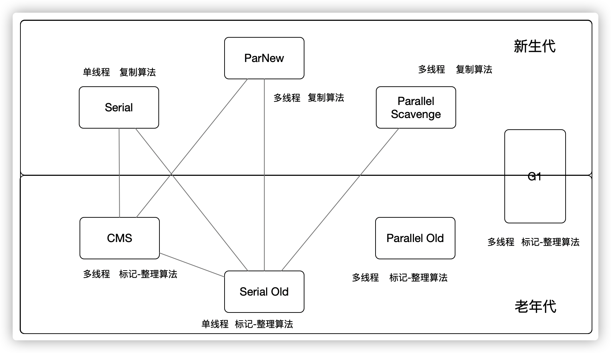

说收集器之前，先总结一下回收机制

## 一、回收机制

### 1、垃圾回收过程

`JVM `内存的程序计数器、虚拟机栈、本地方法栈的生命周期和线程是同步的，随着线程的销毁而自动释放内存，所以只有堆和方法区需要 `GC`，堆内分为 新生代、老年代，新生代又分为 `Eden`区、`Survivor`区，`Survivor`区又分为 `From`区 和 `To `区，默认占比为 `Eden`区：`From`区：To区 = `8：1：1`

一开始，对象会分配在 `Eden`区和`From`区，`To`区是空的，但当 `Eden `区没有足够内存分配时，`JVM `触发 ·，`Minor GC `时，`Eden `区存活的数据会被复制到 `Survivor To `区（存活对象是指在程序里还有用的数据，`Survivor `就是幸运的意思，存活即幸运很好理解），也不见得是所有数据都会到 `To `区，上一期讲过，如果符合"动态年龄判断"（15岁），或超过 `To `区的**50% 大小**（可配置），会直接到 老年代，这个时候， Eden 区和 `From`区已经被清空了，接下来 `From `和 `To `区交换角色，以保证下一次 `GC `开始前是空的。·一直重复这个过程，直到 `TO`区满，会将所有对象放到老年代，如果老年代不足了，就会触发 `Full GC`，再不够分配，系统抛出 `OOM `异常，终止运行！

### 2、对象是否存活

在确定这个数据是有用数据和垃圾时，就是判断对象是否存活，判断存活主要两个方法，**引用计数法**、可达性分析法。

1. 引用计数：每次引用+1，引用失效-1，到0时候，这个对象就不会再被引用了。
2. 可达分析：以 GC ROOT 为根，向下搜索，所到之处皆被引用，没被 GC ROOT 引用时，此对象不可用。

> GC ROOT 对象包括：虚拟机栈中引用对象，本地方法栈JVM引用对象，静态属性引用对象，常量引用对象

> 四种引用类型：
>
> 1. 强引用：GC不会回收
> 2. 软引用：回不回收看内存紧张不紧张
> 3. 弱引用：下一次就会被清掉了
> 4. 虚引用：任何时候都会被干掉

### 3、垃圾收集算法

1. 标记清除：标记出所有需要回收的对象，全部标完之后，把标记的全部干掉，干掉就会有空位。缺点就是很多不连续的空位，不能网吧五连坐！
2. 标记整理：标记处需要回收的对象，把存活的赶到一边，然后清理边界外的内存，也有缺点，如果存活对象多的话，挪的会很累
3. 复制算法：将内存分为两等分，只用其中一份，满了，就把存活的复制到另一份上，下一次就使用另一块。这样不用挪，但是内存少了一半。
4. 分代收集：根据年龄代特点，新生代`Eden`区给他干死，活够15岁的老不死，用复制算法挪到老年代，等 `Full GC`。

### 4、对象内存分配策略

1. 所有对象优先放到 `Eden `区，防止频繁 `Full GC`
2. 大对象直接进入老年代
3. 长期存活对象进入老年代，`Minor GC` 杀了15次没杀死，就进入老年代（**谁去记这15次呢？在对象 Head 头里，Head 头处理分代年龄还有锁标记**）
4. 动态年龄判断，对象占 Survivor区的一半以上，就直接去老年代
5. 空间分配担保，这样理解，提前预判要存放的位置是否足够 `Minor GC`，如果不够，直接` Full GC`

## 二、垃圾收集器

主要分为两个流派，老年代派和新生代排



### 1、Serial

新生代收集器，单线程、复制算法，在进行回收时，必须 `STW`，暂停所有用户线程，对于单个`CPU`来说，妥妥的 TOP1

### 2、ParNew

说白了 `Serial `的多线程版，对比 Serial 多核 `ParNew `厉害，单核还是 `Serial `厉害，可以通过 -XX:ParallelGCThreads 来限制收集器核数

### 3、Parallel Sacvenge

他比较特例，别人都是快点`GC`完，好早点结束 `STW`，他的目的是达到可控的吞吐量，吞吐量 = 程序运行时间 / (运行时间 +  收集时间)，高吞吐量可以有效的利用`CPU`时间（我很不能理解这一块....）总之他是认为控制吞吐量的收集器

> -XX:MaxGCPauseMilis：控制最大垃圾收集停顿时间 单位毫秒，参数>0
>
> -XX:GCTimeRatio：直接设置吞吐量，默认99，意思是系统运行100分钟，99分钟在工作，1分钟停止工作在收集，那就是99%

### 4、Serial Old

Serial 的老年版，主要是作为 `CMS `后备方案（`CMS `后面讲）

### 5、Paralled Old

Parallel Sacvenge 另类的老年版，JDK 1.6以后才能保证整体吞吐量。如果系统吞吐量有较高要求，可以考虑 Parallel Sacvenge 和 Paralled Old 一块用

### 6、CMS

Concurrent Mark Sweep，真正意义上的垃圾收集器，为了短时回收不惜暂停为目的的收集器。

收集过程4个步骤，两次给别人按暂停键

1. 初始标记，**停掉所有用户线程**，可达性分析找出所有对象
2. 并发标记，判断对象是否存存活
3. 重新标记，**又一次停掉别人线程**，开始标记垃圾
4. 并发清理，干掉！

`CMS` 收集器虽说是实现了并发收集以及停顿，但是 `CMS `还不够完美，比如说缺点：

1. 对资源敏感，会占用CPU资源，
2. 垃圾源源不断，有些在标记过程之后，这种叫浮动垃圾，只能等下一次`GC`处理
3. `CMS`基于标记清除，这样就会有大量不连续的碎片

### 7、G1

JDK 1.7 新生儿，相比较 `CMS`，标记-整理 不会有碎片，可以在不牺牲吞吐量的前提下，精确控制停顿时间，实现低停顿垃圾回收。

他为啥能这么做呢？来说说他的原理：

G1收集器不采用传统新生代、老生代物理隔离的方式，仅在逻辑上区分新生代和老年代，将整个堆内存划分为 2048 个大小相同的独立内存模块 `Region`，每个 `Region `是逻辑连续 一段内存，具体大小孔子啊在 1-32M 之间，且为2 的次幂（1、2、4、8、16、32）G1不再要求相同类型Region在物理内存相邻，只要`region` 动态的分配逻辑连续就ok

`G1 `通过跟踪 Region中垃圾堆积情况，每次设置垃圾回收时间，优先回收优先级高的地方，避免整个新生代或整个老年代回收。这样 `STW `更短、更可控。

## 三、如何选择垃圾收集器

这么多垃圾收集器怎么选呢

1. 如果你的堆大小不是很大，比如 100M，选择串行收集器效率最高 Serial

  ```sh
  -XX:UseSerialGC
  ```

2. 如果你的应用运行在单核机器，或者你的虚拟机只有单核，还是串行牛

    ```sh
    -XX:+UseSerialGC
    ```

3. 如果你的应用是“吞吐量”优先的，并且对较长时间的停顿没有特别要求

    ```sh
    -XX:+UseParallelGC
    ```

4. 如果你 的应用响应时间要求较高，要较少的暂停，甚至1秒就会引起大量失败，那选择 G1、ZGC、CMS 都合理，虽然他们通常比较短，但是他需要一些额外的资源去处理这些工作，吞吐量会低一点

    ```sh
    -XX:+UseG1GC
    ```

    
