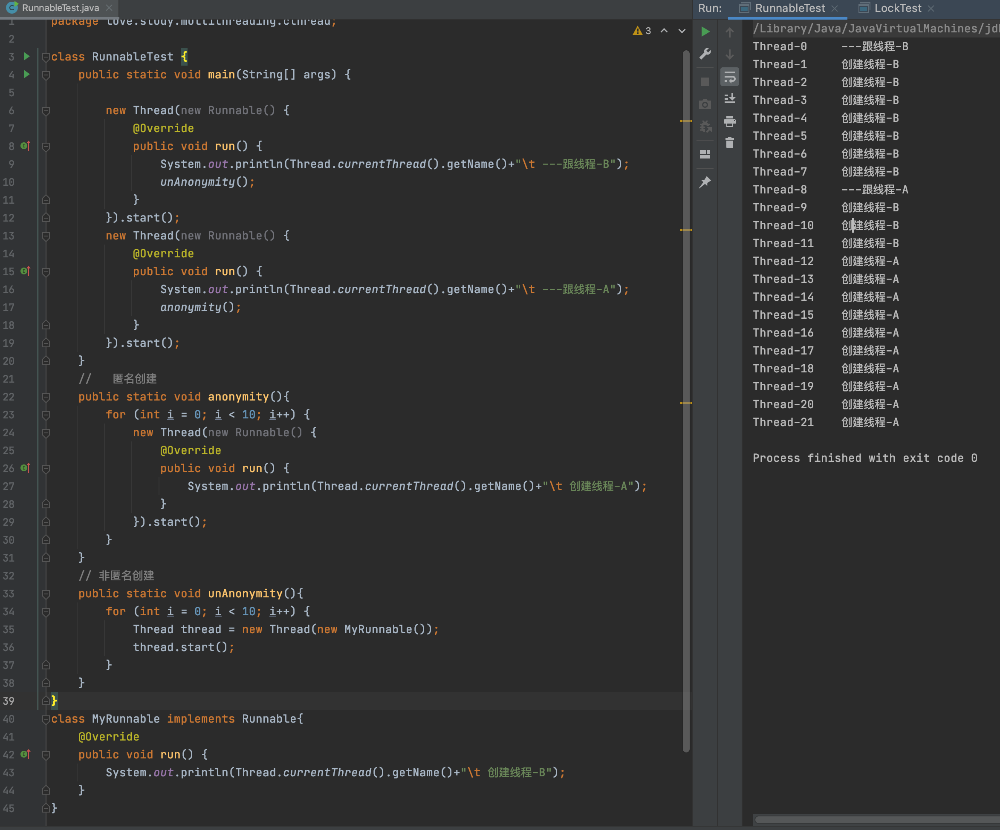

[toc]

## 1、什么是多线程

​		线程被称为轻量级进程，一个进程会有多个线程。但一个线程是程序执行过程中最小单位，每个程序至少一条线程

## 2、线程状态

1. 新建（new）创建后尚未启动线程
2. 运行（Runable）：包括Runing、Ready，处于这种情况的线程有可能正在执行，也有可能等待CPU为他分配资源
3. 等待（Wating）：这种状态的线程不会被分配CPU执行时间，等待分为无限期等待和有限期等待，处于无限期等待的线程需要被其他线程显示召唤，没有设置TimeOut参数的Object.wait（）、没有设置Timeout参数的 Thread.join（）方法都会进入无限期等待状态；有限期等待无须等待其他线程召唤，在一定时间由系统自动激活，Thread.sleep（），设置了TimeOut参数的Object.wai t（）
4. 阻塞（Blocked）：线程被阻塞，阻塞状态“在等待着获取到一个排他锁，这个时间将在另外一个线程放弃这个锁的时候发生；而”等待状态“则是在等待一段时间或者唤醒动作的发生。在程序等待进入同步区域的时候，线程将进入这种状态。
5. 结束（Terminated）：终止线程

## 3、线程同步方法

+ wait()：使线程处于一种等待状态，释放所持有的对象锁。

+ sleep()：使一个正在运行的线程处于睡眠状态，是一个静态方法，调用它时要捕获InterruptedException异常，不释放对象锁。

+ notify()：唤醒一个正在等待状态的线程。注意调用此方法时，并不能确切知道唤醒的是哪一个等待状态的线程，是由JVM来决定唤醒哪个线程，不是由线程优先级决定的。

+ notifyAll()：唤醒所有等待状态的线程，注意并不是给所有唤醒线程一个对象锁，而是让它们竞争。

## 4、创建线程的七种方法（重要）

### 4.1、继承Thread类

```java
class ThreadTest {

    public static void main(String[] args) {
        noAnonymity();
    }

  	//	匿名创建多线程
    public static void anonymity(){
        for (int i = 0; i < 10; i++) {
            new Thread(()->{
                System.out.println(Thread.currentThread().getName() + "\t 创建线程");
            }).start();
        }
    }
		// 非匿名创建多线程
    public static void noAnonymity(){
        for (int i = 0; i < 10; i++) {
            new MyThread().start();
        }
    }
}

class MyThread extends Thread{
    @Override
    public void run() {
        System.out.println(Thread.currentThread().getName() + "\t 创建线程");
    }
}
```

### 4.2、实现Runnable

```java
class RunnableTest {
    public static void main(String[] args) {
        anonymity();
    }

    //   匿名创建
    public static void anonymity(){
        for (int i = 0; i < 10; i++) {
            new Thread(new Runnable() {
                @Override
                public void run() {
                    System.out.println(Thread.currentThread().getName()+"\t 创建线程");
                }
            }).start();
        }
    }

    // 非匿名创建
    public static void unAnonymity(){
        for (int i = 0; i < 10; i++) {
            Thread thread = new Thread(new MyRunnable());
            thread.start();
        }
    }
}

class MyRunnable implements Runnable{
    @Override
    public void run() {
        System.out.println(Thread.currentThread().getName()+"\t 创建线程");
    }
}
```



### 4.3、实现Callable接口

```java
class CallableTest {
    public static void main(String[] args) throws ExecutionException, InterruptedException {
        for (int i = 0; i < 10; i++) {
            FutureTask<Integer> futureTask = new FutureTask<>(new MyCallableTest());
            new Thread(futureTask).start();
            System.out.println(futureTask.get());
        }
    }
}

class MyCallableTest implements Callable<Integer>{
    @Override
    public Integer call() throws Exception {
        System.out.println(Thread.currentThread().getName() +"\t 创建线程");
        return 1;
    }
}
```

### 4.4、创建线程池

```java
class ThreadPoolTest {
    public static void main(String[] args) {
        Anonymity();
    }

    // 匿名创建
    public static void Anonymity(){
        ExecutorService es = Executors.newFixedThreadPool(5);
        for (int i = 0; i < 10; i++) {
            es.execute(new Runnable() {
                @Override
                public void run() {
                    System.out.println(Thread.currentThread().getName() +"\t线程创建");
                }
            });
        }
    }

    // 非匿名创建
    public static void unAnonymity(){
        ExecutorService es = Executors.newFixedThreadPool(4);
        for (int i = 0; i < 10; i++) {
            ThreadPool tp = new ThreadPool();
            es.submit(tp);
        }
        // 关闭线程池  如果不关闭，则永远停滞在这里
        es.shutdown();
    }
}

class ThreadPool implements Runnable{
    @Override
    public void run() {
        System.out.println(Thread.currentThread().getName() +"\t线程创建");
    }
}
```

### 4.5、定时器

```java
public void schedule(TimerTask task, Date firstTime, long period){}
// task 任务
// firstTime 第一次执行的时间
// 时隔多少时间执行一次

public void schedule(TimerTask task, long delay, long period){}
// delay 执行次任务前，等待时常 如果为0 就是立即执行
```

```java
public class TimerTest {
    public static void main(String[] args) {
        Date date = new Date();
        SimpleDateFormat sdf = new SimpleDateFormat("yyyy-MM-dd hh:mm:ss");
        System.out.println("系统启动时间："+sdf.format(date));
        Calendar newTime = Calendar.getInstance();
        newTime.setTime(date);
        // 加5秒
        newTime.add(Calendar.SECOND,5);
        Date time = newTime.getTime();
        System.out.println("预计定时器启动时间"+sdf.format(time));

        Timer timer = new Timer();
        // 定时器
        timer.schedule(new TimerTask() {
            @Override
            public void run() {
                System.out.println("系统启动后5秒开始执行 , 每隔 2 秒 执行一次");
            }
        },time,2000);

        // 打印时间戳
        new Thread(()->{
            timer.schedule(new TimerTask() {
                @Override
                public void run() {
                    System.out.println("Thread-线程\t 打印时间戳:"+sdf.format(new Date()));
                }
            },0,1000);
        }).start();
    }
}
```

效果：


### 4.6、Lambda表达式实现

使用 jdk1.8 并行流形式

```java
public class LambdaTest {

    public static void main(String[] args) {
        List<Integer> list = Arrays.asList(1,2,3,4,5,6,7);
        list.parallelStream().forEach((s)->{
            System.out.println(Thread.currentThread().getName()+"\t线程获取到到值为：\t"+s);
        });
    }
}
```

```txt
main	线程获取到到值为：	5
ForkJoinPool.commonPool-worker-6	线程获取到到值为：	4
ForkJoinPool.commonPool-worker-9	线程获取到到值为：	2
ForkJoinPool.commonPool-worker-13	线程获取到到值为：	6
ForkJoinPool.commonPool-worker-4	线程获取到到值为：	3
ForkJoinPool.commonPool-worker-2	线程获取到到值为：	1
ForkJoinPool.commonPool-worker-11	线程获取到到值为：	7

Process finished with exit code 0
```

### 4.7、Spring实现多线程

#### 4.7.1、Maven工程导入Spring相关依赖

​		这里为直接引用 Spring-Boot 依赖，避免繁琐配置 

```xml
<dependencies>
   <dependency>
     <groupId>org.springframework.boot</groupId>
     <artifactId>spring-boot-starter</artifactId>
     <version>2.3.7.RELEASE</version>
  </dependency>
</dependencies>
```

#### 4.7.2、新建Java类，开启@EnableAsync注解 

开启配置，支持异步任务

```java
package love.study.multithreading.cthread;

import org.springframework.context.annotation.ComponentScan;
import org.springframework.context.annotation.Configuration;
import org.springframework.scheduling.annotation.EnableAsync;

@Configuration
@ComponentScan("love.study.multithreading.cthread")
@EnableAsync
public class SpringConfig {

}
```

### 4.7.3、方法类

书写异步执行的方法类(注意方法上需要有@Async——异步方法调用)

```java
package love.study.multithreading.cthread;

import org.springframework.scheduling.annotation.Async;
import org.springframework.stereotype.Service;

@Service
public class SpringAsyncService {

    @Async
    public void AsyncA(){
        System.out.println("A is Running");
    }

    @Async
    public void AsyncB(){
        System.out.println("B is Running");
    }
}
```

### 4.7.4、主方法类

```java
package love.study.multithreading.cthread;

import org.springframework.context.annotation.AnnotationConfigApplicationContext;

public class SpringThreadTest {
    public static void main(String[] args) {
        AnnotationConfigApplicationContext ac = new AnnotationConfigApplicationContext(SpringConfig.class);
        SpringAsyncService bean = ac.getBean(SpringAsyncService.class);
        bean.AsyncA();
        bean.AsyncB();
    }
}
```

运行结果：有时A在上面 有时B在上面 可知已开启多线程

```
B is Running
A is Running
```

> 本文创建于 2021年5月14日
> 
> 作者：[Xiang](https://blog.csdn.net/qq_39550368/article/details/116796190)
> 
> 参考文献；
> 
> [创建多线程的四种方法](https://www.cnblogs.com/zhou-test/p/9811771.html)
> 
>[创建线程的8种方法](https://blog.csdn.net/itcats_cn/article/details/81149232?utm_medium=distribute.pc_relevant_t0.none-task-blog-2%7Edefault%7EBlogCommendFromMachineLearnPai2%7Edefault-1.baidujs&depth_1-utm_source=distribute.pc_relevant_t0.none-task-blog-2%7Edefault%7EBlogCommendFromMachineLearnPai2%7Edefault-1.baidujs)
> 
>[创建匿名线程的5种方法](https://blog.csdn.net/qq_26106607/article/details/79142904)
>
> 特别鸣谢


><center><b><font color=blue >好了到这我们的分享也结束了😉</font></b></center>
>
><center><b><font color=blue >希望以上方法可以帮到您，祝您工作愉快！💖</font></b></center>
>
><center>👇</center>
><center><b><font color=pink >对您有帮助的话记点赞得收藏哦！👍</font></b></center>
><center><font color=blue>我是</font>       <font color=red>Xiang</font>     <font color=blue>从小白一步一步地变成工具人 😛</font></center>

