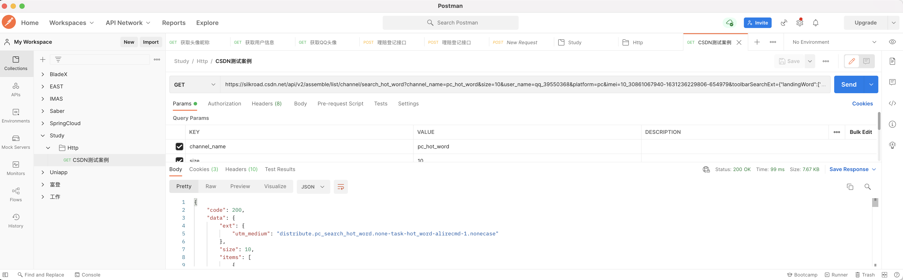

> 创建于 2021年12月3日
> 作者：想想
> 来源：https://blog.csdn.net/longshehe9319/article/details/80509829


[toc]

### 前言

​		随之互联网时代的发展，互联网API请求越来越多，微服务、SDK等，都需要通过Http请求等方式，获取所需数据，之前就是因为 它喵的，就是因为不会这个技术，导致很多问题没办法解决。今天专门来解决一下以下问题。

+ Java 原生等各类工具发送Http请求
+ 请求中夹带head请求头

## Java 发送Http请求

我们以 csdn 中的接口来作为测试请求

```
Method:GET
url:https://silkroad.csdn.net/api/v2/assemble/list/channel/search_hot_word?channel_name=pc_hot_word&size=10&user_name=qq_39550368&platform=pc&imei=10_30861067940-1631236229806-654979&toolbarSearchExt={"landingWord":["java执行字符串代码"],"queryWord":"","tag":["java"],"title":"Java如何实现执行字符串中包含的代码"}
```



测试所需环境： PostMan 工具、JDK 1.8

### 1、HttpURLConnection


