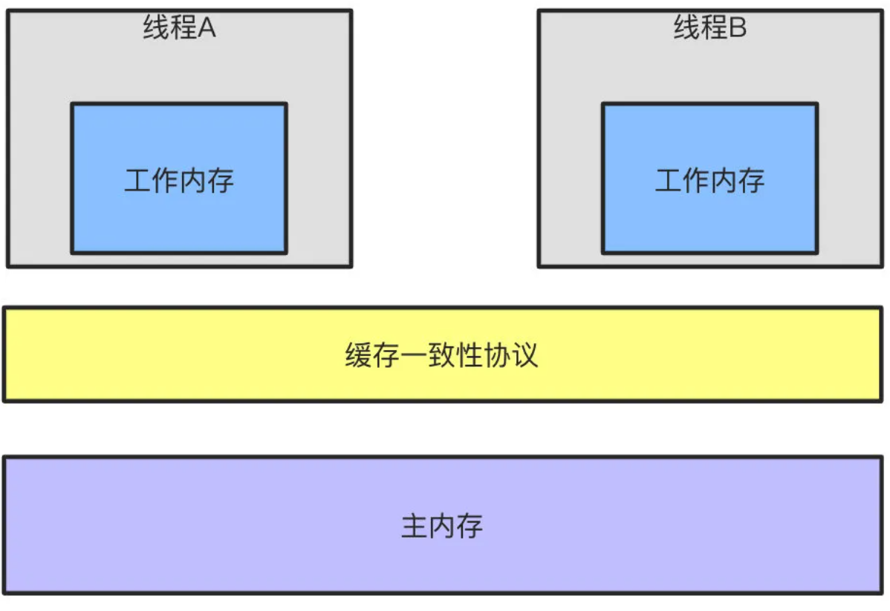

```http
https://mp.weixin.qq.com/s?__biz=MzAwNDA2OTM1Ng==&mid=2453147889&idx=2&sn=d6eae67898f3b0d378475f11730eef74&scene=21#wechat_redirect
```


[toc]


# 1、说说进程和线程的区别

​		进程是程序的一次执行，是系统进行资源分配和调度的独立单位，他的作用是是程序能够并发执行提高资源利用率和吞吐率。

​		由于进程是资源分配和调度的基本单位，因为进程的创建、销毁、切换产生大量的时间和空间的开销，进程的数量不能太多，而线程是比进程更小的能独立运行的基本单位，他是进程的一个实体，可以减少程序并发执行时的时间和空间开销，使得操作系统具有更好的并发性。

​		线程基本不拥有系统资源，只有一些运行时必不可少的资源，比如程序计数器、寄存器和栈，进程则占有堆、栈。

==优劣势：==

- 进程是资源分配的最小单位，线程是程序执行的最小单位。
- 进程有自己的独立地址空间，每启动一个进程，系统就会为它分配地址空间，建立数据表来维护代码段、堆栈段和数据段，这种操作非常昂贵。而线程是共享进程中的数据的，使用相同的地址空间，因此CPU切换一个线程的花费远比进程要小很多，同时创建一个线程的开销也比进程要小很多。
- 线程之间的通信更方便，同一进程下的线程共享全局变量、静态变量等数据，而进程之间的通信需要以通信的方式（IPC)进行。不过如何处理好同步与互斥是编写多线程程序的难点。
- 但是多进程程序更健壮，多线程程序只要有一个线程死掉，整个进程也死掉了，而一个进程死掉并不会对另外一个进程造成影响，因为进程有自己独立的地址空间。


# 2、知道synchronized原理吗？

```
// synchronized文章
http://www.360doc.com/content/20/0602/17/70282097_916085028.shtml
```

​		synchronized是java提供的原子性内置锁，这种内置的并且使用者看不到的锁也被称为==监视器锁==，使用synchronized之后，会在编译之后在同步的代码块前后加上monitorenter和monitorexit字节码指令，他依赖操作系统底层互斥锁实现。他的作用主要就是实现原子性操作和解决共享变量的内存可见性问题。

​		执行monitorenter指令时会尝试获取对象锁，如果对象没有被锁定或者已经获得了锁，锁的计数器+1。此时其他竞争锁的线程则会进入等待队列中。

​		执行monitorexit指令时则会把计数器-1，当计数器值为0时，则锁释放，处于等待队列中的线程再继续竞争锁。

​		synchronized是排它锁，当一个线程获得锁之后，其他线程必须等待该线程释放锁后才能获得锁，而且由于Java中的线程和操作系统原生线程是一一对应的，线程被阻塞或者唤醒时时会从用户态切换到内核态，这种转换非常消耗性能。

​		从内存语义来说，加锁的过程会清除工作内存中的共享变量，再从主内存读取，而释放锁的过程则是将工作内存中的共享变量写回主内存。


> *实际上大部分时候我认为说到monitorenter就行了，但是为了更清楚的描述，还是再具体一点*

如果再深入到源码来说，synchronized 实际上有两个队列。EntryList 和 WaitSet

1. 当多个线程进入同步代码块时，首先进入 EntryList
2. 有一个线程获取到 monitor 锁后，就赋值给当前线程，并且计数器+1
3. 如果线程调用wait方法，将释放锁，当前线程置为null，计数器-1，同时进入 waitSet等待唤醒，调用notify或者notifyAll之后有会进入 entryList 竞争锁
4. 如果线程执行完毕，同时释放锁，计数器-1，当前线程置为null


# 3、那锁的优化机制了解吗？

​		从JDK1.6版本之后，synchronized 本身也在不断优化的机制，有些情况下他并不会说一个很重量级的锁了，优化机制包括==适应锁、自旋锁、锁消除、锁粗化、轻量级锁、重量级锁==

​		锁的状态从低到高依次为**无锁->偏向锁->轻量级锁->重量级锁**，升级到过程就是从低到高，降级在一定条件下也有可能发生的。

## 3.1、自旋锁：

​		由于大部分时候，锁被占用很短时间，共享变量的锁定时间也很短，所以没必要挂起线程，用户态和内核态的来回上下文切换严重影响性能。自旋的概念就是让线程执行一个忙循环，可以理解为啥也不干，防止用户态转为内核态，自旋锁可以通过设置 `-XX:+UseSprining` 来开启，让自旋默认次数是10次，也可以使用 `-XX:PreBlockSpin` 来设置

## 3.2、自适应锁

自适应锁就是自适应的自旋锁，自旋的时间不是固定时间，而是又前一次在同一个锁上的自旋时间和锁的持有者状态来决定。

## 3.3、锁消除

消除锁指的锁JVM检测到一些同步代码块，完全不存在数据竞争场景，也就是不需要加锁，就会进行锁消除

## 3.4、锁粗化

锁粗化指的是有很多操作都是对同一个对象进行加锁，就回把锁同步范围扩展到整个序列之外。

## 3.5、偏向锁

当线程访问同步块获取锁时，会在对象头中包含一些锁的标志位，代码进入同步代码块的时候，JVM将会使用CAS 方式来尝试获取锁，如果更新成功则会把对象中的状态位标记为轻量级锁，如果更新失败，当前线程就尝试自旋来获取锁

整个锁升级的过程非常复杂

​		简单来说，偏向锁就是通过对象头的偏向线程ID来对比，甚至都不需要CAS了，而轻量级锁主要就锁通过CAS修改对象头锁记录和自旋来实现，重量级锁则是除了拥有锁的线程其他全部阻塞


# 4、对象头中具体包含哪些内容？

		1. 对象头
		2. 实例数据
		3. 对齐填充

而对象头包含两部分内容，Mark Word 中的尼尔会随着锁标志位而发生变化，所以只说存储结构好了

1. 对象自身运行时所需的数据，也被称为Mark Word，也就是用于轻量级锁和偏向锁的关键点。具体的内容包含对象hashcode、分代年龄、轻量级锁指针、重量级锁指针、GC标志、偏向锁线程ID、偏向锁时间戳
2. 存储类型指针，也就是指向类的元数据指针，通过这个指针才能确定对象是属于那个时代类的实例

如果是数组，则还会包含数组长度


# 5、对于加锁，那再说下ReentrantLock原理？

相对于 synchronized ，ReentrantLock 需要显式的获取锁和释放锁，相对现在基本都是用于JDK7和JDK8的版本，ReentrantLock的效率和synchronized区别基本可以持平了。

1. 等待可中断，当持有锁的线程长时间不释放锁的时候，等待中的线程可以选择放弃等待，转而处理其他的任务
2. 公平锁，synchronized 和 ReentrantLock 默认都是非公平锁，但是ReentrantLock 可以通过构造函数传参改变。只不过使用公平锁的话会导致性能急剧下降
3. 绑定多个条件：ReentrantLock 可以同时绑定多个 Condition 条件对象

ReentrantLock 基于AQS（QbstractQueueSynchronizer）抽象队列同步器实现。

AQS 内部维护了一个 state 状态位，尝试加锁的时候通过 CAS（CompareAndSwap）修改值，如果成功，设置为1，并且把当前线程ID赋值，则加锁成功，一旦获取到锁，其他的线程会被阻塞进入阻塞队列自旋，获得锁的线程释放锁的时候会将唤醒队列中的线程，释放锁的时候则会把state充值为0，同时当前线程ID置为空。


# 6、CAS的原理

CAS 叫做 CompareAndSwap ，比较并交换，主要是通过处理器的指令来保障操作的原子性，它包含三个操作数

1. 变量内存地址 V 表示
2. 旧的预期值 A 表示
3. 准备设置的新值 B 表示

当执行 CAS 指令时，只有当V等于A 的时候，才会用B去更新V的值，否则就不会执行更新操作


# 7、CAS有什么缺点

CAS 的三个缺点

## 7.1、ABA问题

ABA问题指的是值CAS更新的过程中，当读取到的值是A，然后准备赋值的时候仍然是A，但实际上有可能A的值被更新成了B，然后又被改回了A，这个CAS更新的漏洞就叫做ABA。只是ABA的问题大部分场景下不影响并发的最终效果。

Java 中有 AtomicStampedReference 来解决这个问哦，他加入了预期标志和更新后标志两个字段，更新时不光检查值，还要检查当前的标志是否等于预期标志，全部相等的话才会更新。

## 7.2、循环时间长开销大

 自旋CAS的方式如果长时间不成功，会给CPU带来很大的开销

## 7.3、只能保证一个共享变量的原子操作

只对一个共享变量操作可以保证原子性，但是多个则不行，多个可以通过AtomicReference来处理或者使用锁 synchronized 实现


# 8、HashMap的原理

HashMap主要由数组和链表组成，它不是线程安全的，核心的点就是put插入数据的过程，get查询数据以及扩容的方式，JDK1.7和1.8的主要区别在于头插法和尾插方的修改，头插容易导致HashMap链表死循环，并且1.8后加入红黑树对性能有提升。

## 8.1、put插入数据流程

往map插入元素的时候首先通过key hash然后与数组长度-1进行运算((n-1)&hash)，都是2的次幂所以等同于取模，但是位运算的效率要高，找到数组中的位置之后，如果数组中没有元素，直接存入，反之则判断key是否相同，key相同就覆盖，否则就回插入链表尾部，如果数组长度达到了64，且链表长度超过8，则会转换成红黑树，最后判断数组长度是否超过默认的负载因子，也就是12，超过，则进行扩容

## 8.2、查询数据

查询数据相对于就比较简单，首先计算hash的值，然后去数组查询，是红黑树就去红黑树茶，链表就遍历链表就可以了。

## 8.3、resize扩容过程

扩容的过程就是对key重新计算hash，然后把数据拷贝到新的数组中。


# 9、那多线程环境怎么使用Map呢？

多线程环境的考验使用Collections.synchornizedMap同步加锁的方式，还可以使用HashTable，但是同步的方式显然性能不达标，而ConurrentHashMap更适合高并发场景使用。

ConcurrentHashmap在JDK1.7 和 1.8的版本改动比较大，1.7使用Segment+HashEntry分段锁的方式实现，1.8则抛弃Segment，改为CAS+synchronized+Node方式实现，同样加入了红黑树，避免链表过长导致性能问题

## 9.1、JDK1.7分段锁

从结构上说，1.7版本上的ConcurrentHashMap 采用分段锁机制，里面包含了一个Segment 数组，Segment继承与 ReentrantLock，Segemnt则包含HashEntry的数组，HashEntry本身就是一个链表的结构，具有保存Key和Value的能力指向下一个节点的指针

实际上就相当于每个segment都是一个Hashmap，默认Segment长度是16，也就是支持16个线程的并发写，segment之间相互不受到影响

## 9.2、put流程

其实发现整个流程和HashMap非常想是，只不过是先定位到具体的 Segment，然后通过ReentrantLock去操作而已

1. 计算Hash，定位到segment，segment 如果是空就先去初始化
2. 使用 ReentrantLock加锁，如果获取失败则尝试自旋，自旋超过次数就回阻塞获取，保证一定取锁成功
3. 遍历HashEntry，就是HashMap一样，数组中key 和 value 一样就直接替换，不存在就在插入链表，


## 9.3、get流程

get也很简单，key通过hash定位到segment，再遍历链表定位到具体元素上，需要注意的是value 和 volatile 的，所以 get 是不需要加锁的，

## 9.4、1.8CAS+synchronized

1.8抛弃分段锁，转而用CAS+synchronized 来实现，同样HashEntry 改为 Node，也加入了红黑树实现，主要还是看put的流程

### 9.4.1、put流程

1. 先计算hash，遍历node数组，如果node为空的话，就通过 CAS+自旋的方式初始化
2. 如果当前数组位置上空则直接通过CAS自旋写入数据
3. 如果 hash == MOVED ，就说明要扩容，执行扩容
4. 如果都不满足，就使用 synchronized 写入数据，写入数据同样判断链表、红黑树、链表写入和 HashMap 方式一样，key hash 一样就覆盖，反之就尾插法，链表长度超过8，且数组长度到达64，就转为红黑树


### 9.4.2、get查询

get 很简单，通过key计算 hash，如果key hash相同就返回，如果是红黑树按照红黑树获取，如果不是就遍历链表计算


# 10、volatile 原理知道吗？

相比 synchronized 的加锁方式来解决共享变量的内存可见性问题，volatile就是轻量的选择，他没有上下文切换的额外开销成本，使用 volatile 声明变量，可以确保值被更新的生活对其他线程立即可见，volatile 使用内存屏障来保证不会发生指令重排，解决了内存可见性的问题

我们知道，线程都是从主线程内存中读取共享变量到工作内存来操作的，完成之后再把结果写回主内存，但是注意就回带来可见性问题，举个🌰，假设现在我们是两级缓存的双核CPU架构，包含L1、L2两级缓存

1. 线程A首先获取变量X的值，由于最初两级缓存都是空的，所以直接从主内存中读取X，假设X初始值为0，线程A读取之后把X值修改为1，同时写回主内存，这时候缓存和主内存的情况如下：


2. 线程B也同样读取变量X的值，由于L2缓存已经有缓存X=1，所以直接从L2缓存中读取，之后线程B把X修改为2，同时写回L2和主内存中。这时X的值如下：

   那么线程A如果再想获取变量X的值，因为L1缓存已经有X=1了，所以这个时候，变量内存不可见问题就产生了，B修改为2的值对A来说没有感知


那么，如果X变量用volatile修饰的话，当线程A再次读取到X的话，CPU就回根据缓存一致性协议，强制线程A重新从主内存中加载最新的值到自己的工作内存，而不是直接用缓存中的值。


再来说内存屏障的问题，volatile修饰之后会加入不同的内存屏障来保证可见性的问题能正常秩序。

这里写的屏障给予书中提供的内容，但是实际上由CPU机构不同，重排序的策略不同，提供到内存屏障也不一样，比如 x86平台上，只有 SotreLoad 一种内存屏障

1. StroeStore屏障，保证上面的普通写不和 volatile 发生重排序
2. StoreLoad屏障，保volatile写与后面可能的volatile读写不发生重排序
3. LoadLoad屏障，禁止 volatile 读和后面的普通重读顺序
4. LoadStore屏障，禁止 volatile 读和后面的普通写重顺序


# 11、JMM内存模型的理解，为什么需要JMM

​		本身随着CPU的内存发展速度差异，导致CPU的速度远快于内存，所以现在CPU加入了高速缓存，高速缓存一般可以分为L1、L2、L3三级缓存，基于上面的例子我们知道了这导致了缓存一致性的问题，所以加入了缓存一致性协议，同时导致了内存可见性的问题，而编译器和CPU的重排序导致了原子性和有序性的问题，JMM 内存模型正是对多线程操作下的一系列规范约束，因为不可能让代码兼容所有的CPU，通过 JMM 我们才屏蔽了不同硬件和操作系统的访问差异，这样保证了Java程序中不同的平台下达到内存访问一致的效果，同时也保证中高并发的时候能正确执行



原子性：Java内存模型通过 read、load、assign、use、store、write来保证原子性操作，此外还有lock 和 unlock，直接对应 synchronized 关键字的。monitorenter 和 monitorexit 字节码指令。

可见性：可见性的问题上面已经说过了，Java保证可见性可以认为通过 volatile、synchronized、final 来实现

有序性：由于处理器和编译器的重排导致有序性的问题，java通过 volatile、synchronized 来保证

haapen-before规则：

​	虽然指令重排提高了并发的性能，但是java虚拟机会对指令规则作出一些规则限制，并不能让所有的指令都能随意改变执行位置

1. 单线程每个操作，happen-before 于该线程中任意后续操作
2. volatile 写 happen-before 与后续对这个变量的读
3. synchronized 解锁 happen-before后续对这个锁的加锁
4. final 变量的写 happen-before于final域对象读写，happen-before 后续对final变量的读
5. 传递性规则，A先于B，B先于C，那么A一定先于C发生


# 12、工作内存和主内存是什么

​		主内存可以认为就是物理内存，java内存模型中实际就是虚拟机内存的一部分。而工作内存就是CPU缓存，他有可能是寄存器也有可能是L1/L2/L3缓存，都可能是


# 13、ThreadLocal 原理

TrheadLocal 可以理解为线程本地变量，他会中每个多线程创建一个副本，那么在线程之间访问内部变量即可，做到了线程之间互相隔离，相比于 synchronized 的做法是空间来换时间

ThreadLocal有一个静态内部类 ThreadLocalMap ，ThreadLocalMap又包含一个Entry数组，Entry 本身就是一个弱引用，他的key是指ThradLocal 的弱引用，Entry具备了保存key 和 value 键值对的能力。弱引用的目的就是防止内存泄漏，如果是强引用那么ThradLocal 对象除非线程结束否则始终无法被收回，弱引用则会在下一次GC的时候回收

但是这样还是会存在内存泄漏的问题，如果key和ThradLocal对象被回收之后，entry中就回存在key为null，但是value有值的entry对象，但是永远没有办法访问到，同样除非线程运行结束，

但只要ThreadlLoca使用恰当，在使用之后调用 remove方法删除 Entry对象，实际上上不会出现这个问题的


# 14、引用类型有哪些，有什么区别

引用类型主要分为强软弱虚四种：

1. 强引用的就是代码中普遍存在的赋值方式，比如 A a = new A() 这样的方式，强引用关联对象，永远不会被GC回收
2. 软引用可以用 SoftReference 来描述，指的是哪些有用但是  不是必须要的对象，系统在发生内存溢出钱会对这类引用对象进行回收
3. 弱引用可以用 WeakReference 来描述，他的强度比弱引用更低一些，弱引用的对象下一次GC的时候一定会被回收，而不管内存是否足够
4. 虚引用也被称为幻影引用，是最弱的引用关系，用 PhantomReference 来描述，他必须和 ReferenceQueue 一起使用，同样当发生GC时候，虚引用也会被回收，可以用虚引用来管理堆外内存


# 15、线程池原理？

首先线程池有几个核心的参数概念：

1. 最大线程数。maximumPoolSize
2. 核心线程数  corePoolSize
3. 活跃时间  keepAliveTime
4. 阻塞队列  wokeQueue
5. 拒绝策略 RejectedExecutionHandler

当提交一个新任务到线程池时，具体执行流程如下：

1. 当我们提交新任务，线程池会根据 corePoolSize 大小创建若干任务数量线程执行任务
2. 当任务到数量超过 corePoolSize 数量，后续的任务会进入阻塞队列阻塞排队
3. 当阻塞队列也满了之后，那么将继续创建（maximumPoolSize-corePoolSize）个数量的线程来执行任务，如果任务处理完成，maximumPoolSize-corePoolSize 额外创建的线程等待 keepAliveTime 之后被自动销毁
4. 如果达到 maximumPoolSize 阻塞队列还是满的状态，那么将根据不同的拒绝策略对应处理


# 16、拒绝策略有哪些？

主要有4种拒绝策略：

1. AbortPolicy：直接丢弃任务，抛出异常，这是默认策略
2. CallerRunsPolicy：只用调用者所在的线程来处理任务
3. DiscardOldestPolicy：丢弃等待队列中最旧的任务，并执行当前任务
4. DiscardPolicy：直接丢弃任务，也不抛出异常