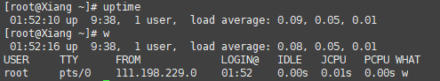

[toc]

# 1、CPU负载和CPU利用率的区别是什么

> 首先，我们可以通过 uptime ，w 或者 top 命令来看到 cpu 的平均负载



load average ：负载的3个数字，比如上图的 0.09 、0.05、0.01 分别代表系统在过去的1分钟 、5分钟、15分钟内的系统平均负载，他代表的是当前系统正在运行和处于等待进行的进程数之和，也指的是处于可运行状态和不可中断状态的平均进程数。

​	如果是单核Cpu的话，负载达到1就代表 CPU 已经达到了满负荷的状态，超过1后，后面的进行就要排队等待处理了，如果是多核多CPU的话，假设现在的服务器是2个CPU 每个 CPU 有2个线程，那么总负载不超过4都没有问题。

> 查看 CPU 情况
>
> ```sh
> [root@Xiang ~]# cat /proc/cpuinfo | grep "model name"
> model name	: AMD EPYC 7K62 48-Core Processor
> ```

> 查看 CPU 核数
>
> ```sh
> [root@Xiang ~]# cat /proc/cpuinfo | grep "cpu cores"
> cpu cores	: 1
> ```

​	CPU 利用率：和负载不同，CPU 利用率指的是当前正在运行的进程实时用 CPU 的百分比，他是对一段时间内 CPU 使用状态的统计

我举个 栗子

假设那么公司厕所有1个坑位，有一个占了一个坑位，这时负载就是1，如果还有一个人在排队，那么负载就是2了，如果1小时内，A上厕所花了10分钟，B上厕所花了20分钟，剩下30分钟厕所都没人用，那么这1个小时利用率就是50%


# 2、如果CPU负载很高，利用率很低怎么办

CPU负载很高，利用率很低，说明处于等待状态的任务很多，负载越高，代表可能很多僵死的进程，通常这种情况是IO密集型任务，大量请求在请求相同的IO，导致任务队列堆积

同样，可以通过 top 命令观察，假设发现现在确实是高负载低使用率

```shtotal,   3 running,  87 sleeping,   0 stopped,   0 zombie
%Cpu(s):  1.3 us,  0.3 sy,  0.0 ni, 98.3 id,  0.0 wa,  0.0 hi,  0.0 si,  0.0 st
MiB Mem :   1827.0 total,    135.0 free,    165.2 used,   1526.8 buff/cache
MiB Swap:   1025.0 total,    935.2 free,     89.8 used.   1477.2 avail Mem 
    PID USER      PR  NI    VIRT    RES    SHR S  %CPU  %MEM     TIME+ COMMAND                                                             
   1509 root      20   0  428916  10888   1656 S   0.3   0.6   1:03.90 barad_agent                                                         
      1 root      20   0  179520   5980   3788 S   0.0   0.3   0:03.65 systemd   
      2 root      20   0       0      0      0 S   0.0   0.0   0:00.00 kthreadd 
      3 root       0 -20       0      0      0 I   0.0   0.0   0:00.00 rcu_gp   
      4 root       0 -20       0      0      0 I   0.0   0.0   0:00.00 rcu_par_gp 
      6 root       0 -20       0      0      0 I   0.0   0.0   0:00.00 kworker/0:0H-kblockd  
      8 root       0 -20       0      0      0 I   0.0   0.0   0:00.00 mm_percpu_wq         
      9 root      20   0       0      0      0 S   0.0   0.0   0:02.33 ksoftirqd/0       
     10 root      20   0       0      0      0 R   0.0   0.0   0:01.55 rcu_sched       
     11 root      rt   0       0      0      0 S   0.0   0.0   0:00.00 migration/0     
     12 root      rt   0       0      0      0 S   0.0   0.0   0:00.01 watchdog/0      
     13 root      20   0       0      0      0 S   0.0   0.0   0:00.00 cpuhp/0       
     15 root      20   0       0      0      0 S   0.0   0.0   0:00.00 kdevtmpfs    
     16 root       0 -20       0      0      0 I   0.0   0.0   0:00.00 netns      
```

然后再通过 ps -axjf 查看是否存在状态为 D+ 状态的进程，这个状态指的是不可中断的睡眠状态进程，处于这个状态的进程无法终止。也无法退出，只能通过回复其他依赖的资源或者重启系统来解决。

```sh
[root@Xiang ~]# ps -axjf
   PPID     PID    PGID     SID TTY        TPGID STAT   UID   TIME COMMAND
      0       2       0       0 ?             -1 S        0   0:00 [kthreadd]
      2       3       0       0 ?             -1 I<       0   0:00  \_ [rcu_gp]
      2       4       0       0 ?             -1 I<       0   0:00  \_ [rcu_par_gp]
      2       6       0       0 ?             -1 I<       0   0:00  \_ [kworker/0:0H-kblockd]
      2       8       0       0 ?             -1 I<       0   0:00  \_ [mm_percpu_wq]
      2       9       0       0 ?             -1 S        0   0:02  \_ [ksoftirqd/0]
```


# 3、如果负载很低，利用率很高呢？

如果你的公司只有一个人上厕所，外面人没排队，却有一个人在里面上大半个小时，这说明什么？

两种可能，他没带纸，或者一些奇怪的事情发生了

这表示CPU 的任务并不多，但是任务执行的时间太长了，大概率是你的代码本身有问题，通常是计算密集型任务，生成了大量耗时短的计算任务

直接 top 命令找到使用率最高的任务，定位到去看看就行了，如果代码本身没问题，那么过段时间 cpu 使用率就会下降


# 4、那如果CPU使用率达到100%呢?怎么排查

1. 通过 top 找到占用率搞的进程
2. 通过 `top -Hp pid` 找到占用 cpu 高的线程ID , 这里找到了这个 985
3. 再把线程转换为 16 进制， `printf "0x%x\n" 985 `   得到线程 0x3be
4. 通过 jstack 163 | grep '0x3be' -C5 --clor 或者 jstack 163|vim +/0x3be - 找到有问题的代码即可


# 5、常见的Linux命令

+ ls 用户查看目录下的文件，
  + -a 可以用来查看隐藏文件
  + -l 可以用于查看文件的信息，包括权限、大小、所有者等信息
+ touch：用于创建文件，如果文件不存在，则创建一个新的 文件，如果文件已存在，则会修改文件等时间戳。
+ cat：cat的英文是 concatenate 的缩写，用于查看文件内容，使用 cat 查看文件的话，不管文件的内容有多少，都会一次性显示，所以不适合查看太大的文件。
+ more：more 和 cat 的区别，more用于分屏显示文件内容， 可以用 `空格键`  向下翻页，`b` 向下翻页
+ less：和 more 类型，less 用于分行显示
+ tail：可能是平时用的最多的命令了，查看日志文件基本都靠它了，一般用户 tail -fn 100  xx.log. 查看最后100行内容

## 常用权限命令

+ chmod 修改权限命令。一般用 + 号添加权限，- 号删除权限，	
  + x 代表执行权限
  + r 代表可读权限
  + w 代表写入权限
  + 常见写法比如 chmod +x 文件名 添加执行权限
+ 还有另外一种写法，就是用数字授权，因为 r = 4 ，w = 2 ， x = 1，平时执行命令 chmod 777 文件名，这样就是最高权限
  + 第一个数字 7 = 4+2+1 代表所有者的最高权限，第二个数字7 代表所属组的权限，第三个数字代表其他人的权限
  + 常见的权限数字还有 644，所有者的读写权限，其他人只有读权限，755 代表其他人只有只读和执行权限
+ chown：用于修改文件和目录的所有者和所属组，一般用法 chown user 文件 用于修改文件所有者，chown user：user 文件，修改文件所有者和组，冒号前面是者，后面是组
+ zip ：压缩zip文件命令 比如 zip test.zip 文件，可以把文件压缩成 zip 文件，如果压缩目录的添加 -r 参数
+ unzip ：与zip 对应，解压 zip 文件命令。unzip xxx.zip 直接解压，还可以通过 -d 选项解压到指定目录

`gzip`：用于压缩.gz后缀文件，gzip命令不能打包目录。需要注意的是直接使用`gzip 文件名`源文件会消失，如果要保留源文件，可以使用`gzip -c 文件名 > xx.gz`，解压缩直接使用`gzip -d xx.gz

`tar`：tar常用几个选项，`-x`解打包，`-c`打包，`-f`指定压缩包文件名，`-v`显示打包文件过程，一般常用`tar -cvf xx.tar 文件`来打包，解压则使用`tar -xvf xx.tar`。

Linux的打包和压缩是分开的操作，如果要打包并且压缩的话，按照前面的做法必须先用tar打包，然后再用gzip压缩。当然，还有更好的做法就是`-z`命令，打包并且压缩。

使用命令`tar -zcvf xx.tar.gz 文件`来打包压缩，使用命令`tar -zxvf xx.tar.gz`来解压缩