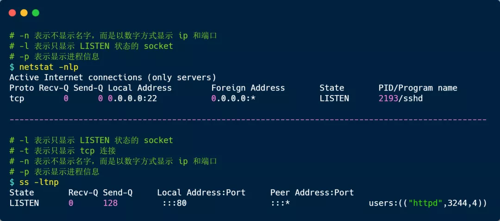

> 创建时间：2021年4月26日

[toc]

## 1、性能指标有哪些

+ 带宽，标识链路的最大传输速率，单位是 b/s (比特/秒)，带宽越大，其传输能力越强
+ 延时，表示请求数据包发送后，收到相应，所需要的时间延迟。不同的场景有不同的含义，比如可表示建立TCP连接所需的时间延迟，或一个数据包往返所需的时间延迟
+ 吞吐量：表示单位时间内成功传输的数据量，单位是 b/s（比特 / 秒）或者 B/s（字节 / 秒），吞吐受带宽限制，带宽越大，吞吐率的上限才可能越高。
+ PPS：全称 Packet Per Second（包/秒）表示以网络包为单位的传输速率，一般用来评估系统对于网络的转发能力。


当然，除了以上这四种基本的指标，还有一些其他常用的性能指标，比如：

- *网络的可用性*，表示网络能否正常通信；
- *并发连接数*，表示 TCP 连接数量；
- *丢包率*，表示所丢失数据包数量占所发送数据组的比率；
- *重传率*，表示重传网络包的比例；

## 2、查看网络配置

> ```sh
> ifconfig / ip 
> 查看网络配置和状态
> ```
>
> Ifconfig 属于 net-tools 软件包，ip 属于 iproute2 软件包，前者没人维护了，建议使用后则 IP


```sh
[xiang@Xiang ~]$ ifconfig eth0
eth0: flags=4163<UP,BROADCAST,RUNNING,MULTICAST>  mtu 1500
        inet 10.0.8.3  netmask 255.255.252.0  broadcast 10.0.11.255
        inet6 fe80::5054:ff:fe66:e22d  prefixlen 64  scopeid 0x20<link>
        ether 52:54:00:66:e2:2d  txqueuelen 1000  (Ethernet)
        RX packets 9515653  bytes 2654085180 (2.4 GiB) # 接收
        RX errors 0  dropped 0  overruns 0  frame 0
        TX packets 10307740  bytes 5013081540 (4.6 GiB) # 发送
        TX errors 0  dropped 0 overruns 0  carrier 0  collisions 0
[xiang@Xiang ~]$ ip -s addr show dev eth0
2: eth0: <BROADCAST,MULTICAST,UP,LOWER_UP> mtu 1500 qdisc fq_codel state UP group default qlen 1000
    link/ether 52:54:00:66:e2:2d brd ff:ff:ff:ff:ff:ff
    inet 10.0.8.3/22 brd 10.0.11.255 scope global noprefixroute eth0
       valid_lft forever preferred_lft forever
    inet6 fe80::5054:ff:fe66:e22d/64 scope link 
       valid_lft forever preferred_lft forever
    RX: bytes  packets  errors  dropped overrun mcast   
    2654115724 9515972  0       0       0       0       
    TX: bytes  packets  errors  dropped carrier collsns 
    5013127525 10308027 0       0       0       0     
```

第一：使用 ifconfig 命令，可以看到 `RUNNING` 或者 ip 命令可以看到 `LOWER_UP` 🙈看不见说明网口没有接网线


第二：MTU大小，默认是 1500 字节，其主要作用是限制网络包大小，如果IP层又一个数据要传，而且数据帧的长度比链路层的MTU还要大，那么IP层就需要把他切片，即把数据切成若干片，这样每一片都小于MTU ，实际上，每个网络都链路层 MTU 可能会不一样，所以你需要调动MTU的数值

第三：网口的 IP 地址、子网掩码、MAC 地址、网关地址。这些信息必须要配置正确，网络功能才能正常工作。

网路包收发的统计信息。通常有网络收发的字节数、包数、错误数以及丢包情况的信息，如果 `TX`（发送） 和 `RX`（接收） 部分中 errors、dropped、overruns、carrier 以及 collisions 等指标不为 0 时，则说明网络发送或者接收出问题了，这些出错统计信息的指标意义如下：

+ *errors* 表示发生错误的数据包数，比如校验错误、帧同步错误等；
+ *dropped* 表示丢弃的数据包数，即数据包已经收到了 Ring Buffer（这个缓冲区是在内核内存中，更具体一点是在网卡驱动程序里），但因为系统内存不足等原因而发生的丢包；
+ *overruns* 表示超限数据包数，即网络接收/发送速度过快，导致 Ring Buffer 中的数据包来不及处理，而导致的丢包，因为过多的数据包挤压在 Ring Buffer，这样 Ring Buffer 很容易就溢出了；
+ *carrier* 表示发生 carrirer 错误的数据包数，比如双工模式不匹配、物理电缆出现问题等；
+ *collisions* 表示冲突、碰撞数据包数；


### 3、socket信息如何查询

我们可以使用 `netstat` 或者 `ss`，这两个命令查看 socket、网络协议栈、网口以及路由表的信息。

虽然 `netstat` 与 `ss` 命令查看的信息都差不多，但是如果在生产环境中要查看这类信息的时候，尽量不要使用 `netstat` 命令，因为它的性能不好，在系统比较繁忙的情况下，如果频繁使用 `netstat` 命令则会对性能的开销雪上加霜，所以更推荐你使用性能更好的 `ss` 命令。



可以发现，输出的内容都差不多， 比如都包含了 socket 的状态（*State*）、接收队列（*Recv-Q*）、发送队列（*Send-Q*）、本地地址（*Local Address*）、远端地址（*Foreign Address*）、进程 PID 和进程名称（*PID/Program name*）等。

接收队列（*Recv-Q*）和发送队列（*Send-Q*）比较特殊，在不同的 socket 状态。它们表示的含义是不同的。

当 socket 状态处于 `Established`时：

- *Recv-Q* 表示 socket 缓冲区中还没有被应用程序读取的字节数；
- *Send-Q* 表示 socket 缓冲区中还没有被远端主机确认的字节数；

而当 socket 状态处于 `Listen` 时：

- *Recv-Q* 表示全连接队列的长度；
- *Send-Q* 表示全连接队列的最大长度；