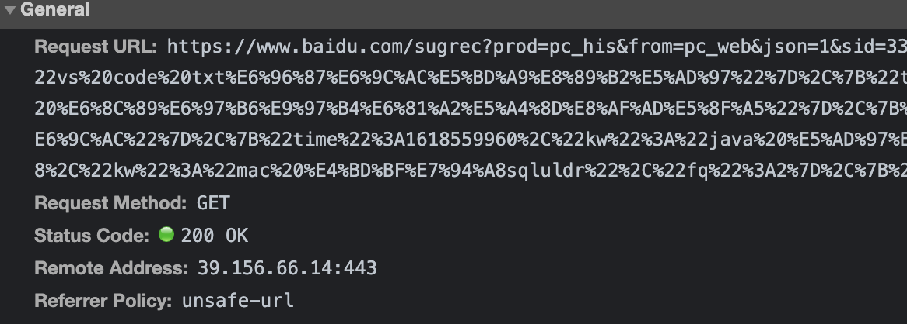

> 创建于 2021年4月26日

[toc]

# HTTP

> HTTP 是超文本传输协议，HTTP是缩写，全称是 HyperText Transfer Protocol

超文本指的是 HTML、css、JavaScript和图片等，HTTP的出现就是为方便接收和发布超HTML页面，经过不断的发展，也可以用于发布接收一些音频、文件等。

HTTP 协议是用于客户端和服务端之间的通信，除此之外还有 TCP/IP 协议族在内的众多协议，请求文本资源的一方，我们称之为客户端（client），接收请求并提供相应的一方称为服务端（Server）

有时候，客户端和服务端身份是可以互换的，单就一条通信线路来讲，可以确定的是，由HTTP协议就可以区分谁是客户端谁是服务端


HTTP 的特点：

+ 支持客户端、服务端模式，简单快速，http 允许任意传输类型的数据对象，无连接，限制每次连接处理一个请求，无状态，指明协议对事物处理没有标记的能力。
+ 灵活：允许任何数据对象，音频、视频、图片、文件等...
+ 无状态：任何两个请求之间没有必然的联系
+ 无连接：每次服务器在处理完请求后，就断开连接了，再请求就是新的连接，采用这种方式节省传输时间

==HTTP1.0版的主要缺点==

每个TCP 连接智能发送一个请求，发送数据完毕后，连接就关闭了，HTTP 是一种不保存状态，无状态协议，协议对于发送过来的请求或是响应都不做持久化处理

HTTP1.1虽然是无状态协议，但是为了实现期望的保存状态功能，于是引入了 Cookie技术，有了 Cookie，HTTP 协议通信，就可以管理状态了。


TCP 连接的新建成本很高，因为客户端需要和服务端 三次握手

==交流端简单流程==：客户端发起连接，客户端发起请求，服务端响应请求，服务端关闭链接

## HTTP的消息结构

请求消息的结构：

一个请求消息是由 `请求行，请求头字段，一个空行和消息主体` 构成

消息主体是响应消息的承载数据

客户端：发送请求

```txt
GET/HTTP/1.1
Host: xiangi.love
```

服务器：发送响应

```txt
HTTP/1.1 200 OK
Date: Tue, 10 Jul ...
Content.Length: 362
Content.Type: text/html
<html>
...
```


Request Method：请求方法
Request URL：请求URL 的路径
Status Code 为状态码
Remote Address：地址

HTTP 是基于 TCP/IP 协议的应用层协议，不涉及数据包传输，规定了客户端和服务端之间的通讯方式，默认使用80端口

HTTP 发送请求例子：



服务器回应消息格式：


响应头：

Server 为服务器的名称，Location 为通知客户端新的资源位置，Content-Type 为数据类型，

```sh
# Content-Type 字段类型
text/plain
text/html
text/css
image/jpeg
image/png
image/svg+xml
audio/mp4
video/mp4
application/javascript
application/pdf
application/zip
application/atom+xml
```


## HTTP 常用请求方法

常见的是 GET、POST 除此之外还有...

```sh
1.GET为获取资源数据
get方法用于请求指定的页面信息，并返回请求消息的主体

2.POST为提交资源数据
post方法用于向指定的资源提交数据

3.PUT为更新资源数据
4.DELETE为删除资源数据
5.HEAD为读取资源的元数据
6.OPTIONS为读取资源多支持的所有请求方法
7.TRACE为回显服务器收到额请求
8.CONNECT为保留将来使用
```

HTTP 1.0 只有 GET、POST、HEAD 三种请求方式，其他的都是 1.1 新增的 其中包括（OPTOPNS、PUT、DELETE、TARCE、CONNECT）

## HTTP 状态码

200 成功！

500 出bug了

404 没有找到资源

302 临时跳转，非永久性，以闪电五连鞭之势就完成了跳转

301 永久性重定向，


HTTP/2 版本主要增加以下几点：

- 是二进制协议，不再是纯文本。
- 支持一个 TCP 连接发起多请求，移除了 pipeline。
- 利用 HPACK 压缩头部，减少数据传输量。
- 允许服务端主动推送数据。


[领略HTTP前世今生](https://mp.weixin.qq.com/s?__biz=MzAwNDA2OTM1Ng==&mid=2453147612&idx=2&sn=2420e569704a398362fe5ee3716c37dc&scene=21#wechat_redirect)