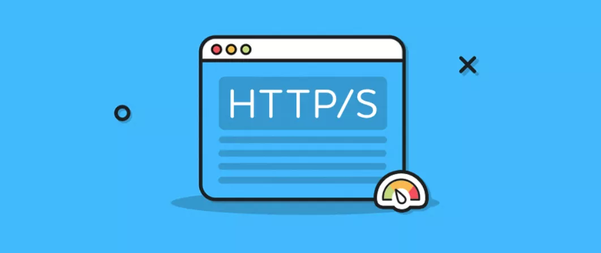
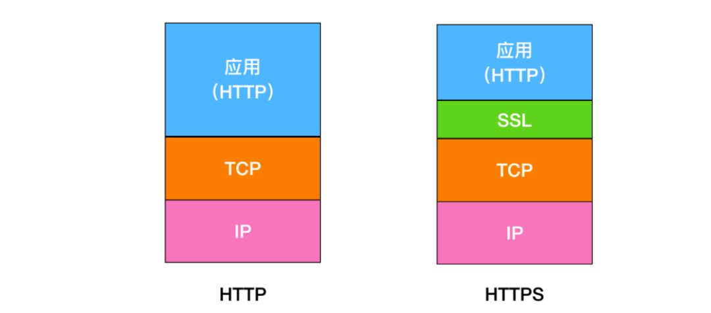
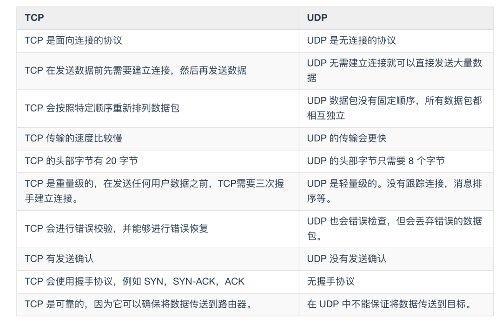
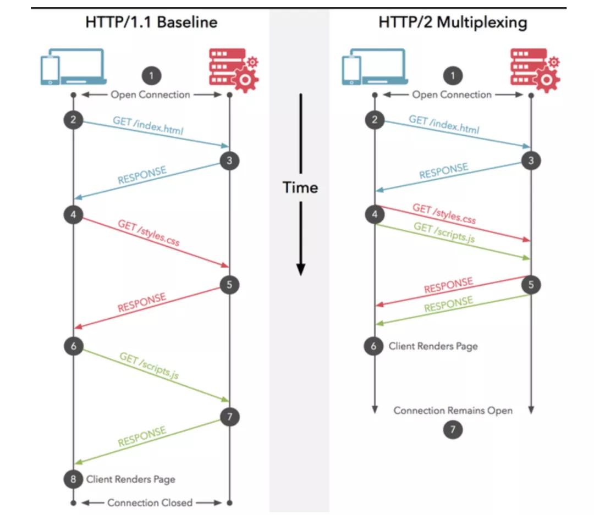
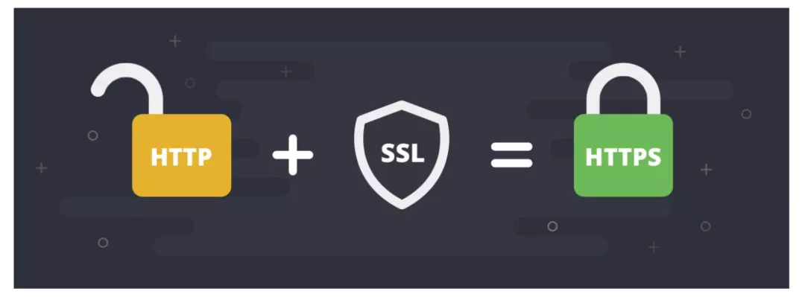
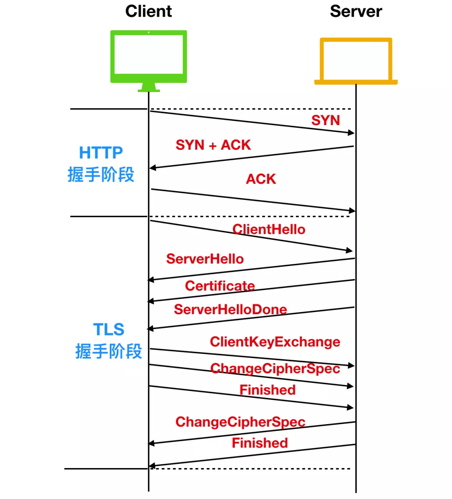

> 创建于 2021年4月27日

[toc]

# HTTP




## 1、HTTP 和 HTTPS 的区别

HTTP 就是披了一身 SSL 的 HTTP



最主要的区别是：

1. 最简单的，HTTP 在地址栏上的协议是 http:// 开头，而 HTTPS 在地址栏上的协议是 https:// 开头
2. HTTP 是未经过安全加密的协议，它的传输过程中容器被攻击者监听、数据容器呗窃取、发送方和接收方容易被伪造；而HTTPS 是安全协议，它通过 密钥交换算法- 签名算法 - 对称加密算法 - 摘要算法 能解决上面这些问题
3. HTTP 默认端口是 80，HTTPS 的默认端口是 443

## 2、GET 和 POST 的区别

HTTP 中最常用的就是 GET 和 POST 这两种方法

+ 发送方式

  + GET 方法一般用于请求，他的特征就是请求服务器资源，类似于 pull 拉的操作
  + POST 方法一般用于提交表单信息，类似 push 推的操作

+ 链接内容

  + GET 方法是不安全的，他的请求参数回拼在 URL 后，容易被攻击之切去

    ```http
    /test/demo_form.asp?name1=value1&name2=value2
    ```

  + POST 方法是把请求放在 body 体中，对用户来说不可见

    ```http
    POST /test/demo_form.asp HTTP/1.1
    Host: w3schools.com
    name1=value1&name2=value2
    ```

+ 长度限制

  + 因为URL 有长度限制，所以 GET 肯定也是有限制的
  + POST 把参数放在消息体中，对深度和长度都没有要求

+ 回退/前进操作

  + GET 请求在浏览器反复的前进后退是无害的
  + POST 操作，每次会提交表单

+ 被浏览器主动 cache

  + GET 请求会被浏览器主动 cache
  + POST 不会，但可以手动设置

+ 请求方式

  + get 请求在发送过程中会产生一个 TCP 数据包。对于 get 方式的请求，浏览器会把 http header 和 data 一并发送出去，服务器响应 200（返回数据）；
  + post 在发送过程中会产生两个 TCP 数据包。而对于 post，浏览器先发送 header，服务器响应 100 continue，浏览器再发送 data，服务器响应 200 ok（返回数据）。

## 3、无状态协议

> 什么是无状态协议，HTTP 是状态协议吗？怎么解决

无状态协议（Stateless Protocol）指的是浏览器对于事物的处理没有记忆能力，每一次请求都是独立的一个请求，中间没有必然联系，在HTTP 由1.0 升级至 1.1 后，HTTP 除了新增的  六种请求方式外，新增了 Cookie 机制，客户端第一次向服务端发起请求时，服务端回应时会带回来一个小饼干，有了小饼干的标识，服务端可以从容的认识哪些请求是故人，哪些请求是新秀。

谷歌浏览器：<span style="color:red">chrome://settings/content/cookies</span>

<span style="color:blue"> 	 	当你想服务器发送请求时，服务端会给你发送一个认证信息，同时生成一个 sessionid，并通过相应头的 Set-Cookie：JESSIONID=xxxx 的命令，向客户端发送要求设置的 Cookie 的响应；客户端收到响应后，在本机客户端设置了一个 JESSIONID=xxxx 的 Cookie 信息，该Cookie 的过期时间为浏览器回话结束时间</span>

<span style="color:orange;font-size:15px">还有一种是 JWT 机制</span>

+ JWT 的 Cookie 信息存储在 客户端，而不是服务端内存中，也就是说，JWT 直接本地进行验证就可以，验证完毕后，这个 Token 就会在 Session 中随请求一起发送到服务器，通过这种方法，可以节省服务器资源，并且 token 也可以进行多次验证。
+ JWT支持跨域认证，Cookie 只能用在 单个节点的域 或者它的子域中有效，如果Cookie 尝试在 三个节点访问，就会被禁止，使用 JWT 可以解决这一问题，使用 JWT 能够通过 多个节点 进行用户认证，也就是我们常说的跨域认证

## 4、UDP 和 TCP 的区别

TCP 和 UDP 都说位于计算机网络模型中的运输层，他们负责运输应用产生的数据

### 1、UDP

用户数据报协议，它不需要所谓的 握手，从而加快了通讯速度，允许网络上的其他主机接收通信之前进行数据传输

+ 能支持容忍数据包丢失的宽带密集型应用服务
+ 具有低延迟的特点
+ 能够发送大量的数据包
+ 能狗允许 DNS 查找，DNS 说建立在 UDP 之上的应用协议层

### 2、TCP

传输控制协议。它能够帮助你确定计算机连接到 Internet 以及它们之间的数据传输。通过三次握手来建立 TCP 连接，三次握手就是用来启动和确认 TCP 连接的过程。一旦连接建立后，就可以发送数据了，当数据传输完成后，会通过关闭虚拟电路来断开连接。

TCP 的主要特点有

- TCP 能够确保连接的建立和数据包的发送
- TCP 支持错误重传机制
- TCP 支持拥塞控制，能够在网络拥堵的情况下延迟发送
- TCP 能够提供错误校验和，甄别有害的数据包。



## 5、简述 HTTP1.0/1.1/2.0 的区别

### HTTP 1.0

HTTP 1.0 是在 1996 年引入的，从那时开始，它的普及率就达到了惊人的效果。

- HTTP 1.0 仅仅提供了最基本的认证，这时候用户名和密码还未经加密，因此很容易收到窥探。
- HTTP 1.0 被设计用来使用短链接，即每次发送数据都会经过 TCP 的三次握手和四次挥手，效率比较低。
- HTTP 1.0 只使用 header 中的 If-Modified-Since 和 Expires 作为缓存失效的标准。
- HTTP 1.0 不支持断点续传，也就是说，每次都会传送全部的页面和数据。
- HTTP 1.0 认为每台计算机只能绑定一个 IP，所以请求消息中的 URL 并没有传递主机名（hostname）。

### HTTP 1.1

HTTP 1.1 是 HTTP 1.0 开发三年后出现的，也就是 1999 年，它做出了以下方面的变化

- HTTP 1.1 使用了摘要算法来进行身份验证
- HTTP 1.1 默认使用长连接，长连接就是只需一次建立就可以传输多次数据，传输完成后，只需要一次切断连接即可。长连接的连接时长可以通过请求头中的 `keep-alive` 来设置
- HTTP 1.1 中新增加了 E-tag，If-Unmodified-Since, If-Match, If-None-Match 等缓存控制标头来控制缓存失效。
- HTTP 1.1 支持断点续传，通过使用请求头中的 `Range` 来实现。
- HTTP 1.1 使用了虚拟网络，在一台物理服务器上可以存在多个虚拟主机（Multi-homed Web Servers），并且它们共享一个IP地址。

### HTTP 2.0

HTTP 2.0 是 2015 年开发出来的标准，它主要做的改变如下

- `头部压缩`，由于 HTTP 1.1 经常会出现 **User-Agent、Cookie、Accept、Server、Range** 等字段可能会占用几百甚至几千字节，而 Body 却经常只有几十字节，所以导致头部偏重。HTTP 2.0 使用 `HPACK` 算法进行压缩。
- `二进制格式`，HTTP 2.0 使用了更加靠近 TCP/IP 的二进制格式，而抛弃了 ASCII 码，提升了解析效率
- `强化安全`，由于安全已经成为重中之重，所以 HTTP2.0 一般都跑在 HTTPS 上。
- `多路复用`，即每一个请求都是是用作连接共享。一个请求对应一个id，这样一个连接上可以有多个请求。



## 6、HTTPS 的工作原理

我们上面描述了一下 HTTP 的工作原理，下面来讲述一下 HTTPS 的工作原理。因为我们知道 HTTPS 不是一种新出现的协议，而是



所以，我们探讨 HTTPS 的握手过程，其实就是 SSL/TLS 的握手过程。

TLS 旨在为 Internet 提供通信安全的加密协议。TLS 握手是启动和使用 TLS 加密的通信会话的过程。在 TLS 握手期间，Internet 中的通信双方会彼此交换信息，验证密码套件，交换会话密钥。

每当用户通过 HTTPS 导航到具体的网站并发送请求时，就会进行 TLS 握手。除此之外，每当其他任何通信使用HTTPS（包括 API 调用和在 HTTPS 上查询 DNS）时，也会发生 TLS 握手。

TLS 具体的握手过程会根据所使用的`密钥交换算法的类型`和双方支持的`密码套件`而不同。我们以`RSA 非对称加密`来讨论这个过程。整个 TLS 通信流程图如下



- 在进行通信前，首先会进行 HTTP 的三次握手，握手完成后，再进行 TLS 的握手过程
- ClientHello：客户端通过向服务器发送 `hello` 消息来发起握手过程。这个消息中会夹带着客户端支持的 `TLS 版本号(TLS1.0 、TLS1.2、TLS1.3)` 、客户端支持的密码套件、以及一串 `客户端随机数`。
- ServerHello：在客户端发送 hello 消息后，服务器会发送一条消息，这条消息包含了服务器的 SSL 证书、服务器选择的密码套件和服务器生成的随机数。
- 认证(Authentication)：客户端的证书颁发机构会认证 SSL 证书，然后发送 `Certificate` 报文，报文中包含公开密钥证书。最后服务器发送 `ServerHelloDone` 作为 `hello` 请求的响应。第一部分握手阶段结束。
- `加密阶段`：在第一个阶段握手完成后，客户端会发送 `ClientKeyExchange` 作为响应，这个响应中包含了一种称为 `The premaster secret` 的密钥字符串，这个字符串就是使用上面公开密钥证书进行加密的字符串。随后客户端会发送 `ChangeCipherSpec`，告诉服务端使用私钥解密这个 `premaster secret` 的字符串，然后客户端发送 `Finished` 告诉服务端自己发送完成了。

> Session key 其实就是用公钥证书加密的公钥。

- `实现了安全的非对称加密`：然后，服务器再发送 `ChangeCipherSpec` 和 `Finished` 告诉客户端解密完成，至此实现了 RSA 的非对称加密。


