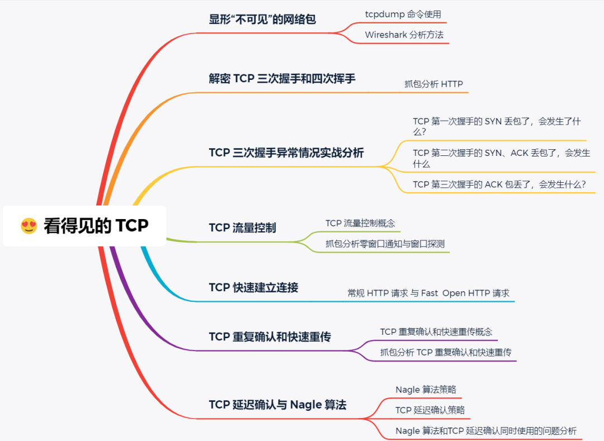
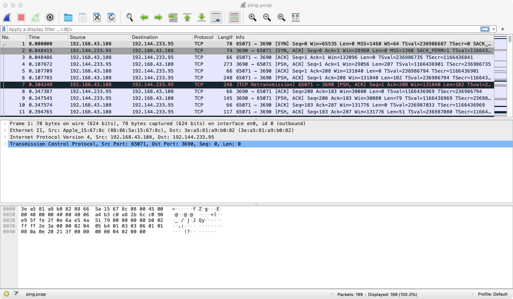
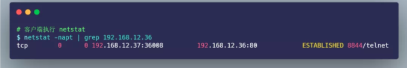
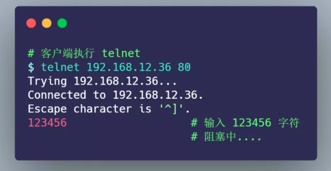

> 创建于 2021年4月30日
>
> 作者：[https://mp.weixin.qq.com/s?__biz=MzAwNDA2OTM1Ng==&mid=2453143342&idx=2&sn=2d9aba18ec5f6ba01d1048358a407419&scene=21#wechat_redirect](https://mp.weixin.qq.com/s?__biz=MzAwNDA2OTM1Ng==&mid=2453143342&idx=2&sn=2d9aba18ec5f6ba01d1048358a407419&scene=21#wechat_redirect)

[toc]

提纲




## 1、抓包工具

> tcpdump 和 Wireshark

- tcpdump 仅支持命令行格式使用，常用在 Linux 服务器中抓取和分析网络包。
- Wireshark 除了可以抓包外，还提供了可视化分析网络包的图形页面。

所以，这两者实际上是搭配使用的，先用 tcpdump 命令在 Linux 服务器上抓包，接着把抓包的文件拖出到 Windows 电脑后，用 Wireshark 可视化分析。


删除手册 Wireshark 

1. Remove */Applications/Wireshark.app*
2. Remove */Library/Application Support/Wireshark*

您可以通过 [Uninstall ChmodBPF](Wireshark.app/Contents/Resources/Extras/Uninstall ChmodBPF.pkg) 卸载, 或者通过 **Wireshark** **›** **About Wireshark** **›** **Folders** **›** **macOS Extras**来卸载。 您还可以通过执行以下操作进行手动卸载：

1. 禁用 “org.wireshark.ChmodBPF.plist” 启动
2. 删除 */Library/LaunchDaemons/org.wireshark.ChmodBPF.plist*
3. 移除 “access_bpf” 组。

您可以通过 [Remove Wireshark from the system path](Wireshark.app/Contents/Resources/Extras/Remove Wireshark from the system path.pkg) 卸载, 或者通过 **Wireshark** **›** **About Wireshark** **›** **Folders** **›** **macOS Extras**来卸载。 您还可以通过执行以下操作进行手动卸载：

1. 删除 */etc/paths.d/Wireshark*
2. 删除 */etc/manpaths.d/Wireshark*


```sh
-- 使用 tcpdump 对我远程服务器进行监控，注意，需要root权限
sudo tcpdump host 192.144.233.95

-- 此时下拉svn 可获得大量信息
```


> 使用Mac 自身终端进入桌面
>
> ```sh
> sudo tcpdump host 192.144.233.95 -w ping.pcap
> -- 监听 端口并将文件写入 ping.pcap 文件中
> ```
>
> 再使用 ‘大白鲨’🦈 打开 ping.pcap 文件
>
> 

这里抓去到的 大部分都是 TCP 协议


+ 我们可以在数据链路层看到 MAC 包信息
+ 可以在IP层看到 IP 包头信息，源IP地址和目标IP地址 TTL、IP包长度、协议等IP协议各个字段的数值和含义


## 2、解密 TCP 三次握手和四次挥手


Mac 执行 tcpdump 抓包命令

> ```sh
> sudo tcpdump -i any tcp and host 47.119.167.7 and port 8080 -w http.pcap
> ```

```sh
xiang@xiaocencen Desktop % sudo tcpdump -i any tcp and host 47.119.167.7 and port 8080 -w http.pcap
Password:
tcpdump: data link type PKTAP
tcpdump: listening on any, link-type PKTAP (Apple DLT_PKTAP), capture size 262144 bytes
```

开启另一个窗口，执行

> ```sh
> curl http://47.119.167.7:8080/
> ```


我们都知道 HTTP 是基于 TCP 协议进行传输的，那么：

- 最开始的 3 个包就是 TCP 三次握手建立连接的包
- 中间是 HTTP 请求和响应的包
- 而最后的 3 个包则是 TCP 断开连接的挥手包


> 你可能会好奇，为什么三次握手连接过程的 Seq 是 0 ？

实际上是因为 Wireshark 工具帮我们做了优化，它默认显示的是序列号 seq 是相对值，而不是真实值。


这样就能看到真实的 seq 了

> 为什么抓到的 TCP 挥手是三次，而不是书上说的四次？

因为服务器端收到客户端的 `FIN` 后，服务器端同时也要关闭连接，这样就可以把 `ACK` 和 `FIN` 合并到一起发送，节省了一个包，变成了“三次挥手”。

而通常情况下，服务器端收到客户端的 `FIN` 后，很可能还没发送完数据，所以就会先回复客户端一个 `ACK` 包，稍等一会儿，完成所有数据包的发送后，才会发送 `FIN` 包，这也就是四次挥手了。


## 3、TCP 三次握手异常情况实战分析

TCP 三次握手的过程相信大家都背的滚瓜烂熟，那么你有没有想过这三个异常情况：

- **TCP 第一次握手的 SYN 丢包了，会发生了什么？**
- **TCP 第二次握手的 SYN、ACK 丢包了，会发生什么？**
- **TCP 第三次握手的 ACK 包丢了，会发生什么？**

有的小伙伴可能说：“很简单呀，包丢了就会重传嘛。”

那我在继续问你：

- 那会重传几次？
- 超时重传的时间 RTO 会如何变化？
- 在 Linux 下如何设置重传次数？
- ….

是不是哑口无言，无法回答？

不知道没关系，接下里我用三个实验案例，带大家一起探究探究这三种异常。


**实验场景**

本次实验用了两台虚拟机，一台作为服务端，一台作为客户端，它们的关系如下：


- 客户端和服务端都是 CentOs 6.5 Linux，Linux 内核版本 2.6.32
- 服务端 192.168.12.36，apache web 服务
- 客户端 192.168.12.37

### 实验一：TCP 第一次握手 SYN 丢包

为了模拟 TCP 第一次握手 SYN 丢包的情况，我是在拔掉服务器的网线后，立刻在客户端执行 curl 命令：


其间 tcpdump 抓包的命令如下：


过了一会， curl 返回了超时连接的错误：


从 `date` 返回的时间，可以发现在超时接近 1 分钟的时间后，curl 返回了错误。

接着，把 tcp_sys_timeout.pcap 文件用 Wireshark 打开分析，显示如下图：


从上图可以发现， 客户端发起了 SYN 包后，一直没有收到服务端的 ACK ，所以一直超时重传了 5 次，并且每次 RTO 超时时间是不同的：

- 第一次是在 1 秒超时重传
- 第二次是在 3 秒超时重传
- 第三次是在 7 秒超时重传
- 第四次是在 15 秒超时重传
- 第五次是在 31 秒超时重传

可以发现，每次超时时间 RTO 是**指数（翻倍）上涨的**，当超过最大重传次数后，客户端不再发送 SYN 包。

在 Linux 中，第一次握手的 `SYN` 超时重传次数，是如下内核参数指定的：

```
$ cat /proc/sys/net/ipv4/tcp_syn_retries
5
```

`tcp_syn_retries` 默认值为 5，也就是 SYN 最大重传次数是 5 次。

接下来，我们继续做实验，把 `tcp_syn_retries` 设置为 2 次：

```
$ echo 2 > /proc/sys/net/ipv4/tcp_syn_retries
```

重传抓包后，用 Wireshark 打开分析，显示如下图：


> 实验一的实验小结

通过实验一的实验结果，我们可以得知，当客户端发起的 TCP 第一次握手 SYN 包，在超时时间内没收到服务端的 ACK，就会在超时重传 SYN 数据包，每次超时重传的 RTO 是翻倍上涨的，直到 SYN 包的重传次数到达 `tcp_syn_retries` 值后，客户端不再发送 SYN 包。


### 实验二：TCP 第二次握手 SYN、ACK 丢包

为了模拟客户端收不到服务端第二次握手 SYN、ACK 包，我的做法是在客户端加上防火墙限制，直接粗暴的把来自服务端的数据都丢弃，防火墙的配置如下：


接着，在客户端执行 curl 命令：


从 `date` 返回的时间前后，可以算出大概 1 分钟后，curl 报错退出了。

客户端在这其间抓取的数据包，用 Wireshark 打开分析，显示的时序图如下：


从图中可以发现：

- 客户端发起 SYN 后，由于防火墙屏蔽了服务端的所有数据包，所以 curl 是无法收到服务端的 SYN、ACK 包，当发生超时后，就会重传 SYN 包
- 服务端收到客户的 SYN 包后，就会回 SYN、ACK 包，但是客户端一直没有回 ACK，服务端在超时后，重传了 SYN、ACK 包，**接着一会，客户端超时重传的 SYN 包又抵达了服务端，服务端收到后，超时定时器就重新计时，然后回了 SYN、ACK 包，所以相当于服务端的超时定时器只触发了一次，又被重置了。**
- 最后，客户端 SYN 超时重传次数达到了 5 次（tcp_syn_retries 默认值 5 次），就不再继续发送 SYN 包了。

所以，我们可以发现，**当第二次握手的 SYN、ACK 丢包时，客户端会超时重发 SYN 包，服务端也会超时重传 SYN、ACK 包。**

> 客户端设置了防火墙，屏蔽了服务端的网络包，为什么 tcpdump 还能抓到服务端的网络包？

添加 iptables 限制后， tcpdump 是否能抓到包 ，这要看添加的 iptables 限制条件：

- 如果添加的是 `INPUT` 规则，则可以抓得到包
- 如果添加的是 `OUTPUT` 规则，则抓不到包

网络包进入主机后的顺序如下：

- 进来的顺序 Wire -> NIC -> **tcpdump -> netfilter/iptables**
- 出去的顺序 **iptables -> tcpdump** -> NIC -> Wire

> tcp_syn_retries 是限制 SYN 重传次数，那第二次握手 SYN、ACK 限制最大重传次数是多少？

TCP 第二次握手 SYN、ACK 包的最大重传次数是通过 `tcp_synack_retries` 内核参数限制的，其默认值如下：

```
$ cat /proc/sys/net/ipv4/tcp_synack_retries
5
```

是的，TCP 第二次握手 SYN、ACK 包的最大重传次数默认值是 `5` 次。

为了验证 SYN、ACK 包最大重传次数是 5 次，我们继续做下实验，我们先把客户端的 `tcp_syn_retries` 设置为 1，表示客户端 SYN 最大超时次数是 1 次，目的是为了防止多次重传 SYN，把服务端 SYN、ACK 超时定时器重置。

接着，还是如上面的步骤：

1. 客户端配置防火墙屏蔽服务端的数据包
2. 客户端 tcpdump 抓取 curl 执行时的数据包

把抓取的数据包，用 Wireshark 打开分析，显示的时序图如下：


从上图，我们可以分析出：

- 客户端的 SYN 只超时重传了 1 次，因为 `tcp_syn_retries` 值为 1
- 服务端应答了客户端超时重传的 SYN 包后，由于一直收不到客户端的 ACK 包，所以服务端一直在超时重传 SYN、ACK 包，每次的 RTO 也是指数上涨的，一共超时重传了 5 次，因为 `tcp_synack_retries` 值为 5

接着，我把 **tcp_synack_retries 设置为 2**，`tcp_syn_retries` 依然设置为 1:

```
$ echo 2 > /proc/sys/net/ipv4/tcp_synack_retries
$ echo 1 > /proc/sys/net/ipv4/tcp_syn_retries
```

依然保持一样的实验步骤进行操作，接着把抓取的数据包，用 Wireshark 打开分析，显示的时序图如下：


可见：

- 客户端的 SYN 包只超时重传了 1 次，符合 tcp_syn_retries 设置的值；
- 服务端的 SYN、ACK 超时重传了 2 次，符合 tcp_synack_retries 设置的值

> 实验二的实验小结

通过实验二的实验结果，我们可以得知，当 TCP 第二次握手 SYN、ACK 包丢了后，客户端 SYN 包会发生超时重传，服务端 SYN、ACK 也会发生超时重传。

客户端 SYN 包超时重传的最大次数，是由 tcp_syn_retries 决定的，默认值是 5 次；服务端 SYN、ACK 包时重传的最大次数，是由 tcp_synack_retries 决定的，默认值是 5 次。

### 实验三：TCP 第三次握手 ACK 丢包

为了模拟 TCP 第三次握手 ACK 包丢，我的实验方法是在服务端配置防火墙，屏蔽客户端 TCP 报文中标志位是 ACK 的包，也就是当服务端收到客户端的 TCP ACK 的报文时就会丢弃，iptables 配置命令如下：


接着，在客户端执行如下 tcpdump 命令：


然后，客户端向服务端发起 telnet，因为 telnet 命令是会发起 TCP 连接，所以用此命令做测试：


此时，由于服务端收不到第三次握手的 ACK 包，所以一直处于 `SYN_RECV` 状态：


而客户端是已完成 TCP 连接建立，处于 `ESTABLISHED` 状态：



过了 1 分钟后，观察发现服务端的 TCP 连接不见了：


过了 30 分钟，客户端依然还是处于 `ESTABLISHED` 状态：


接着，在刚才客户端建立的 telnet 会话，输入 123456 字符，进行发送：



持续「好长」一段时间，客户端的 telnet 才断开连接：


以上就是本次的实现三的现象，这里存在两个疑点：

- 为什么服务端原本处于 `SYN_RECV` 状态的连接，过 1 分钟后就消失了？
- 为什么客户端 telnet 输入 123456 字符后，过了好长一段时间，telnet 才断开连接？

不着急，我们把刚抓的数据包，用 Wireshark 打开分析，显示的时序图如下：


- 客户端发送 SYN 包给服务端，服务端收到后，回了个 SYN、ACK 包给客户端，此时服务端的 TCP 连接处于 `SYN_RECV` 状态；
- 客户端收到服务端的  SYN、ACK 包后，给服务端回了个 ACK 包，此时客户端的 TCP 连接处于 `ESTABLISHED` 状态；
- 由于服务端配置了防火墙，屏蔽了客户端的 ACK 包，所以服务端一直处于 `SYN_RECV` 状态，没有进入  `ESTABLISHED` 状态，tcpdump 之所以能抓到客户端的 ACK 包，是因为数据包进入系统的顺序是先进入 tcpudmp，后经过 iptables；
- 接着，服务端超时重传了 SYN、ACK 包，重传了 5 次后，也就是**超过 tcp_synack_retries 的值（默认值是 5），然后就没有继续重传了，此时服务端的 TCP 连接主动中止了，所以刚才处于 SYN_RECV 状态的 TCP 连接断开了**，而客户端依然处于`ESTABLISHED` 状态；

- 虽然服务端 TCP 断开了，但过了一段时间，发现客户端依然处于`ESTABLISHED` 状态，于是就在客户端的 telnet 会话输入了 123456 字符；
- 此时由于服务端已经断开连接，**客户端发送的数据报文，一直在超时重传，每一次重传，RTO 的值是指数增长的，所以持续了好长一段时间，客户端的 telnet 才报错退出了，此时共重传了 15 次。**

通过这一波分析，刚才的两个疑点已经解除了：

- 服务端在重传 SYN、ACK 包时，超过了最大重传次数 `tcp_synack_retries`，于是服务端的 TCP 连接主动断开了。
- 客户端向服务端发送数据包时，由于服务端的 TCP 连接已经退出了，所以数据包一直在超时重传，共重传了 15 次， telnet 就 断开了连接。

> TCP 第一次握手的 SYN 包超时重传最大次数是由 tcp_syn_retries 指定，TCP 第二次握手的 SYN、ACK 包超时重传最大次数是由 tcp_synack_retries 指定，那 TCP 建立连接后的数据包最大超时重传次数是由什么参数指定呢？

TCP 建立连接后的数据包传输，最大超时重传次数是由 `tcp_retries2` 指定，默认值是 15 次，如下：

```
$ cat /proc/sys/net/ipv4/tcp_retries2
15
```

如果 15 次重传都做完了，TCP 就会告诉应用层说：“搞不定了，包怎么都传不过去！”

> 那如果客户端不发送数据，什么时候才会断开处于 ESTABLISHED 状态的连接？

这里就需要提到 TCP 的 **保活机制**。这个机制的原理是这样的：

定义一个时间段，在这个时间段内，如果没有任何连接相关的活动，TCP 保活机制会开始作用，每隔一个时间间隔，发送一个「探测报文」，该探测报文包含的数据非常少，如果连续几个探测报文都没有得到响应，则认为当前的 TCP 连接已经死亡，系统内核将错误信息通知给上层应用程序。

在 Linux 内核可以有对应的参数可以设置保活时间、保活探测的次数、保活探测的时间间隔，以下都为默认值：

```
net.ipv4.tcp_keepalive_time=7200
net.ipv4.tcp_keepalive_intvl=75  
net.ipv4.tcp_keepalive_probes=9
```

- tcp_keepalive_time=7200：表示保活时间是 7200 秒（2小时），也就 2 小时内如果没有任何连接相关的活动，则会启动保活机制
- tcp_keepalive_intvl=75：表示每次检测间隔 75 秒；
- tcp_keepalive_probes=9：表示检测 9 次无响应，认为对方是不可达的，从而中断本次的连接。

**==也就是说在 Linux 系统中，最少需要经过 2 小时 11 分 15 秒才可以发现一个「死亡」连接。==**


> 实验三的实验小结

在建立 TCP 连接时，如果第三次握手的 ACK，服务端无法收到，则服务端就会短暂处于 `SYN_RECV` 状态，而客户端会处于 `ESTABLISHED` 状态。

由于服务端一直收不到 TCP 第三次握手的 ACK，则会一直重传 SYN、ACK 包，直到重传次数超过 `tcp_synack_retries` 值（默认值 5 次）后，服务端就会断开 TCP 连接。

而客户端则会有两种情况：

- 如果客户端没发送数据包，一直处于 `ESTABLISHED` 状态，然后经过 2 小时 11 分 15 秒才可以发现一个「死亡」连接，于是客户端连接就会断开连接。
- 如果客户端发送了数据包，一直没有收到服务端对该数据包的确认报文，则会一直重传该数据包，直到重传次数超过 `tcp_retries2` 值（默认值 15 次）后，客户端就会断开 TCP 连接。


## 4、TCP 快速建立连接

客户端在向服务端发起 HTTP GET 请求时，一个完整的交互过程，需要 2.5 个 RTT 的时延。

由于第三次握手是可以携带数据的，这时如果在第三次握手发起 HTTP GET 请求，需要 2 个 RTT 的时延。

但是在下一次（不是同个 TCP 连接的下一次）发起 HTTP GET 请求时，经历的 RTT 也是一样，如下图：


在 Linux 3.7 内核版本中，提供了 TCP Fast Open 功能，这个功能可以减少 TCP 连接建立的时延。


- 在第一次建立连接的时候，服务端在第二次握手产生一个 `Cookie` （已加密）并通过 SYN、ACK 包一起发给客户端，于是客户端就会缓存这个 `Cookie`，所以第一次发起 HTTP Get 请求的时候，还是需要 2 个 RTT 的时延；
- 在下次请求的时候，客户端在 SYN 包带上 `Cookie` 发给服务端，就提前可以跳过三次握手的过程，因为 `Cookie` 中维护了一些信息，服务端可以从 `Cookie` 获取 TCP 相关的信息，这时发起的 HTTP GET 请求就只需要 1 个 RTT 的时延；


注：客户端在请求并存储了 Fast Open Cookie 之后，可以不断重复 TCP Fast Open 直至服务器认为 Cookie 无效（通常为过期）

> 在 Linux 上如何打开 Fast Open 功能？

可以通过设置 `net.ipv4.tcp_fastopn` 内核参数，来打开 Fast Open 功能。

```sh
vi /etc/sysctl.conf
```

==**需要：Linux内核 3.7.1 以及更高版本**==

```sh
uname -a 
-- 查看 linux 内核版本
```


net.ipv4.tcp_fastopn 各个值的意义:

- 0 关闭
- 1 作为客户端使用 Fast Open 功能
- 2 作为服务端使用 Fast Open 功能
- 3 无论作为客户端还是服务器，都可以使用 Fast Open 功能

> TCP Fast Open 抓包分析

在下图，数据包 7 号，客户端发起了第二次 TCP 连接时，SYN 包会携带 Cooike，并且有长度为 5 的数据。

服务端收到后，校验 Cooike 合法，于是就回了 SYN、ACK 包，并且确认应答收到了客户端的数据包，ACK = 5 + 1 = 6


## 5、TCP 重复确认和快速重传

当接收方收到乱序数据包时，会发送重复的 ACK，以使告知发送方要重发该数据包，**当发送方收到 3 个重复 ACK 时，就会触发快速重传，立该重发丢失数据包。**


TCP 重复确认和快速重传的一个案例，用 Wireshark 分析，显示如下：


- 数据包 1 期望的下一个数据包 Seq 是 1，但是数据包 2 发送的 Seq 却是 10945，说明收到的是乱序数据包，于是回了数据包 3 ，还是同样的 Seq = 1，Ack = 1，这表明是重复的 ACK；
- 数据包 4 和 6 依然是乱序的数据包，于是依然回了重复的 ACK；
- 当对方收到三次重复的 ACK 后，于是就快速重传了 Seq = 1 、Len = 1368 的数据包 8；
- 当收到重传的数据包后，发现 Seq = 1 是期望的数据包，于是就发送了确认报文 ACK；

注意：快速重传和重复 ACK 标记信息是 Wireshark 的功能，非数据包本身的信息。

以上案例在 TCP 三次握手时协商开启了**选择性确认 SACK**，因此一旦数据包丢失并收到重复 ACK ，即使在丢失数据包之后还成功接收了其他数据包，也只需要重传丢失的数据包。如果不启用 SACK，就必须重传丢失包之后的每个数据包。

如果要支持 `SACK`，必须双方都要支持。在 Linux 下，可以通过 `net.ipv4.tcp_sack` 参数打开这个功能（Linux 2.4 后默认打开）。

