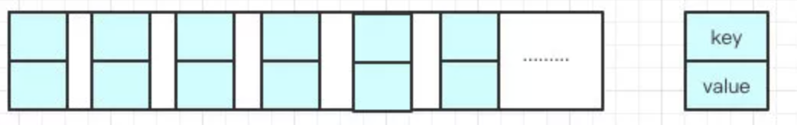
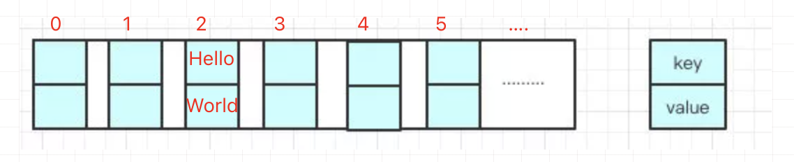
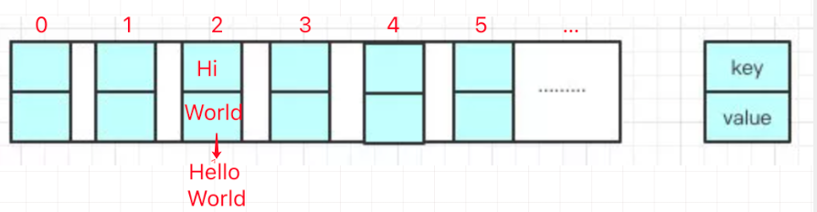
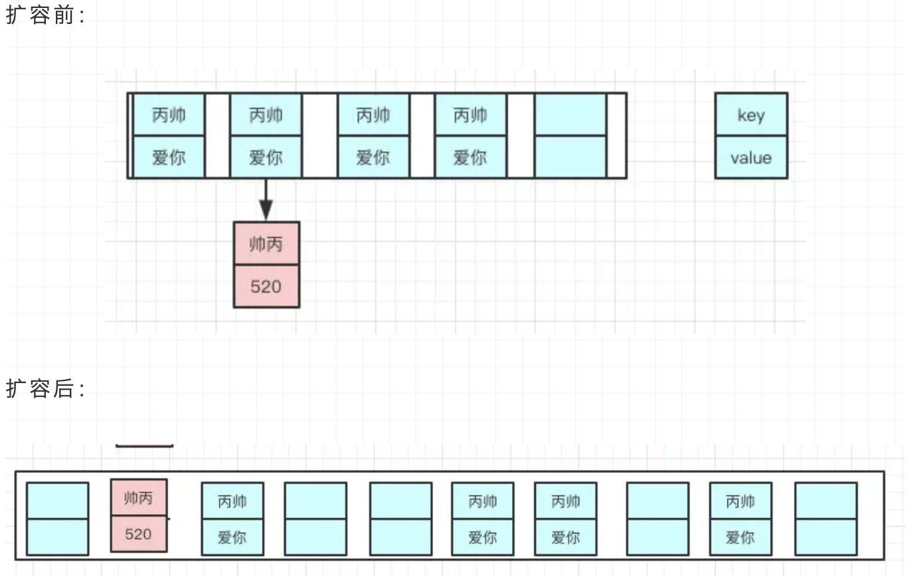

> 创建于 2021-5-11
>
> 来源于 [敖丙](https://mp.weixin.qq.com/s?__biz=MzAwNDA2OTM1Ng==&mid=2453141093&idx=2&sn=2784802c46f56c1fa1a1053c2c52ece0&scene=21#wechat_redirect)

[toc]

## HashMap

### 1、结构和底层原理

​		HashMap 是我们非常常用到数据结构，由数组和链表构成的数据结构，数组里面每个地方都存了 key-value 这样的实例，在Java7叫 Entry 在 Java8 中叫 Node



​		因为他本身所有的位置都是null，在 put 插入的时候，会根据 key 的hash去计算一个 index 的值，就比如我  put("Hello"，"World")，我插入了为“Hello”的元素，这个时候，我们会通过 哈希函数计算出插入的位置，计算出 index 是 2 的位置，

```http
hash("Hello") = 2
```



​		我们都知道，数组的长度是有限的，在有限的长度去使用哈希，哈希本身就存在概率性，就像上面的情况，可能为再 put 一个 “Hi” ，计算出的 hash 值也在 2上，和之前是同一值，这样就形成了链表



每一个节点都会保存自身的hash、key、value、以及下个节点，我看看Node的源码。

```java
static class Node<K,V> implement Map.Entry<K,V>{
  final int hash;
  final K key;
  V value;
  Node<K,V> next;
  ...
}
```

> ==新的Entry节点再插入链表的时候，是怎么插入的？==

Java 8之前是头插法，也就是说，新的值会取代原有的值，原有的值顺推到链表中去，就像上面的🌰一样

但是 Java 8 之后，都说用尾插法了。

> ==为什么改成尾插法？==

​		数组容量是有限的，数据多次插入，到达一定数量就会扩容，也就是 `resize`

> ==什么时候resize呢？==

有两个因素

+ Capacity：HashMap 当前长度
+ LocalFactor：负载因子，默认值为 0.75f

```java
static final float DEFAULT_LOAD_FACTOR = 0.75f;
```

比如当前容量为 100，当存到 76 个的时候，判断发现需要进行 resize 了，那就扩容。

> ==怎么扩容呢？==

分为两步：

+ 扩容：创建一个新的 Entry 空数组，长度是原来的2倍
+ ReHash：遍历原Entry 数组，把所有 Entry 重新 Hash 到新的数组

> ==为什么要重新Hash呢？为什么不直接复制过去==

​		因为长度扩容之后，Hash 规则也随之改变，原来的长度是 8 是通过位运算得出的，这和新的 16 肯定就不一样了。

​		**==Hash的公式---> index = HashCode（Key） & （Length - 1）==**



> ==言归正传，java8 为什么改成尾插了呢？==

​		多线程的情况下，头插法进行扩容。会出现环形链 --==Infinit Loop==(♾️)

```sh
# 插入 A、B、C到长度为2的Entry 中 当长度依旧还是2的时候，未扩容时
顺序是 A -> B -> C

# 2*0.75 = 1，插入到第二个就要 resize 了，因为 resize ，使用单链表头插法，同一个位置上的元素总会被放到链表头部，重新计算的索引位有可能被放到新的不同的位置
顺序是 B -> A

# 一旦多个线程完成调整
这时 ...  A -> B  -> A -> B ...
```

因为 Java 8 之后链表有红黑树，代码中有很多 if else 的逻辑判断，红黑树的引入将原本 O(n) 的时间复杂度 降低为 O(logn)，使用头插法会改变链表上的顺序，但是如果用尾插法，在扩容的时候会保持链表元素原本的顺序，就不会出现链表成环的问题了

> ==那是不是意味着 Java8 就可以把 HashMap 用在多线程呢？==

​		源码中的 put/get 方法都没有加同步锁，所以线程安全还是无法保证的。

> ==HashMap 的默认初始化长度是多少？==

​		16

> ==为什么是16呢？==

​		源码中有一行

```java
static final int DEFAULT_INITIAL_CAPACITY = 1<<4;
```

*1<<4 = 16*  在创建 HashMap 时，阿里巴巴规会提示我们最好赋初值，而且最好是2的幂，这样是为了位运算方便，位与运算比算数计算的效率高了很多，之所以选择16，是为了服务将 key 映射到 index 的算法。

> ==那为啥用16不用别的呢？==

​		这是为了**实现均匀分布**

> ==为啥我们重写equals方法的时候需要重写hashCode方法呢？==

​		因为在java中，所有的对象都是继承于Object类。Ojbect类中有两个方法equals、hashCode，这两个方法都是用来比较两个对象是否相等的。在未重写equals方法我们是继承了object的equals方法，**那里的 equals是比较两个对象的内存地址**，显然我们new了2个对象内存地址肯定不一样

- 对于值对象，==比较的是两个对象的值
- 对于引用对象，比较的是两个对象的地址

我们通过 key 去计算出 index，一个index 下面可能会有n个元素，如果不重写 hashCode 获取到 准确的 hash值，根本找不到呀！所以针对 Map重写 equals 方法后，还需要重写 hashCode 方法。

> ==HashMap在线程安全的场景==

​		在多线程情况下，一般都会使用HashTable 或者 CurrentHashMap，但是因为前者都是并发度的原因基本上没啥使用场景，所以存在线程不安全情况我们都是用 CurrentHashMap

​		HashTable源码我看过，很简单粗暴，直接在方法上锁，并发度很低，最多同时允许一个线程访问，currentHashMap就好很多，1.7 和 1.8 有较大的不同，不过并发度比前者好太多了


