> 创建于 2021年5月28日
>
> 作者：[敖丙](https://mp.weixin.qq.com/s?__biz=MzAwNDA2OTM1Ng==&mid=2453144928&idx=2&sn=9381f2e2ac82013d7f6483a751597d1e&scene=21#wechat_redirect)

[toc]

## 什么是堆

堆—— 其实就是一种特殊的队列，优先队列

普通队列游戏规则很简单，但这种队列==搞特殊==，不是按照队列的时间顺序，而是按照每个元素的优先级来比拼，==优先级高的在堆顶==

这里要区分操作系统中的「堆」虽然都叫堆，但是和操作系统那个「堆」没有半毛钱关系，都只是借用了 Heap这个英文单词而已

堆中的地位：

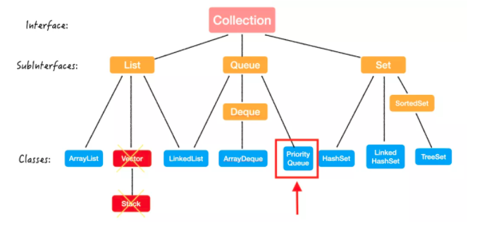

也就是说

+ PriorityQueue 也是一个类（class）
+ PrioriryQueue 继承自 Queue 这个接口（interface）

heap 其实是一个抽象的数据结构，或者说是逻辑上的数据结构，并不是一个物理上真正存在的数据结构，heap 实现方式有很多，比如 binomial Heap，Fibonacci heap 等等。但是面试最常考的，也是最经典的就是 binary heap 二叉堆，也就是用一颗 完全二叉树来实现。

那完全二叉树怎么实现呢？ ==数组== 那数组怎么实现呢？ ==gun==

所以 binray heap/PrioriyQueue 实际上都是用数组实现的

这个数组的排列方式有点特别，因为它总会维护你定义的（或者默认的）**优先级最高的元素**在数组的首位，所以不是随便一个数组都叫「堆」，实际上，它在你心里，应该是一棵「完全二叉树」。

这棵完全二叉树，只存在你心里和各大书本上；实际在在内存里，哪有什么树？就是数组罢了。

>  那为什么完全二叉树可以用数组来实现？是不是所有的树都能用数组来实现？

这个就涉及完全二叉树的性质了，我们下一篇会细讲，简单来说，因为完全二叉树的定义要求了它在层序遍历的时候没有气泡，也就是连续存储的，所以可以用数组来存放；第二个问题当然是否。

### 堆的特点

1. 堆是完全二叉树；

2. 堆序性（heap order）任意节点都优于它的所有孩子

   1. 如果是任意节点都大于它的所有孩子，这样的堆叫大顶堆，Max Heap；
   2. 如果.....           都小于.....            ，这样的.....  小堆顶，Min Heap；

   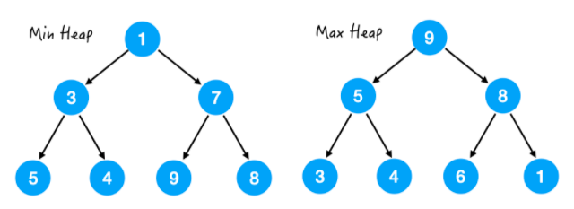

   左图是小堆顶，可以看出每个节点来说，都是小于它的所有孩子的，注意，是==所有== 包括孙子、曾曾曾孙

3. 既然堆是用数组实现的，那我们可以找到每个节点和它的父母、孩子之间的关系，从而可以直接访问到他们。

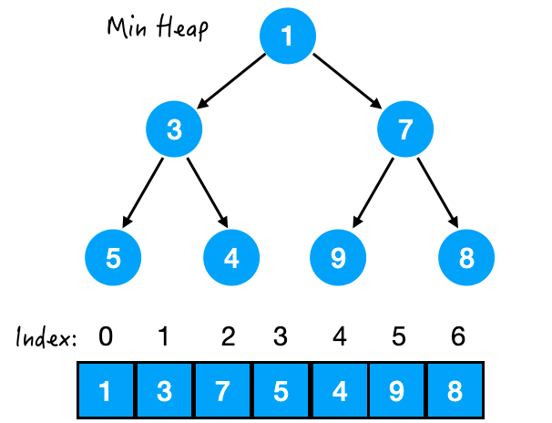

​	比如对于节点 3 来说，

+ 它的 index = 1
+ 它的 parent index = 0
+ 左孩子 left child index = 3
+ 右孩子 right child index = 4

   ==可以归纳出如下规律==

- 设当前节点的 index = x
- 那么 parent index = (x-1)/2
- 左孩子 left child index = 2*x + 1
- 右孩子 right child index = 2*x + 2

这样就可以从任意一个点，一步找到它的孙子、曾孙子，真的太方便了，在后文讲具体操作时大家可以更深刻的体会到。

### 基本操作

任何一个数据结构，无非是增删改查四大类

| 功能 |     方法     | 时间复杂度 |
| :--- | :----------: | :--------- |
| 增   |  offer(E e)  | O(logn)    |
| 删   |    poll()    | O(logn)    |
| 改   | 无直接的 API | 删 + 增    |
| 查   |    peek()    | O(1)       |

这里 `peek()` 的时间复杂度很好理解，因为堆的用途就是能够快速的拿到一组数据里的最大/最小值，所以这一步的时间复杂度一定是 `O(1)` 的，这就是堆的意义所在。

那么我们具体来看 `offer(E e)` 和 `poll()` 的过程。

### offer（E e）

比如我们新加一个 0 到刚刚这个最小堆里头

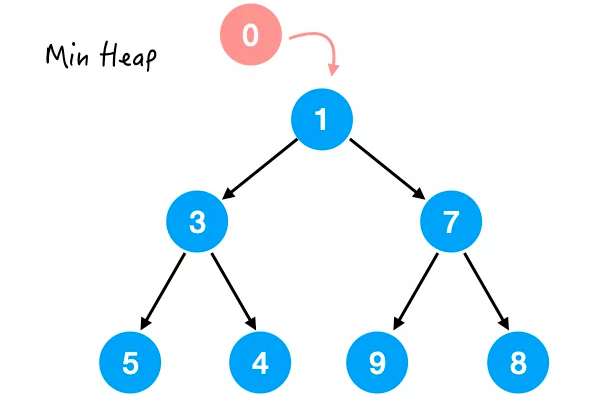

那很明显，0 是要放在最上面的，可是，直接放上去就不是一棵完全二叉树了啊。。

所以说，

- 我们先保证加了元素之后这棵树还是一棵完全二叉树，
- 然后再通过 swap 的方式进行微调，来满足堆序性。

这样就保证**满足了堆的两个特点**，也就是保证了加入新元素之后**它还是个堆**。

那具体怎么做呢：

#### Step 1.

先把 0 放在最后接上，别一上来就想着上位；

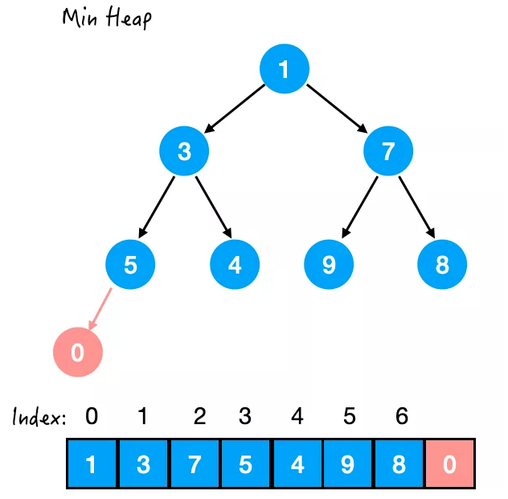

OK！总算先上岸了，然后我们再一步步往上走。

这里「能否往上走」的标准在于：
**是否满足堆序性**。

也就是说，现在 5 和 0 之间不满足堆序性，那么交换位置，**换到直到满足堆序性为止**。

这里对于最小堆来说的堆序性，就是**小的数要在上面**。

#### Step 2. 与 5 交换

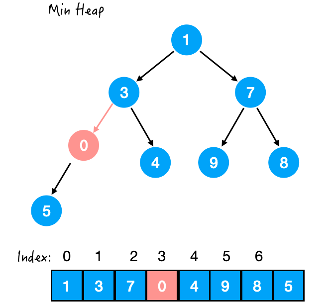

此时 0 和 3 不满足堆序性了，那么再交换。

#### Step 3. 与 3 交换

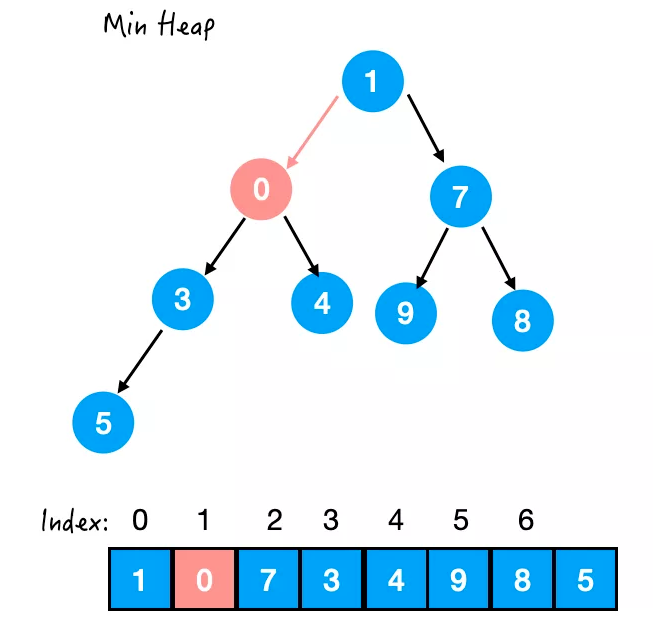

还不行，0 还比 1 小，所以继续换。

#### Step 4. 与 1 交换

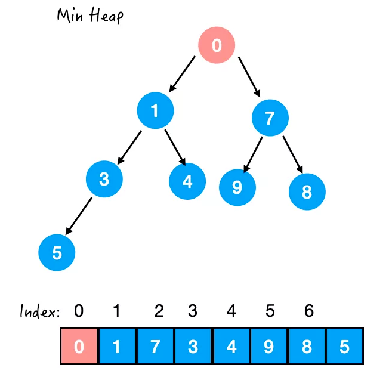

OK！这样就换好了，一个新的堆诞生了～

总结一下这个方法：

**先把新元素加入数组的末尾，再通过不断比较与 parent 的值的大小，决定是否交换，直到满足堆序性为止。**

这个过程就是 `siftUp()`，源码如下：

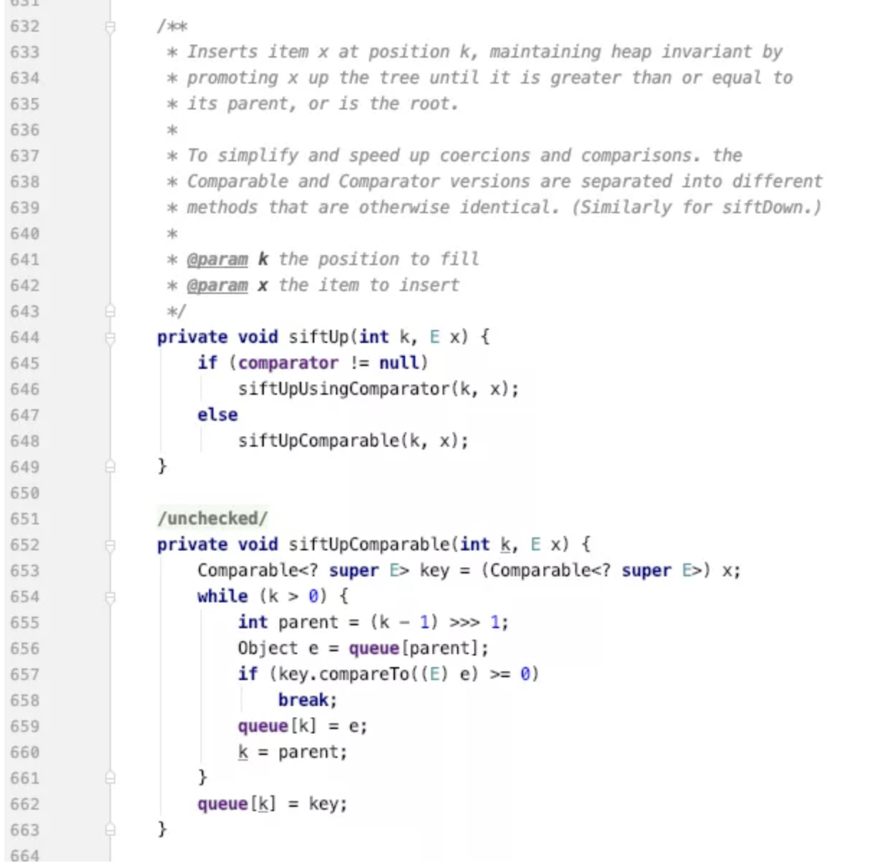

#### 时间复杂度

这里不难发现，其实我们只交换了一条支路上的元素，

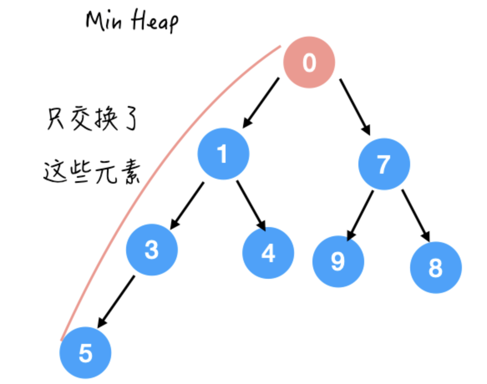

也就是最多交换 `O(height)` 次。

那么对于完全二叉树来说，除了最后一层都是满的，`O(height) = O(logn)`。

所以 `offer(E e)` 的时间复杂度就是 `O(logn)` 啦。

### poll()

`poll()` 就是把最顶端的元素拿走。

对了，没有办法拿走中间的元素，毕竟要 VIP 先出去，小弟才能出去。

那么最顶端元素拿走后，这个位置就空了：

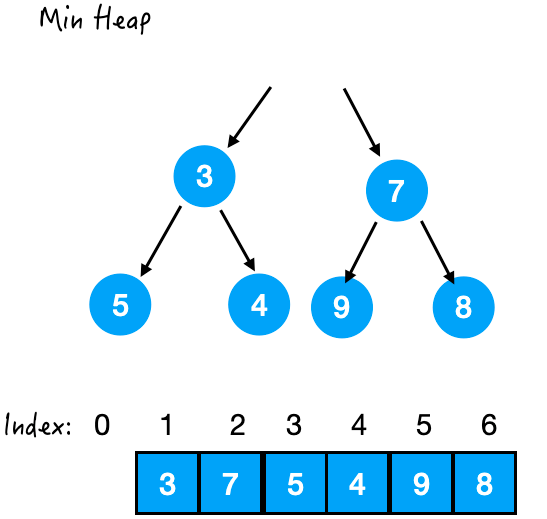

我们还是先来满足堆序性，因为比较容易满足嘛，直接从最后面拿一个来补上就好了，先放个傀儡上来。

#### Step1. 末尾元素上位

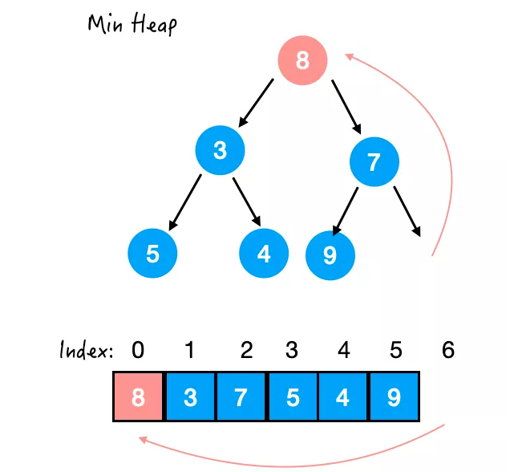

这样一来，堆序性又不满足了，开始交换元素。

那 8 比 7 和 3 都大，应该和谁交换呢？

假设与 7 交换，那么 7 还是比 3 大，还得 7 和 3 换，麻烦。

所以是与左右孩子中**较小**的那个交换。

#### Step 2. 与 3 交换

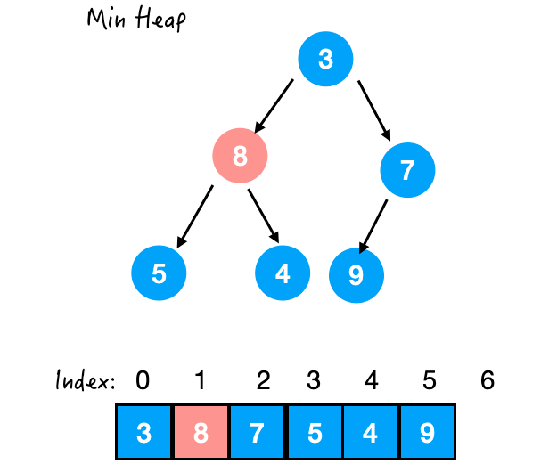

下去之后，还比 5 和 4 大，那再和 4 换一下。

#### Step 3. 与 4 交换

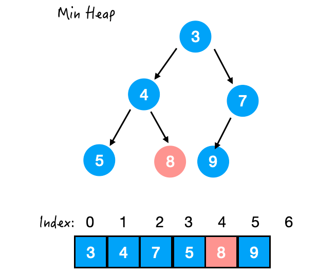

OK！这样这棵树总算是稳定了。

总结一下这个方法：

**先把数组的末位元素加到顶端，再通过不断比较与左右孩子的值的大小，决定是否交换，直到满足堆序性为止。**

这个过程就是 `siftDown()`，源码如下：

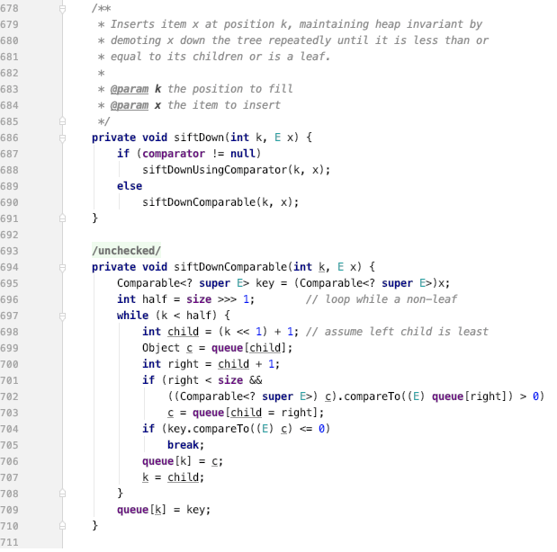

#### 时间复杂度

同样道理，也只交换了一条支路上的元素，也就是最多交换 `O(height)` 次。

所以 `offer(E e)` 的时间复杂度就是 `O(logn)` 啦。

### heapify()

还有一个大名鼎鼎的非常重要的操作，就是 `heapify()` 了，它是一个很神奇的操作，

可以用 `O(n)` 的时间把一个乱序的数组变成一个 heap。

但是呢，`heapify()` 并不是一个 public API，看：

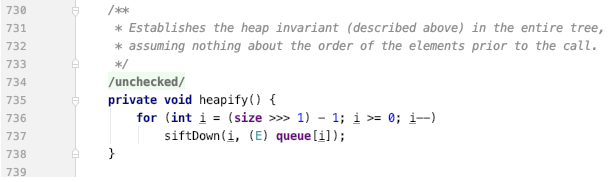

所以我们没有办法直接使用。

唯一使用 `heapify()` 的方式呢，就是使用`PriorityQueue(Collection<? extends E> c)`

这个 constructor 的时候，人家会自动调用 heapify() 这个操作。

那具体是怎么做的呢？

哈哈源码已经暴露了：

从最后一个非叶子节点开始，从后往前做 `siftDown()`.

因为叶子节点没必要操作嘛，已经到了最下面了，还能和谁 swap？

举个例子：

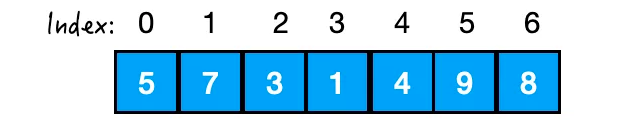

我们想把这个数组进行 `heapify()` 操作，想把它变成一个最小堆，拿到它的最小值。

那就要从 3 开始，对 3，7，5进行 `siftDown()`.

#### Step 1.

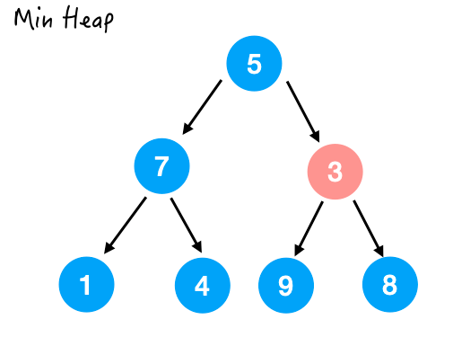

尴尬 😅，3 并不用交换，因为以它为顶点的这棵小树已经满足了堆序性。

#### Step 2.

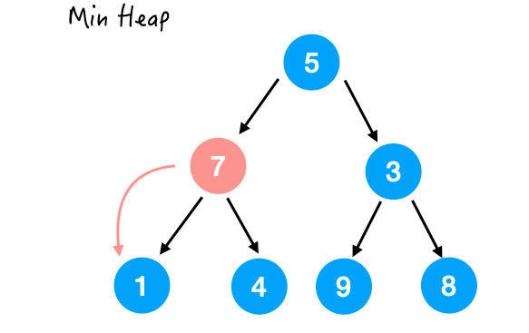

7 比它的两个孩子都要大，所以和较小的那个交换一下。

交换完成后；

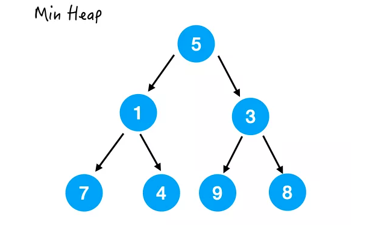

#### Step 3.

最后一个要处理的就是 5 了，那这里 5 比它的两个孩子都要大，所以也和较小的那个交换一下。

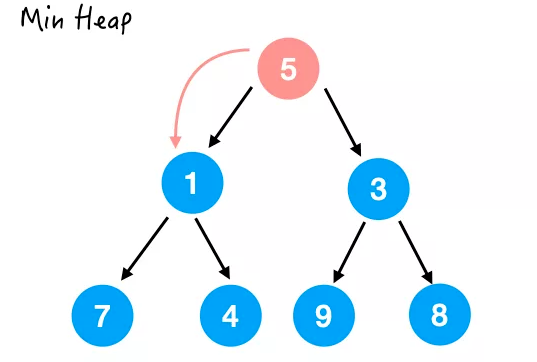

换完之后结果如下，注意并没有满足堆序性，因为 4 还比 5 小呢。

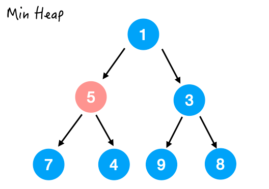

所以接着和 4 换，结果如下：

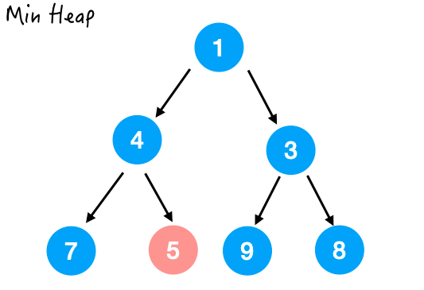

这样整个 `heapify()` 的过程就完成了。

>  好了难点来了，为什么时间复杂度是 O(n) 的呢？

怎么计算这个时间复杂度呢？

其实我们在这个过程里做的操作无非就是交换交换。

那到底交换了多少次呢？

没错，交换了多少次，时间复杂度就是多少。

那我们可以看出来，其实**同一层的节点**最多交换的次数都是相同的。

**那么这个总的交换次数 = 每层的节点数 \* 每个节点最多交换的次数**

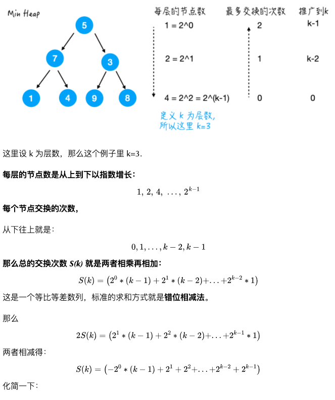

