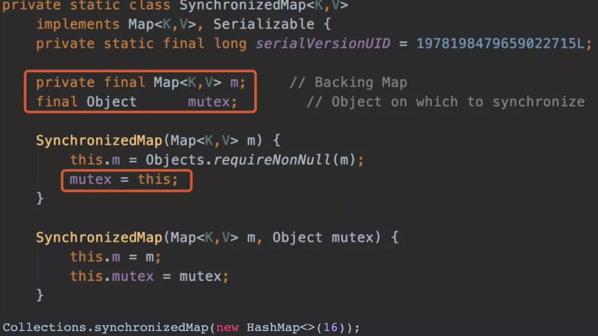
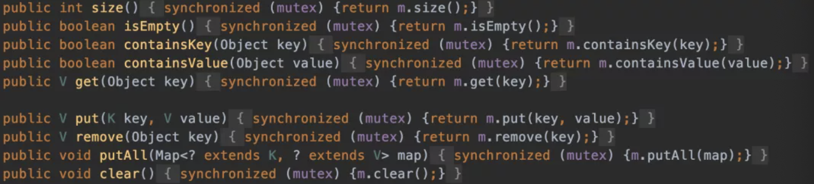
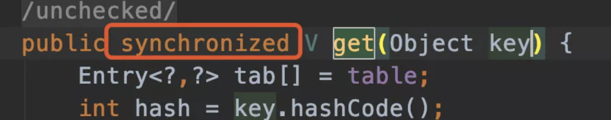
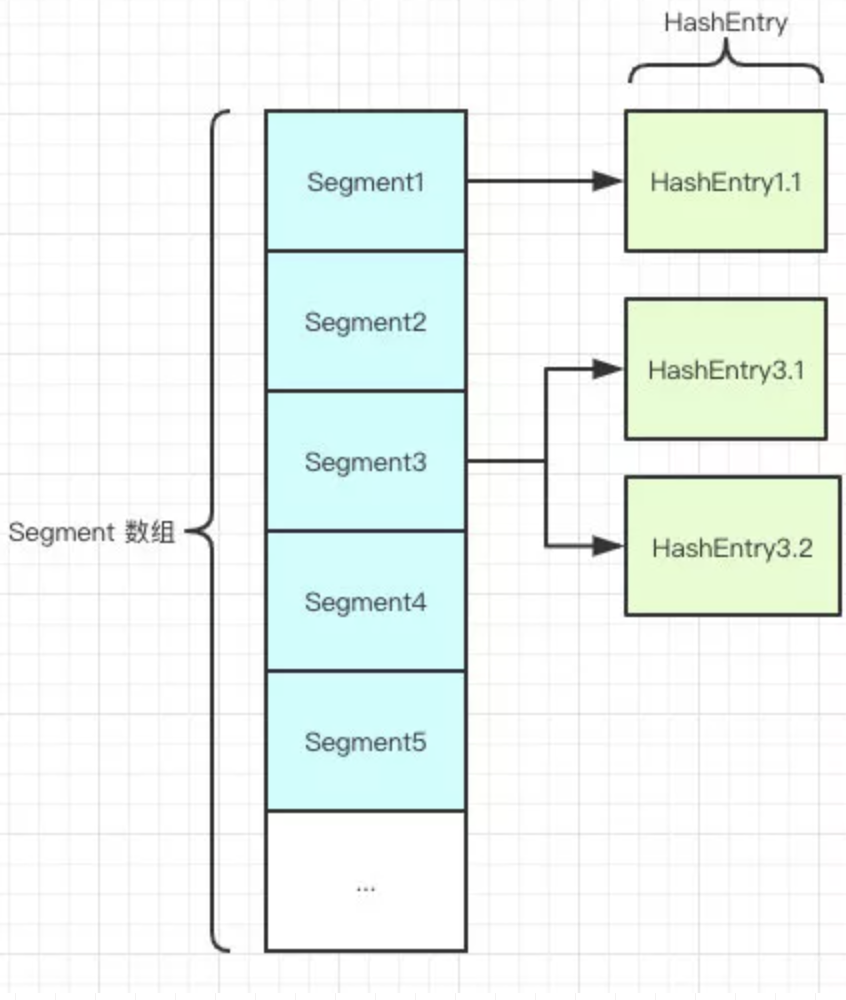
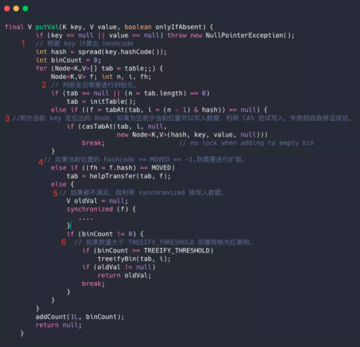

> 本文创建于 2021-5-12
>
> 作者：[敖丙](https://mp.weixin.qq.com/s?__biz=MzAwNDA2OTM1Ng==&mid=2453141162&idx=1&sn=72976d5ae28ca6e7cdeaef407d3fe2ca&scene=21#wechat_redirect)

[toc]

## ConcurrentHashMap

### 1、多线程环境下如何使用HashMap

+ 使用 Collections.synchronizedMap(Map)创建线程安全的map集合
+ Hashtable
+ ConcurrentHashMap

出于程序并发原因，一般都是舍弃前两种使用最后的 ConcurrentHashMap，他的性能和效率明显高于前两者

#### 1、Collections.synchronizedMap 是怎么实现线程安全的？

在SynchronizedMap内部维护了一个普通Map，还有排斥锁 mutex



我们在调用这个方法的时候需要传入一个 Map，可以看到这里有两个构造器，如果你传入了 mutex参数，则将对象排斥锁赋值为传入的对象。

如果没有，则将对象排斥锁赋值为this，即调用 synchronizedMap 的对象，就是上面的 Map。

创建出 synchronizedMap 之后，再操作 map 的时候，就会对方法上锁。如图，全是锁🔒

#### 2、Hashtable？

跟HashMap 相比 Hashtable 是线程安全的，适合在多线程的情况下使用。但是效率可不太乐观。



Hashtable 是不允许键或值为 null 的，HashMap 的键值对则都可以为null，Hashtable 在我们put空值的时候直接抛出空指针异常，但是HashMap 却做了特殊处理

```java
static final int hash(Object key) {
    int h;
    return (key == null) ? 0 : (h = key.hashCode()) ^ (h >>> 16);
}
```

#### 3、为什么不允许 Hashtable 的键或值为null的？

这是因为 hashtable 使用的是 安全失败机制（fail-safe），这种机制会使你此次读到的数据不一定是最新的数据。

如果你使用null值，就会使得无法判对应的key是不是存在还是为空，因为你无法再调用一次 contain（key）对于key是否存在进行判断，ConcurrentHashMap同理。

**不同点**

+ 实现方法不同：Hashtbale 继承了 Dictionary 类，而 HashMap 继承的是 AbstracMap类
  + Dictionary 是 JDK1.0 添加的，貌似没人用过
+ 初始化容量不同：HashMap 的初始化容量为 16，Hashtable 初始化容量为 11，两个负载因子默认都是 0.75
+ 扩容机制不同：当现有容量 > 总容量 ✖️ 负载因子时，HashMap 扩容规则为当前容量翻倍，Hashtable 扩容规则为当前容量翻倍 + 1。
+ 迭代器不同：HashMap 中的 Iterator 迭代器是 fail-fast 的。而 Hashtable 的 Enumerator 不是 fail-fast 的。

所以，当其他线程改变了 HashMap 的机构时候，如：增加、删除元素。将会抛出 ConcurrentModificationException 异常，而Hashtable 不会。

```http
fail-fast和fail-safe的区别：
fail-safe允许在遍历的过程中对容器中的数据进行修改，而fail-fast则不允许
fail-fast:直接在容器上进行遍历，在遍历过程中，一旦发现容器中的数据被修改了，会立刻抛出ConcurrentModificationException异常导致遍历失败。java.util包下的集合类都是快速失败机制的, 常见的的使用fail-fast方式遍历的容器有HashMap和ArrayList等。
fail-safe:这种遍历基于容器的一个克隆。因此，对容器内容的修改不影响遍历。java.util.concurrent包下的容器都是安全失败的,可以在多线程下并发使用,并发修改。常见的的使用fail-safe方式遍历的容器有ConcerrentHashMap和CopyOnWriteArrayList等。
```

#### 4、fail-fast是啥？

**快速失败（fail—fast）**是java集合中的一种机制， 在用迭代器遍历一个集合对象时，如果遍历过程中对集合对象的内容进行了修改（增加、删除、修改），则会抛出Concurrent Modification Exception。

#### 5、他的原理是啥？

迭代器在遍历时直接访问集合中的内容，并且在遍历过程中使用一个 modCount 变量。

集合在被遍历期间如果内容发生变化，就会改变modCount的值。

每当迭代器使用hashNext()/next()遍历下一个元素之前，都会检测modCount变量是否为expectedmodCount值，是的话就返回遍历；否则抛出异常，终止遍历。

==可以理解为，一旦遍历到到元素被其他线程修改了，立刻抛出异常==

**Tip**：这里异常的抛出条件是检测到 modCount！=expectedmodCount 这个条件。如果集合发生变化时修改modCount值刚好又设置为了expectedmodCount值，则异常不会抛出。

因此，不能依赖于这个异常是否抛出而进行并发操作的编程，这个异常只建议用于检测并发修改的bug。

结论：==不能在多线程下并发修改==

**Tip**：**安全失败（fail—safe）**大家也可以了解下，java.util.concurrent包下的容器都是安全失败，可以在多线程下并发使用，并发修改。

结论：==可以选择 fial-safe在多线程下并发修改==

#### 6、ConcurrentHashMap 的底层数据结构如何，它的并发度为什么这么高

HashMap 底层基于 `数组 + 链表` 组成，不过在 jdk1.7 和 jdk1.8中具体实现稍有不同

1.7



如图所示，是又 Segment 数组、HashEntry 组成，和 HashMap 一样，仍然是 数组加链表

Segment 是 ConcurrentHashMap 的一个内部类，主要的组成如下：

```java
static final class Segment<K,V> extends ReentrantLock implements Serializable {

    private static final long serialVersionUID = 2249069246763182397L;

    // 和 HashMap 中的 HashEntry 作用一样，真正存放数据的桶
    transient volatile HashEntry<K,V>[] table;

    transient int count;
        // 记得快速失败（fail—fast）么？
    transient int modCount;
        // 大小
    transient int threshold;
        // 负载因子
    final float loadFactor;
}
```

HashEntry跟HashMap差不多的，但是不同点是，他使用volatile去修饰了他的数据Value还有下一个节点next。

#### 7、volatile的特性是啥？

- 保证了不同线程对这个变量进行操作时的可见性，即一个线程修改了某个变量的值，这新值对其他线程来说是立即可见的。（实现**可见性**）
- 禁止进行指令重排序。（实现**有序性**）
- volatile 只能保证对单次读/写的原子性。i++ 这种操作不能保证**原子性**。

#### 8、那你能说说他高并发的原因吗？

​		原理上来说，ConcurrentHashMap 采用了分段锁技术，其中 Segmet 继承于 ReentrantLock。不会像 HashTable那样不管是 put 还是 get 操作都需要同步处理，理论上 ConcurrentHashMap 支持 CurrentcyLevel （Segemt 数组数量）的线程并发。每当一个线程占用锁访问一个 Segment 时，不会影响到其他的 Segment。就说说如果容量大小还是16他的并发度就说16，可以同时允许16个线程操作16个Segemnt 而且还是线程安全的。

```java
public V put(K key, V value) {
    Segment<K,V> s;
    if (value == null)
        throw new NullPointerException();//这就是为啥他不可以put null值的原因
    int hash = hash(key);
    int j = (hash >>> segmentShift) & segmentMask;
    if ((s = (Segment<K,V>)UNSAFE.getObject          
         (segments, (j << SSHIFT) + SBASE)) == null) 
        s = ensureSegment(j);
    return s.put(key, hash, value, false);
}
```

他先定位到Segment，然后再进行put操作。

我们看看他的put源代码，你就知道他是怎么做到线程安全的了，关键句子我注释了。

```java
final V put(K key, int hash, V value, boolean onlyIfAbsent) {
          // 将当前 Segment 中的 table 通过 key 的 hashcode 定位到 HashEntry
            HashEntry<K,V> node = tryLock() ? null :
                scanAndLockForPut(key, hash, value);
            V oldValue;
            try {
                HashEntry<K,V>[] tab = table;
                int index = (tab.length - 1) & hash;
                HashEntry<K,V> first = entryAt(tab, index);
                for (HashEntry<K,V> e = first;;) {
                    if (e != null) {
                        K k;
 // 遍历该 HashEntry，如果不为空则判断传入的 key 和当前遍历的 key 是否相等，相等则覆盖旧的 value。
                        if ((k = e.key) == key ||
                            (e.hash == hash && key.equals(k))) {
                            oldValue = e.value;
                            if (!onlyIfAbsent) {
                                e.value = value;
                                ++modCount;
                            }
                            break;
                        }
                        e = e.next;
                    }
                    else {
                 // 不为空则需要新建一个 HashEntry 并加入到 Segment 中，同时会先判断是否需要扩容。
                        if (node != null)
                            node.setNext(first);
                        else
                            node = new HashEntry<K,V>(hash, key, value, first);
                        int c = count + 1;
                        if (c > threshold && tab.length < MAXIMUM_CAPACITY)
                            rehash(node);
                        else
                            setEntryAt(tab, index, node);
                        ++modCount;
                        count = c;
                        oldValue = null;
                        break;
                    }
                }
            } finally {
               //释放锁
                unlock();
            }
            return oldValue;
        }
```

首先第一步的时候会尝试获取锁，如果获取失败肯定就有其他线程存在竞争，则利用 `scanAndLockForPut()` 自旋获取锁。

1. 尝试自旋获取锁。
2. 如果重试的次数达到了 `MAX_SCAN_RETRIES` 则改为阻塞锁获取，保证能获取成功。

#### 9、get？

​		将key通过Hash定位到具体的 Segment，再通过 Hash 定位到具体的元素，因为 HashEntry 中的 value 属性是用 volatile 关键词修饰的，所以每次获取的都是最新的值，==整个过程不加锁==

#### 10、1.7虽然支持Segment但是...

​		因为 1.7 是链表，我们在查询的时候，还是需要去遍历全表

#### 11、1.8是如何呢

​		抛弃了原有的 Segment 分段锁，采用了 CAS + synchronized 来保证并发安全行，和 HashMap 很想，把之前 HashEntry 改成了 Node ，但是作用不变，把值和 next 采用 volatile 去修饰，保证了可见性，并且也引入了 红黑树，在链表大于一定值的时候会转换（默认情况是8）

#### 12、ConcurrentHashMap 是如何存取的？以及怎么保证线程安全

1. 根据key计算出 hascode
2. 判断当前是否需要进行 resize
3. 既为当前 key 定位出 Node，如果为空表示当前位置可以写入数据，利用CAS尝试写入，失败则自旋保证成功
4. 如果当前位置的 `hashcode == MOVED == -1`,则需要进行扩容。
5. 如果都不满足，则利用 synchnoized 锁写入数据
6. 如果数量大于 `TREEIFY_THRESHOLD` 则要转换为红黑树。



#### 13、什么是 CAS？

​		CAS 是一种乐观锁的实现方式，是一种轻量级锁，JUC 中有很多工具类就是基于CAS的，乐观的认为不会出现并发操作情况，如果发生了，返回个错误就好了。很乐观

#### 14、CAS 就一定能保证数据没有被别的线程修改过？

​		并不是，比如 ABA 问题，CAS 就很无奈！！

#### 15、什么是ABA

​		比如存钱罐里有 10块钱，当CAS来看他时，发现他有10块，这个时候，有两个人，一个人拿走了5块，另一个人又放回去了5块。这个时候，钱还是没变。CAS一瞅，10块钱没变！看来没人动过他，我CAS就可以继续操作了。但是他并不知道中间有人操作了.. 中间那个人就是B ，CAS 就好比是A 这就是 ABA问题

#### 16、怎么解决ABA问题

​		加个版本就好了，改成功了，就给他+1，还有时间戳什么的，一起查出来，对的上才修改，并且保存的时候连同新的时间戳也一起保存了。和版本号异曲同工之妙

#### 17、CAS性能很高，但是synchronied性能不行，为啥1.8之后反而 synchronied 更强了？

​		synchronied 之前一直是重量锁，但是 java 官方后来对他升级了，采用锁升级的形式，针对 synchronied 获取锁的方式，JVM 使用了锁升级的优化方式，就是先使用偏向锁 优先同一线程然后再此获取锁，，如果失败了就升级为 CAS 轻量级锁，如果再失败就会短暂自旋，放着线程被系统挂起，如果最后都失败了就升级为 重量级锁

#### 18、ConcurrentHashMap 的get？

1. 根据计算出来的 hashcode 寻址，如果在通上，直接返回
2. 如果是红黑树就按红黑树去拿
3. 不满足就一个一个遍历按链表找

1.8 在 1.7 的数据结构上做了大的改动，采用红黑树之后可以保证查询效率（`O(logn)`），甚至取消了 ReentrantLock 改为了 synchronized，这样可以看出在新版的 JDK 中对 synchronized 优化是很到位的。