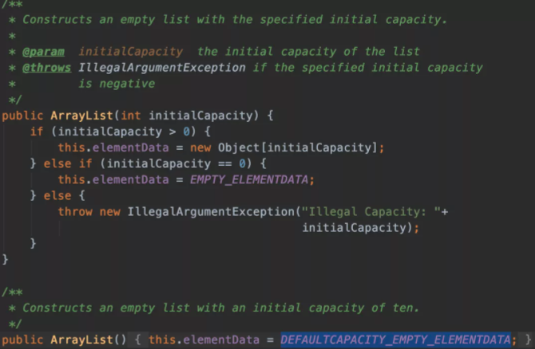
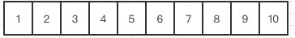
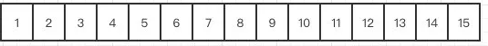
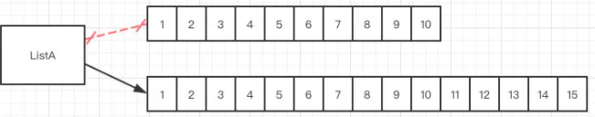
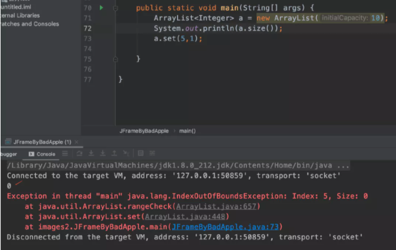
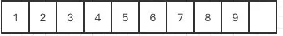
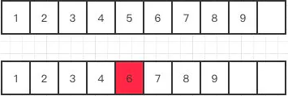

> 创建于 2021年5月17日
>
> 作者：[敖丙](https://mp.weixin.qq.com/s?__biz=MzAwNDA2OTM1Ng==&mid=2453141292&idx=2&sn=0876d3e4c8a0010898974158547c81f9&scene=21#wechat_redirect)

[toc]

## ArrayList

### 1.ArrayList是个啥

​		数组列表，装载的基本类型 int、long、boolean、short、byte... 的时候，只能存储他们对应的包装类，主要底层实现的数组 Object[] elementData，类似于 LinkedList 和 LinkedList 相比，查找比他快，但是增、删 比较慢

​		底层用数组实现，查询效率高、增删效率低，线程不安全，使用频率高

### 2、为啥不安全还用？

​		正常使用的场景中，都是用来查询，不会涉及太多的增删，如果频繁涉及删改就用 LinkedList，如果需要线程安全就用 Vector，这就是三者之间的区别。实际开发中还是 ArrayList 用的多。

​		不存在一个集合，查询效率又高，增删效率也高，线程还安全，数据结构都是优劣共存的，想找个平衡点很难，牺牲性能就安全了。

### 3、添加数据干了啥？

​		在初始化ArrayList时，底层赋值 Object[] elementData 为一个空的数组，容量为0 ，只有真正对数据进行添加时，才会分配10的初始化容量。大家可以分别看下他的无参构造器和有参构造器，无参就是默认大小，有参会判断参数。

```java
private static final int DEFAULT_CAPACITY = 10;
```




### 4、怎么扩容

就比如我们现在有一个长度为10的数组，现在我们要新增一个元素，发现已经满了，那ArrayList会怎么做呢？



第一步他会重新定义一个长度为10+10/2的数组也就是新增一个长度为15的数组。



然后把原数组的数据，原封不动的复制到新数组中，这个时候再把指向原数的地址换到新数组，ArrayList就这样完成了一次改头换面。



#### 5、为啥默认是10？

​		8个12个没什么区别，10好用点

#### 6、增删的时候为什么慢

​		因为需要扩容呀！一旦扩容，原先的数组需要拷贝到新的数组里，在扩容的时候 jdk8 以后的版本是有区别的，8之后的效率就更高了，采用了位运算，右移一位，其实就是除以2这个操作

```java
private void grow(int minCapacity){
  int oldCapacity = elementData.length;
  int newCapacity = oldCapacity + (oldCapacity>>1);
  ....
}
```

​		指定位置新增的时候，在校验之后很简单，arraycopy 就好比一栋10层楼的房子，里面1-9楼都住满了，这时二楼再插一户进来，原先二楼以上的，都得往上搬一层.. 多麻烦呀！如果这个时候再涉及扩容，更麻烦了

#### 7、ArrayList会不会初始化大小

​		==不会初始化大小==

​		使用构造后，再使用set（）会抛出异常，尽管数组已经创建，但是大小设置不正确，使用 sureCapacity（） 页不不起作用，因为它基于 elementData 数组而不是大小，还有副作用，因为带有 sureCpacity（）的静态 DEFAULT_CAPACITY。so 进行此工作的唯一办法就是 多次 add



#### 8、ArrayList 插入一定会慢嘛？

​		取决于你操作元素离数组末端有多远。ArrayList 拿来做堆栈用还是挺合适的，push 和 pop 操作完全不涉及数据的移动操作，删除其实根新增一样，不过不叫删除，他copy了一个新数组，

那为什么copy呢？

​		继续打个比方，我们现在要删除下面这个数组中的index5这个位置



​		那代码他就复制一个index5+1开始到最后的数组，然后把它放到index开始的位置



​		index5的位置就成功被”删除“了其实就是被覆盖了，给了你被删除的感觉。

​		同理他的效率也低，因为数组如果很大的话，一样需要复制和移动的位置就大了。

### 9、ArrayList 是线程安全的嘛？

​		当然不是，线程安全版本的数组容器是Vector。

Vector的实现很简单，就是把所有的方法统统加上synchronized就完事了。

你也可以不使用Vector，用Collections.synchronizedList把一个普通ArrayList包装成一个线程安全版本的数组容器也可以，原理同Vector是一样的，就是给所有的方法套上一层synchronized。

### 10、ArrayList 用来做队列合适么？

​		不适合，队列是 FIFO 先进先出类型，List实现是 尾部插入，头部删除... 删除头部，整个数组需要 arraycopy... 不妙呀！

### 11、数组适合做队列么？

​		适合呀！ArrayBlockingQueue 内部就是一个环形队列，是一个定长的队列，内部就是用的数组，如果写入超过长度，就折回到头部继续操作。

## ArrayList常用的方法总结

- boolean add(E e)

将指定的元素添加到此列表的尾部。

- void add(int index, E element)

将指定的元素插入此列表中的指定位置。

- boolean addAll(Collection c)

按照指定 collection 的迭代器所返回的元素顺序，将该 collection 中的所有元素添加到此列表的尾部。

- boolean addAll(int index, Collection c)

从指定的位置开始，将指定 collection 中的所有元素插入到此列表中。

- void clear()

移除此列表中的所有元素。

- Object clone()

返回此 ArrayList 实例的浅表副本。

- boolean contains(Object o)

如果此列表中包含指定的元素，则返回 true。

- void ensureCapacity(int minCapacity)

如有必要，增加此 ArrayList 实例的容量，以确保它至少能够容纳最小容量参数所指定的元素数。

- E get(int index)

返回此列表中指定位置上的元素。

- int indexOf(Object o)

返回此列表中首次出现的指定元素的索引，或如果此列表不包含元素，则返回 -1。

- boolean isEmpty()

如果此列表中没有元素，则返回 true

- int lastIndexOf(Object o)

返回此列表中最后一次出现的指定元素的索引，或如果此列表不包含索引，则返回 -1。

- E remove(int index)

移除此列表中指定位置上的元素。

- boolean remove(Object o)

移除此列表中首次出现的指定元素（如果存在）。

- protected void removeRange(int fromIndex, int toIndex)

移除列表中索引在 fromIndex（包括）和 toIndex（不包括）之间的所有元素。

- E set(int index, E element)

用指定的元素替代此列表中指定位置上的元素。

- int size()

返回此列表中的元素数。

- Object[] toArray()

按适当顺序（从第一个到最后一个元素）返回包含此列表中所有元素的数组。

- T[] toArray(T[] a)

按适当顺序（从第一个到最后一个元素）返回包含此列表中所有元素的数组；返回数组的运行时类型是指定数组的运行时类型。

- void trimToSize()

将此 ArrayList 实例的容量调整为列表的当前大小。

