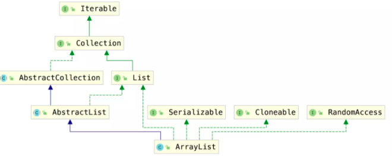

> 创建于 2021年5月18日
>
> 作者：[敖丙](https://mp.weixin.qq.com/s?__biz=MzAwNDA2OTM1Ng==&mid=2453142021&idx=2&sn=506a47e86fe0cd74d0eb52b56a0c831d&scene=21#wechat_redirect)

[toc]

## ArrayList

### 1、类图



- 实现了`RandomAccess`接口，可以随机访问
- 实现了`Cloneable`接口，可以克隆
- 实现了`Serializable`接口，可以序列化、反序列化
- 实现了`List`接口，是`List`的实现类之一
- 实现了`Collection`接口，是`Java Collections Framework`成员之一
- 实现了`Iterable`接口，可以使用`for-each`迭代

### 2、属性

```java
// 序列化ID
private static final long serialVersionUID = 8683452581122892189L;

// 默认初始化长度 10
private static final int DEFAULT_CAPACITY = 10;

// 用于空实例的共享空数组实力
// new ArrayList(0);
private static final Object[] EMPTY_ELEMENTDATA = {};

/*
 * 用于提供默认大小的实例的共享空数组实例
 * new ArrayyList();
 */
private static final Object[] DEFAULTCAPACITY_EMPTY_ELEMENTDATA = {};

/**
 * 存储ArrayList 元素的数组缓冲区
 * ArrayList 的容量，是数组的长度
 *
 * non-private to simplify nested class access
 */
transient Object[] elementData;

// 数量
private int size;
```


.

.

.

 太多了，直接看原文吧！


### 3、总结

- ArrayList底层的数据结构是数组
- ArrayList可以自动扩容，不传初始容量或者初始容量是`0`，都会初始化一个空数组，但是如果添加元素，会自动进行扩容，所以，创建ArrayList的时候，给初始容量是必要的
- `Arrays.asList()`方法返回的是的`Arrays`内部的ArrayList，用的时候需要注意
- `subList()`返回内部类，不能序列化，和ArrayList共用同一个数组
- 迭代删除要用，迭代器的`remove`方法，或者可以用倒序的`for`循环
- ArrayList重写了序列化、反序列化方法，避免序列化、反序列化全部数组，浪费时间和空间
- `elementData`不使用`private`修饰，可以简化内部类的访问