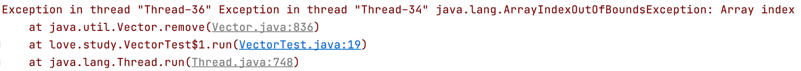

> 创建于 2021年5月20日
>
> 作者：[敖丙](https://mp.weixin.qq.com/s?__biz=MzAwNDA2OTM1Ng==&mid=2453141371&idx=1&sn=ad7efb98a07517e5047c13645188e529&scene=21#wechat_redirect)

[toc]

## Vector

​		在Java中，同步容器主要包括2类：

- 1、Vector、Stack、HashTable
- 2、Collections类中提供的静态工厂方法创建的类


### 1、Vector 在多线程中不安全问题

Vector 中 remove方法源码：

```java
public synchronized E remove(int index) {
    modCount++;
    if (index >= elementCount)
        throw new ArrayIndexOutOfBoundsException(index);
    E oldValue = elementData(index);

    int numMoved = elementCount - index - 1;
    if (numMoved > 0)
        System.arraycopy(elementData, index+1, elementData, index,
                         numMoved);
    elementData[--elementCount] = null; // Let gc do its work

    return oldValue;
}
```


​		   通过看 Vector 的源码，我们能看到 add、remove、get 等方法都有 synchronized 的，也就是说，我们可以在多线程场景中放心的使用单独这些方法...因为方法本身的确是线程安全的，但是==请注意，是单独，虽然同步容器的所有方法都加了锁，但是针对容器的复合操作无法保证其安全性，需要客户端主动加锁==

```java
public class VectorTest {
    public static void main(String[] args) {
        Vector<String> vector = new Vector<>();
        for (int i = 0; i < 100000; i++) {
            vector.add("Hello");
        }
        System.out.println(vector.size());

        for (int i = 0; i < 10000; i++) {
            new Thread(new Runnable() {
                @Override
                public void run() {
                        for (int j = 0; j < vector.size(); j++) {
                            vector.remove(vector.size()-1);
                        }
                }
            }).start();
        }
    }
}
```

​		我们举个简单的🌰 删除Vector 中的最后一个元素，因为remove方法中有 synchronized ，乍一看好像没什么问题，无论是 size 方法还是 remove方法都是线程安全的，那么整个程序也应该是安全的。但当我们跑起来的时候：



我们上面贴了 remove 的源码，当 `index >= elementCount` 时才会抛出 ArrayIndexOutOfBoundsException 异常，也就是说，当前索引不再有效时，就会抛出这个异常


#### 1.2、解决办法：

给 remove 外手动套一个 synchnoized 

```java
synchronized (vector){
  vector.remove(vector.size()-1);
}
```

==这样就巴适多了==


### 2、同步容器问题

​		前面说过了，同步容器直接保证单个操作的线程安全性，但是无法保证复合操作的线程安全，遇到这种情况时，必须要通过主动加锁的方式来实现。

​		而且，除此之外，同步容易由于对其所有方法都加了锁，这就导致多个线程访问同一个容器的时候，只能进行顺序访问，即使是不同的操作，也要排队，如get和add要排队执行。这就大大的降低了容器的并发能力。


### 3、并发容器

​		针对前文提到的同步容器存在的并发度低问题，从Java5开始，java.util.concurent包下，提供了大量支持高效并发的访问的集合类，我们称之为并发容器。

针对前文提到的同步容器的复合操作的问题，一般在Map中发生的比较多，所以在ConcurrentHashMap中增加了对常用复合操作的支持，比如putIfAbsent()、replace()，这2个操作都是原子操作，可以保证线程安全。

另外，并发包中的CopyOnWriteArrayList和CopyOnWriteArraySet是Copy-On-Write的两种实现。

Copy-On-Write容器即写时复制的容器。通俗的理解是当我们往一个容器添加元素的时候，不直接往当前容器添加，而是先将当前容器进行Copy，复制出一个新的容器，然后新的容器里添加元素，添加完元素之后，再将原容器的引用指向新的容器。

CopyOnWriteArrayList中add/remove等写方法是需要加锁的，而读方法是没有加锁的。

这样做的好处是我们可以对CopyOnWrite容器进行并发的读，当然，这里读到的数据可能不是最新的。因为写时复制的思想是通过延时更新的策略来实现数据的最终一致性的，并非强一致性。

但是，作为代替Vector的CopyOnWriteArrayList并没有解决同步容器的复合操作的线程安全性问题。