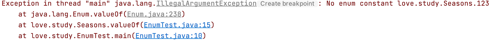

> 创建于 2021年5月21日
>
> 作者：[敖丙](https://mp.weixin.qq.com/s?__biz=MzAwNDA2OTM1Ng==&mid=2453142263&idx=1&sn=37509e87be245f41d728f2c4070c444f&scene=21#wechat_redirect)

[toc]

## 枚举

​		枚举是JDK1.5之后的特性，在此之前一般是在类中对常量进行定义。那么为什么需要枚举呢？举个栗子：

假如我们需要四个变量来表示“春、夏、秋、冬”

```java
class season{
    private final static int SPRING = 1;        //  春
    private final static int SUMMER = 2;        //  夏
    private final static int AUTUMN = 3;        //  秋
    private final static int WINTER = 4;        //  冬
}
```

​		这时只需要直接引用 season.SPRING 就可以拿到自己想要的值了，如果我们想做更多的事情，比如

```java
class Season{
    private Season(){}

    public final static Season SPRING = new Season();
    public final static Season SUMMER = new Season();
    public final static Season AUTUMN = new Season();
    public final static Season WINTER = new Season();

    public static Season getNextSeason(Season nowSeason){
        if(nowSeason == SPRING){
            return SUMMER;
        }else if(nowSeason == SUMMER){
            return AUTUMN;
        }else if(nowSeason == AUTUMN){
            return WINTER;
        }else{
            return SPRING;
        }
    }

    public static void printNowSeason(Season nowSeason){
        if(nowSeason == SPRING){
            System.out.println("春季");
        }else if(nowSeason == SUMMER){
            System.out.println("夏季");
        }else if(nowSeason == AUTUMN){
            System.out.println("秋季");
        }else{
            System.out.println("冬季");
        }
    }

    public static void main(String[] args){
        Season nowSeason = Season.SUMMER;
        Season.printNowSeason(nowSeason);
        Season nextSeason = Season.getNextSeason(nowSeason);
        Season.printNowSeason(nextSeason);
    }
}
```

​		这样有个隐患 这是如果要扩展功能，需要写大量的 if-else 判断，这时 枚举来了

​		还是以四季为🌰

```java
public class EnumTest {
    public static void main(String[] args) {
        System.out.println(Seasons.SPRING); // 输出SPRING
    }
}

enum Seasons{
   SPRING,SUMMER,AUTUMN,WINTER
}
```

​		Seanons.valueOf()方法，

​		此方法的作用是传来一个字符串，然后将它转化成对应的枚举变量，前提是传入的字符串和定义枚举变量的字符串一摸一样，需区分大小写。如果传入了一个不存在的字符串，则会抛出异常

```java
System.out.println(Seasons.valueOf("spring".toUpperCase()));
System.out.println(Seasons.valueOf("123"));
```



### values()方法和 ordinal()方法

Season.value（）方法会返回包括所有枚举变量的数据

​		默认情况下，枚举会给所有枚举变量提供一个默认的次序，该次序类似数组的下标，从0开始，而Season.ordinal（）方法正是可以获取其序列的方法

```java
for (Seasons value : Seasons.values()) {
  System.out.println(value+"--->"+value.ordinal());
}
```

结果是：

```java
SPRING--->0
SUMMER--->1
AUTUMN--->2
WINTER--->3
```


### toString()方法和 name()方法

Season.toString() 方法会返回枚举定义变量时的字符串，次方法同 Season.name() 方法是一样的

```java
System.out.println(Seasons.SUMMER.toString());
System.out.println(Seasons.AUTUMN.name());
```

结果是：

```java
SUMMER
AUTUMN
```

表面上一看，name() 方法和 toString() 方法可以说一样滴。。。

But  肯定是要有差距的撒，要没有差距 搞两个作甚，闹着玩呀！ 所以，toString 可以被重写，name 不行，被final 修饰了


### compareTo()方法

​		这个方法用于比较两个枚举变量的“大小”实际上比比较的是两个枚举变量之间的序号，并返回次序相减之后的结果

```java
System.out.println(Seasons.WINTER.compareTo(Seasons.SPRING));
// 3
```


注意事项：


>- 枚举使用的是enum关键字，而不是class；
>- 枚举变量之间用逗号隔开，且枚举变量最好用大写，多个单词之间使用“_"隔开（INT_SUM）。
>- 定义完变量之后，以分号结束，如果只是有枚举变量，而不是自定义变量，分号可以省略。
>- 只需要类名.变量名就可以召唤枚举变量了，跟使用静态变量一样。
>- 构造器必须私有化


### 单利枚举

枚举类实现单例模式相当硬核，因为枚举类型是线程安全的，且只会装载一次。使用枚举类来实现单例模式，是所有的单例实现中唯一一种不会被破坏的单例模式实现。

```java
public class SingletonObject {

    private SingletonObject() {
    }

    private enum Singleton {
        INSTANCE;

        private final SingletonObject instance;

        Singleton() {
            instance = new SingletonObject();
        }

        private SingletonObject getInstance() {
            return instance;
        }
    }

    public static SingletonObject getInstance() {
        return Singleton.INSTANCE.getInstance();
    }
}
```

